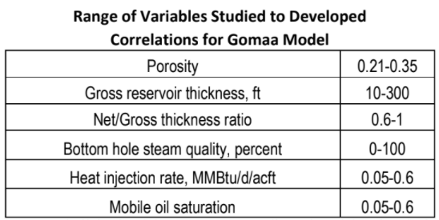

# Steamflood Predictive Model

```{r include=FALSE}
knitr::opts_chunk$set(echo = FALSE)
```

## Pendahuluan

___Steamflooding___ (atau disebut juga ___steam-drive___) merupakan bagian dari metode _Thermal Enhanced Oil Recovery_ (EOR) yang paling banyak digunakan sampai saat ini. _Thermal_ EOR merupakan mekanisme penting yang berperan dalam produksi minyak untuk reservoir-reservoir dengan tipe _heavy oil_.

Studi awal terhadap proses _steamflood_ sangat penting untuk dilakukan sebelum penerapan di lapangan. Melalui studi awal, prediksi performa reservoir dari penerapan _steamflood_ dapat diketahui. Terkait dengan hal ini, dibutuhkan suatu model yang dapat memprediksi performa reservoir di bawah proses steamflood. Model prediksi performa ini disebut sebagai _steamflood_ _predictive model_. _Predictive model_ ini mampu memberikan informasi awal mengenai prediksi performa reservoir di bawah proses _steamflood_ sehingga dapat digunakan sebagai bahan pertimbangan untuk studi lebih lanjut.

Terdapat empat metode yang digunakan dalam _steamflood_ _predictive model_, yaitu:

1. __Metode Williams__, atau disebut juga __Metode Stanford University Petroleum Research Institute (SUPRI)__
2. __Metode Jones__
3. __Metode Gomaa__
4. __Metode Aydelotte – Pope__, disebut juga __Metode Intercomp__.

___Steamflood___ (injeksi uap) merupakan salah satu metode peningkatan perolehan minyak lanjut yang termasuk ke dalam kelompok peningkatan perolehan minyak termal. Konsep dari peningkatan perolehan minyak termal adalah mengurangi viskositas minyak di reservoir, sekaligus juga menambah mobilitas minyak, dengan cara meningkatkan temperatur reservoir melalui injeksi panas ke dalam reservoir. Khusus untuk *steamflood*, injeksi panas ke dalam reservoir dilakukan dalam bentuk injeksi uap (*steam*) secara kontinu ke dalam reservoir.

Penjelasan mengenai teori steamflood pertama kali dilakukan oleh Marx dan Langenheim di tahun 1959, dimana mereka menjelaskan mengenai pertumbuhan zona *steam* (*steam zone growth*) di reservoir selama proses _steamflood_. Mandl dan Volek (1969) kemudian mengembangkan teori Marx-Langenheim dengan mengenalkan parameter *critical time* dalam perhitungan. Myhill dan Stegemeier (1978) kemudian mengembangkan kembali teori Mandl-Volek dengan menambahkan parameter efisiensi termal dalam perhitungan.

Selanjutnya, Van Lookeren (1977) membahas mengenai fenomena *steam override* dalam proses *steamflood*, yaitu kecenderungan *steam* untuk mengalir ke bagian _top_ reservoir sebagai akibat dari pengaruh gaya gravitasi. Van Lookeren menyatakan bahwa *steam overrid*e dipengaruhi oleh sifat-sifat *steam*, viskositas minyak, temperatur zona *steam*, dan permeabilitas vertikal reservoir. Sifat *buoyancy* yang dimiliki oleh *steam* beserta tingginya mobilitas minyak di zona *steam* merupakan dua faktor yang mendukung terjadinya *steam override*. Selain itu, adanya saturasi gas di zona *steam* akan mempercepat terjadinya *steam override*. Dengan terjadinya *steam override*, maka steam cenderung bergerak menuju zona _top_ reservoir, menyebabkan zona bawah (*bottom*) reservoir tidak terlewati oleh steam. Pada *steamflooding*, *steam override* akan terjadi di hampir semua kasus, dimana laju terjadinya *steam override* akan lebih lambat untuk reservoir dengan viskositas minyak yang lebih tinggi.

Proses *steamflood* akan menyebabkan terbentuknya zona *steam* di reservoir. Zona *steam* adalah bagian reservoir dimana saturasi *steam* mendominasi fluida lainnya. Zona *steam* berada pada temperatur *steam*, *T~steam~*. Terbentuknya zona *steam* di reservoir dalam proses *steamflooding* merupakan fenomena yang kompleks. Oleh karena itu, digunakan beberapa asumsi sebagai penyederhanaan. Asumsi-asumsi yang digunakan dalam menjelaskan pembentukan zona *steam* adalah sebagai berikut:

1. Zona _steam_ berada dalam kondisi temperatur konstan, _T~S~_
2. _Heat loss_ ke _overburden_ dan _underburden_ terjadi melalui mekanisme konduksi. 

Di zona _steam_, nilai saturasi minyak diasumsikan berkurang dari mulai saturasi awal saat awal *flooding* (S~oi~) hingga saturasi minyak residu (S~orst~). Viskositas minyak akan berkurang dimana orde pengurangan viskositas minyak berbanding lurus dengan nilai _T~steam~_ (semakin tinggi nilai temperatur _steam_, semakin besar orde pengurangan viskositas minyak). Minyak yang berada di zona _steam_ (yang mana viskositasnya sudah berkurang) akan didorong oleh _steam drive_ sehingga saturasi minyak di zona _steam_ akan berkurang hingga nilai residualnya (S~orst~), dimana nilai residual minyak ini diasumsikan konstan.

## Fenomena _Heat Loss_

_Predictive model_ yang dibangun menyertakan terjadinya _heat loss_ saat steam mengalir di sepanjang pipa permukaan dan di sumur injeksi.

### Fenomena _Heat Loss_ di Pipa Permukaan

_Heat loss_ di permukaan terjadi saat _steam_ mengalir di sepanjang pipa permukaan menuju _wellhead choke_. Untuk menjelaskan fenomena ini, dibangun suatu model yang membagi pipa permukaan ke dalam beberapa segmen, dimana perubahan tekanan, laju _heat loss_, dan _steam quality_ akan dihitung untuk setiap segmen. Jumlah segmen maksimum ditentukan sebanyak 20 segmen.

Perubahan tekanan (antara _steam generator_ dan _wellhead choke_) diasumsikan terjadi hanya disebabkan oleh faktor gesekan. Perubahan tekanan di sepanjang pipa permukaan dihitung untuk setiap segmen I.
$$\Delta P_{friction}(I) = \frac{4.219(10)^{-13}W^2.SPCT(I).DELS(I).F(I)}{r_{SURI}^5}...(1)$$
dimana: </br>
$W$ = laju alir massa = laju injeksi _steam_, lb/hr </br>
$r_{SURI}$ = radius dalam pipa permukaan, ft (nilai _default_ = $r_{TI}$ = 0.102) </br>
$SPCT(I)$ = volume spesifik campuran _steam_ dengan air untuk segmen ke-*I*, cuft/bbl </br>
$\Delta P _{friction}(I)$ = perubahan tekanan untuk segmen ke-*I* </br>
$F(I)$ = _moody friction factor_ untuk segmen ke-*I*, _dimensionless_ </br>
$DELS(I)$ = panjang segmen pipa permukaan ke-*I*, ft

Volume spesifik campuran _steam_ dengan air (SPCT) dihitung menggunakan persamaan berikut:
$$SPCT(I) = X(I).SPCG(I)+(1-X(I)).SPCL(I)...(2)$$
dimana: </br>
$SPCG(I)$ = volume spesifik _steam_ untuk segmen ke-*I* (cuft/bbl) </br>
$SPCL(I)$ = volume spesifik air untuk segmen ke-*I* (cuft/bbl) </br>
$X(I)$ = _steam quality_, frkasi massa

Nilai _moody friction factor_, _F(I)_, ditentukan dari bilangan Reynolds untuk aliran dua fasa. Bilangan Reynolds dihitung sebagai berikut.
$$N_{Re} = \frac{2967W_T}{\pi. r_{SURI}.\mu_M}...(3)$$
dengan:
$$\mu_M = (\mu_{SL}(I))^{HL}(\mu_{G}(I))^{1-HL}...(4)$$
$$HL = \frac{[1-X(I)].SPCL(I)}{SPCT(I)}...(5)$$
dimana: </br>
$N_{Re}$ = bilangan Reynolds </br>
$W_T$ = laju alir massa, lb/sec </br>
$r_{SURI}$ = radius dalam pipa permukaan, ft </br>
$\mu_M$ = viskositas campuran _steam_ dengan air, cp </br>
$\mu_{SL}(I)$ = viskositas air saturasi _steam_ di segmen pipa permukaan ke-*I* </br>
$\mu_G(I)$ = viskositas _steam_ di segmen pipa permukaan ke-*I* </br>
$HL$ = _liquid holdup_

Nilai _F(I)_ ditentukan sebagai berikut.

- Jika $N_{Re} \leq 2000$, maka
$$F(I) = \frac{64}{N_{Re}}...(6)$$
- Jika $N_{Re} > 4000$, maka
$$F(I) = 1.14 - 0.86858 \log \left[ED + \frac{9.34}{N_{Re}F(I)}\right]...(7)$$
dimana: </br>
$ED = \frac{EPSC}{\frac{r_{SURI}}{24}}$ = _dimensionless roughness ratio_ </br>
$EPSC$ = _roughness factor_ dari pipa permukaan, in (nilai _default_ = 0.0008)

Solusi _F(I)_ dari persamaan (7) diperoleh dengan prosedur iterasi

- Jika 2000 < $N_{Re}$ < 4000, maka
$$F(I) = F(I)' + \frac{(N_{Re}-2000)(F(I)"-F(I)')}{2000}...(8)$$
dengan
$$F(I)' = \frac{64}{N_{Re}}...(9)$$
$$F(I)" = 1.14 - 0.86858 \log \left[ED + \frac{9.34}{N_{Re}F(I)}\right]...(10)$$

_Heat loss_ di pipa permukaan dihitung dengan persamaan berikut.
$$Q_{surface}(I) = 2\pi K_{surface}.r_{SURI}.DELS(I)[T_{surface}-T_{ground}]...(11)$$
$$T_{surface} = \frac{T(I+1)+T(I)}{2}...(12)$$
dimana: </br>
$Q_{surface}(I)$ = laju _heat loss_ di pipa permukaan, Btu/hr </br>
$K_{surface}$ = koefisien transfer panas untuk pipa permukaan, Btu/hr-ft^2^-°F (nilai _default_ = 0.5) </br>
$DELS(I)$ = panjang segmen pipa permukaan ke-*I*, ft = $\frac{500}{jumlah\ segmen\ permukaan}$ </br>
$T_{surface}$ = temperatur rata-rata segmen pipa permukaan, °F </br>
$T_{ground}$ = temperatur tanah pada kondisi permukaan, °F (nilai _default_ = 70°F) </br>
$T(I)$ = temperatur segmen pipa permukaan ke-*I*, °F

Nilai _steam quality_ dihitung di sisi _downstream_ dari setiap segmen pipa permukaan.
$$X(I+1) = \frac{X(I)\left( [H_G(I)-H_{SL}(I)] + [H_{SL}(I)-H_{SL}(I+1)]-\frac{Q_{surface}(I)}{W} \right)}{H_G(I+1)-H_{SL}(I+1)}...(13)$$
dimana: </br>
$X(I)$ = _steam quality_ di segmen pipa permukaan ke-*I* </br>
$X(I+1)$ = _steam quality_ di segmen pipa permukaan ke-(*I*+1) </br>
$H_G(I)$ = entalpi _steam_ di segmen pipa permukaan ke-*I* </br>
$H_{SL}(I)$ = entalpi air tersaturasi _steam_ di segmen pipa permukaan ke-*I*.

### Fenomena _Heat Loss_ di Sumur Injeksi

Selain _heat loss_ yang terjadi di pipa permukaan saat _steam_ bergerak dari _steam generator_ ke _wellhead_, _predictive model_ yang dibangun juga menyertakan _heat loss_ yang terjadi saat _steam_ bergerak dari _wellhead_ ke _sandface_. _Heat loss_ yang terjadi pada kondisi ini dikelompokkan ke dalam fenomena _heat loss_ di sumur injeksi.

Perhitungan _heat loss_ di sumur injeksi dilakukan menggunakan metode Earlougher dan Willhite. Sama seperti perhitungan _heat loss_ di pipa permukaan, sumur injeksi akan dibagi ke dalam beberapa segmen, kemudian perhitungan perubahan tekanan, laju _heat loss_, dan _steam quality_ akan dilakukan di setiap segmen. Jumlah segmen maksimum dibatasi sebanyak 20 segmen.

Perubahan tekanan antara _wellhead_ dengan _sandface_ diasumsikan dipengaruhi oleh tiga faktor, yaitu berat kolom fluida, energi kinetik, dan gesekan. Sehingga, perubahan tekanan antara _wellhead_ dengan _sandface_ (untuk setiap segmen sumur injeksi) dinyatakan oleh persamaan berikut.
$$P(Z+1) = P(Z) + \Delta P_{KE}(Z) + \Delta P_{F_{weight}}(Z) - \Delta P_{friction}(Z)...(14)$$
dengan:
$$\Delta P_{KE}(Z) = \frac{1.686(10)^{-12}[SPCT(Z)-SPCT(Z+1)]W^2}{r_{TI}^4}...(15)$$
$$\Delta P_{F_{weight}}(Z) = \frac{6.944(10)^{-3}.DELZ(Z)}{SPCT(Z)} ...(16)$$
$$\Delta P_{friction}(Z) = \frac{4.219(10)^{-13}W^2.SPCT(Z).DELZ(Z).F(Z)}{r_{SURI}^5}...(17)$$
dimana: </br>
$P(Z+1)$ = tekanan di segmen sumur ke-(*Z*+1) </br>
$P(Z)$ = tekanan di segmen sumur ke-*Z* </br>
$\Delta P_{KE}(Z)$ = perubahan tekanan akibat pengaruh perubahan energi kinetik dari steam untuk segmen sumur ke-*Z* </br>
$\Delta P_{F_{weight}}(Z)$ = perubahan tekanan akibat pengaruh berat kolom fluida untuk segmen sumur ke-*Z* </br>
$\Delta P_{friction}(Z)$ = perubahan tekanan akibat pengaruh gesekan untuk segmen sumur ke-*Z* </br>
$SPCT(Z)$ = volume spesifik campuran _steam_ dengan air untuk segmen ke-*Z*, cuft/bbl </br>
$r_{TI}$ = radius sisi dalam tubing, ft (nilai _default_ = 0.102) </br>
$DELZ(Z)$ = panjang segmen sumur ke-*Z*, ft = $\frac{depth}{jumlah\ segmen\ sumur\ injeksi}$ </br>
$F(Z)$ = _mody friction factor_ untuk segmen sumur ke-*Z*, _dimensionless_

Volume spesifik campuran _steam_ dengan air (SPCT) dan _moody friction factor_ dihitung dengan cara yang sama seperti pada pipa permukaan, yaitu menggunakan persamaan (2), (6), (7), dan (8), dengan mengganti segmen pipa permukaan _I_ dengan segmen sumur injeksi _Z_.

Pada sumur injeksi _steam_ diasumsikan mengalir di dalam _tubing_, sehingga penjelasan _heat loss_ ke formasi batuan menjadi lebih rumit dibandingkan dengan penjelasan _heat loss_ dari pipa permukaan. _Heat loss_ (dari _steam_) dalam sumur injeksi akan mengalir secara berurutan melalui medium-medium berikut: _tubing_, _annulus_, _casing_, semen pemboran, dan formasi batuan.

Penjelasan _heat loss_ pada sumur injeksi akan dimulai dengan mendefinisikan parameter koefisien _overall_ transfer panas sumur ($K_{coef}$), yaitu:
$$K_{coef} = \frac{1}{K_{konduksi-tub}+K_{konv-rad\ tubing}+K_{konduksi-semen}}...(18)$$
$K_{konduksi-tub}$ menyatakan koefisien transfer panas konduksi melalui tubing. Koefisien ini dinyatakan oleh persamaan berikut:
$$K_{konduksi-tub} = \frac{r_w \log \left(\frac{r_{ins}}{r_{TO}}\right)}{k_{tubing}}...(19)$$
dimana: </br>
$r_w$ = radius sumur, ft (nilai _default_ = 0.25) </br>
$r_{ins}$ = radius insulasi tubing, ft (nilai _default_ = $r_{TO}$) </br>
$r_{TO}$ = radius sisi luar tubing, ft (nilai _default_ =  + 0.015) </br>
$k_{tubing}$ = konduktivitas termal tubing (nilai _default_ = 0.04 Btu/hr.ft.°F).

$K_{konv-rad\ tubing}$ menyatakan koefisien transfer panas konveksi dan radiasi melalui tubing. Koefisien ini dinyatakan oleh persamaan berikut:
$$K_{konv-rad\ tubing} = \frac{r_w}{\left(\frac{r_{ins}}{(K_{konveksi}+K_{radiasi})}\right)}...(20)$$
Pada persamaan (20), $K_{radiasi}$ adalah koefisien transfer panas melalui mekanisme radiasi. Parameter ini dihitung menggunakan persamaan berikut.
$$K_{radiasi} = \sigma F_{TCI}[T_{CI}^2 + T_{IN}^2](T_{CI} + T_{IN})...(21)$$
dimana: </br>
$\sigma$ = konstanta Stefan-Boltzmann = 1.713(10)^-9^ Btu/hr-ft^2^-°R <br>
$T_{CI}$ = temperatur sisi dalam casing, °R </br>
$T_{IN}$ = temperatur sisi luar _insulation_ atau temperatur sisi luar tubing, °R </br>
$F_{TCI}$ = _dimensionless view factor_, merupakan parameter yang menghubungkan geometri sumur beserta sifat emisif _tubing_ dan _casing_ terhadap flux panas _radiant_.
$$F_{TCI} = \frac{1}{\left(\frac{1}{\varepsilon_{TO}}\right)+\frac{r_{ins}}{r_{CI}}\left(\frac{1}{\varepsilon_{CI}-1}\right)}...(22)$$
dengan: </br>
$r_{CI}$ = radius sisi dalam casing, ft (nilai _default_ = 0.2655) </br>
$\varepsilon_{TO}$ = emisivitas permukaan sisi luar _tubing_, _dimensionless_ (nilai _default_ = 0.9) </br>
$\varepsilon_{CI}$ = emisivitas permukaan sisi luar _casing_, _dimensionless_ (nilai _default_ = 0.4) </br>

Selanjutnya, pada persamaan (20), $K_{konveksi}$ adalah koefisien transfer panas melalui mekanisme konveksi. Parameter ini dihitung menggunakan persamaan berikut.
$$K_{konveksi} = \frac{k_{hc}}{\left[\frac{r_{ins}}{\log \left(\frac{r_{CI}}{r_{ins}}\right)}\right]}...(23)$$
$$k_{hc} = 0.049k_{ha}(N_{gr}N_{pr})^{0.333}N_{pr}^{0.074}...(24)$$
dengan:
$$N_{gr} = \frac{4.17(10)^8(r_{CI}-r_{TO})^3\rho_{ann}^2(T_{IN}-T_{CI})}{(T_{ann}+460)\mu_{ann}^2}...(25)$$
$$N_{pr} = \frac{C_{ann}\mu_{ann}}{k_{ha}}...(26)$$
dimana: </br>
$k_{hc}$ = konveksivitas termal fluida annulus </br>
$k_{ha}$ = konveksivitas termal fluida annulus (nilai _default_ = 0.1 Btu/hr.ft.°F)</br>
$N_{gr}$ = bilangan Grashof fluida annulus</br>
$N_{pr}$ = bilangan Prandtl fluida annulus</br>
$T_{ann}$ = temperatur fluida annulus, °F (nilai _default_ = $T_{steam}$)</br>
$\rho_{ann}$ = densitas fluida annulus, lb/cuft (nilai _default_ = 0.1) </br>
$\mu_{ann}$ = viskositas fluida annulus, cp (nilai _default_ = 0.05) </br>
$C_{ann}$ = kapasitas panas fluida annulus, Btu/lb.°F (nilai _default_ = 0.2) </br>

$K_{konduksi-semen}$ menyatakan koefisien transfer panas konduksi melalui semen pemboran. Parameter ini dinyatakan oleh persamaan berikut.
$$K_{konduksi-semen} = \frac{r_w \log \left(\frac{r_w}{r_{CO}}\right)}{k_{semen}}...(27)$$
dimana: </br>
$r_{CO}$ = radius sisi luar _casing_, ft (nilai _default_ = $r_{CI}$ 0.026) </br>
$k_{semen}$ = konduktivitas termal semen pemboran (nilai _default_ = 0.5 Btu/hr.ft.°F).

_Heat loss_ di sepanjang sumur injeksi dinyatakan oleh persamaan berikut.
$$Q_{well}(Z) = \frac{2\pi r_wDELZ(Z)K_{coef}k_{rock}[T(Z)-T_{ground}(Z)]}{k_{rock} + (r_wK_{coef}F_T)}...(28)$$
dimana: </br>
$F_T = \log(2\sqrt {t_{DS}})-0.29$ = fungsi konduksi panas transient </br>
$t_{DS} = \frac{24\alpha T}{r_w^2}$ = _dimensionless time_; $\alpha$ = difusivitas termal batuan, ft^2^/hr (nilai _default_ = 0.0306) </br>
$Q_{well}(Z)$ = laju _heat loss_ dari sumur injeksi untuk segmen sumur ke-*Z* </br>
$k_{rock}$ = konduktivitas termal batuan reservoir (nilai _default_ = 1 Btu/hr.ft.°F) </br>
$T(Z)$ = temperatur segmen sumur ke-*Z* </br>
$T_{ground}(Z)$ = temperatur tanah pada kondisi permukaan

Selanjutnya, _steam quality_ dihitung di bagian _downstream_ dari setiap segmen sumur menggunakan persamaan berikut.
$$X(Z+1) = \frac{X(Z)\left( [H_G(Z)-H_{SL}(Z)] + [H_{SL}(Z)-H_{SL}(Z+1)]-\frac{Q_{well}(Z)}{W} \right)}{H_G(Z+1)-H_{SL}(Z+1)}...(29)$$
dimana: </br>
$X(Z)$ = _steam quality_ di segmen pipa permukaan ke-*Z* </br>
$X(Z+1)$ = _steam quality_ di segmen pipa permukaan ke-(*Z*+1) </br>
$H_G(Z)$ = entalpi _steam_ di segmen pipa permukaan ke-*Z* </br>
$H_G(Z+1)$ = entalpi _steam_ di segmen pipa permukaan ke-(*Z*+1) </br>
$H_{SL}(Z)$ = entalpi air tersaturasi _steam_ di segmen pipa permukaan ke-*Z* </br>
$H_{SL}(Z+1)$ = entalpi air tersaturasi _steam_ di segmen pipa permukaan ke-(*Z*+1) </br>
$W$ = laju alir massa = laju injeksi _steam_

## Perhitungan Sejumlah Parameter Penting yang Digunakan Dalam _Predictive Model_

### Permeabilitas Relatif Tiga Fasa

Permeabilitas relatif tiga fasa dihitung menggunakan modifikasi metode Stone. Hal ini ditunjukkan oleh persamaan-persamaan berikut.
$$k_{rw} = k_{rwro}(T) \left[ \frac{S_w-S_{wr}(T)}{1-S_{wr}(T)-S_{or}(T)} \right]^{n_w(p)}...(30)$$
$$k_{rg} = k_{rgro}(T) \left[ \frac{S_g-S_{gr}(T)}{1-S_{wr}(T)-S_{or}(T)-S_{gr}(T)} \right]^{n_g}...(31)$$
$$k_{ro} = k_{rocw}(T) \left[ \left( \frac{k_{row}}{k_{rocw}}+k_{rw} \right)\left( \frac{k_{rog}}{k_{rocw}}+k_{rg} \right)-k_{rw}-k_{rg}\right] ...(32)$$
dengan:
$$k_{row} = k_{rocw}(T) \left[ \frac{1-S_w-S_{or}(T)}{1-S_{wr}(T)-S_{or}(T)} \right]^{n_{ow}}...(33)$$
$$k_{rog} = k_{rocw}(T) \left[ \frac{1-S_w-S_{or}(T)-S_g}{1-S_{wr}(T)-S_{or}(T)} \right]^{n_{og}}...(34)$$
$$k_{rocw}(T) = k_{rocwi} + k_{rocwt}(T - T_{form})...(35)$$
$$k_{rwro}(T) = k_{rwroi} + k_{rwrot}(T - T_{form})...(36)$$
$$k_{rgro}(T) = k_{rgroi} + k_{rgrot}(T - T_{form})...(37)$$
$$n_w(p) = n_{wi} \left[1+n_{wp}\left(\frac{p-p_{form}}{p_{form}}\right)\right]...(38)$$
dimana: </br>
$k_{rwroi}$ = nilai _initial end-point_ dari kurva $k_{rw}$ (nilai _default_ = 0.2) </br>
$k_{rwrot}$ = perubahan nilai _end-point_ kurva $k_{rw}$ terhadap temperatur (nilai _default_ = 0.00215 °F^-1^) </br>
$k_{rocwi}$ = nilai _initial end-point_ dari kurva $k_{ro}$ (nilai _default_ = 1) </br>
$k_{rocwt}$ = perubahan nilai _end-point_ kurva $k_{ro}$ terhadap temperatur </br>
$k_{rgroi}$ = nilai _initial end-point_ dari kurva $k_{rg}$ (nilai _default_ = 1) </br>
$k_{rgrot}$ = perubahan nilai _end-point_ kurva $k_{rg}$ terhadap temperatur </br>
$n_{wi}$ = initial eksponen persamaan $k_{rw}$ (nilai _default_ = 2) </br>
$n_{wp}$ = perubahan nilai eksponen persamaan $k_{rw}$ terhadap perubahan tekanan </br>
$n_{ow}$ = eksponen dalam persamaan $k_{ro}$ untuk sistem minyak-air (nilai _default_ = 2) </br>
$n_{og}$ = eksponen dalam persamaan $k_{ro}$ untuk sistem minyak-gas (nilai _default_ = 2) </br>
$n_{g}$ = eksponen dalam persamaan $k_{rg}$ </br>
$p_{form}$ = tekanan formasi = 14.7 + $\left(\frac{0.433}{2}\right)depth$ </br>
$T_{form}$ = temperatur formasi = 70 + 0.0011 °F/ft.

### Pembagian Daerah Reservoir

Salah satu asumsi yang digunakan dalam model Aydelotte-Pope adalah predictive model yang dibangun membagi reservoir ke dalam empat daerah. Keempat daerah reservoir ini adalah sebagai berikut. 

- __Daerah 1: zona formasi reservoir awal__ </br>
Daerah ini dikarakterisasi oleh nilai tekanan dan temperatur berikut.
$$T(1) = T_{form}...(39)$$
$$P(1) = P_{form}...(40)$$
- __Daerah 2: zona *cold liquid*__ </br>
Daerah ini dikarakterisasi oleh nilai tekanan dan temperatur berikut.
$$T(2) = T_{form}...(41)$$
$$P(2) = P_(1) + 0.333[P_(4)-P_(1)]...(42)$$

- __Daerah 3: zona *hot liquid*__ </br>
Daerah ini dikarakterisasi oleh nilai tekanan dan temperatur berikut.
$$T(3) = T_{avg}...(43)$$
$$P(3) = P(1) + 0.667[P(4)-P(1)]...(44)$$
dimana:
$$T_{avg} = T_{form}(1-F_{T_{avg}})+T_{steam}F_{T_{avg}}...(45)$$
$F_{T_{avg}}$ = 0.6 = fraksi peningkatan temperatur zona _steam_ yang diterapkan pada temperatur zona _hot liquid_.

- __Daerah 4: zona *steam*__ </br>
Daerah ini dikarakterisasi oleh nilai tekanan dan temperatur berikut.
$$T(4) = T_{steam}...(46)$$
$$P(4) = P_{frac} = 0.5depth...(47)$$

### _Initial Injectivity Index_

Nilai _default_ dari _initial injectivity index_ diperoleh dengan terlebih dahulu mengestimasi nilai _pattern area_ (A) jika tidak diketahui.
$$I_{index} = k \left( \frac{h_{net}}{141.3} \right)\left[ \frac{2}{\log \left( \frac{755268.2763A}{r_w^2} \right)} \right]\beta...(48)$$
$$\beta = \left( \frac{S_{wi}-S_{wr(1)}}{R_1} \right)^{\frac{2}{\mu_w(1)}} + \left( \frac{S_{oi}-S_{or(1)}}{R_1} \right)^{\frac{2}{\mu_o(1)}} + \left( \frac{S_{gi}-S_{gr(1)}}{R_1} \right)^{\frac{2}{\mu_g(1)}}...(49)$$
$$R_1 = 1-S_{wr}(1)-S_{or}(1)-S_{gr}(1)...(50)$$
diasumsikan bahwa:
$$r_w = 0.25$$
$$S_{gr}(1)=0$$
dimana: </br>
$I_{index}$ = _initial injectivity index_ </br>
$h_{net}$ = _net thickness_ reservoir </br>
$A$ = _pattern area_ reservoir; max = 80 acres; min = 0.625 acres </br>
$S_{wi}$ = nilai saturasi air _initial_ = $S_{wr}(1)$ = 0.2 (nilai _default_) </br>
$S_{oi}$ = nilai saturasi minyak _initial_ = $1-S_{wi}-S_{gi}$ </br>
$S_{gi}$ = nilai saturasi air _initial_ = $S_{wr}(1)$ = 0.2 (nilai _default_) </br>
$S_{jr}(1)$ = nilai saturasi residual fluida fasa *j* di zona 1 reservoir </br>
$S_{or}(1,2,3)$ = [0.3495 + 0.03657 $\log$($\mu_o(region)$)[1.294 − 0.0445 log$k$]] </br>
$S_{wr}(3\ or\ 4)$ = $S_{wr}(1) + 0.00245.S_{wr}(1).(T(region)-T_{form})$ </br>
$\mu_j(1)$ = nilai viskositas fluida fasa *j* di zona 1 reservoir

### Viskositas Fluida

#### Viskositas Air

Nilai viskositas air dihitung untuk keempat zona reservoir.
$$\mu_w (zona\ 1\ atau\ 2) = BB(37).T_{form}+BB(38)+\frac{\alpha_3}{T_{form}}...(51)$$
$$\alpha_3 = \frac{\alpha_2}{T_{form}} + BB(39)...(52)$$
$$\alpha_2 = \frac{\alpha_1}{T_{form}} + BB(40)...(53)$$
$$\alpha_1 = \frac{BB(42)}{T_{form}} + BB(41)...(54)$$
dimana: </br>
$BB(i)$ = konstanta viskositas fluida </br>
Nilai $\mu_w$ di zona 3 dan 4 diperoleh dari tabel _steam_

#### Viskositas Minyak

Nilai viskositas minyak dihitung untuk keempat zona reservoir dengan terlebih dahulu menghitung nilai viskositas minyak pada kondisi temperatur 100° dan 210°F.

- Untuk API $\leq 10$:
$$\mu_{o,100} = 10^{(8.35928-0.37539 API)}...(55)$$
$$\mu_{o,210} = 10^{(3.15424-0.11862 API)}...(56)$$

- Untuk API > 10:
$$\mu_{o,100} = e^{[BB(1)API-BB(2) \frac{\alpha_6}{API}]}...(57)$$
$$\mu_{o,210} = e^{[BB(7)API-BB(8) \frac{\alpha_9}{API}]}...(58)$$
dengan:
$$\alpha_6 = \frac{\alpha_5}{API} + BB(3)...(59)$$
$$\alpha_5 = \frac{\alpha_4}{API} + BB(4)...(60)$$
$$\alpha_4 = \frac{BB(6)}{API} + BB(5)...(61)$$
$$\alpha_9 = \frac{\alpha_8}{API} + BB(9)...(62)$$
$$\alpha_8 = \frac{\alpha_7}{API} + BB(10)...(63)$$
$$\alpha_7 = \frac{BB(12)}{API} + BB(11)...(64)$$
dimana: </br>
$API$ = API _gravity_ minyak </br>
$BB(i)$ = konstanta viskositas fluida

Viskositas minyak untuk setiap zona diberikan oleh persamaan berikut.
$$\mu_o(region) = Y(VIS)^{X}...(65)$$
dengan:
$$VIS = \mu_{o,100} \left[ \frac{T(region)}{100} \right]^{1.345 \log \left( \frac{\mu_{o,210}}{\mu_{o,100}} \right)}...(66)$$

- Untuk _solution gas oil ratio_, _R~s~_ < 20:
$$Y = 1-0.0025R_s ...(67)$$
$$X = 1-0.00175R_s ...(68)$$
- Untuk 20 $\leq$ R~s~ < 100:
$$Y = BB(13)R_s + BB(14) + \frac{\beta_3}{R_s}...(69)$$
$$X = BB(25)R_s + BB(26) + \frac{BB(27)}{R_s} + \frac{BB(28)}{R_s^2} + \frac{BB(29)}{R_s^3} + \frac{BB(30)}{R_s^4}...(70)$$
dengan:
$$\beta_3 = \frac{\beta_2}{R_s}+BB(15)...(71)$$
$$\beta_2= \frac{\beta_1}{R_s}+BB(16)...(72)$$
$$\beta_1= \frac{BB(18)}{R_s}+BB(17)...(73)$$

- Untuk R~s~ $\geq$ 100:
$$Y = BB(19)R_s + BB(20) + \frac{BB(21)}{R_s}+ \frac{BB(22)}{R_s^2}+ \frac{BB(23)}{R_s^3}+ \frac{BB(24)}{R_s^4}...(74)$$
$$X = BB(31)R_s + BB(32) + \frac{BB(33)}{R_s}+ \frac{BB(34)}{R_s^2}+ \frac{BB(35)}{R_s^3}+ \frac{BB(36)}{R_s^4}...(75)$$

#### Nilai Konstanta Korelasi Viskositas, BB(*i*)

Tabel berikut memberikan nilai konstanta korelasi viskositas dari *i* = 1 sampai *i* = 42.

|i |BB(*i*)|i |BB(*i*)|i |BB(*i*)|i |BB(*i*)|
|:---:|:---:|:---:|:---:|:---:|:---:|:---:|:---:|
|1| -0.000676825 |11| -190.395376 |21| 281.437484 |31| -7.34671E-05|
|2| -3.89570682 |12| 4161.01142 |22| -53791.9095 |32| 0.541912201|
|3| 272.18035 |13| -0.001495773 |23| 4985256.03 |33| 133.649237|
|4| -3470.80586 |14| 0.944396001 |24| -173099129 |34| -26771.3439|
|5| 36881.4527 |15| 3.98464375 |25| -0.000475188 |35| 2799780.44|
|6| -148843.074 |16| -186.338863 |26| 0.884019819 |36| -110373996|
|7| -0.025195294 |17| 3325.20064 |27| 7.38565439 |37| 0.000547457|
|8| -0.964528667 |18| -18147.1583 |28| -237.472458 |38| -0.375792641|
|9| 95.0590107 |19| -4.55391E-05 |29| 3301.29337 |39| 135.019571|
|10| -398.368883 |20| 0.134211338 |30| -15644.0226 |40| -857.863129|
|||||||41|-68814.674|
|||||||42|1178800.05|

Table: <span style="color: grey;"> Tabel 8.1: Konstanta korelasi viskositas, BB(*i*) </span>
<p> &nbsp; </p>

### _Solution Gas-Oil Ratio_

_Solution gas-oil ratio_, _R~s~_, dihitung menggunakan korelasi Vasquez-Beggs. Dalam korelasi Vasquez-Beggs, nilai _specific gravity gas_, $\gamma_g$, terlebih dahulu dikoreksi ke dalam kondisi tekanan _separator_ 100 psig dan temperatur _separator_ (temperatur _separator_ diasumsikan sama dengan temperatur reservoir).
$$\gamma_{g.100} = \gamma_g \left[ 1+\left( (5.912(10)^{-5}(API)(T)log \left( \frac{64.7}{114.7} \right) \right) \right]...(76)$$
Selanjutnya, nilai _solution gas-oil ratio_ dihitung sebagai berikut. </br>
Untuk _API_ $\leq$ 30:
$$R_s = 0.0362 \gamma_{g.100} P_{form}^{1.0937}exp \left[ 25.724 \left( \frac{API}{T+460} \right)\right]...(77)$$
Untuk _API_ > 30:
$$R_s = 0.0178 \gamma_{g.100} P_{form}^{1.187}exp \left[ 23.931 \left( \frac{API}{T+460} \right)\right]...(78)$$

### Faktor Volume Formasi Minyak

Faktor volume formasi minyak, *B~o~*, dihitung menggunakan korelasi Vasquez-Beggs.
$$B_o = 1 + C_1R-s + (C_2 + C_3R_s)(T-60) \left( \frac{API}{\gamma_{g.100}} \right)...(79)$$
dimana: </br>
Untuk $API \leq$ 30:
$$C_1 = 4.677 (10^{-4})$$
$$C_2 = 1.751 (10^{-5})$$
$$C_3 = -1.811 (10^{-8})$$
Untuk $API$ > 30:
$$C_1 = 4.67 (10^{-4})$$
$$C_2 = 1.1 (10^{-5})$$
$$C_3 = 1.337 (10^{-9})$$

## _Steamflood Predictive Model_

Seperti yang telah dijelaskan di bagian pendahuluan, terdapat empat metode yang digunakan untuk membangun _steamflood predictive model_. Keempat metode yang digunakan adalah:

1. Metode Williams, atau disebut juga Metode _Stanford University Petroleum Research Institute_ (SUPRI)
2. Metode Jones
3. Metode Gomaa
4. Metode Aydelotte – Pope, disebut juga Metode Intercomp.

Penjelasan masing-masing metode ini akan diberikan sebagai berikut.

### Metode Williams (Metode Stanford University)

Dalam metode Williams, model Marx-Langenheim digunakan untuk menghitung reservoir _heat loss_ yang akan mempengaruhi pertumbuhan zona _steam_ (*steam zone growth*). Fraksi injeksi panas yang mengalami _heat loss_ ke formasi _overburden_ dan _underburden_ dinyatakan oleh persamaan berikut.
$$W_{loss} = 1- \left[ \frac{1}{t_{DA}\left[ e^{t_{DA}}erfc(\sqrt {t_{DA}})+ \left( 2 \sqrt {\frac{t_{DA}}{\pi}}-1\right)\right]} \right]...(80)$$
$$t_{DA} = \frac{1460 \alpha t_{tot}}{h_{gross}^2}...(81)$$
dimana:</br>
$\alpha$ = difusivitas termal batuan reservoir, ft^2^/hr </br>
$h_{gross}$ = _gross thickness_ reservoir, ft = 1.25$h_{net}$ </br>
$h_{net}$ = _net thickness_ reservoir, ft
$t_{tot}$ = _economic life_

Parameter selanjutnya yang akan digunakan dalam model adalah nilai saturasi minyak residu di zona _steam_ dan produksi panas kumulatif selama periode _economic life_. Saturasi minyak residu di zona _steam_ (*S~or~*(4)) dihitung dengan persamaan berikut.
$$S_{or}(4) = \frac{S_{orx}}{100}...(82)$$
$$S_{orx} = 13.253 + 2.55956 \log[\mu_o(4)]-0.7196 \log(T_{steam}-T_{form})...(83)$$
Sedangkan produksi panas kumulatif selama periode _economic life_ dinyatakan oleh persamaan berikut.
$$Heat_{prod} = 992.2 - 1060.9E_{1}1^2 + 0.06276\omega^2...(84)$$
dengan:
$$E_{11} = 0.01\left[-237.43 - 11.279 \log \left( \frac{\mu_0(1)}{\mu_0(4)} \right)-0.47331[T(4)-T_{form}]+90.167 \log[T(4)-T_{form}]\right]...(85)$$
$$\omega = 2.15962W\left[ \frac{X(4).(H_G(4)-H_{SL}(4))+(T(4)-T_{form})}{(H_G(4)-H_{SL}(4))+(T(4)-T_{form})} \right]...(86)$$
dimana: </br>
$W$ = laju alir massa = laju injeksi _steam_ </br>
$X(4)$ = _steam quality_ di zona 4 (zona *steam*) </br>
$H_G(4)$ = entalpi _steam_ di zona _steam_ </br>
$H_{SL}(4)$ = entalpi air tersaturasi _steam_ di zona _steam_

Luas daerah reservoir yang terpanaskan oleh injeksi _steam_ (*reservoir heated area*) dapat dinyatakan sebagai fraksi dari total luas daerah reservoir atau sebagai fungsi dari reservoir _heat loss_ dan produksi panas.
$$A_{heated} = \frac{E_{11}(S_{oi}-S_{or}(4))+S_{gi}}{(S_{oi}-S_{or}(4))+S_{gi}}...(87)$$
atau
$$A_{heated} = \frac{\left[ \frac{(1-W_{loss})(Heat_{inj}-Heat_{prod})}{C_{area}} \right]}{\left[\frac{(T(4)-T_{form})}{43560A(10)^6}\right]}...(88)$$
$$C_{area} = QT1+QT2+QT3+QT4...(89)$$
dengan:
$$QT1 = [(1-\phi)h_{net}+(h_{gross}-h_{net})]C_{rock}\rho_{rock}...(90)$$
$$QT2 = \phi S_{wr}(4)\rho_w(4)C_wh_{net}...(91)$$
$$QT3 = \phi S_{or}(4)\rho_w(4)C_oh_{net}...(92)$$
$$QT4 = \frac{\phi (1-S_{or}(4)-S_{wr}(4))H_G(4)}{\left[ \frac{v_G}{(T(4)-T_{form})h_{net}} \right]} ...(93)$$
$$Heat_{inj} = 24W[(X(4)H_G(4))+(1-(4))H_{SL}(4)]\frac{t_{tot}}{10^6}...(94)$$
dimana: </br>
$W_{loss}$ = reservoir _heat loss_ </br>
$C_{area}$ = kapasitas panas areal </br>
$T(4)$ = temperatur _steam_ </br>
$Heat_{inj}$ = injeksi panas kumulatif </br>
$Heat_{prod}$ = produksi panas kumulatif </br>
$C_{rock}$ = kapasitas panas batuan reservoir = 0.19 + $\left(0.00013\left(\frac{T_{form}-T_{steam}}{2}\right)\right)$ </br>
$\rho_{rock}$ = densitas batuan reservoir (nilai _default_ = 165 lb/cuft) </br>
$C_{w}$ = kapasitas panas air = $\frac{H(4)-H(1)}{T_{steam}-T_{form}}$ </br>
$C_{o}$ = kapasitas panas minyak = 0.0000557$T_{steam}$ + (0.00088911*API*) </br>
$v_G$ = volume spesifik _steam_

Produksi minyak kumulatif dan produksi air kumulatif dihitung menggunakan persamaan berikut. 
$$N_p = PV \left[A_{heated}(S_{oi}-S_{or}(4))-(1-A_{heated})\frac{S_{gi}}{B_{oi}}\right]...(95)$$
$$W_p = PV \frac{S_{wi}}{B_{wi}}+2.15962Wt_{tot} - PV \left[A_{heated}S_{wr}(4)+(1-A_{heated})\frac{S_{gi}}{B_{w}(4)}\right]...(96)$$
dengan:
$$PV = 7758 A\phi h_{net}...(97)$$
Model Williams memberikan hasil yang paling optimistik dibandingkan ketiga model lainnya.

### Metode Jones

Metode Jones menggabungkan metode Van Lookeren (1977) dan Myhill-Stegemeier (1978) untuk memprediksi performa _steamflood_. Model ini menjelaskan:

1. Optimisasi laju injeksi _steam_ berdasarkan perbandingan antara jumlah produksi minyak kumulatif dengan jumlah injeksi _steam_
2. Prediksi perolehan minyak menggunakan persamaan Marx-Langenheim yang dimodifikasi oleh Mandl-Volek.

Berbeda dengan metode Williams, metode Jones menyertakan faktor _delay_ terhadap kedatangan _oil bank_ di sumur produksi sehingga terdapat faktor koreksi terhadap perolehan minyak. Model Jones akan memberikan hasil yang paling pesimistik dibandingkan ketiga model lainnya.

Model Jones memberikan laju produksi fluida (minyak dan air) sebagai fungsi dari laju injeksi _steam_ dan laju perpindahan minyak di reservoir.
$$OS_{ratio} = \rho_w(4)\left( \frac{C_w}{C_{res}} \right)\left( \frac{h_{net}}{h_{gross}} \right)(S_{oi}-S_{or}(4))\phi (1+HD)\eta_{steam}...(98)$$
dimana: </br>
$OS_{ratio}$ = perbandingan antara minyak yang terpindahkan dari zona steam terhadap injeksi _steam_ </br>
$C_{res}$ = kapasitas panas reservoir </br>
$HD$ = _dimensionless steam quality_ </br>
$\eta_{steam}$ = koefisien Myhill-Stegemeier untuk efisiensi termal zona _steam_.

Laju perpindahan minyak di reservoir dihitung menggunakan persamaan berikut.
$$q_{od}=\frac{V_{oc}(i)-V_{oc}(i-1)}{t_{step}}...(99)$$
$$V_{oc} = 2.15962.W.OS_{ratio}.t_{step}...(100)$$
dimana: </br>
$q_{od}$ = laju perpindahan minyak </br>
$V_{oc}$ = volume kumulatif minyak terpindahkan </br>
$t_{step}$ = ukuran _time step, days_ 

Selanjutnya, laju produksi minyak (dalam bbl/d) dihitung menggunakan persamaan berikut.
$$q_o = q_{od}V_{od}A_{sd}V_{pd}...(101)$$
dengan:
$$V_{od} = (1 - \Omega)^{0.5}...(102)$$
$$\Omega = \frac{1000N_p(region)S_{oi}}{\left(43560A\phi h_{net}\frac{S_{oi}}{5.615}\right)(S_{oi}-S_{or}(4))}...(103)$$
$$A_{sd} = \left( A_{steam} \frac{A}{f_{ac}}\right)^2...(104)$$
$$A_{steam} = q_{heat}h_{net}\eta_{steam}\left[\frac{\left(\frac{t_D}{1.2}\right)}{\left(\frac{T(4)-T_{form}}{\frac{209088}{A}}\right)}\right]...(105) $$
$$q_{heat} = 31.530452W[H_{SL}(4)+X(4)[H_G(4)-H_{SL}(4)]-C_w(T_{form}-32)]...(106)$$

- Untuk $\mu_0(region) > 100 cp$:
$$f_{ac}=0.3317A \sqrt {\log \left( \frac{\mu_o(region)}{100} \right)}...(107)$$
- Untuk $\mu_o(region) \leq 100 cp$:
$$f_{ac} = 0.01 ...(108)$$
$$V_{pd} = (2.15962.W.t_{step}.V_p)^2...(109)$$
$$V_p = \frac{\left(\frac{5.615}{43560}\right)}{\left[\frac{\left(\frac{A}{h_{net}}\right)}{\left(\frac{\phi}{S_{gi}}\right)}\right]}...(110)$$
dimana: </br>
$q_o$ = laju produksi minyak, bbl/d </br>
$V_{od}$ = volume minyak terpindahkan yang terproduksi, _dimensionless_ </br>
$A_{sd}$ = luas daerah zona _steam, dimensionless_ </br>
$V_{pd}$ = _initial pore volume_ yang terisi oleh _steam, dimensionless_ </br>
$A_{steam}$ = parameter Marx-Langenheim yang menyatakan ukuran zona *steam* </br>
$q_{heat}$ = laju injeksi panas, Btu/hr </br>
$t_D$ = *dimensionless time* </br>
$\eta_{steam}$ = koefisien Myhill-Stegemeier untuk efisiensi termal zona *steam*</br>
$A$ = luas daerah reservoir (*pattern area*)</br>
$f_{ac}$ = fungsi *oil bank response*</br>
$t_{step}$ = ukuran *time step*</br>
$V_p$ = fungsi *gas saturation fillup*

Laju produksi air (dalam bbl/d) dihitung dengan persamaan berikut.
$$q_w = 2.156962W-q_o...(111)$$_
Selain laju produksi fluida, model Jones juga menyertakan analisis efisiensi proyek _steamflood_. Efisiensi proyek _steamflood dihitung menggunakan persamaan berikut.
$$eff = \left[ \frac{13.1\rho_o(4)}{62.4+5.615} \right]Boiler_{eff}f_{os}...(112)$$
$$f_{os} = \left[\frac{1000q_o}{\left(\frac{2.15962W}{[H_{SL}(4)+X(4)(H_G(4)-H_{SL}(4))-C_w(T_{form}-70)]}\right)}\right]...(113)$$
dimana: </br>
$eff$ = efisiensi _steamflood_ </br>
$\rho_o(4)$ = densitas minyak di zona _steam_ </br>
$Boiler_{eff}$ = boiler efisiensi (nilai _default_ = 0.8) </br>
$f_{os}$ = perbandingan produksi minyak kumulatif dengan injeksi _steam_.

### Model Gomaa

Gomaa memprediksi performa _steamflood_ dengan membangun korelasi empiris dari hasil simulasi. Dalam membangun korelasinya, Gomaa menetapkan beberapa parameter reservoir dan fluida pada nilai konstan yang dia anggap sebagai nilai _typical_. Model Gomaa akan berlaku baik untuk proyek _steamflood_ yang karakteristik reservoir dan fluida-nya bersesuaian atau dekat dengan nilai _typical_ yang dinyatakan oleh Gomaa dalam membangun korelasinya.

Laju injeksi _steam_ dan laju injeksi panas dinyatakan oleh Gomaa dalam persamaan berikut.
$$q_{i,steam} = \frac{2.15962W}{\left(\frac{h_{gross}}{A}\right)}...(114)$$
$$q_{i,heat} = q_{i,steam}H_{steam}\left(\frac{350}{10^6}\right)...(115)$$
dimana: </br>
$q_{i,steam}$ =laju injeksi _steam_ </br>
$q_{i,heat}$ = laju injeksi panas </br>
$H_{steam}$ = entalpi _steam_

Injeksi panas efektif dan total injeksi panas dinyatakan oleh persamaan berikut.
$$q_{{i,steam}_{eff}} = F_{HU}q_{{i,heat}_{net}}...(116)$$
$$q_{{i,heat}_{net}} = 0.128q_{i,steam}H_{steam}(1-F_{HV})\frac{t_{step}}{365}...(117)$$
dimana: </br>
$q_{{i,steam}_{eff}}$ = injeksi panas efektif </br>
$q_{{i,heat}_{net}}$ = injeksi panas kumulatif </br>
$F_{HU}$ = _heat utilization factor_ </br>
$F_{HV}$ = _vertical heat loss_, dinyatakan sebagai frkasi dari $q_{i,heat}$ </br>
$t_{step}$ = _time step_ </br>

Koreksi terhadap nilai injeksi panas efektif dilakukan jika kemiringan reservoir lebih besar dari 10°
$$\left[q_{{i,steam}_{eff}}\right]_{corr} = \frac{q_{{i,steam}_{eff}}}{1.093-0.013dip}...(118)$$
dimana: </br>
$dip$ = kemiringan reservoir terhadap sumbu horizontal </br>
$\left[q_{{i,steam}_{eff}}\right]_{corr}$ = injeksi panas efektif yang telah dikoreksi terhadap faktor kemiringan reservoir.

Laju produksi minyak dan laju produksi air diberikan oleh persamaan berikut.
$$q_o = \frac{RF(S_{oi}-S_{or}(4))}{\left(\frac{B_{oi}}{t_{step}PV}\right)}...(119)$$
$$q_w = 2.15962W-q_o...(120)$$

Nilai _typical_ dari sejumlah parameter reservoir dan fluida yang ditentukan oleh Gomaa dalam membangun korelasinya dirangkum dalam tabel berikut.

```{r fig.align = 'center', out.width = "50%", fig.cap = "Nilai _typical_ dari sifat batuan dan fluida dalam korelasi Gomaa"}
knitr::include_graphics("images/steam/typical.png")
```
<p> &nbsp; </p>
```{r fig.align = 'center', out.width = "50%", fig.cap = "Nilai viskositas fluida yang digunakan dalam korelasi Gomaa"}
knitr::include_graphics("images/steam/viskositas.png")
```
<p> &nbsp; </p>
```{r fig.align = 'center', out.width = "50%", fig.cap = "Interval nilai sejumah parameter yang digunakan dalam korelasi Gomaa"}

```
<p> &nbsp; </p>

### Model Aydelotte-Pope (Model Intercomp)

Model Aydelotte-Pope adalah model analitik yang merupakan pengembangan dari model analitikyang telah disusun sebelumnya oleh beberapa peneliti, seperti Marx-Langenheim, Mandl-Volek, Myhill-Stegemeier, Williams, et al, Jones, Farouq Ali, dan Gomaa.

Model Ayedelotte-Pope disusun dengan menggabungkan persamaan kesetimbangan panas dengan persamaan *fractional flow*. Reservoir dibagi ke dalam enam zona (atau *bank*), yaitu: (1) zona formasi reservoir awal, (2) zona *cold liquid*, (3) zona *hot liquid*, (4) zona *steam*, (5) zona *hot water drive*, dan (6) zona *cold water drive*. Namun, dalam *predictive model* yang dibangun, zona (5) dan (6) dianggap tidak signifikan pengaruhnya terhadap performa reservoir sehingga diabaikan dalam perhitungan. Sehingga, seperti yang telah dibahas sebelumnya, reservoir dibagi ke dalam empat zona, yaitu (1) zona formasi reservoir awal, (2) zona *cold-liquid*, (3) zona *hot liquid*, dan (4) zona *steam*. Ukuran zona (*bank size*), saturasi fluida, dan kecepatan gerak dari setiap zona ini kemudian dihitung menggunakan persamaan *fractional flow* dan persamaan kesetimbangan panas.

```{r fig.align = 'center', out.width = "50%", fig.cap = "Pembagian zona reservoir berdasarkan model Aydelotte-Pope"}
knitr::include_graphics("images/steam/pembagian.png")
```
<p> &nbsp; </p>
Model yang disusun menyertakan efek penyapuan reservoir, *steam injectivity*, beserta heat loss di pipa permukaan dan sumur injeksi ke dalam perhitungan. Model ini memberikan gambaran fenomena perpindahan yang lebih realistik dibandingkan ketiga model lainnya, sehingga model ini mampu memberikan hasil prediksi yang lebih akurat.

Model Aydelotte-Pope ini kemudian dibandingkan dengan studi simulasi numerik dan uji data lapangan, diantaranya lapangan Franklin Heavy Pool, Kern River, dan Deerfield pilot test. *Predictive model* mampu memberikan hasil prediksi yang cukup dekat dengan hasil simulasi dan data *history* lapangan.

Batasan dari model Aydelotte-Pope beserta sejumlah asumsi yang digunakan adalah sebagai berikut:

1. Perhitungan perubahan tekanan beserta *heat loss* yang terjadi di pipa permukaan dan sumur injeksi dilakukan dengan mengadopsi metode Williams, et al (dikenal juga dengan metode Stanford University)
2. Reservoir diasumsikan horizontal, homogen isotropik, dan bersifat *incompressible*
3. Reservoir berada dalam keadaan setimbang termal dengan lapisan batuan di sekelilingnya (termasuk dengan lapisan *overburden* dan *underburden*)
4. Keadaan awal (*initial*) reservoir tersaturasi secara merata dengan minyak, air, dan gas
5. Saturasi gas hanya terdapat di zona formasi reservoir awal
6. *Cold-liquid bank* menyatakan respon awal reservoir terhadap proses *steamflood*
7. *Hot-liquid bank* dapat dianggap sebagai proses “*hot waterflooding*”
8. *Hot and cold water banks* di belakang zona *steam* disebabkan oleh injeksi _drive water_ yang mengikuti injeksi _steam_
9. Nilai densitas, viskositas, *residual saturation*, dan permeabilitas relatif dari setiap fasa fluida akan berbeda-beda di setiap zona (atau *bank*) tergantung pada kondisi tekanan dan temperatur di zona terkait
10. Setiap zona (atau *bank*) mengalir secara radial menjauh dari sumur injeksi
11. Urutan zona (atau *bank*) di reservoir tidak pernah berubah

Model Aydelotte-Pope dimulai dengan penjelasan mengenai teori kesetimbangan panas dan teori *fractional flow*. Selanjutnya, faktor-faktor seperti perhitungan *areal sweep*, *steam overlay*, penurunan tekanan reservoir, dan laju produksi juga disertakan dalam analisis.

#### Teori Kesetimbangan Panas

Kesetimbangan panas dijelaskan dari pengembangan teori Marx-Langenheim, yaitu dengan menggunakan *time ste*p yang diskrit di dalam perhitungan, dimana perhitungan dilakukan di setiap *time step*.

Persamaan kesetimbangan panas untuk zona 3 (zona *hot liquid*) dan zona 4 (zona *steam*) adalah:
$$\Delta (V_4M_4\Delta T_4)^n+\Delta (V_3M_3\Delta T_3)^n = H^n-Q_4^n-Q_3^n...(121)$$
dimana: </br>
$$H^n = \dot H_i^n \Delta t^n...(122)$$
$$Q_k^n = \sum_{m=1}^n {(A_k^m-A_k^{m-1})q_k^m\Delta t^n}...(123)$$
$$q_k^m = \frac{k_f\Delta T_k}{\pi\alpha(t^n-t^m)}...(124)$$
dimana: </br>
$V_k$ = volume *bulk* dari _bank_ ke-*k*, cuft </br>
$M_k$ = kapasitas panas volumetrik dari *bank* ke-*k*, Btu/cuft.°F </br>
$\Delta T_k$ = perubahan temperatur bank ke-*k* </br>
$H_i^n$ = laju injeksi panas untuk *time step* ke-*n* </br>
$\Delta t^n$ = *time step* </br>
$Q_k^n$ = *heat loss* dari *bank* ke-*k* pada *time step* ke-*n* </br>
$A_k^m$ = luas daerah zona *steam* pada *time step* ke-*n* </br>
$k_f$ = konduktivitas termal batuan _overburden_ dan _underburden_ </br>
$\alpha$ = difusivitas termal 

Perubahan temperatur di zona _steam_ dan zona _hot liquid_ diasumsikan tidak signifikan. Pertumbuhan zona _hot-liquid_ dinyatakan oleh:
$$\Delta (V_3M_3\Delta T_3)^n = u_3^n(\rho_{w3}f_{w3}C_{w}\Delta T_3 + \rho_{o3}f_{o3}C_{o}\Delta T_3)^n(2\pi r_4h_n)\Delta t^n-Q_3^n...(125)$$
dimana: </br>
$u_k^n$ = flux volumetrik di *bank* ke-*k* pada time step ke-*n* </br>
$\rho_{jk}$ = densitas fluida fasa *j* pada *bank* ke-*k* </br>
$f_{jk}$ = *fractional flow* dari fasa *j* pada *bank* ke-*k* </br>
$C_j$ = panas spesifik untuk fasa *j* </br>
$r_k$ = radius *bank* ke-*k*

Prosedur iterasi dilakukan untuk mendapatkan nilai Q~3~, Q~4~, V~3~, dan V~4~. Dari sini, terlihat bahwa pertumbuhan zona ke-*k* (pertambahan volume zona *k*) terkait erat dengan jumlah *flux heat loss* dari dan menuju zona *k*.

#### Teori _Fractional Flow_

Analisis *fractional flow* digunakan untuk mengetahui hubungan antara kecepatan *front bank* dengan *volumetric flu*x yang terjadi di depan dan di belakang *front bank* terkait. Tujuan dari analisis *fractional flow* adalah menentukan nilai saturasi air rata-rata dan *fractional flow of water* di setiap zona, _S~wk~_ dan _f~wk~_.

__Analisis Zona 4 (Zona *Steam*)__ </br>
Analisis dimulai dari zona 4, yaitu zona *steam*. Tinjau persamaan laju *heat arrival* di *steam front*.
$$v_4M_4\Delta T_4 = u_4(f_{w4}\rho_{w4}C_w\Delta T_4 + f_{g4}\rho_{g4}C_{g4}\Delta T_4)...(126)$$
dimana: </br>
$C_{g4}$ = panas spesifik _steam_ </br>
$M_k$ = kapasitas panas dari _bank k_
$$C_{g4} = \frac{C_{w4}\Delta T_4+L_v}{\Delta T_4}...(127)$$
$$M_k = \phi \frac{h_n}{h_t}(S_{ok}\rho_{ok}C_o\Delta T_k + S_{wk}\rho_{wk}C_w\Delta T_k + S_{gk}\rho_{gk}C_g\Delta T_k)\Delta T_k + \left(1- \phi \frac{h_n}{h_t}\right)\rho_rC_r\Delta T_k...(128)$$
dengan asumsi-asumsi berikut:
$$S_{o4} = S_{or4},\ f_{o4}=0,\ S_{g4}=1-S_{w4}-S_{or4},\ f_{g4}=1-f_{w4}$$
maka, volumeterik flux di zona _steam_, u~4~, dinyatakan oleh:
$$u_4 = \frac{\dot m_i}{f_{w4}\rho_{w4}+f_{g4}\rho_{g4}} \frac{1}{2\pi r_4h_n}...(129)$$
dimana: </br>
$v_k$ = kecepatan *front bank* ke-*k*, ft/d </br>
$u_k$ = flux volumetrik di *bank* ke-*k*, ft/d </br>
$\phi$ = porositas, fraksi </br>
$h_n$ = *net thickness* reservoir, ft </br>
$h_t$ = *total thicknes*s reservoir, ft </br>
$L_v$ = panas laten penguapan air, Btu/lbm </br>
$S_{jk}$ = saturasi fluida fasa *j* di *bank* *k*, fraksi </br>
$\rho_r$ = densitas batuan reservoir </br>
$C_r$ = kapasitas panas spesifik batuan reservoir </br>
$\dot m_i$ = laju alir massa = laju injeksi *steam* 

Kecepatan _front_ zona _steam_, v~4~, adalah
$$v_4 = \frac{\Delta r_4}{\Delta t}...(130)$$
dimana r~4~ dihitung dari pertumbuhan zona _steam_.

Nilai saturasi air rata-rata di zona _steam_ (*S~w4~*) diperoleh dengan melakukan substitusi persamaan (127), (128), (129), dan (130) ke dalam persamaan (126). Nilai _S~w4~_ diperoleh melalui prosedur iterasi. Adapun nilai _default_ dari *S~w4~* adalah:
$$S_{g4} = 1-S_{or4}-S_{w4} \geq S_{g4\min}$$
$$S_{g4\min} = 0.5...(131)$$
$$S_{w4\min} = S_{wr4} + \frac{\rho_{g4}(1-f_{st,i})}{\rho_{g4}+f_{st,i}(\rho_{w4}-\rho_{g4})}...(132)$$
Setelah nilai _S~w4~_, _S~g4~_, dan _S~o4~_ diperoleh, nilai kapasitas panas dari setiap _bank_, _M~k~_, dapat dihitung.

_Steam quality_ di zona _steam_ (*f~st4~*) dihitung dari persamaan berikut.
$$f_{st4} = \frac{S_{g4}\rho_{g4}}{S_{w4}\rho_{w4}+S_{g4}\rho_{g4}}...(133)$$
Fraksi aliran suatu fasa fluida _j_ di dalam _bank k_ dihitung menggunakan persamaan berikut:
$$f_{jk} = \frac{\frac{k_{rjk}}{\mu_{jk}}}{\left(\frac{k_{rok}}{\mu_{ok}}\right) + \left(\frac{k_{rwk}}{\mu_{wk}}\right) + \left(\frac{k_{rgk}}{\mu_{gk}}\right)}...(134)$$
Sehingga fraksi aliran air di zona _steam_ (*f~w4~*) adalah:
$$f_{w4} = \frac{\frac{k_{rw4}}{\mu_{w4}}}{\left(\frac{k_{ro4}}{\mu_{o4}}\right) + \left(\frac{k_{rw4}}{\mu_{w4}}\right) + \left(\frac{k_{rg4}}{\mu_{g4}}\right)}...(135)$$

__Analisis Zona 3 (Zona *Hot Liquid*)__ </br>
Selanjutnya, tinjau persamaan kesetimbangan massa di *steam front*. Seperti yang telah disebutkan sebelumnya bahwa kecepatan *front* suatu *bank* akan terhubung dengan flux volumetrik di belakang dan di depan *bank* tersebut. Dalam hal ini, kecepatan *steam front* ($v_4$) terhubung dengan flux volumetrik zona *steam*, $u_4$ (sebagai zona di belakang *steam front*) dan flux volumetrik zona *hot-liquid*, $u_3$ (sebagai zona di depan *steam front*). Karena terdapat tiga fasa fluida yang mengalir (minyak, air, dan gas), dan setiap fasa fluida ini berperan dalam flux aliran, maka flux volumetrik dapat dinyatakan dalam bentuk setiap fraksi fluida yang mengalir.

Karena _fractional flow_ minyak di zona _steam_, f~o4~ = 0, maka
$$v_4 = \frac{-u_3f_{o3}\rho_{o3}}{\phi(S_{o4}\rho_{o4}-S_{o3}\rho_{o3})}...(136)$$
$$v_4 = \frac{u_4(f_{w4}\rho_{w4}+f_{g4}\rho_{g4})-u_3f_{w3}\rho_{w3}}{\phi(S_{w4}\rho_{w4}+S_{g4}\rho_{g4}-S_{w3}\rho_{w3})}...(137)$$
Gabungan dari persamaan (136) dan (137 ) memberikan persamaan berikut.
$$u_3 = u_4 \left( f_{w4}\frac{\rho_{w4}}{\rho_{w3}} + f_{g4}\frac{\rho_{g4}}{\rho_{w3}} \right) - \phi v_4\left(S_{o4}\frac{\rho_{o4}}{\rho_{o3}}+S_{w4}\frac{\rho_{w4}}{\rho_{w3}}+S_{g4}\frac{\rho_{g4}}{\rho_{w3}}-1\right)...(138)$$
Substitusi persamaan (138) ke persamaan (137), diperoleh persamaan untuk menghitung _S~w3~_ sebagai berikut.
$$f_{w3} = K_{a3}S_{w3} + K_{b3}...(139)$$
dimana:
$$K_{a3} = \frac{\phi v_4}{u_3}...(140)$$
$$K_{b3} = 1 + K_{a3}\left(S_{o4}\frac{\rho_{o4}}{\rho_{o3}}-1\right)...(141)$$
Nilai _f~w3~_ dihitung dengan menerapkan persamaan (134) untuk fasa air di _bank_ ke-3 (*hot liquid bank*). Dengan asumsi tidak terdapat fasa gas di *hot liquid bank*, maka *S~o3~* = 1 − *S~3~*. Kecepatan *hot liquid bank front* diperoleh dari persamaan berikut.
$$v_3 = \frac{\Delta r_3}{\Delta t}...(142)$$

__Analisis Zona 2 (Zona *Cold Liquid*)__ </br>
Dengan melakukan analisis yang sama terhadap _hot liquid bank front_, diperoleh persamaan-persamaan berikut.
$$v_3 = \frac{u_3\left(\frac{r_4^2}{r_3^2}\right)f_{o3}\rho_{o3}-u_2f_{o2}\rho_{o2}}{\phi(S_{o3}\rho_{o3}-S_{o2}\rho_{o2})}...(143)$$
$$v_3 = \frac{u_3\left(\frac{r_4^2}{r_3^2}\right)f_{w3}\rho_{w3}-u_2f_{w2}\rho_{w2}}{\phi(S_{w3}\rho_{w3}-S_{w2}\rho_{w2})}...(144)$$
$$u_2 = u_3 \left(\frac{f_{o3}\rho_{o3}}{\rho_{o2}}+\frac{f_{w3}\rho_{w3}}{\rho_{w2}}\right)\left(\frac{r_4^2}{r_3^2}\right) - \phi v_3\left(\frac{S_{o3}\rho_{o3}}{\rho_{o2}}+\frac{S_{w3}\rho_{w3}}{\rho_{w2}}-1\right)...(145)$$
Substitusi persamaan (145) ke persamaan (144), diperoleh persamaan untuk menghitung _S~w2~_. Nilai _f~w2~_ dihitung menggunakan persamaan (134) untuk fasa air dan _bank_ ke-2 (*cold liquid bank*). Nilai saturasi air rata-rata di zona 2 diperoleh dari persamaan berikut.
$$f_{w2} = k_{a2}S_{w2} + k_{b2}...(146)$$
dimana:
$$k_{a2} = \frac{\phi v_3}{u_2}...(147)$$
$$k_{b2} = u_3 \frac{r_4^2}{r_3^2} \left(\frac{f_{w3}\rho_{w3}- \phi v_3S_{w3}\rho_{w3}}{\rho_{w2}u_2}\right)...(148)$$
Kecepatan _cold-liquid bank front_ dinyatakan oleh persamaan berikut.
$$v_2 = \frac{u_2\left(\frac{r_3^2}{r_2^2}\right)f_{o2}\rho_{o2}-u_1f_{o1}\rho_{o1}}{\phi(S_{o2}\rho_{o2}-S_{o1}\rho_{o1})}...(149)$$
Karena temperatur zona 1 sama dengan zona 2, maka $\rho_{o2} = \rho_{o1}$ dan $u_2\left(\frac{r_3^2}{r_2^2}\right) =u_1$, sehingga:
$$v_2 = u_2\left(\frac{r_3^2}{r_2^2}\right)\frac{f_{o2}-f_{o1}}{\phi (S_{o2}-S_{o1})}...(150)$$
Nilai v~2~ diperoleh dengan mensubstitusi nilai r~2~ ke dalam persamaan (150) untuk setiap _time step_.

__Analisis Zona 5 dan 6 (*Drive Water*)__ </br>
Volume dari _bank_ 5 dan 6 dihitung sebagai berikut:
$$V_5 = \frac{W_d}{\frac{h_n}{h_t} \phi \left[\left(\frac{M_5-M_4}{M_4} \frac{\rho_{w6}}{S_{w6}}\right)+\frac{\rho_{w5}}{S_{w5}}\right]}...(151)$$
$$V_6 = \frac{W_d-V_5 \phi \frac{h_n}{h_t}\frac{\rho_{w5}}{S_{w5}}}{\phi \frac{h_n}{h_t}\frac{\rho_{w6}}{S_{w6}}}...(152)$$
Volumetrik flux dari masing-masing zona adalah:
$$u_6 = \frac{m_i}{\rho_{w6}}\frac{1}{2\pi r_6h_n}...(153)$$
$$u_5 = u_6 \left(\frac{r_6^2}{r_5^2}\right) \frac{\rho_{w6}}{\rho_{w5}}...(154)$$

#### Perhitungan _Areal Sweep_

Nilai volume setiap bank, kecuali zona *steam*, yang diperoleh dari persamaan *fractional flow* yang telah dijelaskan sebelumnya kemudian dikoreksi menjadi volume sapuan (*swept volume*) menggunakan korelasi Claridge (pola injeksi *five-spot*). *Areal sweep* untuk zona *steam* dinyatakan oleh persamaan berikut.
$$E_A = 0.9 - 0.1025 \log [\mu_o@80 ^\circ F]...(155)$$
Persamaan (155) merupakan korelasi Farouq Ali.

#### Perhitungan _Steam Overlay_

Metode Van Lookeren digunakan untuk menghitung pengaruh _steam overlay_ terhadap volume zona _steam_. Pengaruh _steam overlay_ dilakukan dengan menganalisis perubahan potensial di _interface_ antara zona _steam_ dan zona _hot liquid_.
$$\Delta \Phi_{st}-\Delta \Phi_{o} = (\rho_{o3}-\rho_{st4})g\Delta h...(156)$$
Perubahan radius zona _steam_ akibat pengaruh _steam overlay_ relatif terhadap _gross thickness_ reservoir adalah:
$$\delta = h_t \frac{\Delta r}{\Delta h} = \frac{K_1kh_t(p_{o3}-p_{st4})}{\frac{f_{o3}u_3}{\lambda_{o3}}}...(157)$$

```{r fig.align = 'center', out.width = "50%", fig.cap = "Efek _steam overlay_ terhadap radius zona _steam_"}
knitr::include_graphics("images/steam/overlay.png")
```
<p> &nbsp; </p>

Untuk menghitung volume zona _steam_ dengan menyertakan faktor _steam overlay_, asumsikan zona _steam_ memiliki bentuk irisan kerucut. Maka, volume zona _steam_ (V~4~) adalah:
$$V_4 = \frac{h_{st}}{3}(A_t + A_b + \sqrt {A_tA_b})...(158)$$
dimana:
$$A_t = \pi \left(\bar r_4+ \frac{\delta}{2}\right)^2...(159)$$
$$A_b = \left(\bar r_4- \frac{\delta}{2}\right)^2...(160)$$
$$\bar r_4 = \sqrt {\frac{V_4}{\pi h_{st}}-\frac{\delta^2}{12}}...(161)$$
Jika zona _steam_ belum mencapai batas bawah reservoir, maka nilai A~b~ = 0. Ketebalan zona _steam_ di dekat sumur injeksi adalah:
$$h_{st} = \frac{3V_4}{A_t}...(162)$$
Saat bagian atas zona _steam_ telah mencapai sumur produksi, ketebalan zona _steam_ di dekat sumur produksi dinyatakan oleh:
$$h_p = \frac{h_t}{\delta}\left(\sqrt {\frac{A_{ti}}{\pi}-\frac{A_{t}}{\pi}}\right)...(163)$$
Ati adalah luas daerah _original_ dari _top steam zone_, dan A~t~ adalah luas daerah _top steam zone_ setelah koreksi _areal sweep_. Maka, volume zona _steam_ (V~4~) dinyatakan oleh:
$$V_4 = \frac{h_{st}-h_p}{3}(A_t +A_b + \sqrt {A_tA_b}) + h_pA_t...(164)$$

#### Perhitungan _Reservoir Pressure Drop_

Perhitungan reservoir _pressure drop_ dilakukan dengan terlebih dahulu menghitung _pressure drop_ di setiap _bank_. Jumlahan _pressure drop_ dari setiap bank memberikan nilai reservoir _pressure drop_.
$$q_m^n = \frac{\phi}{\Delta t} \frac{h_n}{h_t} \sum_{k=1}^6 \left(\frac{V_k^nS_{mk}^n}{B_{mk}^n}-\frac{V_k^{n-1}S_{mk}^{n-1}}{B_{mk}^{n-1}}\right)-q_i^n...(166)$$
dimana B~mk~ menyatakan faktor konversi satuan.</br>
Laju produksi panas diperoleh dari persamaan berikut.
$$\dot H_p^n = \frac{1}{\Delta t}\sum_{k=3}^n\left(V_k^nM_{k}^n \Delta T_k^n - V_k^{n-1}M_k^{n-1} \Delta T_k^{n-1} + \frac{Q_3^n}{\Delta t}+\frac{Q_4^n}{\Delta t}- \dot H_i^n\right)...(167)$$
Model Aydelotte-Pope merupakan suatu _predictive model_ sederhana untuk proses _steamflood_,
dimana model yang disusun memiliki kriteria-kriteria berikut:

a. Model membagi reservoir ke dalam enam zona (atau _bank_), dimana parameter sifat fluida, saturasi, dan ukuran (volume) dari setiap _bank_ akan dihitung per _time step_.
b. Model menggunakan konsep _incremental heat balance_ dan persamaan _fractional flow_ dalam menghubungkan kecepatan _front bank_ dengan flux volumetrik di depan dan di belakang _front bank_ tersebut untuk menghitung nilai saturasi fluida dan volume di setiap _bank_.
c. Model menyertakan faktor koreksi untuk volume _bank_ terhadap _areal sweep_ dan fenomena _steam-overlay_.
d. Model menyertakan perhitungan _heat loss_ di pipa permukaan dan sumur injeksi. 

_Predictive model_ ini telah divalidasi dengan studi simulasi dan penerapan data lapangan, dan menunjukkan hasil yang mendekati hasil simulasi dan data _history_ lapangan.