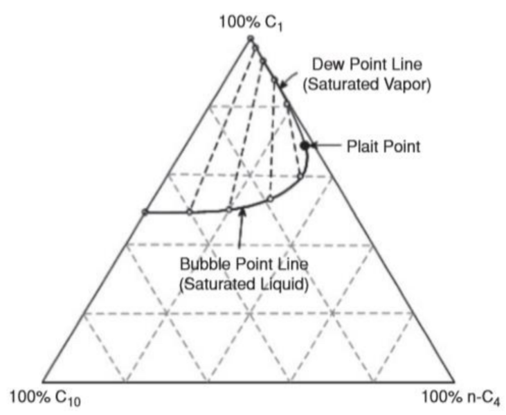
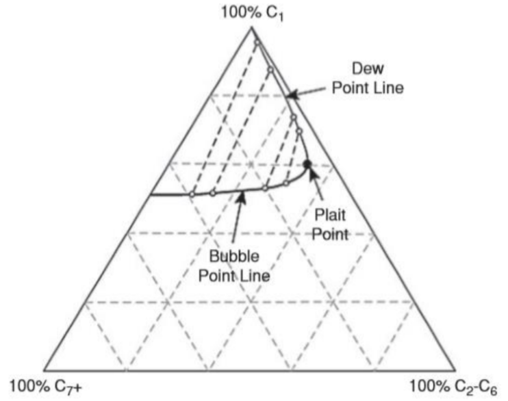
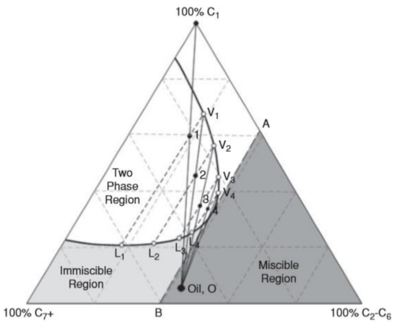
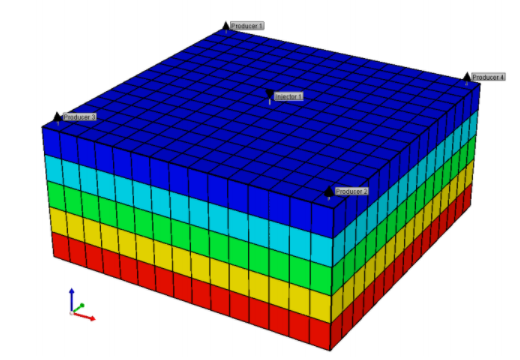

# Hydrocarbon Gas Injection Predictive Model

```{r include=FALSE}
knitr::opts_chunk$set(echo = FALSE)
```

## Pendahuluan

Injeksi hidrokarbon adalah salah satu metode _Enhanced Oil Recovery_ (EOR) yang menggunakan gas hidrokarbon sebagai fluida injeksinya. Dalam injeksi hidrokarbon, gas hidrokarbon ringan (C~1~ hingga C~6~) diinjeksikan ke dalam reservoir. Apabila tekanan reservoir di bawah _Minimum Miscibility Pressure_ (MMP), maka mekanisme perpindahannya adalah _immiscible displacement_ (perpindahan tak terlarut). Jika tekanan reservoir di atas MMP, maka mekanismenya adalah _miscible displacement_ (perpindahan terlarut).

Berikut akan dibahas mengenai penyusunan model prediktif injeksi hidrokarbon untuk memprediksi performa reservoir saat dilakukan metode EOR _hydrocarbon gas injection_. Model prediktif dibuat berdasarkan hasil simulasi reservoir dan aplikasi _Artificial Neural Network_ (ANN). Profil produksi dibentuk berdasarkan model prediktif laju alir maksimum, waktu saat laju alir maksimum, laju alir inisial, periode produksi dan laju alir di akhir periode produksi.

## Mekanisme Injeksi Hidrokarbon

Injeksi tak terlarut (*immiscible*) adalah kondisi injeksi dengan proses perpindahan fluida di mana ada sebuah batas pemisah yang jelas antara fluida pemindah dan fluida yang dipindahkan. Sedangkan injeksi terlarut (*miscible*) adalah kondisi injeksi dengan proses perpindahan fluida di mana ada fluida pemindah dapat terlarut pada fluida yang dipindahkan. Faktor-faktor yang memengaruhi kondisi terlarut atau tidak terlarutnya suatu fluida injeksi terhadap fluida reservoir adalah tekanan reservoir, temperatur reservoir, komposisi fluida reservoir, komposisi fluida injeksi dan heterogenitas reservoir.

Gas hidrokarbon diinjeksikan ke dalam reservoir untuk memindahkan fluida reservoir menuju sumur produksi. Beberapa dari gas injeksi dapat terlarut pada boundary melalui mekanisme _multiple contact miscibility_ (MCM), meningkatkan volume minyak dan mengurangi viskositas untuk menaikkan perolehan minyak.

Konsep _miscibility_ dalam injeksi gas dapat ditunjukkan pada sebuah diagram terner. Contoh diagram terner C~1~, n-C~4~ dan C~10~ pada 2500 psia dan 160 °F ada pada gambar di bawah ini (Hutchinson and Braun, 1961). Terlihat bahwa sistem ini memiliki daerah 2 fasa yang dikelilingi _bubble point line_ dan _dew point line_ yang bertemu pada sebuah titik kritis. Pada kondisi tekanan dan suhu tersebut, fluida dengan komposisi di luar zona 2 fasa akan terlarut dengan fluida pada sistem, dan fluida dengan komposisi di dalam zona tersebut tidak akan terlarut.
```{r fig.align = 'center', out.width = "50%", fig.cap="Diagram terner C~1~, n-C~4~ dan C~10~ pada 2500 psia dan 160 °F (Hutchinson and Braun, 1961)"}

```
Besar zona 2 fasa ini bergantung pada tekanan dan temperatur sistem. Misalkan pada temperatur konstan 160 °F, kenaikan tekanan sistem dari 2500 ke 3200 psia akan mengecilkan zona 2 fasa, yang berarti lebih banyak komposisi fluida hidrokarbon yang dapat terlarut dengan fluida sistem.
```{r fig.align = 'center', out.width = "50%", fig.cap="Diagram terner C~1~, n-C~4~ dan C~10~ pada 160 °F dengan tekanan kondisi berbeda, 2500 dan 3200 psia (Hutchinson and Braun, 1961)"}
knitr::include_graphics("images/HC/terner2.png")
```
Sistem hidrokarbon kompleks umumnya direpresentasikan oleh sebuah diagram pseudo-terner, seperti pada gambar di bawah ini. Komponen pseudo hidrokarbon digunakan untuk merepresentasikan sistem hidrokarbon multikomponen, seperti pada reservoir.
```{r fig.align = 'center', out.width = "50%", fig.cap="Diagram pseudo-terner sistem hidrokarbon kompleks (Hutchinson and Braun, 1961)"}

```
Injeksi hidrokarbon terlarut pada umumnya diklasifisikan menjadi tiga kategori berdasarkan mekanismenya: _First Contact Miscibility_ (FCM), _Vaporizing Gas Drive _(VCD), dan _Condensing Gas Drive_ (CGD).

_First Contact Miscibility_ (FCM) adalah kondisi saat gas hidrokarbon yang diinjeksikan langsung terlarut seluruhnya saat menyentuh minyak di reservoir. Pada diagram terner, FCM terjadi jika garis antara fluida injeksi dan fluida reservoir sama sekali tidak menyentuh zona 2 fasa. Hidrokarbon yang diinjeksikan adalah _liquified petroleum gas_ (LPG) seperti propana, pada tekanan yang tinggi agar FCM tercapai.

_Vaporizing Gas Drive_ (VCD) dan _Condensing Gas Drive_ (CGD) adalah kondisi _multiple contact miscibility_ (MCM), yaitu kondisi saat _miscibility_ tercapai setelah fluida injeksi melakukan kontak berulang terhadap minyak di reservoir.

_Vaporizing Gas Drive_ (VCD) adalah mekanisme dimana gas hidrokarbon injeksi diperkaya oleh komponen menengah minyak yang menguap hingga fluida injeksi dapat larut pada minyak. Proses VCD dimulai saat gas injeksi menguapkan komponen ringan minyak pada reservoir pada kontak pertama, membentuk sebuah fluida dengan komposisi baru. Komponen gas fluida baru tersebut kemudian melakukan kontak pada minyak, menghasilkan fluida baru yang akan melakukan kontak kembali pada minyak. Proses ini terjadi berulang hingga gas yang dihasilkan mencapai _miscibility_ dengan minyak.

Contohnya ditunjukkan pada gambar di bawah ini, gas injeksi adalah 100% C~1~ (metana).
```{r fig.align = 'center', out.width = "50%", fig.cap="Mekanisme _Vaporizing Gas Drive_ (VCD) pada diagram pseudo-terner sistem hidrokarbon kompleks"}

```
Pada kontak pertama, metana menguapkan komponen ringan minyak dan membentuk fluida baru dengan komposisi ditunjukkan oleh titik 1. Komponen gas dari fluida 1 (V~1~) kemudian melakukan kontak pada minyak, membentuk fluida baru dengan komposisi ditunjukkan oleh titik 2. Komponen gas dari fluida 2 (V~2~) kemudian melakukan kontak pada minyak, membentuk fluida baru dengan komposisi ditunjukkan oleh titik 3. Komponen gas dari fluida 3 (V~3~) kemudian melakukan kontak pada minyak, membentuk fluida baru dengan komposisi ditunjukkan oleh titik 4. Komponen gas fluida 4 (V~4~), kemudian dapat mencapai _miscibility_ dengan minyak di reservoir. 

Pada kondisi VCD, gas hidrokarbon yang diinjeksikan adalah _lean gas_, yaitu gas yang hampir seluruhnya mengandung metana. Gas diinjeksikan pada tekanan tinggi untuk menguapkan komponen menengah minyak (C~2~-C~6~) dan memicu mekanisme VCD.

_Condensing Gas Drive_ (CGD) adalah mekanisme dimana fluida reservoir diperkaya oleh komponen menengah gas hidrokarbon injeksi, membentuk fluida yang dapat dilaruti oleh gas injeksi. Proses CGD dimulai saat gas injeksi mengembunkan komponen menengah minyak pada kontak pertama, membentuk fluida dengan komposisi baru. Komponen cair fluida baru tersebut kemudian melakukan kontak pada gas injeksi, menghasilkan fluida baru yang akan melakukan kontak kembali pada fluida injeksi. Proses ini terjadi berulang hingga gas yang dihasilkan mencapai _miscibility_ dengan minyak.

Contohnya ditunjukkan pada gambar di bawah ini, gas injeksi adalah _enriched gas_, yaitu hidrokarbon dengan komponen campuran C~1~ dan C~2~-C~6~.
```{r fig.align = 'center', out.width = "50%", fig.cap="Mekanisme _Condensing Gas Drive_ (CGD) pada diagram pseudo-terner sistem hidrokarbon kompleks"}
knitr::include_graphics("images/HC/terner5.png")
```
Pada kontak pertama, gas injeksi mengembunkan komponen menengah minyak dan membentuk fluida baru dengan komposisi ditunjukkan oleh titik 1. Komponen cair dari fluida 1 (L~1~) kemudian melakukan kontak pada gas injeksi, membentuk fluida baru dengan komposisi ditunjukkan oleh titik 2. Komponen cair dari fluida 2 (L~2~) kemudian melakukan kontak pada gas injeksi, membentuk fluida baru dengan komposisi ditunjukkan oleh titik 3. Komponen cair dari fluida 3 (L~3~) kemudian melakukan kontak pada minyak, membentuk fluida baru dengan komposisi ditunjukkan oleh titik 4. Komponen cair fluida 4 (L~4~), kemudian dapat mencapai _miscibility_ dengan gas injeksi.

Pada kondisi CGD, gas hidrokarbon yang diinjeksikan adalah _enriched gas_, yaitu gas hidrokarbon dengan komponen menengah (C~2~-C~6~). Gas diinjeksikan untuk mengembunkan komponen minyak dan memicu mekanisme CGD.

Dari data komponen hidrokarbon pada diagram terner, dapat ditentukan besar _Minimum Miscibility Pressure_ (MMP) dari fluida reservoir. Sebuah korelasi MMP untuk injeksi hidrokarbon adalah Korelasi Glasø (Glasø, 1985). Korelasi Glasø menghitung MMP sebagai fungsi dari temperatur reservoir, berat molekul komponen C~7~^+^ minyak, persen mol dari metana pada gas injeksi, dan berat molekul komponen menengah (~C~2-C~6~) pada gas injeksi. Berikut korelasi Glasø untuk menghitung MMP untuk sistem hidrokarbon:
$$MMP_{x=34} = 6329.0 − 25.410y − z(46.745 − 0.185y) + T(1.127 × 10^{−12}y^{5.258}e^{319.8zy^{−1.703}})...(1)$$
$$MMP_{x=44} = 5503.0 − 19.238y − z(80.913 − 0.273y) + T(1.700 × 10^{−9}y^{3.730}e^{13.567zy^{−1.058}})...(2)$$
$$MMP_{x=54} = 7437.0 − 25.703y − z(73.515 − 0.214y) + T(4.920 × 10^{−14}y^{5.520}e^{21.706zy^{−1.109}})...(3)$$
dimana: </br>
$MMP$ = _minimum miscibility pressure_, psig </br>
$x$ = berat molekul komponen C~2~-C~6~ pada gas injeksi, lbm/lb-mole </br>
$y$ = berat molekul komponen C~7~^+^ minyak pada kondisi _stock-tank_, dimana $y = \left( \frac{2.622}{\gamma_{o,C_{7+}}^{-0.846}} \right)$ dan $\gamma_{o,C_{7+}}$ adalah _specific gravity_ minyak pada kondisi _stock-tank_. </br>
$z$ = metana pada gas injeksi, persen mol </br>
$T$ = temperatur reservoir, $^\circ$F

Untuk berat molekul komponen C~2~-C~6~ pada gas injeksi (x) di luar nilai pada persamaan tersebut (33,44,54) dapat dilakukan interpolasi ataupun ekstrapolasi. Glasø melaporkan deviasi sebesar 2-8 persen antara MMP hasil korelasi dengan eksperimen. 

## Pembuatan _Predictive Model_

Model prediktif injeksi hidrokarbon dibentuk menggunakan fungsi Multilayer Neural Network pada _software_ CMG-CMOST berdasarkan data hasil simulasi reservoir. Tahapannya adalah pembuatan model sintetis, analisa sensitivitas, pembuatan _proxy model_ untuk tiap titik hasil, dan pembuatan profil produksi.

Model sintetis reservoir yang dibangun merupakan model _pattern area 5-spot_ dengan jenis _grid_ kartesian dengan ukuran _grid_ homogen pada bagian lateral dan _layer_ vertikal. Model reservoir tertutup dengan 1 sumur injeksi dan 1 sumur produksi. Perforasi sumur injeksi dipasang pada 2 layer teratas reservoir, dan perforasi sumur produksi pada 3 _layer_ terbawah reservoir. Properti batuan reservoir pada model merupakan _single value model_ (homogen), kondisi inisial reservoir disesuaikan dengan kedalaman reservoir dan telah disesuaikan dengan _screening criteria_ pada berbagai studi dan aplikasi lapangan yang telah dilakukan sebelumnya.
```{r fig.align = 'center', out.width = "50%", fig.cap="Model sintesis reservoir untuk pembuatan Hydrocarbon Injenction Predictive Model"}

```
Fluida yang digunakan adalah _black oil_ yang memiliki rentang API 15-45. Model fluida dibentuk menggunakan _software_ CMG-WINPROP untuk melakukan lumping komponen untuk mengelompokkan komponen dengan kategori: Komponen ringan, komponen sedang, komponen berat dan pengotor (*impurities*). Berikut komponen hidrokarbon untuk masing-masing nilai API fluida
```{r fig.align = 'center', out.width = "50%", fig.cap="Komposisi fluida reservoir untuk jenis API berbeda"}
knitr::include_graphics("images/HC/komposisi.png")
```
<p> &nbsp; </p>
Kurva permeabilitas relatif dibangun menggunakan Persamaan Corey.

Untuk permeabilitas relatif minyak dan air ditentukan dengan persamaan berikut ini:
$$k_{ro} = (k_{rocw}) \left[ \frac{1-S_{w}-S_{orw}}{1-S_{wc}-S_{orw}} \right]^{n_o}...(4)$$
$$k_{rw} = (k_{rwiro}) \left[ \frac{S_{w}-S_{wc}}{1-S_{wc}-S_{orw}} \right]^{n_{ow}}...(5)$$

```{r fig.align = 'center', out.width = "50%", fig.cap="Kurva permeabilitas relatif minyak-air"}
knitr::include_graphics("images/chemicalhnp/oilwater.png")
```
Berikut asumsi yang digunakan dalam membuat tabel permeabilitas relatif minyak dan gas:
$$S_{wc}=S_{wcrit}...(6)$$
$$S_{orw}=S_{oirw}...(7)$$
Untuk permeabilitas relatif _liquid_ dan gas ditentukan dengan persamaan berikut ini:
$$k_{rog} = (k_{rogcg})\left[ \frac{1-S_{g}-S_{Lc}}{1-S_{gc}-S_{Lc}} \right]^{n_{og}}...(8)$$
$$k_{rg} = (k_{rgci}) \left[ \frac{S_{g}-S_{gc}}{1-S_{gc}-S_{Lc}} \right]^{n_g}...(9)$$

```{r fig.align = 'center', out.width = "50%", fig.cap="Kurva permeabilitas relatif liquid-gas"}
knitr::include_graphics("images/chemicalhnp/oilgas.png")
```
Berikut asumsi yang digunakan dalam membuat tabel permeabilitas relatif _liquid_-gas:
$$S_{wcon} = S_{Lcon}$$
$$S_{Lrg} = S_{Lcon}+S_{org}$$
$$S_{gc} = S_{gcrit}$$
$$N_o = N_g$$
$$N_{ow} = N_{og}$$

Tekanan alir produksi bawah sumur di-set sama dengan tekanan reservoir, yang akan menunjukkan bahwa produksi adalah _incremental gain_ jika melakukan injeksi hidrokarbon. Parameter operasi adalah laju alir gas injeksi. Gas yang diinjeksikan adalah _enriched hydrocarbon gas_, dengan komposisi campuran komponen C~1~-C~3~. Produksi dan injeksi dilakukan secara kontinu selama 15 tahun. Konstrain yang digunakan adalah GOR Produksi, yang mana jika telah melebihi 100000 SCF/STB maka produksi dihentikan.

Analisa sensitivitas dilakukan menggunakan fungsi CMOST pada software CMG, dengan menggunakan metode _Response Surface Methodology_. Metode ini digunakan untuk menentukan hubungan antara variabel _input_ (parameter) dan respon (*objective function*). Seluruh parameter divariasikan dalam sejumlah eksperimen yang dibuat menggunakan _Latin Hypercube Method_ dan respon dari seluruh eksperimen akan digunakan untuk membentuk sebuah _proxy model_.

Ada 20 parameter yang divariasikan, dengan range nilai masing-masing parameter yang berbeda. Tabel 2 menunjukkan parameter-parameter dan variasi nilainya:

|No|Parameter|Satuan|Min|Max|Keterangan|
|:---:|:---:|:---:|:---:|:---:|:---:|
|1 | _Luas area pattern_ (A)|acre|5|20||
|2 | Ketebalan _net pay_(h)|ft|10|250||
|3 |Porositas|%|8|26||
|4 |Permeabilitas Lateral|mD|10|1250||
|5 |kv/kh _Ratio_|fraksi|0.1|0.3||
|6 |Densitas Fluida Reservoir|$^\circ$API|15|45|SG 0.7978 - 0.9599|
|7 |Temperatur Reservoir |$^\circ$F|100|300||
|8 |Kedalaman|fraksi|ft|3000|15000||
|9 |Tekanan Reservoir|psia|500|5000||
|10|Saturasi Air _Initial_||0.1|0.95||
|11| SWCON||0.125|0.4||
|12 |SORW ||0.1|0.45||
|13 |SGCON ||0s|0.1||
|14 |SORG||0.05|0.2||
|15 |NW||1|4||
|16 |NOW||1|4||
|17 |KROCW||0.35|1||
|18 |KRWIRO||0.35|1||
|19 |KRGCL||0.35|1||
|20 | _Injection Rate_|MMSCFD|0.05|5||

Table: <span style="color: grey;"> Tabel 11.1: _Range_ Nilai Parameter _Input_ Untuk Studi Sensitivitas dan Pembuatan _Proxy Model_ </span>

Respon yang diukur adalah volume produksi dan laju alir fluida. Dari respon tersebut akan direkam nilai produksi kumulatif, laju alir inisial (Q~i~), laju alir maksimum (Q~max~), laju alir di akhir produksi (Q~e~), waktu saat laju alir maksimum tercapai (t~Qmax~), dan periode produksi (t~stop~). Masing-masing respon ini akan dibentuk _proxy model_-nya untuk membangun profil produksi suatu fluida reservoir.
```{r fig.align = 'center', out.width = "50%", fig.cap="Pembangunan profil produksi fluida reservoir berdasarkan _Proxy Model_"}
knitr::include_graphics("images/HC/pembangunan.png")
```

Tren dari laju alir inisial menuju laju alir maksimum diasumsikan berupa _linear trend_, dan tren dari laju alir maksimum menuju laju alir akhir produksi berupa _exponential decline_.

_Proxy model_ dibuat berdasarkan hubungan parameter dan respon pada fungsi CMOST pada software komersial CMG. Ada 2 jenis _proxy model_ yang dapat dibentuk: _Polynomial Regression_ dan _Neural Network_. Setelah membandingkan keakuratan kedua jenis model, jenis _proxy model_ yang dominan digunakan adalah _Neural Network_, tipe _Multilayer Neural Network_.

Jumlah eksperimen simulasi yang digunakan untuk membangun _proxy model_ adalah 4022 eksperimen, dengan jumlah data training 3595 data dan jumlah data verifikasi _proxy model_ 427 data.

Profil produksi akan dibentuk menggunakan _proxy model _variabel-variabel respon di atas untuk fluida minyak, air, gas, dan _liquid_ seperti tertera pada Tabel 3. Di bawah ini akan dilampirkan seluruh _proxy model_ pembentuk profil produksi dalam bentuk _weighting_ dari _neural network architecture_.

|Respon|Minyak|Air|Liquid|
|:---:|:---:|:---:|:---:|
|Kumulatif Produksi|N~p~|W~p~|L~p~|
|Laju Alir Maksimum|Q~omax~|Q~wmax~|Q~lmax~|
|Waktu Saat Laju Alir Maksimum|t~Qomax~|t~Qwmax~|t~Qlmax~|
|Laju Alir Inisial|Q~oi~|Q~wi~|Q~li~|
|Laju Alir Akhir|Q~oe~|Q~we~|Q~le~|
|Periode Produksi|t~stop~|t~stop~|t~stop~|

Table: <span style="color: grey;"> Tabel 11.2: Jumlah _Proxy Model_ yang Dibentuk untuk Profil Produksi Berbagai Fluida Reservoir </span>

<p> &nbsp; </p> 
_Proxy model_ untuk produksi kumulatif minyak:

__Multilayer Neural Network (8, 6, 4)__

__Layer 1:__

|||||||||
|:---:|:---:|:---:|:---:|:---:|:---:|:---:|:---:|:---:|
|-0.57| 0.11| -0.29 |0.40| -0.34| 0.19| 5.61| 0.18|
|-0.42| -0.20| 0.13 |0.03| -0.28| 1.10| 0.51| 0.12|
|-0.14| 0.00| 0.11 |-0.11| -0.04| 0.04| -0.02| -0.02|
|5.41 |-0.06| 0.11 |-0.12| -0.0| 0.05| -0.22| -0.03|
|-0.04| -0.40| 0.05 |-0.17| 0.06| 0.03| 0.02| -0.09|
|-0.15| -1.09| -0.38| -0.14| 0.20| -0.13| -0.18| -0.11|
|-0.49| 0.04| 0.57 |0.49| -0.24| 0.32| 0.28| -0.07|
|-1.08| -0.01| -0.01| 0.03| 0.04| -0.04| 0.23| 0.00|
|2.20 |-0.21| -0.07| 3.71| 0.55| -0.79| 2.36| -0.53|
|0.05 |-0.02| -0.23| -0.53| 0.10| 0.00| -0.50| 0.12|
|0.07 |-0.20| 0.05 |0.33| 0.09| -0.06| 0.28| -0.09|
|-0.02| 0.00| -0.10| 0.07| 0.10| -0.10| -0.08| 0.00|
|0.18 |0.06| 0.05 |-0.07| -0.04| 0.04| -0.07| 0.01|
|-0.04| 0.77| -0.12| -0.33| -0.2|1 0.10| -0.51| 0.24|
|-0.21| 0.26| -0.12| 0.42| 0.10| -0.15| 0.37| 0.02|
|0.04 |-0.04| -0.08| -0.22| -0.08| 0.03| 0.07| 0.04|
|-0.02| -0.01| -0.03| 0.19| 0.03| -0.04| 0.09| -0.01|
|0.07 |-0.18| -0.08| 0.03| 0.09| -0.04| -0.23| -0.03|
|-2.51| 0.0| 0.42 |3.75| 2.05| -1.09| -0.48| -0.33|
|0.23 |0.59| -1.71| -0.01| -0.23| -0.04| -0.16| 0.61|
|-2.23| -0.12| -0.15| -1.48| 0.01| 0.24| -2.76| 0.14|

__Layer 2:__

|||||||
|:---:|:---:|:---:|:---:|:---:|:---:|
|3.75| 0.24| 0.24| -0.28| 2.74| 3.07|
|-0.95| 0.62 |-0.20| 1.08| -0.61| 0.46|
|0.93| -1.53 |-0.63| -0.68| 0.30| -1.56|
|-2.40| 0.35| 0.65| -0.48| -0.61| -4.17|
|-1.28| -1.97 |-3.01| 4.23| -3.64| -2.33|
|-0.54| 0.75| 0.03| 2.61| -0.59| 0.51|
1.37 |-1.50| -0.36| 0.23| -1.71| -1.10|
|2.28| -5.37| -2.27| -1.61| 0.02| -5.58|
|1.49| 0.37| 1.76|-2.55| 1.74| -2.76|

__Layer 3:__

|||||
|:---:|:---:|:---:|:---:|
|0.20| -3.97| 3.94| -0.03|
|-0.63| 3.84| -4.11| 0.11|
|0.10| -1.98| 2.77| 0.02|
|-0.05| 0.47| 0.16| 0.05|
|0.73| 0.46| -0.38| -0.13|
|0.71| 4.07| -4.04| -0.08|
|0.86| -2.27| 2.28| 0.64|

__Output Layer:__

||||||
|:---:|:---:|:---:|:---:|:---:|:---:|
|-0.07| 2.22| 2.22| -0.60| 0.58|

<p> &nbsp; </p>
_Proxy model_ untuk laju alir maksimum minyak:

__Multilayer Neural Network (8, 6, 4)__

__Layer 1:__

|||||||||
|:---:|:---:|:---:|:---:|:---:|:---:|:---:|:---:|:---:|
|-0.56| 0.15| 4.94| 0.29| 0.63| 0.31| 0.23 |0.47|
|-0.13| -0.03| 0.35| 0.04 |0.74| 0.04 |0.03| 0.02|
|-0.09| -0.03 |-0.02| -0.14| 0.08| 0.03| -0.05| 0.26|
|0.75| -0.27 |0.60| 2.07| 1.89 |-1.39| -0.22| 0.08|
|-0.05| 0.04| 0.14| 0.05 |0.04| 0.05 |0.06 |-0.19|
|-0.33| 0.38| -0.18| 0.65| 1.94| 0.35 |0.70| -0.44|
|-0.17| 0.10| -0.13| 0.03| 0.17 |0.19| 0.12 |0.24| 
|0.05| -0.05 |-0.46| -0.47 |0.21| 0.13| 0.02 |-0.09|
|0.88| -1.17 |0.95| 0.11| 4.21 |-1.90 |-0.94| -3.13|
|-0.10| 0.33| 0.04| 0.27 |-0.82 |0.50| 0.37| -0.01|
|0.06| -0.22| 0.41| -0.09 |0.36 |-0.08| -0.22| -0.77|
|-0.16| 0.05 |0.20|-0.01| -0.46| 0.17| 0.00| -0.23|
|0.07| -0.08 |0.12| 0.05| 0.34 |-0.04| -0.05| -0.10|
|-0.20| 0.11| 0.56 |0.10 |-0.98| 0.49| 0.05| -0.23|
|0.12 |-0.28 |1.01| -0.33| -0.24 |-0.13 |-0.38| -0.58|
|-0.09| 0.20| 0.10 |0.33| -0.03| 0.13| 0.27| 0.02|
0.06 |-0.10| 0.03| 0.03| 0.39 |-0.14 |-0.08| -0.14|
|0.01 |0.00 |-0.53| -0.03| -0.02| -0.04| -0.01| 0.13|
|-3.63| 0.29 |0.28| 1.19| -0.55| 2.07| 0.03| 0.49|
|-0.15| 0.13 |-3.04| 1.41| -0.99 |-0.43| 0.76| -0.72|
|0.42| 0.70| -2.52| -0.31| 0.10| -0.65| 0.30| -0.56|

__Layer 2:__

|||||||
|:---:|:---:|:---:|:---:|:---:|:---:|
|2.83| -3.71 |-1.42 |-6.21| 0.50 |2.32|
|1.23 |-4.63| -7.37| -0.07 9.63 12.57
|2.05| -0.49| -1.63| 4.81 |-4.08 |0.55|
|-0.36| -2.65| -1.37 |-4.95| 0.05| 1.58|
|0.14| -0.57| -0.46| -1.45| 0.83| 0.69|
|0.72| -6.14| -0.76| -9.12| 0.59| 4.20|
|-0.77 |4.68| 5.74| 4.65 |-6.03| -6.08|
|-0.27 |-1.12| 0.56 |-3.84| -0.84| 0.31|
|-1.26| -1.48| 2.36|-1.67| -7.36| -4.52|

__Layer 3:__

|||||
|:---:|:---:|:---:|:---:|
|-1.15| 1.14| 0.15| -21.22|
|-2.64| 2.59 |-7.12| -12.37|
|0.62| -0.54 |2.42| 0.42
|-0.19| 0.18| 1.18 |10.50|
|-1.08| 1.03| -2.52| -5.63|
|-2.03| 1.99| -5.03| -0.52|
|-0.13| 0.04 |1.32| 2.38|

__Output Layer:__

||||||
|:---:|:---:|:---:|:---:|:---:|
|1.98| 2.10| 0.20| -2.20| 2.30|

<p> &nbsp; </p>
_Proxy model_ untuk waktu saat laju alir maksimum minyak:

__Multilayer Neural Network (9, 9, 9)__

__Layer 1:__

||||||||||
|:---:|:---:|:---:|:---:|:---:|:---:|:---:|:---:|:---:|
|1.56 |-0.09| 2.43| -0.35 |0.98| -2.58| 3.72 |3.39| -1.23|
|0.98 |-0.14| 1.60| 1.63 |-0.02 |-0.63| -1.40| -0.73| -0.83|
|0.07| 0.57 |0.22 |-1.21| 0.10| 0.91| -3.25| 1.01| 0.88|
|0.55| 0.14| 0.74 |-1.18 |-4.48| 0.81| 0.82| 0.89| 0.72|
|0.76 |-0.67| 0.43| -0.72 |0.32 |-0.41 |1.41| 1.23 |-0.54|
|0.12 |0.21| 0.66| 1.07| -0.80 |-0.49 |-0.62| -0.95 |-0.21|
|-1.77| 0.72 |-0.58| -2.15| -1.56 |-0.37| -2.87 |-2.27 |-0.91|
|-0.64| -0.24 |-0.94| 0.31 |-0.84 |-0.57| -2.71 |1.18 |-0.28|
|-0.68| 0.30 |-0.40 |-0.55 |-0.30 |-0.06| -2.32 |-0.49 |-0.22|
|-0.44| -0.06 |-0.70 |-0.26 |-0.24 |0.12| -1.42|-0.96| -0.01|
|0.81 |0.07| 0.99| -0.12| 0.26| 0.39 |3.12 |-0.32| 0.36|
|0.63 |-0.65| 0.11| 1.26 |0.49 |-0.75 |1.65| -0.50 |-0.50|
|-0.51| 0.13 |-0.36| -0.77| 0.33 |-0.27 |0.15 |-0.81 |-0.18|
|0.55 |-0.20| 0.20 |-0.20| -0.35| 0.23 |0.82 |0.02| 0.30|
|0.06| 0.66 |0.78| -0.21| 0.67 |0.25| 1.90 |-0.16 |0.33|
|0.06 |0.09 |0.13| 0.13 |-0.05| 0.15 |-2.42| -0.54 |0.04|
|1.48 |-0.83| 0.07| -0.68 |-0.43| 0.92 |-0.61| -1.80| 0.79|
|-0.90| -1.37| -1.89| 0.03| 0.44| 0.10| -0.82| -0.59 |0.24|
|0.39 |0.28| 1.00| -0.07| 2.02| -0.47| 3.86| 2.17| -0.33|

__Layer 2:__

||||||||||
|:---:|:---:|:---:|:---:|:---:|:---:|:---:|:---:|:---:|
|4.49 |-10.49 |0.08| -1.58| -0.55 |-1.98| -0.11| -1.01 |8.52|
|3.38 |-11.55| 0.23 |-0.65| -0.56 |1.15| 0.43 |-0.34 |-3.41|
|-0.36 |7.86 |-0.01 |0.67 |-0.70 |-3.00| -0.80| 2.38| 2.81|
|-0.47| 0.13| -0.03 |-0.03| -0.18| 5.52| 0.43| -0.74| -8.25|
|0.57 |1.69 |0.69 |1.10| -0.15| -5.10| -2.32| -2.94| 1.24|
|3.72| -1.44 |0.99| 1.23 |-3.72 |-2.48| -1.02 |2.13 |-4.30|
|0.15 |-1.71 |-0.15| -0.39| -0.19| -0.38| 1.33 |1.37| 0.86|
|0.71| 0.59 |0.55| 1.57| 2.17| 5.12 |-1.18 |0.80 |5.93|
|-6.15| 6.44 |-1.55 |-0.94 |4.70| 7.21 |1.76 |-2.57 |-2.74|
|0.16 |-3.07| -0.49| -0.08 |-2.47 |0.87| 1.92| 1.94| 1.41|

__Layer 3:__

||||||||||
|:---:|:---:|:---:|:---:|:---:|:---:|:---:|:---:|:---:|
|-1.63| 0.16| -0.57| 0.62| -3.02| 1.59| 3.87| 1.15 |0.53|
|2.41 |3.89| 6.96 |-7.37| 0.80 |1.14| 0.63 |1.71| -2.75|
|-3.66 |5.12 |-0.17| 0.54| 0.63 |-2.73 |-2.21 |-2.50 |-4.25|
|-0.95| -0.33| 1.83 |-2.56 |1.43| 2.41| 0.08 |2.35 |-0.33|
|-0.04| -0.44| 0.21| -0.15| -0.14| -0.58 |-0.22| -0.54| 0.98|
|-0.20 |5.73| 0.00| 0.02 |-0.69 |0.61| 1.09| 0.54| -5.42|
|-0.23 |1.48| 0.52| -0.51 |1.00| -0.39| -1.34| -0.26| -1.20|
|3.71| -2.75| 0.58| -0.13| 2.96| 2.53| -3.40 |2.07| 1.70|
|0.03| -0.97| -0.46| -2.25| 2.08| -1.00| 0.08 |-1.37| 1.39|
|-1.49 |-1.79| 4.57 |-2.05| -5.39| -3.36| 3.81 |-1.55| 3.35|

__Output Layer:__

||||||||||
|:---:|:---:|:---:|:---:|:---:|:---:|:---:|:---:|:---:|
|-1.30| 1.81| 3.19 |3.14 |1.26| 1.4| 1.08| -1.5| 2.33 |-1.55|

<p> &nbsp; </p>
_Proxy model_ untuk laju alir inisial minyak:

__Multilayer Neural Network (8, 6, 4)__

__Layer 1:__

|||||||||
|:---:|:---:|:---:|:---:|:---:|:---:|:---:|:---:|
|0.02| -2.65| 0.03| 1.52| 0.26| -2.71 |-0.07| 1.33|
|-0.14|  -0.37|  -0.04| 0.15| 0.29| -0.42| 0.17| 0.28|
|0.08 | -0.08 | -0.09 |-0.01 |0.13| -0.08 |0.03| 0.09|
|0.19 | -1.01 | -0.49| 0.25 |-8.83| -0.80| 0.02| -0.03|
|0.01 | -0.02 | 0.00 |-0.08 |0.16 |0.01 |-0.01| 0.07|
|0.68 | -0.26 | 0.31| 0.14| -0.08 |-0.06| -1.06| -0.35|
|-0.11|  -0.13|  -0.12| 0.12 |0.48| -0.26| 0.25| 0.29|
|-0.03|  -0.02|  0.22| 0.11| 1.86| -0.08| -0.09| -0.20|
|-0.29|  0.98 | 0.00 |-1.85 |-0.58 |-3.50| 0.44| 2.74|
|0.23 | -1.34 | -0.11| 0.05| 0.51| 0.42 |-0.16| -0.08|
|-0.02|  -1.04|  0.03| -0.72 |0.15 |-1.03| 0.01| 1.06|
|-0.02|  0.13 | 0.01 |-0.07 |-0.09| 0.05 |0.01| 0.06|
|0.06 | -0.02 | 0.00|-0.08| -0.14 |-0.02| -0.05 |0.13|
|-0.07|  0.16 | 0.07| -0.70| -0.04 |0.67| 0.01 |1.03|
|-0.02|  -1.22|  -0.11| -0.36 |0.31 |-0.91| 0.13| 0.59|
|0.08 | -0.02 | 0.12| 0.13 |-0.08|0.18| -0.20| -0.18|
|0.01 | -0.33 | 0.01 |0.11| 0.03| -0.34| -0.03 |-0.16|
|0.00 | -0.12 | -0.04| -0.03| 0.21| -0.01| 0.03| -0.03|
|-0.73|  0.98 | 1.74| -0.31 |-6.33 |0.96| -1.53| -0.01|
|-0.43|  0.45 | 0.41| -0.04 |-1.18 |0.33| 0.51| -0.08|
|-0.56|  -1.35|  -0.16| -0.33| -0.25 |-0.66| -0.21| -0.80|

__Layer 2:__

|||||||
|:---:|:---:|:---:|:---:|:---:|:---:|
|2.69 |-9.48| 3.60 |-15.30 |-0.78| -3.15|
|0.13 |-0.26| -1.36 |4.37 |0.17| -0.53|
|1.33 |-3.49| 2.53| 6.32| -1.45| -2.29|
|-0.05| -0.04 |-2.61 |2.41 |0.00| 2.20|
|-0.29| 3.47| -0.03 |12.07| -0.27| 0.00|
|-0.02| -0.15| 0.45| -1.32 |0.02 |1.47|
|1.61| -4.22 |2.31 |-6.68| -0.73 |-2.05|
|0.08 |-0.54 |-2.02 |0.29 |0.19 |1.72|
|1.70| -2.19 |0.73 |4.19| -1.16| -0.88|

__Layer 3__

|||||
|:---:|:---:|:---:|:---:|
|3.42| 1.74| -1.11| 7.94|
|-0.89| -3.84 |3.32| 1.01|
|1.68| 4.52| -4.37| 5.09|
|-0.15| 0.00| 0.04| 7.01|
|-4.48 |-2.77| 1.73| 0.60|
|3.28| 6.92| -6.64| 7.85|
|0.54| 5.11| -5.32| 10.79|

__Output Layer:__

||||||
|:---:|:---:|:---:|:---:|:---:|
|0.04| 0.86| 1.08 |-2.42|2.80|

<p> &nbsp; </p>
_Proxy model_ untuk laju alir akhir minyak:

__Multilayer Neural Network (8, 6, 4)__

__Layer 1:__

|||||||||
|:---:|:---:|:---:|:---:|:---:|:---:|:---:|:---:|
|-1.84 |0.52| 1.67| 1.00| -1.80| -0.52| 3.01|1.39|
|0.83 |-0.86| 0.58| -0.58| 0.55| 3.90|3.76| -0.39|
|-0.12| -0.32| 0.40| 0.80| -0.22| -0.74| -0.94| -0.06|
|0.45 |-1.47| 0.21| 0.51| 0.07| -0.39 |-2.09 |0.09|
|0.62 |-1.25 |-0.05| 0.19| 0.44 |-0.39| -0.72| -0.22|
|0.76 |-2.04| -0.02| 0.72| 1.06| -0.54| 6.19| -0.81|
|-0.22| 1.48 |0.73| 0.19 |-0.75 |1.37| -2.15| -0.17|
|-0.56 |0.73| 0.63 |-0.18| 0.22 |-0.56| 1.31| 0.02|
|0.57| -1.09| -1.63 |-1.76| 0.33|1.37| -2.11 |-1.39|
|-0.11| 0.95| 0.03 |-0.30 |-0.24 |-1.38| -0.47| 0.48|
|-0.30 |-0.05| 0.03| -0.14| -0.21 |0.21| 0.24| 0.06|
|-0.18| 0.17| -0.07| 0.67| -0.32 |-0.50| -0.60| -0.07|
|-0.18| -0.55| 0.04 |0.05 |-0.17| -0.55| -0.39| 0.64|
|-0.27| 1.71 |-0.12 |0.29| -0.35 |-0.91| -2.08|0.26|
|-1.39| 0.53| 0.85 |0.50 |0.06| 1.01| 3.49| -0.05|
|0.46| -0.29| 0.23| 0.18| 0.96| -1.14 |1.30| -0.01|
|0.20| -0.44 |-0.09| -0.52| 0.45 |-0.10| -0.26| -0.08|
|0.06| -1.14| -0.18| 0.51 |-0.22| -0.82| -0.36| -0.03|
|-0.52| 3.64| 1.26| 0.03| 1.05| -0.12 -1.67| -3.33|
|-0.31| 1.64 |-0.09| 6.07 |0.38 |0.71| 0.34| 1.40|
|-0.57| -0.74| -0.28| -0.61| 0.03| -0.48| -0.78 0.34|

__Layer 2:__

|||||||
|:---:|:---:|:---:|:---:|:---:|:---:|
|6.84| -9.36| 2.01| -3.61| 0.26 |-0.36|
|-5.95| 2.13 |0.00 |4.15| -0.06 |-0.34|
|-1.88 |-4.61| 2.45 |2.80 |0.26| -1.07|
|-0.33| 0.82| -0.80| 0.04| -0.38| 0.90|
|-10.06| 8.07| -0.80 |6.31| -0.35| -0.09|
|2.75| -1.92 |0.54| -1.90| -0.15| 0.59|
|-0.99| -0.18 |-0.29 |1.02 |0.07 |-0.36|
|-2.34| -0.73|1.10| 1.97| -0.08| -0.28|
|0.33 |-7.94| 3.12| 1.06 |0.41| 0.05|

__Layer 3:__

|||||
|:---:|:---:|:---:|:---:|
|-0.29 |0.34 |10.46 |7.53|
|-0.43| 0.53| -1.34 |4.30|
|0.25| -0.16 |-0.79 |9.32|
|-0.50| 0.60 |3.62 |9.25|
|-2.39 |2.68 |-3.97| 4.09|
|-0.79 |0.96| -2.19 |4.11|
|1.47| -1.59 |9.87| -2.65|

__Output Layer:__

||||||
|:---:|:---:|:---:|:---:|:---:|
|1.41| 1.14| 0.10 |2.57 |-2.73|

<p> &nbsp; </p>
_Proxy model_ untuk produksi kumulatif air:

__Multilayer Neural Network (8, 6, 4)__

__Layer 1:__

|||||||||
|:---:|:---:|:---:|:---:|:---:|:---:|:---:|:---:|
|-0.19 |-0.25| 2.25 |-0.31| 0.09 |-0.45 |-0.08 |0.56|
|-1.28 |-0.03| -0.02 |-0.39 |0.30| 0.36| -0.05 |-0.02|
|0.05 |0.05| -0.04| 0.00| -0.06| 0.14| 0.06| 0.00|
|0.00| -0.02| 0.02 |-0.33| 0.10 |-0.01 |0.01| -0.01|
|-0.02| 0.07| 0.03 |0.25| -0.05 |-0.09| 0.08| -0.23|
|-0.05 |0.02| -0.01 |0.98| -0.08| -0.50| 0.03 |-0.30|
|0.05 |-0.24| -0.92 |-0.77| -0.04 |0.02| 0.07| 0.19|
|0.03 |-0.18 |0.13 |1.35| 0.10| 0.15 |-0.29| -0.10|
|-0.95| 1.20 |0.05 |0.18| 2.38| -1.04| 3.13| -3.10|
|0.40 |-0.04| 0.04| 1.46| -1.24| 0.23| -0.78| -0.41|
|0.03 |0.13| 0.06| 1.47| -0.11| 0.00| 0.06 |-1.42|
|-0.07| 0.18| 0.07 |-0.09 |-0.08| -0.29| 0.22| -0.31|
|-0.03| -0.06| 0.00| -0.20 |0.07| -0.07| -0.07 |-0.06|
|0.16 |-0.11| -0.02| -1.64| -0.34| -0.05| -0.36| -0.59|
|0.04| 0.32| -0.02| 0.88 |-0.27| 0.05| 0.38 |-0.49|
|-0.06 |-0.13| 0.09 |-0.20| 0.07 |-0.20| -0.21 |-0.01|
|0.05| -0.02| 0.06 |0.91 |0.00 |0.25 |-0.05| -0.08|
|-0.06 |0.23| -0.09 |0.04 |-0.17 |-0.17| 0.34 |0.17|
|-0.83| -0.26| 0.06 |0.46| 0.13 |-3.08 |-0.35| -1.14|
|0.07 |0.01| -0.16| 0.04| -0.04 |0.15 |0.04| -0.19|
|0.34| 0.05| -1.96| -1.36| 0.05 |-0.15| -0.09| -0.07|

__Layer 2:__

|||||||
|:---:|:---:|:---:|:---:|:---:|:---:|
|2.26 |0.54| -1.12| -0.25| -1.20| -0.32|
|-0.74| 0.47| 1.16| -0.83 |-1.14| 1.34|
|3.14| -0.76| -0.75| 0.70 |0.52| -1.41|
|-0.41| 0.40 |-0.69| 0.11 |-0.09| -0.22|
|-1.06 |1.29 |-4.13 |0.03 |0.07| -0.21|
|4.24 |0.08 |-0.30| 0.21| -1.16 |-0.10|
|3.82| -0.08| -2.79 |0.56 |-0.59 |-0.96|
|0.81| -0.33| 0.87| -0.15 |-0.68| 0.20|
|-0.80| -0.07| 1.80| 1.26 |3.09| -2.06|

__Layer 3:__

|||||
|:---:|:---:|:---:|:---:|
|-0.97 |-0.39| -0.35 |0.49|
|1.15| 1.24 |-0.05 |0.09|
|1.29| 0.89 |1.28 |-1.31|
|-2.81| 0.40| -0.43| 1.75|
|-2.15| -1.06| -0.62| 0.54|
|1.09| 3.14| 0.45 |0.81|
|-0.91| -1.28 |-0.72| 2.40|

__Output Layer:__

||||||
|:---:|:---:|:---:|:---:|:---:|
|-2.54| 1.34| -0.12 |-1.38| 0.27|

<p> &nbsp; </p>
_Proxy model_ untuk laju alir maksimum air:

__Multilayer Neural Network (8, 6, 4)__

__Layer 1:__

|||||||||
|:---:|:---:|:---:|:---:|:---:|:---:|:---:|:---:|
|-0.88 |0.21| 0.75 |-2.20| 1.45 |-0.97 |-0.01| 0.22|
|-0.36| 0.11| 0.34| 1.36| -0.10 |-0.33| -0.09 |0.01|
|-0.01 |-0.04| -0.06| 1.55| 0.42 |0.11| -0.25| -0.18|
|2.80| 0.01| -0.17 |0.38| 1.45 |0.46 |-0.71 |-0.54|
|-0.05| -0.04| -0.08| 0.34| 0.40 |0.04 |-0.08| -0.11|
|-0.23| 0.05| 0.11 |-2.49 |0.04| 0.02 |-0.33| -0.25|
|-0.43| 0.10| 0.10 |1.68 |0.90| -0.16| -0.37 |-0.32|
|-0.93| 0.21| 0.24 |2.81 |-0.17| -0.07 |-0.23| -0.27|
|-1.23| 2.67 |0.48 |4.85 |-0.66| -0.28| 3.80| -0.58|
|0.18 |-0.02| 0.17 |-1.57 |-0.03 |0.15 |-1.49| -0.38|
|-0.35 |1.03| 0.28| 1.96 |-0.25| 0.02| 0.33| -0.44|
|-0.03 |-0.17| -0.20 |-0.33| 0.54| 0.04 |0.07| 0.03|
|-0.08|0.00|0.03 |0.00 |0.28 |-0.09| -0.06| -0.06|
|0.11| 0.66 |0.07| 0.03| 0.47| 0.16 |-0.67 |-0.46|
|0.07| 0.29 |0.19|-0.75| 0.20| 0.12| -0.49 |-0.48|
|0.11| 0.00 |-0.08| -0.32| 0.04| 0.07 |0.03 |0.04|
|-0.09| 0.09 |-0.01| -1.56 |0.01| 0.06 |0.11| -0.06|
|-0.08| -0.03| 0.08 |1.76| -0.34| -0.09| 0.05 |0.10|
|-1.13 |-0.06| -0.54| 0.44| 2.33 |-0.32| 0.29 |0.02|
|-2.33| -0.57 |-1.26| 1.99| 1.76| 1.06| 0.46| -0.07|
|0.14| -0.66| -0.12| 2.74| -0.77 |-0.49| -0.51| 0.14|

__Layer 2:__

|||||||
|:---:|:---:|:---:|:---:|:---:|:---:|
|0.25| -3.93| -0.27 |-0.01| -0.04 |-0.51|
|-3.23| -0.98| -0.17 |0.60| 4.71 |-0.58|
|3.00 |-1.78| 0.25| 11.68 |-5.57| 0.38|
|-1.17 |-2.96| 0.17 -0.15| 1.75 |0.40|
|-0.13| -2.86| 0.03| 3.77 |0.65| -0.03|
|0.18| -4.26| 0.37| 13.01 |0.66| 0.16|
|3.67 |3.46| -0.16| 0.58 |-4.41| -0.41|
|-4.71 |-5.5| 0.24| 7.89 |3.95| 0.26|
|0.42|2.79| 0.73| 6.39| 1.15| -2.06|

__Layer 3:__

|||||
|:---:|:---:|:---:|:---:|
|-2.96 |2.04 |3.90 |3.61|
|-0.19 |0.55| 0.68 |0.33|
|2.04 |-0.20| 4.79| 5.35|
|-3.30| 0.27 |3.15| 4.62|
|-1.15| 0.47 |-4.59| 1.39|
|2.02| -1.43| 1.10 |-3.40|
|-5.40 |0.96 |8.96| 0.03|

__Output Layer:__

||||||
|:---:|:---:|:---:|:---:|:---:|
|0.73 |0.14 |-0.26| 0.67 |0.38|

<p> &nbsp; </p>
_Proxy model_ untuk waktu saat laju alir maksimum air:

__Multilayer Neural Network (8, 6, 4)__

__Layer 1:__

|||||||||
|:---:|:---:|:---:|:---:|:---:|:---:|:---:|:---:|
|-1.15| -0.29| -2.24 |1.68 |1.11| 2.48 |0.12 |2.04|
|-1.63| -0.02| -1.77| 0.01| 0.21| 4.23| 0.11 |0.51|
|0.93| -1.03| -1.88 |0.41| 0.25 |1.74| 0.29| 0.82|
|-1.20 |-0.77 |0.48| 0.22 |2.50 |0.76| 0.27 |1.32|
|0.35| 0.61 |-1.37 |-0.02| 0.44 |-1.09| 0.18| -0.20|
|4.35| 1.20 |1.14| 0.85 |3.61 |0.78 |-0.61| -1.54|
|-2.14| -1.50| 1.97 |1.17| 5.15| 4.17| 0.51| 1.13|
|0.35| 0.34| -0.76| 1.20 |1.64 |0.58| 0.70 |-0.07|
|-3.06 |1.05| -7.26| -0.28| 0.85 |-1.18| 13.49 |2.52|
|0.51 |1.35| -0.43| -0.25| -2.16| -1.26| -4.47| -1.81|
|-0.49| 0.19| 2.08| 1.22| 0.97| 3.85 |1.75| 0.09|
|0.16| -0.09 |1.77| -0.60| -0.73 |1.06 |0.31| -0.46|
|-0.41 |-0.34| -0.89| 0.00| 0.47| 1.87| -0.39 |-0.38|
|0.94| 0.48| 3.17 |0.82 |-3.09 |3.01| -3.20 |-0.53|
|-0.28| 0.06| -0.47| -1.31| -1.71| -0.04| 0.76| -0.37|
|0.54| 0.25| -0.67| 0.51| 1.23 |-1.22| -0.40 |0.03|
|-0.60| -0.18| -0.15 |-0.24| 0.47 |1.58| 0.80| -0.05|
|-0.67| -0.64 |-2.46| -1.39 |0.29| -0.71| 0.63| -0.05|
|-0.93| 2.66 |3.43 |1.91 |1.50| 0.89 |-1.83 |-1.44|
|1.62 |2.68| -5.38 |3.02 |-4.38 |-3.02| -0.36| -0.54|
|-0.95| -1.04 |2.64| -0.19| -0.41| 0.67| -1.74| 0.35|

__Layer 2:__

|||||||
|:---:|:---:|:---:|:---:|:---:|:---:|
|-0.36 |-0.24| -0.76| 3.12 |-0.22| -3.11|
|-3.19| -0.70| -0.58| -5.10 |-0.08| 0.70|
|-0.98| -0.08| 0.30| 1.25| 0.18 |-6.20|
|2.50 |0.76 |0.24 |0.96 |-0.20| 1.38|
|-1.28| -0.42| -0.41| -0.70| -0.04| 0.04|
|-0.34 |-0.38 |-0.11| 1.33| 0.10| -0.37|
|-1.50| 1.09 |-1.07 |6.37| -1.64 |0.58|
|-1.60 |-1.11 |0.44| -0.95| 0.69| -9.35|
|-0.90 |-0.67| 0.73| -7.36| 1.02 |-3.10|

_Layer 3:__

|||||
|:---:|:---:|:---:|:---:|
|-2.83 |3.63 |-0.02 |-0.11|
|-5.54| 3.82| -0.14| 0.59|
|0.03| 2.47| 1.16 |0.67|
|4.36| -0.61| -0.70 |-1.99|
|-0.74| -2.52 |-1.29| -1.69|
|-2.64| 3.50| 0.62 |2.63|
|4.66 |-0.91 |0.77| 1.23|

__Output Layer:__

||||||
|:---:|:---:|:---:|:---:|:---:|
|4.34| 4.29| 0.91 |-0.15| -0.61|

<p> &nbsp; </p>
_Proxy model_ untuk laju alir inisial air:

__Multilayer Neural Network (8, 6, 4)__

__Layer 1:__

|||||||||
|:---:|:---:|:---:|:---:|:---:|:---:|:---:|:---:|
|0.19| 0.06| 6.60| 0.08| 0.05 |0.16 |-0.09| 0.04|
|0.03| 0.13| 1.84 |0.01 |0.05| -0.20 |-0.34| -0.37|
|-0.13 |-0.01| -0.10| -0.04 |-0.13| 0.09 |-0.04 |-0.02|
|3.87 |-0.05 |-0.88 |-0.24 |1.11 |0.15 |0.18 |0.65|
|-0.04 |-0.03 |0.00 |0.00| 0.03 |-0.08 |-0.06| -0.07|
|-0.15| -0.35 |0.15 |-0.11 |-0.01| 0.14| 1.05| 0.90|
|-0.13| -0.01| 0.78 |-0.01 |-0.20 |0.09| -0.14 |-0.07|
|-0.91| 0.02 |0.44 |-0.14| -0.16 |0.03 |0.09| -0.24|
|-0.61| 4.51| -0.38 |4.18 |-0.47 |0.56| -1.24| -3.65|
|0.37| -0.56| -0.25 |-1.45| 0.11| 0.07| 0.40| 0.57|
|0.06| 1.37| 0.15 |0.32 |-0.10| 0.16| -0.17 |-1.04|
|-0.23| -0.10| -0.18| 0.13| -0.15| 0.08| -0.01| 0.11|
|-0.31| -0.05| 0.49 |0.03| -0.12| -0.11 |0.06| 0.01|
|-0.04| 0.55| -0.39 |-0.21| -0.19| 0.39| 0.10 |0.17|
|0.05| 0.14 |0.21 |-0.27| -0.09| 0.03| -0.17 |-0.45|
|-0.10| 0.00| -0.02| 0.16 |0.00| -0.04| 0.12 |0.23|
|0.05| 0.05| 0.28| -0.19 |0.00| 0.03| -0.02| -0.24|
|-0.09| -0.01| -0.21 |-0.04| -0.13| 0.07| 0.13| 0.10|
|1.52| -0.06 |2.05| 0.08 |1.99| -1.62| 0.14| 0.23|
|-1.02| -0.34| -0.70 |0.08| 1.49 |0.13| -0.15 |-0.01|
|-0.32 |-0.92| -2.13| -1.19| -1.50| -0.20 |-0.30 |0.48|

__Layer 2:__

|||||||
|:---:|:---:|:---:|:---:|:---:|:---:|
|1.05 |-1.55 |-1.02| 1.10| 0.32 |0.69|
|-4.43 |2.38 |-0.98 |-0.92 |0.99| -1.74|
|-0.01| 0.54 |-0.09 |3.75| 0.11 |0.23|
|5.75| -3.60| 0.41| 3.51 |-1.38 |0.71|
|-0.63| 0.80| 3.06| -0.83| 3.09 |-2.31|
|2.06| -1.50| 1.86| 6.14 |-1.60 |-1.50|
|4.48| -2.15| 0.10 |-3.09| -0.19 |-0.02|
|-5.02| 1.77| -0.51 |1.01 |0.26| -0.63|
|3.77| -1.16| 1.40| 2.29 |2.96| -5.30|

__Layer 3:__

|||||
|:---:|:---:|:---:|:---:|
|-4.30| 4.03| 2.13| 2.11|
|-2.94 |-0.38 |0.30| 0.47|
|2.05 |2.85| 3.78 |2.84|
|-1.01| -0.45| 1.25| 0.88|
|1.94 |5.49| 1.51 |1.37|
|2.95| -0.10| -0.60| -2.87|
|0.15| 1.27| 4.68| 1.82|

__Output Layer:__

||||||
|:---:|:---:|:---:|:---:|:---:|
|0.03 |0.01 |-0.42| 1.66|-1.01|

<p> &nbsp; </p>
_Proxy model_ untuk laju alir akhir air:

__Multilayer Neural Network (9, 8, 7)__

__Layer 1:__

||||||||||
|:---:|:---:|:---:|:---:|:---:|:---:|:---:|:---:|:---:|
|0.32 |-0.43 |1.30 |0.02 |-0.45| 0.32 |-0.31 |0.03| 0.07|
|0.67| -0.46| 1.12| 0.30| -0.13| 1.12| -0.28| 1.08 |0.15|
|-0.51 |-1.97| -2.56 |0.09 |-0.29 |-1.01| 1.33| -1.52| -0.89|
|-0.55| 0.38 |-3.02 |0.64| 0.66| 0.54| -0.12| 2.56 |-1.07|
|-0.48| -0.17 |-0.63 |-0.28| 0.64 |-0.27| -0.96 |2.79| -0.66|
|-1.01| -0.85 |3.52| -1.53 |-0.54 |-0.84| 0.07| -0.63| -0.01|
|0.20 |0.41| -1.26| -0.31 |0.09 |1.31| 0.90| 1.08| -0.55|
|0.02| -0.28 |-0.94| -0.72| 1.07 |-0.83 |-0.65| 0.21| -1.26|
|-3.36 |1.62| -2.68 |-0.66 |-0.04| 0.11 |-0.93| -1.62| 1.73|
|0.30| -0.89| -2.10 |0.12| -0.95| 0.33 |-1.48| 2.04| -0.33|
|-1.78 |2.13| 0.99| -0.48| 1.64| -0.23| 0.03| -0.10 |-1.32|
|0.76| 1.15 |-1.84 |0.84 |0.62| 0.84| -1.74| 2.72| 0.45|
|0.38| 0.36 |-0.64 |1.17 |0.69| 0.49 |-0.06| -1.17| -0.66|
|0.66 |1.07 |-2.59| 1.07 |1.03 |-0.67 |-0.04| -0.27| -0.23|
|-1.03 |-0.03 |-0.61 |-0.89 |-0.52 |-1.10| 0.89| 0.|52| 0.97|
|0.16| -0.68 |-0.13| -1.65 |1.12 |-0.54 |0.24| 2.63| -1.40|
|-0.16 |1.11| 1.46| 0.32 |0.60 |-1.08| -1.20| -1.36| 0.26|
|-0.96 |-0.12 |-1.06 |-0.11| 0.56| 0.40 |-0.04| -0.59 |-1.37|
|3.20 |-1.09 |0.54 |-1.62 |-0.32| 0.30| -0.31 |-0.37 |1.64|
|-0.80| -1.58| 1.79| -0.64| 0.36 |-2.48 |1.72| -3.40 |0.07|
|-0.83| 0.51| 0.63 |-0.79| 0.17 |-0.68| -0.64| 0.74| -0.26|

__Layer 2:__

|||||||||
|:---:|:---:|:---:|:---:|:---:|:---:|:---:|:---:|
|1.76| -1.34| -1.23 |1.96 |0.78| 2.07| -1.89| 0.01|
|3.07| -1.26| -0.26 |1.34 |-0.27 |-0.68 |2.00 |-0.24|
|-1.96 |-0.15| -0.13 |5.63| -0.41| 0.12 |-0.08 |-1.17|
|-4.46 |-1.17| -0.52| 2.63 |-0.10 |2.32 |0.04 |0.00|
|-3.06| 2.23| 0.40| -1.12 |2.17| 1.26| 0.93 |3.89|
|-2.72| 0.30| 1.59 |-2.86 |-0.13 |-0.38 |4.38| -0.45|
|0.55| -0.90| 1.22| 0.06 |2.04| -0.65 |1.07| -4.69|
|1.12| -0.95| -0.39| 0.29 |1.22 |0.79| 1.69| -0.37|
|1.55 |1.71| 1.53| -0.20| 2.54| 0.32 |1.10 |5.82|
|0.66| -0.22| 1.50 |-4.80 |1.79| 0.70 |3.79 |0.97|

__Layer 3:__

||||||||
|:---:|:---:|:---:|:---:|:---:|:---:|:---:|
|0.01 |5.85| -0.29| -0.05 |1.11| 0.06 |-3.19|
|-1.21 |5.32| 2.10| 3.52| 2.14 |-1.94| -0.91|
|-0.54 |6.34| 0.36 |1.22 |2.74 |-0.44 |-3.92|
|0.68| -2.88| -1.96| -2.53 |0.02| 1.66| 1.68|
|-0.58| -3.06 |1.22 |0.93| 0.27| -1.04| -1.90|
|-0.56| 4.64 |-1.53| -0.93| 0.90 |1.02| 0.38|
|-0.26| 2.42| 0.68| 1.25 |1.89| -0.65| -1.73|
|-0.34| 1.04| 2.67| 3.14 |-0.27| -2.10 |-0.80|
|-0.44 |-4.68| 0.26| 0.57| 1.09| 0.15| 1.13|

__Output Layer:__

|||||||||
|:---:|:---:|:---:|:---:|:---:|:---:|:---:|:---:|
|-0.15 |0.51| 2.48 |-1.45 |0.65 |1.42| 0.35|-0.36|

<p> &nbsp; </p>
_Proxy model_ untuk produksi kumulatif gas:

__Multilayer Neural Network (8, 6, 4)__

__Layer 1:__

|||||||||
|:---:|:---:|:---:|:---:|:---:|:---:|:---:|:---:
|0.08| 0.07| 13.63| 6.94| -0.88 |0.1|7 0.77 |-0.35|
|-0.66| -0.35 |0.62 |2.54| -0.72 |-0.31| 0.18 |-1.64|
|0.01 |-0.03 |0.12| 1.12 |-0.16 |0.00| 0.00 |0.02|
|-0.19 |0.79 |-0.24 |2.16 |-1.35 |-0.14 |-0.42 |-0.26|
|-0.09| 0.03 |-0.12 |0.42| -0.26| -0.08 |-0.20 |-0.04|
|-0.05| 0.05 |0.13 |3.22 |0.30| 0.02| -0.11 |0.00|
|0.43 |-0.32 |1.43| 2.75| -1.35| 0.71 |0.03 |-0.32|
|-0.25 |0.11 |0.84 |-3.91| 1.06| -0.38 |0.43| 0.08|
|0.07| 0.31 |0.18 |1.20| -2.51| -0.20| -5.99| 0.19|
|-0.16 |0.13| -0.03| -1.53| 0.77 |-0.22| 0.89 |0.08|
|-0.05| -0.07 |0.05 |0.69 |0.11 |-0.03| -0.03| -0.08|
|0.02 |0.03| -0.18| -0.30 |0.37 |-0.01 |-0.55 |0.17|
|-0.14 |0.15| 0.06| -1.23 |0.21 |-0.17| -0.09| 0.05|
|-0.17 |0.31| -0.32| -3.87 |0.70 |-0.31 |0.52 0.15|
|0.01 |-0.02| 0.08 |-2.58 |0.44 |-0.08 |-0.65| 0.09|
|-0.13 |0.15| 0.90| -3.34 |0.27 |-0.34| 0.33 |-0.01|
|-0.01 |0.05| 0.05 |1.33 |0.10| 0.06| 0.06| -0.02|
|0.00| -0.03| -0.95 |2.65| -0.34| 0.10 |-0.47| 0.03|
|0.80 |-0.77| -0.12| -5.33| 4.73| 1.96 |-1.12 |0.48|
|-1.21| -1.62 |-2.53 |-9.30 |2.85 |-1.16| -1.89 |1.89|
|-0.80 |-1.90| -4.10 |-1.34 |1.12 |-1.58| -0.92|0.10|

__Layer 2:__

|||||||
|:---:|:---:|:---:|:---:|:---:|:---:|
|-3.24| 4.19| -4.22| 5.38 |-5.13| 0.80|
|-3.29| 1.79| -1.59 |-0.30 |-1.32 |-4.40|
|0.80| -4.31| 4.36| -5.45| 4.57 |-1.42|
|0.14| -0.59| 0.32 |-0.07| 0.15| -0.31|
|-0.63| 0.93 |-2.34| 3.36 |-0.92 |0.84|
|3.68| -4.55 |5.64| -9.95 |10.47| -2.11|
|0.88 |0.02| 0.45| -1.46| 1.12| -1.26|
|1.02 |-0.60| 0.58| -0.48| 0.40| -3.28|
|0.17 |-5.72 |8.48 |-16.35 |11.99 |-9.92|

__Layer 3:__

|||||
|:---:|:---:|:---:|:---:
|3.21| 2.16| 3.17| 1.42|
|-0.67| 26.60 |-0.61 |4.00|
|-7.88| 46.38| -7.86| 6.83|
|-18.65| 28.26|-18.77| 4.78|
|-1.99| 12.61| -2.03| 1.95|
|2.02| 4.86 |1.96| 0.28|
|-8.79| 1.35| -8.87| 0.79|

__Output Layer:__

||||||
|:---:|:---:|:---:|:---:|:---:|
|2.5| 0.08 |-2.60 |0.16| -0.02|

<p> &nbsp; </p>
_Proxy model_ untuk laju alir maksimum gas:

__Multilayer Neural Network (9, 8, 7)__

__Layer 1:__

||||||||||
|:---:|:---:|:---:|:---:|:---:|:---:|:---:|:---:|:---:|
|1.40 |0.73 |2.62 |-0.04| 1.55 |-0.39| -1.04 |0.23| 0.99|
|0.20 |-2.09 |-0.10| 0.39 |-0.11| -1.13 |0.18| 0.30 |-0.04|
|-0.42| -3.01| 0.22| 0.09| 0.22| -1.18 |0.80| 0.31| 0.10|
|1.20| 2.82 |-0.92| -0.10| 0.51| -0.30 |0.51 |-0.01| -0.04|
|1.58 |-0.01 |-2.73 |-0.03| -1.05| -1.45| 0.07 |0.15 |0.21|
|3.85| 1.38| -0.76 |-0.31| 0.27 |-0.36 |0.41 |0.06| 0.56|
|-0.79| -3.73| 1.77 |0.49 |0.44 |1.58| 0.35| 0.15 |-0.26|
|0.84| -0.23 |-0.56| 0.09 |-0.53 |0.95| -0.35| -0.17| -0.12|
|-0.90| 4.60| -0.95 |-2.40 |-1.96| 0.64 |3.60 |-1.72 |-1.30|
|0.29| -1.71| 1.04 |1.20 |0.42 |-0.74 |-1.33 |0.60| -0.17|
|-1.50| 0.67| -1.78 |-0.48 |-0.94 |-0.64 |1.31| -0.23| -0.17|
|-0.38 |-0.41| 1.14| -0.30 |1.29 |0.89 |0.58 |-0.16| 0.03|
|-0.90 |0.37| 1.27| 0.06 |1.26| -1.04| -0.57| 0.38| 0.74|
|-0.92| 2.54| -1.09| 0.03 |-0.87 |-0.27 |-0.88| 0.00| 0.10|
|-1.22 |-1.14| -0.61 |-0.21| -0.58| 0.27| 0.81| -0.10| -0.21|
|0.18 |-1.57| -0.52 |-0.14 |-0.16 |-0.09 |0.57| 0.21| 0.46|
|-0.09 |0.16 |-1.48 |-0.28 |-0.79 |-0.76 |0.26| -0.06| 0.09|
|-1.84 |0.25| 1.37 |-0.46| 1.10| 1.08| 0.76 |-0.36| -0.18|
|-0.35 |1.77 |0.31| -1.15 |0.39| 3.72 |-1.98| -0.37 |1.73|
|-2.59 |-2.09 |3.02| 2.19 |2.28 |0.57| 0.73| -0.93 |-0.50|
|-1.17 |0.48| 0.59| -0.20 |0.46| -1.04 |0.23 |0.37 |0.15|

__Layer 2:__

|||||||||
|:---:|:---:|:---:|:---:|:---:|:---:|:---:|:---:|
|3.43| -2.24 |-0.23 |0.11| 0.77 |0.08 |1.48| 0.00|
|0.66| -0.96| 0.38| -0.24| 0.99| -1.44| -2.61| 0.73|
|1.28 |-3.69 |0.22| -0.17 |0.14| 0.72| 3.67| 0.12|
|-0.03 |-2.41 |0.96| -0.48| 1.65| 0.21| 1.00| 1.46|
|-0.26| 6.14 |-0.62| 0.44| 0.12| -1.35 |-2.21 |-0.15|
|0.23 |-1.65| 0.52| -0.41| -0.04 |-1.09 |-1.37 |-0.05|
|3.02 |-1.48 |0.75| -0.46| 1.68 |-2.34 |3.45 |1.27|
|1.41 |-2.32| 2.10| -1.68 |2.09 |-0.22| 1.25| 1.34|
|2.80 |-2.90 |0.12 |0.10| 1.50| 0.26| -2.88 |1.46|
||0.91 |0.28 |-0.50 |0.50| 0.70| 2.09| 4.99 |0.04|

__Layer 3:__

||||||||
|:---:|:---:|:---:|:---:|:---:|:---:|:---:|
|-8.12 |3.17 |0.02 |0.04 |-0.35| 0.13 |-0.20|
|3.14| -1.39| -0.14 |0.12| 3.70 |-2.29| 1.89|
|-2.53 |0.48| 0.05| 1.24 |-3.04 |-0.15 |2.06|
|4.78 |-1.91| 1.47| 1.32 |0.81| 1.49| 0.99|
|0.43 |-1.70| 0.61| -0.31| 1.57| 3.28 |-2.33|
|1.83| -0.36| -0.22| 0.08| 2.60 |0.41| -0.45|
|2.23| -0.69| -0.24 |0.07| 1.83 |0.58| -0.64|
|1.88 |-0.29 |-1.08| 0.32| -5.53 |-3.16| 1.96|
|1.11| -0.37 |-0.21 |1.04| 1.95 |0.81| -0.86|

__Output Layer:__

|||||||||
|:---:|:---:|:---:|:---:|:---:|:---:|:---:|:---:|
|0.09| 0.24| 0.16 |1.83|0.26 |0.15| 0.14| -1.52|

<p> &nbsp; </p>
_Proxy model_ untuk waktu saat laju alir maksimum gas:

__Multilayer Neural Network (9, 8, 7)__

__Layer 1:__

||||||||||
|:---:|:---:|:---:|:---:|:---:|:---:|:---:|:---:|:---:|
|-0.58 |-1.66| 0.76| 1.74| 1.02 |-1.35 |1.28 |-1.50| 0.95|
|0.31| 1.35 |2.37 |-0.05| 0.63| -3.54| -1.58| 1.30 |0.81|
|0.46 |-1.50 |-0.54 |0.20 |-0.08 |0.31 |1.86| 0.91| -0.78|
|1.50| -4.82| -1.05 |-1.01| -0.84| -0.38| 2.98| 0.27| -0.73|
|0.23| -0.14 |-0.83| -0.42 |-0.32| 0.03| -0.55 |-0.81 |0.98|
|1.42| 0.77 |-0.37 |-1.89 |-1.38 |-0.68 |6.22 |1.15 |2.77|
|1.64| -1.21 |-1.52 |0.19 |0.75 |2.97| -0.07| 0.22 |-0.14|
|-0.46| -0.36| 0.38 |0.57 |0.56 |-0.05 |0.64 |-1.51 |0.16|
|0.03 |-3.85| -1.17 |-3.16 |-5.96 |-1.15 |0.94| 1.91 |-1.50|
|-0.76| -0.68| 0.59 |0.96 |1.71 |0.94 |-0.96 |-0.41| -0.42|
|-0.05| 0.32 |0.70 |-0.20| -0.50 |-1.08 |-1.06 |0.51 |-0.43|
|-1.26| 0.23| -0.17 |0.01 |-0.64| 0.72 |-2.14 |-0.31 |1.39|
|-1.48| 0.88| 1.31 |-0.47 |0.39 |0.06 |-5.15 |-1.92 |3.52|
|-0.60| 0.72| 0.62 |0.60 |1.79 |1.48 |-0.48| -1.02| 0.58|
|-0.80| 0.26 |0.54 |0.29 |0.23 |-1.10 |-0.72| -0.97 |0.64|
|-0.11| -0.44| 1.22 |0.35 |0.73 |-0.83| 3.32 |0.66 |-0.57|
|-0.44 |-0.47| 0.28 |-0.20| -0.33 |-0.47 |-1.14 |-1.15| 0.26|
|0.37| -0.06| -0.12 |0.30 |0.54| 0.40 |1.36 |0.22| -1.71|
|-0.28| 8.17| 1.31 |-0.46 |-0.20| 1.69| -1.17| -3.25| -1.60|
|-1.38 |-1.83 |0.09 |0.11 |-0.22 |-2.22 |1.22 |-0.28 |-0.82|
|-0.13| 0.61 |-0.10 |-0.17 |0.19| 0.07 |-0.11| 0.05| -0.06|

__Layer 2:__

|||||||||
|:---:|:---:|:---:|:---:|:---:|:---:|:---:|:---:|
|9.60 |-2.48 |0.66 |-1.12 |2.23 |2.13 |-2.01 |-2.44|
|-4.50| -1.21| -0.32| -0.82| 0.56| -1.06| 2.31 |2.07|
|9.49 |-2.48 |2.68| -0.86 |2.12| 0.00 |-0.51| -6.64|
|-3.44 |7.85| 5.16 |-2.67| 1.00| 0.94| 0.89| -6.82|
|-4.25 |-4.75| -6.43 |1.90| 0.90| 0.87| 1.84| 6.43|
|1.50 |-4.93| 1.40 |-3.69 |1.50| -0.41| 1.02| -0.28|
|0.29| 1.77| 1.68| -0.54| -0.53| -0.85| 0.52| -0.34|
|-0.27 |-3.98 |-1.67 |-6.44| 2.27| 0.19| 4.30| -1.83|
|1.78 |4.77 |1.09 |-4.29| 2.01| 0.64 |2.77| -0.27|
|2.79| 4.24 |-0.69| -6.16 |3.33 |2.06 |2.84| -2.74|

__Layer 3:__

||||||||
|:---:|:---:|:---:|:---:|:---:|:---:|:---:|
|-1.50 |1.06 |-1.75 |-0.66| -0.78| -0.02| 0.27|
|2.02 |0.44| 2.28| 1.33 |2.19 |-0.31| 2.04|
|-3.15| 4.62 |-3.59| 1.13| 0.84 |13.88 |-3.78|
|0.14 |-1.85 |0.06| 0.56 |0.40| -0.25 |5.02|
|-3.21| 0.37 |-3.66| -0.09| -0.13| 8.83| -0.39|
|-5.31 |0.69 |-6.07| 0.90 |0.81 |6.10| 0.03|
|1.41| 0.51 |1.54 |0.54 |0.64| -9.18 |0.31|
|-0.32 |2.35 |-0.42| 0.24| 0.12 |-0.78| -0.42|
|1.69| 0.67 |1.96| 3.40| 4.13 |9.23| -0.20|

__Output Layer:__

|||||||||
|:---:|:---:|:---:|:---:|:---:|:---:|:---:|:---:|
|-1.02| 0.04| 0.99| -0.92| 1.16| 0.12| 0.06 |-0.20|

<p> &nbsp; </p>
_Proxy model_ untuk laju alir inisial gas:

__Multilayer Neural Network (8, 6, 4)__

__Layer 1:__

|||||||||
|:---:|:---:|:---:|:---:|:---:|:---:|:---:|:---:|
|0.26| 0.50| 6.45 |1.35 |0.17 |0.52 |0.72| -0.01|
|0.17| 0.06 |2.12| -0.08| -0.38| 0.31| -0.50 |-1.02|
|0.13| 0.17 |-0.37| -0.44| 0.31| -0.62 |0.06| 0.37|
|1.15| 0.19 |0.51| 7.59| -0.11| 0.16 |23.49 |8.20|
|-0.04| 0.10| -0.31 |0.10| -0.24 |-0.21 |-0.25 |-0.08|
|0.15| 0.34 |-1.27| 0.00| 0.60 |0.03| 5.65 |-2.12|
|-0.12| -0.15| 1.27| 2.58| -0.03 |-0.52| 0.82| 2.72|
|-0.33| -0.06| -0.08 |-1.10| 0.50 |0.96| -5.94| -2.29|
|2.82| -1.63 |2.20 |-1.31| 7.27| -2.01| 2.34| -2.77|
|-0.86| 0.10| -0.16 |0.82 |-1.46| 0.39 |2.86| -0.52|
|0.27| -0.38| 0.91| -0.35| 0.77 |-0.36 |0.27| -1.93|
|-0.17 |0.04 |-0.10 |1.08| -0.75| 0.34| 0.86 |1.24|
|0.06| -0.06 |0.05 |-0.86| 0.53| -0.05| 1.02| 0.21|
|-0.65| -0.13| 0.86 |3.20 |-0.69| 1.35 |-1.17 |2.55|
|0.17| -0.29 |0.76| -0.53 |0.72 |-0.45| 0.20 |-0.33|
|-0.09| 0.22 |-0.36| -0.73 |-0.51 |0.31 |1.68| 0.27|
|0.10| -0.14| 0.29| -1.37| 0.49 |-0.36| -0.32 |-0.50|
|-0.11 |-0.15 |0.31| -1.66 |-0.18 |-0.30 |-0.64| -1.49|
|-1.40| 0.06 |-0.10 |-2.06 |6.35| -21.28 |5.08| -2.52|
|-2.58 |-1.37| 0.63| -6.50 |-1.72 |-5.62 |4.25| -5.28|
|-0.46 |-0.75| -0.29 |-2.00| -2.24| -4.75 |-3.20| -0.79|

__Layer 2:__

|||||||
|:---:|:---:|:---:|:---:|:---:|:---:|
|-1.51 |-2.15| 1.02 |-0.33| 0.61| -0.21|
|0.20| 4.05 |-0.33 |-0.13 |-3.18| 0.04|
|0.38 |-0.14| -1.15| -0.43 |-4.23 |-0.40|
|1.16 |-0.12 |-0.44 |-2.28 |0.47 |-2.41|
|-1.07| 1.60 |-1.57 |-0.85 |-0.45 |-0.80|
|0.43 |-1.10 |1.77 |0.74| 1.16 |0.76|
|0.60 |0.12| 0.63 |-0.31 |-0.03 |-0.39|
|0.43 |0.37 |0.29| 1.68 |-0.43 |1.84|
|-1.81| 2.21 |-1.55 |-1.19 |2.97 |-1.07|

__Layer 3:__

|||||
|:---:|:---:|:---:|:---:|
|0.31| 0.58| -0.91 |-0.08|
|-1.01| -1.11| 1.07| 1.00|
|0.22| -2.03| -1.97| -1.69|
|-2.27 |-1.91| 2.01| 2.25|
|-2.27| -2.42 |-0.55| 2.30|
|2.30| 2.12| -1.98| -2.19|
|0.38| -1.74| 0.20| -1.82|

__Output Layer:__

||||||
|:---:|:---:|:---:|:---:|:---:|
|-3.54| 1.75| 1.32| -1.62| -1.28|

<p> &nbsp; </p>
_Proxy model_ untuk periode produksi:

__Multilayer Neural Network (8, 6, 4)__

__Layer 1:__

|||||||||
|:---:|:---:|:---:|:---:|:---:|:---:|:---:|:---:|
|1.94| -1.16| 0.90| -2.39| 0.62| -2.48 |4.21 |1.26|
|0.74 |-2.55| -0.38| 0.11| 4.29 |0.05| -7.27| 2.29|
|0.14 |-0.93| -0.03| -0.96| -0.06| -0.16 |-0.73 |1.06|
|0.25 |3.47| -0.03 |-0.91 |0.01 |0.03| 0.24 |-2.25|
|0.13 |-0.49 |-0.12 |-0.28| 0.18 |0.05| -0.20| 0.45|
|-0.22 |-2.42| 0.07| -0.27| -0.31| 0.02| 1.91 |2.05|
|0.31 |0.47| 0.13| 0.38 |0.78| -0.11| -3.57 |0.21|
|-0.23| 0.58 |0.23 |-0.39 |-0.06 |-0.15 |-1.04 |-1.05|
|2.64| 4.62| -1.77 |-0.97 |0.16 |-2.70 |4.28 |-3.49|
|-0.41| -0.85| 0.20| 0.33 |-0.09| 0.39 |-0.08 |0.25|
|0.21| -0.31| -0.07| 0.80 |0.22 |-0.25| -0.55| 0.41|
|0.22 |0.63| -0.19| -1.10 |-0.36| -0.43| 0.57| -0.76|
|0.00 |0.55 |-0.03| 0.49 |0.09| 0.21| -0.52| -0.73|
|-0.40| 2.40 |0.17| 0.84 |-0.30 |0.36| 0.44 |-2.55|
|0.21| -0.06 |-0.16 |-0.32 |-0.01| -0.61| -0.44 |-0.12|
|0.10| -0.25| 0.04 |1.31 |0.26 |-0.23 |-3.85| -0.20|
|-0.07| -0.80 |0.00 |-0.31| -0.06 |0.18 |1.17 |0.61|
|0.14| -1.08 |-0.20| -0.53| 0.03| 0.03 |0.61| 1.11|
|-2.61| 4.06 |2.02 |1.06 |-0.51 |-2.15 |4.76| -4.11|
|-0.51| 2.31| 0.10 |9.36| -1.30 |-0.23 |1.63 |-2.46|
|-0.30 |-0.99| -0.50 |-3.00| -1.26 |-0.45| -2.39| 1.14|

__Layer 2:__

|||||||
|:---:|:---:|:---:|:---:|:---:|:---:|
|1.35 |-0.30 |3.34 |-0.04 |-0.47 |-3.72|
|-2.05 |0.29 |1.50| 1.65 |-0.43 |-0.41|
|2.25 |-0.08 |4.57 |-0.34 |-0.20 |-3.41|
|0.29 |2.07 |-5.68| 0.83 |-2.63 |1.99|
|-1.25 |2.89 |3.44| 2.36 |1.85| -3.71|
|1.20 |0.85 |4.78 |0.06| 1.17 |-2.13|
|0.33| 0.63 |0.12 |-0.05| 0.82 |-2.17|
|-2.29 |0.35 |2.02| 1.94| -0.64| -0.73|
|0.82| 5.68| 4.04 |2.55 |0.84| -6.13|

__Layer 3:__

|||||
|:---:|:---:|:---:|:---:|
|-0.10| 9.52| -0.18| 0.05|
|1.31 |-7.70 |0.12| -0.54|
|-1.18 |2.89| 1.60| 1.02|
|-3.09 |11.45 |1.88 |2.22|
|-0.10| 4.91| -0.60 |-0.21|
|-0.43 |1.53 |0.05 |0.17|
|2.80| 0.97 |-3.16 |-2.82|

__Output Layer:__

||||||
|:---:|:---:|:---:|:---:|:---:|
|0.91 |0.18| -0.73| 2.92 |1.25|