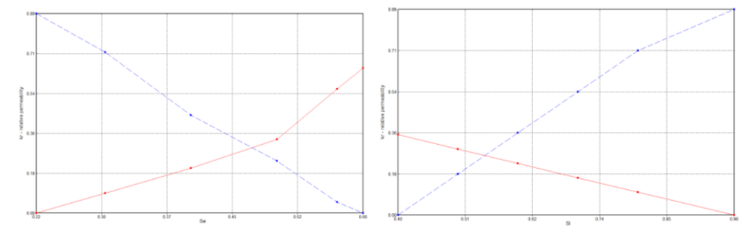
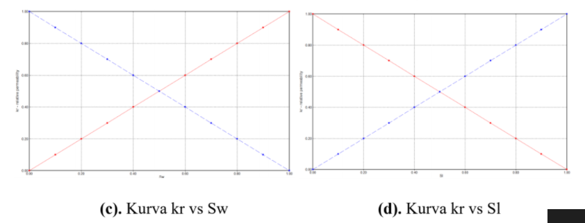
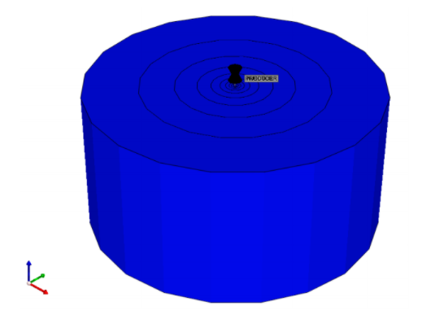

# Chemical Injection Huff & Puff Predictive Model

```{r include=FALSE}
knitr::opts_chunk$set(echo = FALSE)
```

## Pendahuluan

Injeksi surfaktan _huff and puff_ adalah metode EOR yang baru diaplikasikan yang memberikan efisiensi yang lebih besar daripada metode konvensional dengan menginjeksi surfaktan di sumur produksi, bukan di sumur injeksi. Berikut akan dibahas mengenai penyusunan model prediktif injeksi _chemical huff and puff_ untuk memprediksi performa reservoir saat dilakukan metode EOR _chemical huff and puff_. Model prediktif dibuat berdasarkan hasil simulasi reservoir dan aplikasi _Artificial Neural Network_ (ANN). Profil produksi dibentuk berdasarkan model prediktif laju alir maksimum, waktu saat laju alir maksimum, laju alir inisial, periode produksi dan laju alir di akhir periode produksi.

## Mekanisme Injeksi _Chemical Huff and Puff_

_Huff and Puff_ terdiri dari 3 siklus. Siklus terdiri dari injeksi surfaktan, penutupan sumur sementara sambil membiarkan surfaktan meresap dan meningkatkan ekstrasi minyak di sekitar sumur, dan produksi (di masa depan) yang secara inkremental lebih besar daripada metode konvensional. Sekuensi tersebut dilakukan sampai mencapai batasan ekonomi. Contoh dari urutan aktivitas _huff and puff_ dapat dilihat di Gambar 1. 

```{r fig.align = 'center', out.width = "50%", fig.cap="Ilustrasi metode _Huff and Puff_"}
knitr::include_graphics("images/chemicalhnp/ilustrasi.png")
```
_Chemical_ yang diinjeksikan ke dalam suatu sumur adalah surfaktan. Surfaktan akan mengurangi nilai _interfacial tension_ fluida yang ada direservoir dan juga mengubah _wettability_ batuan. Setelah reservoir diinjeksikan surfaktan, seharusnya minyak dalam reservoir akan lebih mudah mengalir. Hasilnya adalah perubahan karakteristik aliran berubah ketika konsentrasi surfaktan dinaikkan sehingga kurva permeabilitas relatif mendekati garis lurus. Gambar 2 dan Gambar 3 menunjukan ilustrasi perubahan kurva permeabilitas relatif setelah injeksi surfaktan. 

```{r fig.align = 'center', out.width = "50%", fig.cap="Kurva permeabilitas relatif sebelum diinjeksikan surrfaktan"}

```
```{r fig.align = 'center', out.width = "50%", fig.cap="Kurva permeabilitas relatif sesudah diinjeksikan surrfaktan"}

```

## Pembuatan Model Prediktif

Model prediktif injeksi hidrokarbon dibentuk menggunakan fungsi _Multilayer Neural Network_ pada _software_ CMG-CMOST berdasarkan data hasil simulasi reservoir. Tahapannya adalah pembuatan model sintetis, analisa sensitivitas, pembuatan _proxy model_ untuk tiap titik hasil, dan pembuatan profil produksi. 

Model sintetis reservoir yang dibangun merupakan model radial dengan jenis _grid_ logaritmik untuk dapat lebih bisa memodelkan efek injeksi. Ukuran _grid_ homogen pada bagian lateral dan _layer vertical_. Model reservoir tertutup dengan 1 sumur injeksi dan 1 sumur produksi yang diletakkan bagian paling tengah. Perforasi injeksi dan produksi juga diletakkan di blok yang sama. Properti batuan reservoir pada model merupakan _single value model_ (homogen), kondisi inisial reservoir disesuaikan dengan kedalaman reservoir dan telah disesuaikan dengan _screening criteria_ pada berbagai studi dan aplikasi lapangan yang telah dilakukan sebelumnya. Fluida yang digunakan didapat dari STARS dengan rentang oAPI 15-45. Gambar 4 menunjukan model sintetik yang digunakan.
```{r fig.align = 'center', out.width = "50%", fig.cap="Model sintetis reservoir untuk pembuatan model prediktif _Chemical Huff and Puff_"}

```
Kurva permeabilitas relatif dibangun menggunakan Persamaan Corey. Contoh kurva permeabilitas relatif minyak-air ditunjukan pada Gambar 5.
```{r fig.align = 'center', out.width = "50%", fig.cap="Kurva permeabilitas relatif minyak-air"}
knitr::include_graphics("images/chemicalhnp/oilwater.png")
```
Untuk permeabilitas relatif minyak dan air ditentukan dengan persamaan berikut ini:
$$k_{ro} = (k_{rocw}) \left[ \frac{1-S_{w}-S_{orw}}{1-S_{wc}-S_{orw}} \right]^{n_o}...(1)$$
$$k_{rw} = (k_{rwiro}) \left[ \frac{S_{w}-S_{wc}}{1-S_{wc}-S_{orw}} \right]^{n_{ow}}...(2)$$
Berikut asumsi yang digunakan dalam membuat tabel permeabilitas relatif minyak dan gas:
$$S_{wc}=S_{wcrit}...(3)$$
$$S_{orw}=S_{oirw}...(4)$$
Untuk permeabilitas relatif _liquid_ dan gas ditentukan dengan persamaan berikut ini:
$$k_{rog} = (k_{rogcg})\left[ \frac{1-S_{g}-S_{Lc}}{1-S_{gc}-S_{Lc}} \right]^{n_{og}}...(5)$$
$$k_{rg} = (k_{rgci}) \left[ \frac{S_{g}-S_{gc}}{1-S_{gc}-S_{Lc}} \right]^{n_g}...(6)$$
Contoh kurva permeabilitas relatif likuid-gas ditunjukan pada Gambar 6.
```{r fig.align = 'center', out.width = "50%", fig.cap="Kurva permeabilitas relatif liquid-gas"}
knitr::include_graphics("images/chemicalhnp/oilgas.png")
```
Berikut asumsi yang digunakan dalam membuat tabel permeabilitas relatif _liquid_-gas:
$$S_{wcon} = S_{Lcon}$$
$$S_{Lrg} = S_{Lcon}+S_{org}$$
$$S_{gc} = S_{gcrit}$$
$$N_o = N_g$$
$$N_{ow} = N_{og}$$

Tekanan alir produksi bawah sumur di-*set* agar perbedaan nilainya dengan tekanan reservoir berbeda sedikit untuk mensimulasikan penggunaan *chemical huff and puff* pada lapangan yang sudah lama diproduksikan. Parameter operasi lainnya adalah laju alir surfaktan yang diinjeksikan, jenis surfaktan yang digunakan, beserta lama waktu injeksi dan *soaking*. Pada awalnya sumur produksi ditutup dan hanya sumur injeksi saja yang dibuka dengan durasi sebesar waktu injeksinya. Setelah injeksi tersebut selesai, sumur injeksi juga dimatikan. Setelah waktu *soaking* tercapai, produksi akan dilanjutkan sampai laju alir fluida mencapai *economic limit* (dengan nilai standar sebesar 2 bbl/day) dimana kemudian sumur produksi akan dimatikan.

Analisa sensitivitas dilakukan menggunakan fungsi CMOST pada *software* CMG, dengan menggunakan metode *Response Surface Methodology*. Metode ini digunakan untuk menentukan hubungan antara variabel *input* (parameter) dan respon (*objective function*). Seluruh parameter divariasikan dalam sejumlah eksperimen yang dibuat menggunakan *Latin Hypercube Method* dan respon dari seluruh eksperimen akan digunakan untuk membentuk sebuah *proxy model*.

Ada 42 parameter yang divariasikan, dengan *range* nilai masing-masing parameter yang berbeda. Tabel 1 menunjukkan parameter-parameter dan variasi nilainya:

|No|Parameter|Satuan|Min|Max|Keterangan|
|:---:|:---:|:---:|:---:|:---:|:---:|
|1 | Area |acre|3|15||
|2 |Thickness |ft|10|100||
|3 |Permeability |mD|50|250||
|4 |Porosity |fraksi|0.1|0.3||
|5 |Densitas Minyak |lb/ft^3^|50.03|60.27||
|6 |API |$^\circ$API|15|45||
|7 |MFCHEM |fraksi|0.001|0.05||
|8 |MFWATER |fraksi|0.999|0.95||
|9 |ADMAXT |gmole/ft^3^|0.02|0.04||
|10 |Injection Rate |ft^3^/day|300|1000||
|11 |INJECTION |Date|2|6||
|12 |SOAKING |Date|7|31||
|13 |Injection Time |Days|1|5||
|14 |Soaking Time |Days|5|25||
|15 |PRES |psi|600|1250||
|16 |PRES Multiplier |fraksi|1|1.25||
|17 |PWF |Psi|600|1000||
|18 |a |-|20|150||
|19 |b |-|105|400||
|20 |IFT |-|-|-||
|21 |TEMP |$^\circ$C|60|150||
|22 |TIFT1 |$^\circ$C|60|150||
|23 |TIFT2 |$^\circ$C|60.1|150.1||
|24 |DTRAPW1 |-|-7|-4||
|25 |DTRAPN1|-|-7|-4||
|26 |DTRAPW2|-|-3|-1||
|27 |DTRAPN2|-|-3|-1||
|28 |Swinit|fraksi|0.4|0.85||
|29 |Swcon|fraksi|0.125|0.4||
|30 |Sorw|-|0.2|0.2||
|31 |Krocw|-|0.4|0.95||
|32 |Krwcw|-|0.15|0.7||
|33 |Nw|-|1|3||
|34 |Now|-|1|5||
|35 |Sorg|-|0|0.2||
|36 |Sgcon|-|0|0.1||
|37 |Krgcl|-|0.5|1||
|38 |Krogcg|-|0.5|1||
|39 |Ng|-|1|3||
|40 |Ngl|-|1|3||
|41 |OilWaterTable|-|-|-||
|42 |LiquidGasTable|-|-|-||

Table: <span style="color: grey;"> Tabel 13.1: _Range_ Nilai Parameter _Input_ Untuk Studi Sensitivitas dan Pembuatan _Proxy Model_ </span>

Respon yang diukur adalah volume produksi dan laju alir fluida. Dari respon tersebut akan direkam nilai produksi kumulatif, laju alir maksimum (Q~max~), waktu saat laju alir maksimum tercapai (t@Q~max~), dan periode produksi (t~Stop~). Masing-masing respon ini akan dibentuk _proxy model_-nya untuk membangun profil produksi suatu fluida reservoir seperti yang ada pada Gambar 7.
```{r fig.align = 'center', out.width = "50%", fig.cap="Pembangunan profil produksi fluida reservoir berdasarkan _proxy model_"}
knitr::include_graphics("images/chemicalhnp/profil.png")
```
Tren dari laju alir inisial menuju laju alir maksimum diasumsikan berupa _linear trend_, dan tren dari laju alir maksimum menuju laju alir akhir produksi berupa _exponential decline_.

_Proxy model_ dibuat berdasarkan hubungan parameter dan respon pada fungsi CMOST pada _software_ komersial CMG. Ada 2 jenis _proxy_ _model_ yang dapat dibentuk: _Polynomial Regressio_n dan _Neural Network_. Setelah membandingkan keakuratan kedua jenis model, jenis _proxy model_ yang dominan digunakan adalah _Neural Network_, tipe _Multilayer Neural Network_.

Jumlah eksperimen simulasi yang digunakan untuk membangun _proxy model_ adalah 2599 eksperimen, dengan jumlah data _training_ 2344 data dan jumlah data verifikasi _proxy model_ 255 data.

Profil produksi akan dibentuk menggunakan _proxy model_ variabel-variabel respon di atas untuk fluida minyak, air, gas, dan _liquid_ seperti tertera pada Tabel 2. Di bawah ini akan dilampirkan seluruh _proxy model_ pembentuk profil produksi dalam bentuk _weighting_ dari _neural network architecture_.

|Respon|Minyak|Air|Gas|
|:---:|:---:|:---:|:---:|
|Kumulatif Produksi| NpOil| NpWater| NpGas|
|Laju Alir Maksimum| Max_RateOil|Max_RateWater|Max_RateGas|
|Waktu Saat Laju Alir Maksimum|Days_At_MaxRate_Oil|Days_At_MaxRate_Water|Days_At_MaxRate_Gas|
|Laju Alir Akhir|RateOil_EndSom|RateWater_EndSom|RateGas_EndSom|
|Saturasi Air di Akhir Produksi| Sw_EndSim|Sw_EndSim|Sw_EndSim|
|Tekanan di Akhir Produksi| Pressure_EndSim|Pressure_EndSim|Pressure_EndSim|
|Waktu Produksi Terakhir| EndCycle|EndCycle|EndCycle|

Table: <span style="color: grey;"> Tabel 13.2: Jumlah _Proxy Model_ yang Dibentuk untuk Profil Produksi Berbagai Fluida Reservoir </span>

_Proxy model_ untuk produksi kumulatif minyak:

__Multilayer Neural Network (15)__

__Layer 1:__

||||||||||||||||
|:---:|:---:|:---:|:---:|:---:|:---:|:---:|:---:|:---:|:---:|:---:|:---:|:---:|:---:|:---:|
|-1.15 |0.16| 0.11| -2.29| 0| 0.02| 0.47| 0.31 |-0.24 |2.27 |0.06 |-0.04 |-0.6 |-1.33| 0.03|
|-3.62 |0.17| -0.13| -2.19 |-4.49| -0.31| 0.05 |0.04| -0.43| 2.29 |-0.11 |0.16 |-0.16 |-4.24| -4.48|
|0.06 |-0.13| -0.06| -0.34| 0.15| 0.02| 0.08| -0.19 |0.02| 0.03 |-0.18| -0.4 |-0.13| 0| 0.14|
|-2.01 |-0.05| 0.01 |-1.62| 0.1| 0| 0.08 |0.25| -0.18| 1.45 0| -0.42 |-0.16| -1.87| 0.15|
|-0.11| 0.03| 0.02| -0.07| -0.57| 0.04| 0.09| 0.01 |-0.05 |0.03| 0.1| 0.31| -0.12| -0.17| -0.55|
|-0.58| -0.01| -0.06| 0.08| -0.35| 0.06| 0.14 |0.3 |0.03 |-0.2 |-0.21| 0.33| -0.19| -0.31| -0.34|
|0.55 |-0.11| -0.03| -0.07| 0.79| 0.04| -0.05 |-0.27 |0.07 |0.14| 0.01 |0.33| 0.03| 0.39| 0.78|
|-0.59 |-0.06| 0.12 |-0.32| 0.87 |-0.08| -0.1 |-0.2| 0.06 |0.29 |-0.13 |0.27| 0.15 |-0.12| 0.87|
|-0.8| -0.04 |0.06| -0.24| 0.33| -0.07 |-0.16| -0.08| -0.02 |-0.02 |-0.03| 0.09| 0.23| -0.23| 0.33|
|0.59| 0.04| -0.1| 0.11| -0.34 |0.08 |0.17 |-0.15| 0.09| -0.12 |0.02| 0.57| -0.24| 0.33| -0.34|
|-1.15| 0.23 |-0.2| 0.38| -0.72| -0.01 |0.33 0.08 |-0.16| -5.26 |0.11 |-0.58| -0.48| -0.33| -0.7|
|2.71| 0.13| 0.03| 0.84| -0.13 |-0.07| -0.1 |-0.08| 0.03| -0.46| 0.17 |-0.84| 0.17| 2.24 |-0.15|
|1.03| 0.13| -0.05 |-0.13| -0.63| 0.04| 0.06| 0.06| -0.01| 0.08| 0.21 |-0.15| -0.06| 0.95| -0.63|
|0.17| 0 0.05 |-0.02| -0.56| 0.01| 0| 0.1| 0| 0.11| -0.01| 0.77 |0| 0.33| -0.55|
|1.49| -0.07 |0.01 |-0.09| 1.3 |0.01| -0.06| 0.12| -0.01| 0.09 |-0.08| -0.12 |0.06 |1.19| 1.31|
|0.27| -0.12 |0.07 |-0.15 |0.68| -0.03| 0.06| -0.4| -0.01| 0.09| -0.1 |0.24 |-0.06 |0.56| 0.66|
|0.74| 0.07 |0.09 |-0.27| -0.21| -0.05| -0.16| 0.16 |-0.01| 0.11| 0.08 |0.5| 0.26| 0.97| -0.21|
|7.71| -0.58 |1.49| 5.12 |-1.23| -0.38 |-1.48 |-0.29| 0.46 |-4.48 |-0.27 |0.15 |2.37 |6.63| -1.33|
|-4.31| 0.1 |-0.24| -1.66| 0.53 |0.15 |0.49| -0.19 |0.08 |1.02| -0.02 |-0.69 |-0.7| -4.27| 0.56|
|-2.03| -0.01 |0.01| -0.31| 0.32| 0 |-0.02| 0.15| -0.02| 0.22| -0.08| 0.82| 0.04 |-2.32| 0.34|
|1.12| -0.09 |0.13| 0.21| 0.07| 0.02| -0.05| -0.28 |0.16| -0.44| -0.06| 0.78| 0.08| 0.85| 0.06|
|-3.23| -0.02 |-0.12| -0.74| 0.27| 0.06| 0.22 |-0.02| -0.05| 0.65| -0.09| 0.82| -0.34 |-3.24| 0.3|
|-0.97| 0.09 |0.42 |0.04| 0.25| 0.03 |-0.3 |-0.1 |0.54| -0.48 |0.09 |-0.18| 0.55| -0.7 |0.22|
|-0.87| -0.14| 0.01| 0.25 |0.48| 0.05 |-0.02 |-0.15| 0.08 |-0.32 |-0.09| 0.16| 0.03 |-0.55| 0.47|
|-0.37| -0.13| -0.18 |-0.66 |1.12 |-0.04 |0.15 |0.27| -0.1 |0.51 |-0.5| -1.08| -0.32 |-1.03| 1.12|
|-0.97| 0.15| 0.03| 0.46 |-0.18| 0.06| 0.11| 0.08| 0.06| -0.24| 0.2| 0.19| -0.12| -1.16| -0.2|
|-0.49| 0.07| -0.05 |-0.65 |0.26 |-0.02| 0.03 |-0.06| -0.06 |0.6| 0.11 |-0.07| -0.05 |-0.1| 0.24|
|1.03| 0 |0.08 |0.39| 0.06 |-0.03 |-0.04| -0.17| 0.01 |-0.24| 0.08| -0.41 |0.09| 0.62| 0.05|
|0.92| 0.13| -0.21| -1.11| 0.64| -0.06 |0.04| 0.13 |-0.19 |1.05 |0.11 |-0.36 |-0.15 |0.87| 0.64|
|-5.55| -0.07 |0.12| -2.65 |0.15| 0.02| -0.16 |-0.05| 0.12| 3.72| -0.03| -0.01| 0.27| -5.57| 0.13|

__Output Layer:__

|||||||||||||||||
|:---:|:---:|:---:|:---:|:---:|:---:|:---:|:---:|:---:|:---:|:---:|:---:|:---:|:---:|:---:|:---:|
|2.13| -3.47| -1.34| -0.26| -0.76| -5.57 |3.95| 1.08 |2.55| -0.39 |2.06| 0.06| 1.46| -2.91 |0.76 |-0.33||

<p> &nbsp; </p>
_Proxy model_ untuk produksi kumulatif air:

__Multilayer Neural Network (3,3)__

__Layer 1:__

||||
|:---:|:---:|:---:|
|-4.7| 2.03| 3.96|
|-8.14 |2.29| 2.15|
|-1.67| -0.14 |-1.49|
|-1.36 |1.53| 0.22|
|2.23 |-0.15| -1.65|
|-0.79 |0.09| 2.16|
|4.27| 0.07| -0.8|
|0.7| 0.24 |1.79|
|1.8| -0.06 |-0.98|
|5.1| -0.06 |-2.54|
|-7.03 |1.37| 0.36|
|0.32| -0.05| 2.14|
|0.08 |-0.4| -1.01|
|1.25 |-0.04 |-0.72|
|-2.36| 0.65 |3.28|
|0.57 |-0.14| -0.49|
|3.25 |-0.1| -0.75|
|13.61 |2.59 |16.52|
|-0.87 |-1.37| -2.76|
|0.65| 0.03 |2.23|
|1.37 |0.72 |2.95|
|-1.85| -0.62 |0.13|
|4.9| 0.54| 7.8|
|3.52| -0.35| -1.67|
|-2.47| 0.38| -1.24|
|-4.25 |-0.19| 1.09|
|-1.15 |-0.11| -2.4|
|-2.73| 0.35| 3.23|
|-4.91| 0.97 |-0.85|
|-3.82 |2.56 |2.51|

__Layer 2:__

||||
|:---:|:---:|:---:|
|0.51 |-9.67 |-0.28|
|-11| -8.56 |-2.15|
|6.2 |-4.7| -2.78|
|4.79| 2.33| 5|

__Output Layer:__

|||||
|:---:|:---:|:---:|:---:|
|-0.19| 0.07 |-0.35| 0.29|

<p> &nbsp; </p>
_Proxy model_ untuk produksi kumulatif gas:

__Multilayer Neural Network (3)__

__Layer 1:__

||||
|:---:|:---:|:---:|
|-1.68 |-1.87 |1.75|
|-2.09| -2.65 |2.09|
|-0.2| 0.14| 0.27|
|-1.49 |-1.49 |1.57|
|-0.33 |-0.12| 0.41|
|0.13| 0.13| -0.13|
|0.12 |-0.11| -0.21|
|-0.36| -0.52 |0.45|
|-0.03| 0.11 |0.08|
|0.18| 0.13 |-0.23|
|-0.51 |5.08| 0.51|
|0.18| 0.04 |-0.29|
|0.02| -0.11 |-0.06|
|0.01 |-0.19| -0.02|
|0.49 |0.23 |-0.52|
|-0.36| -0.21 |0.46|
|-0.14| -0.08 |0.2|
|1.66| 2.73| -1.13|
|-0.02| 0 |-0.1|
|0.14| 0.42| -0.14|
|-0.11| 0.17| 0.24|
|-0.07| -0.0|7| 0.04|
|0.27 |0.73| -0.05|
|0.38 |0.49 |-0.39|
|-0.18 |-0.45 |0.02|
|0.05| 0.09 |-0.04|
|-0.25 |-0.56| 0.21|
|0.01 |0.17 |0.03|
|-0.72 |-0.89| 0.66|
|-2.47 |-3.57| 3.07|

__Output Layer:__

|||||
|:---:|:---:|:---:|:---:|
|-2.92| 0.3| -6.93| 4.51|

<p> &nbsp; </p>
_Proxy model_ untuk laju alir maksimum minyak:

__Multilayer Neural Network (5)__

_Layer 1:_

||||||
|:---:|:---:|:---:|:---:|:---:|
|-0.06 |-2.5| 0.09 |0.08 |-0.23|
|1.49| 2.5| 3.01 |3.13 |-3.02|
|1.34| 8.45| 1.56| 1.53| -1.58|
|-0.36| 0.06| 0.26 |0.26| -0.17|
|-0.03 |-2.1 |-0.02 |-0.03| 0.06|
|-0.14 |-6.96 |-0.34 |-0.33 |0.45|
|-0.11| -1.47| -0.07 |-0.13 |-0.05|
|0.22| 0.5| 0.26 |0.28 |-0.31|
|-0.04 |-1.45| 0.38 |0.49| -0.21|
|-0.26 |-0.92 |-0.12 |-0.15| 0.15|
|1.74 |16.83 |1.41| 1.71| -0.03|
|0.29 |-3.9| 0.02| -0.04| -0.08|
|-0.14| 1.13 |-0.36 |-0.42| 0.21|
|-0.13| 2.86 |0.03| 0.02| 0.02|
|0.43 |-2.54| 0.06| 0.01 |-0.19|
|-0.27| -4.44 |-0.4 |-0.41 |0.46|
|0.07| -3.2| -0.24| -0.27| 0.17|
|-1.89| -15.92 |-3.38 |-3.12| 3.76|
|-0.36 |5.41 |1.65| 1.6 |-1.6|
|0.46| 5.11 |0.77 |0.78| -0.76|
|-0.33 |-0.87| 0.04| 0.01| -0.07|
|-0.03| 0.36 |0.09| 0.17 |0.18|
|-3.96| -2.53 |-0.19| -0.01| 0.53|
|0.15| -4.47| -0.2| -0.16| 0.24|
|-0.2 |-1.61 |0.09 |0.05 |-0.03|
|0.18 |3.48| -0.34| -0.36| 0.36|
|0.31 |-3.46 |0.18| 0.17| -0.21|
|-0.24 |2.85 |-0.02| 0| 0.13|
|-0.07 |-5.95 |-0.2 |-0.25| 0.21|
|4.41 |12.75| 3.04| 3.65 |-3.17|

__Output Layer:__

|||||||
|:---:|:---:|:---:|:---:|:---:|:---:|
|6.1 |-1.33 |6.53| -14.89 |1.67 |5.47|

<p> &nbsp; </p>
_Proxy model_ untuk laju alir maksimum air:

__Multilayer Neural Network (3,1)__

__Layer 1:__

||||
|:---:|:---:|:---:|
|0.23 |-0.89| 0.5|
|-0.25| -0.99| -0.15|
|0.24| 0.14 |0.77|
|-0.02| -0.39| -0.01|
|0.13| 0.47| 0.29|
|-0.17 |-0.41 |-0.33|
|0.1| -0.59| 0.23|
|-0.26 |0.38 |-0.53|
|0.18| -0.57| 0.46|
|-0.3| -0.19| -0.67|
|0.19 |-0.35| 0.84|
|0.06| 0.18| 0.24|
|0.08 |-0.21| 0.14|
|-0.02 |0.39| -0.07|
|-0.08| -0.04| 0.05|
|0.07 |0.23| 0.11|
|0.14| -0.21 |0.27|
|0.14 |8.31| 0.42|
|0.07| -3.39| 0.14|
|-0.14 |-0.18| -0.29|
|0.08 |-0.68 |0.45|
|-0.07 |-3.6| -0.18|
|0.29| -0.08 |0.64|
|-0.2| -0.5| -0.43|
|0.26 |0| 0.55|
|-0.07| -0.09| -0.14|
|0.21 |-0.23| 0.47|
|0.05| 1.05| 0.06|
|0.39| 0.23| 0.85|
|-0.14 |-1.35| 0.04|

__Layer 2:__

||
|:---:|
|9.66|
|-0.56|
|-4.79|
|-1.23|

__Output Layer:__

|||
|:---:|:---:|
|-0.78| -0.57|

<p> &nbsp; </p>
_Proxy model_ untuk laju alir maksimum gas:

__Multilayer Neural Network (20)__

__Layer 1:__ </br>
<center> Bagian Pertama </center>

|||||||||||
|:---:|:---:|:---:|:---:|:---:|:---:|:---:|:---:|:---:|:---:|
|-0.1| 0.08 |0.03 |0.16 |0.29 |-0.15 |0.18 |-0.16 |-0.2| -0.1|
|-1.21| -0.52 |-0.17 |0.24| -0.6 |-0.29 |0.24| 0.2 |1.34 |-1.29|
|-0.23 |-0.3 |-0.14| 0.02| 1.37 |1.53 |0.16 |-0.1| 1.75 |-0.19|
|-0.01| 0.07| 0.05 |0.02 |-0.16 |0.36| 0.17| 0.12 |0 |-0.01|
|0.09| 0.1 |-0.04 |0.22| -0.24 |-0.67| 0.03| -0.08 |-0.01| 0.09|
|-0.02| -0.13| -0.14 |-0.04 |-0.65 |-1.38| 0.14| 0.3 |-0.06| 0|
|-0.18 |0| 0.08 |0.12 |-0.45 |-0.87| -0.08 |-0.24 |-0.3| -0.18|
|-0.08| 0.08 |-0.14| 0.06 |-0.13| 0 |0.25| 0.04| -0.15| -0.08|
|0.08| 0.04 |0.26| -0.19| 0.25| -0.97 |-0.07 |0.11| -0.07 |0.08|
|0.03 |0.02| 0.17 |0.08 |-0.18 |-0.48 |0.12 |0.15 |-0.03| 0.04|
|1.61| -0.48 |-0.13| 0.11 |1.44| -0.38| 0.2 |0.17| 1.92| 1.76|
|-0.17| -0.19| -0.22| 0 |-0.65| -0.7 |0.02 |-0.14| 0.63| -0.16|
|-0.08 |0.02| 0.16| -0.33| -0.02 |-0.25 |-0.06 |-0.04 |0.08 |-0.1|
|-0.01| 0.07| -0.16 |-0.07 |0.74 |0.21 |0.06 |-0.12 |-0.24 |-0.02|
|-0.06 |0.11 |-0.09 |0.12 |0.18 |0.35 |0.06 |-0.29 |0.06 |-0.07|
|0.04| 0.11| 0.41| -0.3| -0.68| 0.16 |0.01 |-0.18| -0.45| 0.04|
|0 |0.03| 0.19| 0.21 |-0.69 |-1.76 |0.18 |-0.11 |-0.05 |-0.01|
|0.06 |0.18| -0.17| -0.08| -0.87 |-0.59 |-0.2 |-0.56| -5.06| -0.1|
|0.11 |-0.24| -0.11 |0.03 |0.26| 1.16| 0.29 |0.42 |0.94 |0.16|
|0.33 |-0.32| -0.07 |0.07 |0.86| -0.01| -0.25| -0.35 |0.95| 0.39|
|0.09| 0.02 |-0.16 |-0.18| -0.03 |-0.92| -0.21| -0.31 |-0.05 |0.1|
|0.1| 0.12| -0.04| 0.04| -0.74 |0.54| 0.04 |-0.09| -0.34| 0.07|
|0.11 |0.25| -0.09 |0.17| 0.15| 0.95 |-0.49| 0.03 |-3.2 |0.03|
|0.22| 0.07| 0.06| -0.17| 1.56 |-0.42| -0.05| -0.31| 0.02| 0.21|
|-0.14 |-0.1| 0.13 |-0.04 |-0.14 |0.96 |-0.03| 0.09| 0.36| -0.14|
|-0.26| 0.16| 0.13| 0.05 |0 |-0.61 |0.2| 0.02| -0.25| -0.27|
|-0.15 |0.04 |-0.11 |0.11 |-0.23 |-0.11| 0.13| -0.25| 0.14 |-0.18|
|0.09 |0| -0.21| -0.12| -0.31| 0.78| -0.02 |-0.12 |-0.1 |0.07|
|-0.07 |-0.1 |-0.13| 0.04 |-0.38| 1.8| -0.12| -0.05| 0.08 |-0.07|
|-0.03| 0.13| 0.01| -0.05 |-0.25| 0.07| -0.04 |-0.06 |3.36| -0.07|

<center> Bagian Kedua </center>

|||||||||||
|:---:|:---:|:---:|:---:|:---:|:---:|:---:|:---:|:---:|:---:|
|-0.65 |-0.01| 1.43 |0.83| 0.96 |-0.36| -0.04 |1.13 |-0.46| 0.19|
|2.4| 0.1 |1.36 |1.45| 1.52| 1.46| 0.07| 1.98| 0.92 |-0.81|
|1.18 |0.13 |2.79| 1.77 |3.71| 1.53| 0.43 |2.65 |0.15| 2.36|
|0.32 |0| 0.64 |0.47 |0.1| -0.04| -0.08| 0.31 |0.58 |0.3|
|-0.3 |-0.11| 1.51 |0.6| 1 |-0.1 |-0.13 |0.39| 0.32 |0.33|
|-0.04| -0.01| -2| 0.35 |2.25 |-0.09| -0.09| 0.63| 0.71| -0.44|
|-0.35| -0.01| 1.29| 0.39 |1.08 |-0.37| -0.18| 0.81 |0.99 |-0.36|
|-0.51 |-0.03| -2.42| -0.12| 0.32| -0.17| -0.01| 0.06| 0.12 |0.17|
|-0.45 |0.08| 1.5 |0.03| 0.53 |-0.09| 0.01| 0.21 |0.1 -|0.14|
|0.39| 0.02| 1.25 |0.08| -0.93| -0.02| -0.05| -0.36| -0.33| -0.43|
|3.01| 0.01| 6.78| 2.28| 3.25 |1.92 |-0.08| 2.95| 0.63 |-0.51|
|-0.42| 0.07| 1.74 |0.99| 0.86 |0.53 |0.27 |1.13 |-1.04 |-0.13|
|-0.61| 0.1| 2.89| 0.41 |0.66 |-0.19| -0.15| 0.64 |0.55 |0.38|
|-0.72| -0.03| 2.62 |-0.23| -0.28| -0.19 |-0.08 |0.09 |0.26 |0.16|
|0.37| -0.05| -1.66| 0.06| -0.26 |0.02 |-0.06 |-0.25| 0.1 |0.01|
|-1.25| 0.17 |1.85| -0.22| 0.6 |-0.57 |-0.13| 0.47 |0.87 |0.27|
|0.17| 0.03 |-0.4 |-0.23 |-2.05 |0.03| 0.01 |-1.28 |0.31 |-0.44|
|-3.67| -0.16| -5.47| -3.85| -8.2| -3.96 |-0.85 |-6.86 |-1.66| 1.37|
|0.89| 0.09 |5.85 |0.27 |5.8 |0.96| 0.37 |4.26 |0.06 |-0.7|
|2.27 |0.09| 0.95| 0.28 |0.52| 1.07| 0.55| 0.75| 0.05| 0.74|
|-0.93 |0 |-0.67 |-0.35| -1.22 |-0.08 |0.05 |-0.43| 0.21| -0.03|
|0.41| -0.04| 1.52 |-0.38 |0.19| -0.11| -0.04 |-0.3| -0.85 |0.12|
|-1.69 |-0.33| -1.49| -5.97 |-0.9| -2.37| -0.53 |-0.53 |-0.14 |0.73|
|0.24| 0.07 |-0.55| 0 |0.13 |0.03 |0.1| -0.07| -0.18 |0.28|
|0.47 |0.06 |-1.15 |-0.31 |-0.33| 0.36| 0| 0.03 |0.5 |0.15|
|-0.23 |0 |1.65| 0.14| 0.87| -0.26| -0.13| 0.58| 0.15 |0.2|
|-0.78 |-0.01 |0.26| 0.45| 0.85| 0.03| -0.04 |0.85 |0.36| -0.24|
|-0.2| 0 |0.08 |-0.35 |0.5| -0.04 |0 |0.5 |-0.87| -0.19|
|-0.52| -0.05| -1.6| 0.06| -0.92 |-0.02| -0.15| -0.25 |0.7| 0.06|
|4.16 |-0.05| 7.48| 4.55 |6.48| 2.85 |-0.27 |5.36 |-0.42 |0.16|

__Output Layer:__ </br>
<center> Bagian Pertama </center>

|||||||||||
|:---:|:---:|:---:|:---:|:---:|:---:|:---:|:---:|:---:|:---:|
|-0.75 |-0.69 |0.64| -0.77 |-0.02 |0.01| 0.52 |-0.34 |-1.62| 0.62|

<center> Bagian Kedua </center>

||||||||||||
|:---:|:---:|:---:|:---:|:---:|:---:|:---:|:---:|:---:|:---:|:---:|
|-1.27| -2.53| -1.64| 1.54| -1.78| 1.64| 0.29| 2.37| -0.02 |-0.02| 0.99|

<p> &nbsp; </p>
_Proxy model_ untuk waktu laju alir maksimum minyak:

__Multilayer Neural Network (5)__

__Layer 1:__

||||||
|:---:|:---:|:---:|:---:|:---:|
|2.26| 2.79| 0.35| 6.71 |-12.19|
|0.29 |-3.59 |-0.58 |5.14 |-2.4|
|-1.29 |12.64 |-0.24 |-4.08 |3.27|
|-1.07| 1.62 |-0.59 |-5.58 |-4.18|
|0.99| -1.36 |0.57| 7.55 |6.67|
|-2.33| -2.57 |-0.37 |-10.73 |-0.91|
|-1.19| 4.46 |-0.38| -9.08 |-4.96|
|0.58 |1.53 |0.92| 1.74 |10.83|
|-2.02| 2.67 |-0.32| 1.18 |-5.64|
|1.75 |3.37 |3.68 |0.79| 3.33|
|-0.15 |8.35 |-2.9 |1.78 |-11.48|
|-2.37 |-0.27 |0.08 |-2.24| 2.94|
|0.21 |5.23 |0.77 |0 |-3.84|
|0.67 |1.72 |0.27 |4.84 |-10.89|
|-0.19| -8.54 |-0.19 |5.54| -7.6|
|-1.53 |-3.22 |-0.68 |-0.29 |-3.92|
|-0.04 |3.49| -0.32| 5.04 |14.42|
|0.28 |5.47 |0.92| 0.01 |-2|
|-0.73| -1.82| -1.48 |-4.59 |4.8|
|0.46| 4.64| -1.03| -0.73 |-3.89|
|-0.27 |6.23| -2| 1.43| 4.84|
|0.05 |0.32| -0.71| 0.9 |3.43|
|0.79| 0.32 |0.31 |2.51 |-7.51|
|-2.67| -1.2 |-1.23| -2.36 |8.13|
|0.95 |5| 0.23| 0.92| -2.73|
|-2.26| 2.67 |-0.96| -4.96| 2.08|
|-2.53 |6.38| 0.08| -2.96| -12.5|
|-2.9| -2.32| -0.1| -11.87 |5.8|
|1.62 |9.82 |2.36 |7.47| -4.53|
|5.33 |14.01| 0.66| 14.08| -19.36|

__Output Layer:__

||||||
|:---:|:---:|:---:|:---:|:---:|
|-0.57 |1.1| 0| 2.16 |-2.77|

<p> &nbsp; </p>
_Proxy model_ untuk waktu saat laju alir maksimum air:

__Multilayer Neural Network (2)__

__Layer 1:__

|||
|:---:|:---:|
|-0.36 |0.29|
|-2.47 |0.86|
|-1.75| 0.44|
|0.05| 0.29|
|-0.25| 0.27|
|0.09 |-0.19|
|0.29 |0.04|
|1.64 |-0.39|
|1.75 |-0.87|
|2.25| 2.11|
|-1.98| -13.41|
|-0.12 |0.46|
|-0.1| 0.02|
|-0.14| 0.09|
|-0.81 |-0.67|
|0.22 |-0.01|
|0.33 |-0.18|
|2.61| -0.66|
|-1.62| 0.33|
|-0.02| 0.12|
|-1.06 |0.3|
|-0.23 |-0.11|
|0.46 |-0.03|
|-0.04 |0.11|
|-0.48 |0.32|
|-0.1 |-0.08|
|0.01| 0.19|
|0.23 |-0.02|
|0.4 |0.31|
|1.5 |4.9|

__Output Layer:__

||||
|:---:|:---:|:---:|
|0.07| 0.34 |-0.22|

<p> &nbsp; </p>
_Proxy model_ untuk waktu saat laju alir maksimum gas:

__Multilayer Neural Network (7)__

__Layer 1:__

||||||||
|:---:|:---:|:---:|:---:|:---:|:---:|:---:|
|18.93| -14.44 |-14.26 |-3.48 |1.66 |-4.33 |-18.92|
|2.93 |-15.7 |-15.49 |4.42| 4.52| 0.04 |-2.99|
|-5.35| 3.68| 3.64 |-6.96| 7.88 |-6.59| 5.43|
|-1.74| -10.91| -10.79 |-0.18 |7.09| -6.35 |1.81|
|-1.18 |-6.43 |-6.32 |-1.56 |-0.07| -3.86| 1.26|
|0.75 |-2.02| -1.98 |-8.35| -0.06| 6.18 |-0.77|
|4.19| 2.28| 2.23 |-6.93 |-0.77 |-4.33 |-4.29|
|-11.37| -1.48 |-1.4 |-2.18| -5.66 |10.59 |11.41|
|-8.21| -0.09| -0.11 |-1.04| 1.08| 6.8| 8.21|
|-0.46| 2.72 |2.63 |7.54 |-0.58 |1.26 |0.52|
|32.66 |-23.44 -|23.18 |6.9 |8.78 |-5.95 |-32.41|
|-17.72 |20.12 |19.85| 2.54 |-1.3| 1.38 |17.64|
|-1.72| -4.71| -4.61 |-6|.71| -4.25 |-3.06 |1.63|
|-2.7| 3.28 |3.19 |1.92| 1.23 |3.88 |2.68|
|-2.94| -5.94| -5.84| 6.62 |-5.71| 2.46 |2.94|
|7.06| 0.54 |0.61 |4.24 |0.56 |-5.14 |-7.14|
|-6.54| 10.44 |10.3 |-1.85 |-4.89 |2.21| 6.47|
|10.27 |28.12| 28.03| -2.21| -1.68 |6.15 |-10.19|
|-8.4| -1.02 |-1.03 |-5.91 |0.83 |13.34| 8.21|
|-14.45| 1.78| 1.71 |-1.16 |-2.67 |-2.85 |14.34|
|-13.03 |8.27 |8.16 |1.36| 0.48 |5.4| 13.01|
|12.1 |-7.65 |-7.55 |2.51 |-5.48 |-1.32| -12.1
|6.41 |0.07 |0.14| 5.31 |4.82 |-18.61| -6.45|
|-8.27 |1.57 |1.57 |-5.71| 2.71| 0.15| 8.21|
|-6.83| -3.62| -3.49| 2.75| 4.52 |0.66| 6.85|
|5.25| 1.97| 1.98 |-6.99| -5.96 |-2.71 |-5.31|
|6.7 |-8.69 |-8.52| 0.68 |5.5| 1.86 |-6.63|
|16.72 |-0.31 |-0.34 |2.3 |-2.21| 6.23 |-16.69|
|4.26 |2.86 |2.8| -4.72| -3.47| -2.74| -4.24|
|15.41| -11.7| -11.59| 12.21| 6.82| -14.6| -15.31|

__Output Layer:__

|||||||||
|:---:|:---:|:---:|:---:|:---:|:---:|:---:|:---:|
|-2.48| -2.07 |2.08 |1.81 |0.02 |-2.52 |-2.48| -4.13|

<p> &nbsp; </p>
_Proxy model_ untuk saturasi air terakhir:

__Multilayer Neural Network (10)__

__Layer 1:__

|||||||||||
|:---:|:---:|:---:|:---:|:---:|:---:|:---:|:---:|:---:|:---:|
|-0.16| 0.28 |-0.07 |0.52| -0.11| 0.1 |-0.49 |0.04 |-0.03 |-0.14|
|-0.02| -0.14| 0.09| -0.47 |-0.84 |0.85| 0.54 |-0.03 |-0.08| 0.02|
|-0.2 |-0.11| 0.38| -0.75| -0.78| 0.77 |0.48 |-0.27 |-0.05 |-0.06|
|-0.13| 0.01 |0.2| 0.25 |-0.36 |0.37| 0.28 |-0.05 |0.12| -0.06|
|-0.26 |0.01 |0.19| 0.47 |-0.33| 0.34| 0.3| -0.15| -0.22| -0.12|
|0.11| 0.21| -0.29 |-0.56| 0.47| -0.46| -0.3| 0.14| 0.22 |0|
|-0.11 |-0.19 |0.09 |0.19 |-0.23 |0.22 |-0.01 |-0.04 |-0.19 |-0.01|
|-0.1| -0.13 |-0.28 |0.15| 0.63| -0.63 |-0.29 |0.03 |0.28 |0|
|0.2 |-0.09 |0.02| -0.07| 0.37| -0.34| 0.16 |0.07 |0.41 |0.12|
|0.04| 0.22 |-0.04 |-0.52 |0.03 |-0.03| -0.06| 0.06 |0.31 |-0.03|
|-0.2 |-0.11| 0.07| -0.05| 0.17 |-0.19| -0.21 |-0.21 |-0.14| -0.06|
|-0.05| 0.04| 0.34| -0.24| -0.41| 0.43| 0.28 |0.08 |-0.62| -0.04|
|-0.1 |-0.25| -0.1| -0.35| -0.03| 0.03| -0.03 |0| -0.3 |0.01|
|0| 0.25| -0.45| -0.69| 0.08| -0.05 |-0.26| -0.25| 0.09 |-0.06|
|0.15 |0.04 |-0.1| 0.21| 0.13| -0.13| -0.13| 0.14| 0.55| 0.07|
|-0.1| 0.11| 0| -0.18| -0.17| 0.18| 0.02| 0.13 |-0.08| -0.07|
|0.12 |-0.06 |-6.24| 2.81| 8.58 |-8.43| -6.67| -0.46| 0.02 |0.01|
|-0.15 |-0.28| 1.17| -0.69| -0.34 |0.28| 1.41| 0.66 |-0.18| 0.01|
|-0.08| 0.17| -0.4| 0.23| 0.54| -0.55| -0.36| 0.11| -0.41| -0.09|
|0.29 |0.1| -0.75 |0.31 |0.8 |-0.77| -0.34 |-0.26 |-0.66 |0.08|
|-0.09 |-0.24 |0.65 |-0.68| 0.07| -0.09 |0.62 |0.18 |-0.82| 0|
|-0.1 |0.11| -2.57 |0.77| 4.57| -4.49 |-2.42 |0.23| -0.09 |-0.08|
|0.04 |0.13 |0.14| -0.54 |0.12 |-0.11| -0.04| 0.31| 0.2 |-0.01|
|0.09 |0.03 |-0.34 |-1.77 |-1.12 |1.12| 0.3 |-0.24 |0.5| 0.04|
|-0.13 |0.05| 0.03| 0.12| 0.37 |-0.36 |-0.02| 0.18 |-0.22 |-0.07|
|-0.16| -0.06| 0.71 |-0.2 |-0.91 |0.9| 0.57| -0.06 |0.58 |-0.04
|0.01 |-0.1 |-0.02 |0.69| 0.44 |-0.45| 0.04| -0.11| 0.54| 0.04|
|0.02| 0.05| -0.68| -2.07 |-1.53| 1.56| 0.27| -0.44 |-0.02 |-0.01|
|-0.04| -0.02 |0.32| -0.8 |1.07 |-1.1 |-0.36 |0.37 |0.06 |0|
|0.1 |-0.14| 0.24| 1.08| -0.43| 0.62| 2.88| 2.52| 0.03| 0.1|

__Output Layer:__

||||||||||||
|:---:|:---:|:---:|:---:|:---:|:---:|:---:|:---:|:---:|:---:|:---:|
|4.41 |-2.63| 0.07 |-0.03| 0.73| 0.74 |-0.08 |0.11 |0.24| -10.15 |-0.06|

<p> &nbsp; </p>
Proxy model untuk tekanan terakhir:

__Multilayer Neural Network (10)__

__Layer 1:__

|||||||||||
|:---:|:---:|:---:|:---:|:---:|:---:|:---:|:---:|:---:|:---:|
|-0.7 |-0.11 |0.14 |0.17| 0.23 |-0.09 |-0.24| 2.76 |-0.11 |-0.05|
|-0.75| -0.13 |1.01 |0.15 |-0.48 |-0.06 |0.51| -2.44 |-0.13 |-0.15|
|-0.73 |-0.42| -0.46| -0.23 |-0.53| 0.03 |0.55 |0.17| -0.26| 0.11|
|0.03 |0.25 |0.47 |0.09 |-0.01| 0.01| 0.02| 2| 0.14 |-0.12|
|0.35 |0.11| -0.14 |0.13| -0.22 |-0.01 |0.24| 2.37| 0.08 |-0.35|
|0.32| 0.14 |-0.05| 0.1| 0.1| -0.06| -0.11| -2.09| 0.06| 0.15|
|0.58 |-0.77| 0.63| -0.04 |-0.1| -0.09| 0.11 |-0.86 |-0.49| 0.06|
|0.33 |-0.04| -0.02 |0.13 |0.38 |-0.08 |-0.4 |-0.42 |-0.06 |0|
|-0.13| -0.71| 0.1| 0.01| 0.18 |-0.13 |-0.19 |-0.39 |-0.51 |0.04|
|-0.22| -0.31| 0.68| -0.15| 0.04| 0.02 |-0.06 |0.12| -0.2 |0.18|
|0.23| -0.08 |-0.43 |0.25 |-0.13| -0.21| 0.33| 4.07 |-0.11 |0.61|
|-0.24| 0.11 |-0.18 |-0.2 |0.26 |0.05 |-0.23 |1.66| 0.12 |0.2|
|0.27 |0.46 |-0.18| -0.1 |-0.02| 0.11| 0.02| 2.1| 0.34| 0.17|
|0| -0.12| -0.14 |0.08 |-0.07| -0.05| 0.07 |1.13| -0.1| -0.13|
|-0.8| 0.77| -0.23| 0.09| -0.1 |0.08 |0.1| -1.21| 0.52| 0.13|
|0.26 |-0.06 |0.08 |0.17 |0.26 |-0.08 |-0.26 |0.05 |-0.05| -0.03|
|-0.63 |-0.07 |-0.35 |-0.2| -0.07| 0.09| 0.07 |0.64| -0.02| -0.01
|-0.62| 0.73 |-0.28 |-0.03 |6.04 |0.2 |-6.32 |-2.66 |0.53 |-0.43
|-0.08| -0.73| 0.67 |-0.05| -0.54| -0.15| 0.56 |2.89 |-0.53 |0.66|
|0.64 |0.28 |0.24| 0.37 |0.16 |-0.18 |-0.16 |-3.19 |0.13 |0.43|
|-0.39| -0.1 |-0.01 |0.26 |0.65 |-0.13| -0.68 |-0.51 |-0.09 |0|
|0.49 |-0.54 |0.63 |0.22 |-0.18| -0.21| 0.2 |3.14| -0.41 |0.21|
|-0.17 |-0.3| 0.13 |0.14| 2.81 |-0.12 |-2.94 |0.55| -0.24 |0.06|
|-0.16| -0.3| -0.47 |-0.08 |-0.12| -0.03| 0.12 |-0.12| -0.18 |0.3|
|-0.48 |0.67| -0.5 |-0.02 |-0.99 |0.13 |1.04 |-0.44| 0.48 |-0.01|
|0.51| 0.69| -0.13 |-0.05 |0.09| 0.15 |-0.09 |1.63 |0.5 |-0.11|
|-0.36| -0.7 |0.15 |-0.02 |-0.51 |-0.07| 0.53 |-2.27 |-0.47 |-0.26|
|0.44| -0.12 |-0.25 |-0.29| |0.21| 0.13| -0.22| 1.13| -0.02 |-0.03
|-0.37| 0.01 |-0.37| 0.07| -0.88 |0 |0.92| -6.98| 0.03| -0.23|
|-0.19 |-0.04 |0.09| 0.03 |1.41 |-0.04| -1.5| 6.71 |-0.03 |-0.1|

__Output Layer:__

||||||||||||
|:---:|:---:|:---:|:---:|:---:|:---:|:---:|:---:|:---:|:---:|:---:|
|-0.07 |-0.98| 0.11 |-1.96 |0.8 |-4.69| 0.76 |1.02 |2.54 |-0.41| -1.18|

<p> &nbsp; </p>
_Proxy model_ untuk waktu produksi berhenti:

__Multilayer Neural Network (10,10)__

__Layer 1:__

|||||||||||
|:---:|:---:|:---:|:---:|:---:|:---:|:---:|:---:|:---:|:---:|
|0.45 |3.97 |2.26 |-1.69 |1.02 |-0.57 |-0.76 |1.46 |-2.36 |0.83|
|-0.39| -1.03 |0.77| 0.65 |-1.59 |-0.73| 3.9| -0.58 |0.42 |-0.09|
|-0.98 |-0.85| -1.36| 2.25| 0| 1.27| 0.29| 2.81| -1.3| 0.33|
|-0.48 |0.02 |1.86| -1.64 |-0.93 |-0.81| 0.8| -2.19| 0.82| 0.52|
|0.32| -1.25| 0.12 |-1.06| -1.75 |1.37| 0.03| 0.58| 0.07| 0.38|
|-1.15| -0.24| -0.28| -3.27| 3.21| -0.04| 1.27 |-0.74 |0.66 |1.05|
|1.06 |-0.98 |-0.02 |0.9| -1.06 |-0.05 |1.49 |-1.54| 0.95 |-1.02|
|-1.18| -0.52 |-0.5 |0.95| 2.02 |-0.86 |0.4| -0.43| 0.83 |0.24|
|-0.48 |-1.19 |-0.38 |0.23| 1.08 |-0.58| 1.22 |-0.96| 1.06 |-0.17|
|-0.35 |-1.08| 0.79| 1.37| -1.77 |-0.39 |-0.76 |-2.38| 1.09 |-0.33|
|-1.32 |-0.01 |-1.21 |7.48 |-0.13 |0.94 |4.74 |2.98| -1.62 |10.44|
|1.06 |-0.88| 0.06| 2.12| -1.63| 0.68| -0.72| -0.41| 0.05| -0.82|
|0.73 |-0.86 |0.72| 0.99 |-4.31 |0.56 |-2.41 |-0.08| -0.07| -0.48|
|-0.66| -0.38 |0.55| 1.8| -1.26| -0.6| 0.18| 0.11| -0.33 |-0.3|
|1.2| 1.22 |-0.11| 1.88 |1.46 |0.62| -1.07 |0.41 |-0.71 |-1.07|
|0.58| 0.5 |-0.13| -0.1 |-0.73 |0.01| 0.28 |0.96 |-0.6| -0.37|
|-0.9 |0.01 |0.24| -0.05 |2.08 |-1.02| 0.18 |1.58 |-0.94| 0.02|
|5.94| -1.37 |1| 7.58| 15.99| 1.26 |-19.29| 1.2| -1.42| -4.46|
|-0.48 |0.62| 0.11| -1.54| -3.68 |0.52| 3.8 |0.41 |-0.8| 0.83|
|-0.4 |-0.85| -0.46| 1.81 |1.65| -0.51| 0.75| -2.48| 1.79| -0.66|
|2.37| -1.87| -0.09 |3.29 |-0.27 |1.59 |-1.33 |-0.25 |0.43 |-1.53|
|0.98 |0.76 |0.92 |-4.9 |-3.67 |1.2 |-0.41 |0.91 |-0.93 |0.89|
|1.32 |0.91 |0.26| -0.81 |8.13| 0.32 |-8.41 |-0.52| -0.01 |-0.21|
|0.5 |-1.3 |0.11| 0.07| 1.63 |1.12 |0.2 |-0.73 |0.39 |0.04|
|-1.09| 1.19 |-0.18 |-6.81 |-1.53 |-0.96 |0.43 |-1.04| 0.69 |1.88|
|1.42| 1.12 |-0.7 |1.95| -0.7| 0.03 |0.57| -0.1 |-0.17 |-1.27|
|-1.31 |0.28 |-0.24 |-3.21 |-4.56 |-1.42 |0.48| 0.59 |-0.36| 1.17|
|-1.28 |-1.77 |0.66| 0 |1.67 |-1.83 |0.46 |-0.97| 0.6| -0.13|
|-0.32| 1.01 |1.33 |1.78 |5.99 |-0.51| 6.63| -0.55 |0.11 |-0.66|
|-1.07| 0.15 |0.04 |-4.02 |3.49 |-3.16 |-2.11| 0.42 |-0.45| -1.42|

__Layer 2:__

|||||||||||
|:---:|:---:|:---:|:---:|:---:|:---:|:---:|:---:|:---:|:---:|
|0.23| -0.92 |2.13| -0.12 |-0.69| 2.83 |1.32| 0.01 |-0.09 |-0.1|
|-0.59| 0.67| 4.7 |-0.26 |0.3 |1.16 |4.68 |5.09| 0.54| -0.27|
|-0.99| 1.06| -8.36 |2.25 |-1.89 |1.26 |-8.34 |1.1 |0.96 |2.25|
|0.64 |-1.39| 3.55| 0.54 |5.25 |2.48 |2.73 |-0.49 |-0.59| 0.42|
|1.74| -5.14 |0.03 |-1.38 |1.33 |3.71 |0.03 |0.34 |-1.71| -1.37|
|3.2 |0.29 |-1.74 |-0.28| 1.35 |1.85| 1.4| -1.14 |-3.84 |-0.77|
|-3.29 |3.95 |2.69 |2.12 |-3.33 |-0.54 |2.64| 4.38 |3.33| 2.19|
|-0.59 |-1.97 |3.22 |0.55| -2.49 |-3.34 |3.13 |2.41 |0.5 |0.53|
|-1.18 |-1.8 |3.45| 0.98 |2.44 |0.22| 3.31| 1.44| 1.06 |0.95|
|0.72 |-0.1 |-0.62 |0.58 |-3.79 |0.12 |-0.65 |2.26 |-0.45 |0.58|
|-2.72| 9.69 |-0.21 |4.13 |-1.46 |-1.54 |1.38 |11.12| 2.05| 3.6|

__Output Layer:__

||||||||||||
|:---:|:---:|:---:|:---:|:---:|:---:|:---:|:---:|:---:|:---:|:---:|
|2.27 |-0.14 |-0.1| 1.17 |-0.01 |0.01 |0.1| 0.16| 2.5 |-1.19| -0.02|

<p> &nbsp; </p>
_Proxy model_ untuk laju alir minyak saat produksi berhenti:

__Multilayer Neural Network (10,10)__

__Layer 1:__

|||||||||||
|:---:|:---:|:---:|:---:|:---:|:---:|:---:|:---:|:---:|:---:|
|-0.55| -0.73| 1.3| 0.17| 0.17| -1.1| -0.37| 1.45| -0.39| 0.52|
|0.14 |1.33 |0.73| 1.99 |0.62 |-0.31| 1.26| -0.69 |0.56| 0.96|
|-1.12 |-0.81| -1.72| 0.12| 0.63| -2.6|7 1.47| -0.02| -0.29| -0.97|
|-0.1 |0.|2 -0.52 |0.55 |-0.18| 0.51 |0.36 |0.23| 0.5 |0.35|
|0.48 |-1.41| -0.13 |0.16 |0.46| 1.83| 0.58 |1.8 |-0.26 |0.13|
|-0.03| 1.54| 0.89 |-0.43| 0.92 |-1.35 |-1.16| -0.35| -0.09| 1.41|
0.7| -0.13 |0.41 |-0.78 |-1.12 |1.52 |0.78 |-1.75| 0.44 |-1.6|
|0.67| -0.77| -0.73| 1.49 |0.47| -0.86 |-0.28| 0.81| 1.9 |-2.01|
|-0.69| 0.2 |-0.12 |1.11 |-0.35 |-1.15| 2.28| -1.51 |1.98 |-1.36|
|-0.8| 0.91| 2| -0.48 |-0.49 |0.57| -0.93 |-1.35 |-0.02 |-0.79|
|1.64| 1.85| -2.64| 0.02| -0.07 |-1.99| 4.29 |0.39 |0 |-0.24|
|-0.46 |0.75| -0.69 |-0.92 |-1.53 |0.97 |-0.05| -0.72| -0.63 |-1.15|
|0.81| 0.62 |2.29 |-0.51| -0.28 |0.04| -2.12| -0.12 |-0.25 |-0.62|
|-0.36 |-1.33| 1.38 |-0.48| -0.17 |-0.66 |-0.45 |0.51| 0.3| 0.39|
|-0.23 |-0.5 |1.97 |-0.15 |-1.62 |0.79 |1.27| -1.28 |0.34 |1.36|
|0.05| -0.33 |-2.06 |-0.26 |0.02 |0.12| 1.06 |1.39 |1.24| -0.62|
|0.66| -0.72| -0.91 |1.05 |0.72 |-2.7| -2.07 |-0.33 |-0.92| -1.75|
|0.92 |-0.53 |-0.77 |2.97 |-0.54 |3.73| -0.93 |-0.71 |-2.21| -0.17|
|-0.48| 0.03 |0.35 |-2.37| 0.42| -4.81| -0.7| 1.1 |-0.74 |-0.09|
|-0.93| 0.96 |2.02 |0.57| 0.5| -0.55| 0.77| -0.42| 1.69 |-0.38|
|-0.28| -1.11 |0.96 |2.35| 0.6 |0.67 |-0.18| 2.94| 1.1| -0.14|
|1.16| -1.43| 1.62 |0.11| 0.15 |-0.42| 0.32 |0.51| 0.22 |-0.48|
|0.51| 0.4| 0.99| 0.88| 1.14| -0.89| -1.32 |-0.42| 0.57| 0.53|
|1.2 |0.33| -0.14 |-0.33| 0.17 |-1.89| -2.06| -0.1|5 0.64| -1.69|
|-0.33| -1.14| -0.17 |-0.6 |-1.03 |0.08 |0.57 |0| -0.61| 0.13|
|0.52| 0.39| 0.88| -0.33| -1.59 |1.53 |-1.56 |1.79| 0.51 |-0.74|
|-0.05| -1.93| -0.88| 1.04 |0.33| -1.92| 1.56| -0.42| 0.15 |-0.99|
|-0.1| -1.87| 2.32| 0.87| 0.48 |1.06 |0.08 |-0.23 |0.5 |0.58|
|0.28| 1.09 |-0.31| -0.16 |0.27| 4.25| 1.08 |-1.04 |2.19 |1.22|
|-0.79| 0.04 |-0.74 |-1.3 |1.15 |-3.24 |-0.56 |1.34| -1.04| -1.49|

__Layer 2:__

|||||||||||
|:---:|:---:|:---:|:---:|:---:|:---:|:---:|:---:|:---:|:---:|
|1.29| -0.82 |-1.72 |-0.21 |-0.37| -0.01| -1.71 |0.56| 0.7| -0.3|
|-0.12| 0.47| 1.13| -0.21| -1.46 |1.28| 1.13| 0.43 |2.13 |0.74|
|-0.2| -0.32| -1.27| 0| -2.17| 0.06 |-1.26| 1.05 |3.7| 0.02|
|0.36| -0.22| 0.22 |0.71| -0.63| 1.1 |0.22| -0.01| -4.15| 0|
|-0.3 |-0.79| -0.33 |-0.78 |-0.48 |-0.14 |-0.33 |0.33 |2.8| -0.4|
|2.06 |0.3| 1.35| -3.23 |1.18 |-0.01| 1.49 |-1.61 |-3.42| 0.95|
|-0.11 |-0.06 |3.33 |0.33 |-1.38| 0.37 |3.31 |0.92| 2.57| 0.94|
|0.18 |0.36| 0.57| 0.71| -1.66 |0.03| 0.56| 0.85| 3.77| 0.49|
|-1.14 |0.79 |-0.23 |0.4 |2.12 |-1.98 |-0.23 |-0.68 |2.36| -0.03|
|0.79 |0.32 |-0.57 |-0.06 |2.15 |0.08 |-0.58| -0.89| -2.93| -0.26|
|-0.59| 0.57 |-0.12| 0.71 |-1.19| 0.81| 0.01 |1.06| 1.46| 0.52|

__Output Layer:__

||||||||||||
|:---:|:---:|:---:|:---:|:---:|:---:|:---:|:---:|:---:|:---:|:---:|
|0.01 |0 |0.24 |0.02 |-0.23| 0| -0.24 |-0.23 |1.17 |0| -0.97|