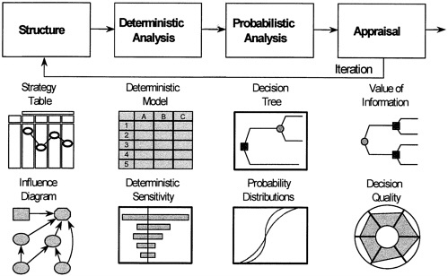

# _Decision Tree Analysis_

```{r include=FALSE}
knitr::opts_chunk$set(echo = FALSE)
```

## Pendahuluan {#label1}

Analisis keputusan atau *Decision Analysis*(DA) secara sederhana didefinisikan sebagai sebuah proses dalam pemilihan alternatif yang paling sesuai dengan tujuan yang telah ditetapkan. Didalam literatur, Analisis keputusan dijelaskan sebagai sebuah prosedur yang sistematis dalam men-trasformasikan masalah-masalah pengambilan keputusan yang masih belum jelas menjadi sebuah keputusan yang lebih jelas dengan urutan langkah yang transparan.

Penggunaan analisis keputusan dalam penilaian kelayakan proyek memberikan gambaran yang lebih baik terhadap _opportunity_ yang dimiliki, mengevaluasi potensi risiko, memberikan gambaran Informasi apa saja yang diperlukan dan menilai kesiapan untuk melakukan pekerjaan tersebut. Dalam konteks pengambilan keputusan, _decision analysis_ sebaiknya dilihat sebagai sebuah komunikasi antara pengambil keputusan dengan _decision facilitator_ yang bertujuan memberikan _insight_, sehingga hasil dari analisis keputusan diharapkan memberikan gambaran terbaik terhadap opsi yang dimiliki. 

Adanya faktor _uncertainty_ baik yang disertakan maupun diluar dari batasannya, memungkinkan bahwa hasil terbaik dari _decision analysis_ bisa jadi tidak linier terhadap kesuksesan proyek. Untuk mengurangi akibat dari ketidakakuratan hasil analisis, diperlukan proses analisis keputusan secara bertahap dengan perubahan informasi baru yang dimiliki seiring perjalanan proyek.

Analisis Pohon Keputusan atau _Decision Tree Analysis_ (DTA) merupakan salah satu metode yang paling sering digunakan dalam proses pengambilan keputusan, implementasi penggunaan metode ini dalam teknik perminyakan sejauh ini sering ditujukan pada tahap eksplorasi [@Bratvold2010]. 

Modul *Decision Analyis* **PertaEOR** menggunakan metode DTA dalam melakukan evalusi sebuah proyek. Modul ini didesain secara khusus untuk proyek-proyek EOR. _Workflow_  pada modul DTA untuk **PertaEOR** telah diintegrasikan dengan modul lainnya yang telah ada, seperti: Modul _screening_, Modul _predictive model_, Modul keekonomian dan modul analisis monte carlo.

```
Istilah Decision Facilitator adalah untuk memberikan cakupan yang lebih luas 
dari individu-individu yang harus terlibat dalam proses pendefinisian pengambilan keputusan.  
``` [@Mcnamee2001]


## Stuktur Analisis Pohon Keputusan _(Decision Tree Analysis)_ {#label2}
Analisis pohon keputusan atau _Decision Tree Analysis (DTA)_ merupakan salah satu metode pengambilan keputusan yang menggunakan _tree-model_ dalam memvisualisasikan opsi dan kemungkinan yang berpotensi terjadi. DTA secara terstruktur akan memetakan opsi-opsi dan kemungkinan dari sebuah kejadian menjadi sebuah cabang-cabang pohon _(tree brach)_. Proses perhitungan di _tree brach_ sangat bergantung dari _tree node_ yang di pilih, dua jenis _tree node_ yang digunakan pada DTA adalah _option node_ dan _uncertainty node_. _Option node_ adalah titik yang akan memberikan cabang berupa opsi yang bisa di pilih dan disertakan, sedangkan _uncertainty node_ adalah titik yang menggambarkan variabel _uncertainty_ dalam sebuah kejadian. Selanjutnya _uncertainty_ akan direpresentasikan dalam sebuah nilai probabilitas, hal ini akan lebih detil dijelaskan pada seksi \@ref(label19) dan seksi \@ref(label20).

```{r fig.align = 'center', out.width = "45%", fig.cap = "_Decision Tree Analysis_"}
knitr::include_graphics("images/decisionanalysis/dtree2.png")
```
Gambar [ref] merupakan sebuah contoh perumusan masalah pada DTA, bagian utama dari struktur _tree_ akan dijelaskan lebih detil pada seksi \@ref(label9). Perumusan bagian-bagian yang terkait dengan cabang-cabang yang akan disertakan merupakan hasil dari proses diskusi antara pengambil keputusan dengan _decision facilitator_. Beberapa hal yang perlu disimpulkan sebelum mebangun sebuah _tree_ adalah pendefinisian: _Objective function_, _alternatif_ / skenario, dan variabel-variabel yang berkaitan dengan  biaya dan ekspektasi yang akan didapatkan. Hal ini akan dijelaskan lebih detil pada seksi \@ref(label13).

### Elemen Analisis Pohon Keputusan {#label3}
Elemen _decision analysis_ merupakan variabel yang perlu dijelaskan sebelum melakukan evaluasi, variabel tersebut harus dipahami dengan baik oleh pengambil keputusan dan _decision facilitator_. Menurut [@Bratvold2010], ada lima elemen utama pada proses studi pengambilan keputusan yaitu: 

- _Alternatives_
- _Objectives_
- _Information_
- _Payoff_
- _Decision_

Tiga elemen teratas sering disebut _"decision basis"_ [@Howard1988].

#### _Alternatives_ {#label4}
Alternatif didefinisikan sebagai sebuah pilihan _(choices)_ yang dimiliki sebelum proses pengambilan keputusan, tidak ada keputusan yang diambil jika tidak memiliki opsi [@Bratvold2010]. Proses pendefinisian alternatif membutuhkan komunikasi antara _decision facilitator_ yang terlibat. Penilaian terhadap sebuah proses pengambilan keputusan apakah sudah menyertakan seluruh opsi yang dimiliki atau belum akan dilakukan pada seksi \@ref(dq2).

#### _Objectives_ {#label5}
Tujuan yang jelas dan dapat dicapai perlu untuk ditetapkan sebelum memulai proses pengambilan keputusan. 

#### _Information_ {#label6}
#### _Payoff_ {#label7}
#### _Decision_ {#label8}

### Notasi Baku Analisis Pohon Keputusan {#label9}

```{r fig.align = 'center', out.width = "45%", fig.cap = "_Decision Tree Analysis_"}
knitr::include_graphics("images/decisionanalysis/elm.png")
```
-Notasi Node
-Notasi Tree
-Notasi Diagram

## Alur Kerja Pengambilan Keputusan {#label10}

## _Decision Tree Analysis Workflow_ {#label11}

```{r fig.align = 'center', out.width = "45%", fig.cap = "_Decision Tree Analysis_"}

```

### _Framing The Problem_ {#label12}

```{r fig.align = 'center', out.width = "45%", fig.cap = "_Decision Tree Analysis_"}
knitr::include_graphics("images/decisionanalysis/fram1.png")
```

### _Deterministic Analysis_ {#label13}

```{r fig.align = 'center', out.width = "45%", fig.cap = "_Decision Tree Analysis_"}
knitr::include_graphics("images/decisionanalysis/sens.png")
```

### _Probabilistic Analysis_ {#label14}
```{r fig.align = 'center', out.width = "45%", fig.cap = "_Decision Tree Analysis_"}
knitr::include_graphics("images/decisionanalysis/forward.png")
```

### _Appraisal_ {#label15}

#### _Value of Information_ {#label16}

```{r fig.align = 'center', out.width = "45%", fig.cap = "_Decision Tree Analysis_"}
knitr::include_graphics("images/decisionanalysis/voi.png")
```

#### _Decision Quality_ {#label17}

Terdapat suatu perbedaan definisi yang mendasar antara keputusan dan hasil. Hasil yang baik adalah apa yang kita inginkan sedangkan keputusan yang baik adalah apa yang dapat dilakukan untuk memaksimalkan kemungkinan hasil yang baik. Keputusan yang baik tidak menjamin hasil yang baik tapi pada umumnya keputusan yang baik akan mengarah pada hasil yang baik sehingga dari definisi ini maka yang dapat dilakukan adalah membuat keputusan yang baik, bukan hasil yang baik. Bagi _decision-maker_ tunggal, biasanya penentuan apakah keputusan itu "baik" dapat dilakukan dengan jelas. Di sisi lain, jika berada dalam suatu lingkungan yang terdiri dari beberapa _decision-maker_, maka penentuan organisasi itu siap mengambil keputusan menjadi cukup sulit. Dalam kondisi tersebut, perlu ada persetujuaan mengenai kualitas dari alternatif, informasi, dan _value_. _Decision Quality_ di sini berperan sebagai alat yang berfungsi untuk mengevaluasi kualitas dari keputusan.

Setelah mencapi tahap pendeklarasian keputusan, perlu dipastikan bahwa proses menentukan keputusan tersebut sudah mencapai keputusan yang berkualitas yang dilakukan dengan mengevaluasi keputusan tersebut berdasarkan 6 elemen _Decision Quality_. Matheson dan Matheson (1998) mensurvei sejumlah besar _decison-maker_ dan menggabungan tanggapan mereka dengan pemikiran akademisi untuk mengembangkan kerangka kerja yang mengevaluasi kualitas dari keputusan dalam 6 dimensi seperti Gambar di bawah ini.

```{r fig.align = 'center', out.width = "55%", fig.cap = "Elemen _Decision Quality_"}
knitr::include_graphics("images/decisionanalysis/bagan.png")
```

Elemen-elemen tersebut direpresentasikan dalam sebagai hubungan dalam rantai keputusan akan hanya sekuat mata rantai yang paling lemah. Jika setiap elemen kuat, maka kualitas keputusan adalah tinggi. Jika salah satu elemen lemah, maka kualitas keputusan tidak lebih baik dari elemen yang lemah tersebut. Setiap elemen harus dipertimbangkan berdasarkan perspektif kepala dan hati karena keputusan harus masuk akal dan terasa benar. Setiap dari 6 elemen tersebut harus mencapai kualitas terbaiknya: _helpful frame_, _creative alternatives_, _useful information_, _clear values_, _sound reasoning_, dan _commitment to follow through_.


##### _1. Helpful Frame_ {#dq1}

Titik awal adalah mengidentifikasi keputusan yang akan dibuat secara jelas dan seberapa akurat keputusan itu untuk dinilai. _Helpful frame_ memperjelas situasi yang akan dipecahkan. Langkah pada tahap ini sangat penting. Mendapat pertanyaan yang baik dari kerangka masalah yang buruk adalah tidak berguna. Sebagai _engineer_ dan _geoscientists_, mereka cenderung untuk segera menghasilkan model (sebagai contoh, _tools_ simulasi, _spreadsheets_, model dan analisi geologi, dan lain-lain) saat menghadapi situasi keputusan yang baru. _Decision-maker_ yang sudah ahli, bagaimanapun, mengetahui bahwa mereka harus mengidentifikasi secara sadar apa uang harus diputuskan. Terlalu sering terdesak waktu dan membutuhkan jawaban yang segera, _decision-maker_ yang belum berpengalaman terjun ke dalam untuk mengumpulkan informasi atau membangun model kuantitatif tanpa berhenti untuk mengajukan pertanyaan-pertanyaan sebagai berikut ini:

- Apa yang diputuskan?
- Apa yang tidak diputuskan? 
- Apa yang akan didapat dari yang diberi?
- Apakah asumsi-asumsi sudah ditentukan secara jelas?

Terlepas dari seberapa sedikit waktu yang tersedia, seseorag tidak boleh melewatkan menanyakan pertanyaan-pertanyaan _framing-type_. Jika tidak bertanya dengan baik, maka memungkinkan akan lebih banyak waktu yang terbuang daripada "menghemat" karena mengambil risiko memecahkan masalah yang salah. 

##### _2. Creative Alternatives_ {#dq2}

Kurangnya tingkat kreativitas dan fleksibilitas alternatif adalah salah satu alasan utama perusahaan-perusahaan memiliki kesulitan dalam mencapai keputusan yang berkualitas tinggi. Bagian ini dapat diilustrasikan dengan menanyakan pertanyaan-pertanyaan sebagai berikut ini:

- Apa saja pilihan-pilihan kita?
- Apakah alternatif-alternatif tersebut dapat dilakukan?
- Apakah alternatif tersebut memecahkan masalah?
- Apakah berbagai alternatif lain sudah dipertimbangkan?

Bagian ini membutuhkan suatu tim untuk menggali ide-ide dan menjadi kreatif. Setiap alternatif yang telah diindetifikasi harus konsisten secara logika dan bisa dilakukan. Kualitas setiap keputusan hanya bisa sebaik alternatifnya yang telah diidentifikasi, jika tidak ada alternatif maka tidak ada keputusan.

##### _3. Useful Information_ {#dq3}

Bagian ini menjelaskan kebutuhan untuk menggunakan informasi yang terpercaya dan relevan yang berkaitan dengan penentuan keputusan. Hal tersebut dapat diilustrasikan dengan menanyakan pertanyaan-pertanyaan di bawah ini:

- Apa yang kita ketahui?
- Apakah kita memiliki informasi yang penting?
- Apakah informasi tersebut tidak bias?
- Seberapa akurat kita di masa lalu dengan penilaian serupa?
- Informasi apa dikumpulkan dengan adanya lebih banyak waktu/uang/sumber daya? 

Perusahaan-perusahaan dan individu-individu seringkali baik dalam memasukkan apa yang mereka tahu dalam analisis. Namun, keenderungan yang sangat berbahaya diilustrasikan dengan tepat sebagai berikut: _"Bukan banyaknya hal yang tidak kita ketahui yang membuat kita dalam masalah. Namun, hal-hal yang kita ketahui tidak seperti itu seharusnya"_. Kunci dari kualitas bagian ini adalah informasi mengenai apa yang belum diketahui (yaitu, keterbatasan pengetahuan). Terlalu banyak keputusan yang dibuat berdasarkan kesalahan atau kekurangan informasi. Penentuan kebutuhan informasi dan mengumpulan informasi yang bermanfaat secara sadar sebelum eksekusi merupakan hal yang sangat penting dilakukan untuk membuat keputusan yang baik.

##### _4. Clear Values_ {#dq4}

Seperti yang telah dibahas sebelumnya, komponen yang sangat penting untuk memebuat keputusan yang baik adalah mendefinisikan dan mengartikulasikan dengan jelas kriteria untuk mengukur _value_ dari alternatif-alternatif dan bagaimana perusahaan membuat _tradeoffs_ pada setiap alternatif. Untuk kebanyakan perusahaan-perusahaan E&P, kriteria kuncinya adalah beberapa dari kombinasi NPV, _cash flow_, produksi, dan penggantian _reserves_. Pertanyaan-pertanyaan yang dapat ditanyakan adalah sebagai berikut:

- Konsekuensi-konsekuensi apa saja yang perlu diperhatikan? 
- _Tradeoff_ apa saja yang dihasilkan?
- Apakah kita bisa mengukur _value_ secara akurat di masa lalu?

_Tradeoff_ seringkali dibutuhkan, dan kejelasan mengenai bagaimana kriteria dirankingkan juga sangat penting. _Value metric_ yang biasa digunakan pada E&P adalah pengurangan _uncertainty_ atau peningkatan kepercayaan. Seperti yang telah dibahas sebelumnya, _metric-metric_ ini tidak memiliki nilai ekonomi. Bahaya lain adalah mengabaikan _metric_ keputusan yang _intangible_, seperti reputasi atau keamanan perusahaan.

##### _5. Sound Reasoning_ {#dq5}

_Reasoning_ adalah bagaimana kita mengkombinasikan alternatif, informasi, dan _value_ agar menjadi keputusan. Itu adalah jawaban kita atas pertanyaan: "Kami memilih alternif ini karena .....". Bagian ini membutuhkan penggabungan input dari bagian-bagian sebelumnya untuk menentukan alternatif manakah yang menghasilkan _value_ terbanyak. Pada kebanyakan kasus, situasi keputusan cukup kompleks untuk memercayakan pada intuisi dan membutuhkan model. Bagian ini dapt diilustrasikan dengan menanyakan pertanyaan: "Apakah saya berpikir jernih tentang ini?".

Pada industri E&P tidak terbiasa untuk mengembangkan model yang terlalu rumit untuk menyampaikan kejelasan dan transparansi yang dibutuhkan. Prosedur biasa dalam pengembangan "*base case*" terkadang menghasilkan determinisktik model yang terlalu detail dan kompleks yang mengabaikan tidak hanya _uncertainties_ tetapi juga variabel-variabel kunci. 

Tujuan dari evaluasi adalah untuk mengembangkan rekomendasi yang jelas, transparan, dan mudah dimengerti. Rekomendasi yang mampu memaksimalkan _value_ dari _decision-maker_.

##### _6. Commitment to Follow Through_ {#dq6}

Bagian ini menggerakkan keputusan ke tahap implementasi, yang mana tidak trivial. Keputusan terbaik tidak berguna jika organisasi tidak mengimplementasikannya. Jika komitmen yang dimilki hanya setengah hati, maka pelaksanaanya biasanya kurang intens dan mungkin tidak mencapai hasil yang terbaik. Bagian ini dapat diilustrasikan dengan menanyakan beberapa pertanyaan:

- Apakah rekomendasi sesuai dan bisa dilakukan?
- Bagaimana kita akan mengkomunikasikan keputusan?
- Apakah organisasi bisa mendukung keputusan tersebut?
- Apakah sudah terdapat rencana implementasi?

Pelaksanaan yang sukses membutuhkan suber daya, seperti waktu, usaha, uang, atau bantuan dari pihak lain. Selain itu pula juga membutuhkan kesiapan untuk mengatasi permasalahan.

## Pemetaan Ketidakpastian {#label18}
### Apa itu _Uncertainty_ {#label19}
### _Uncertainty & Probability_ {#label20}
```{r fig.align = 'center', out.width = "95%", fig.cap = "_Decision Tree Analysis_"}
knitr::include_graphics("images/decisionanalysis/dist.png")
```

## Menciptakan Nilai dari Sebuah Ketidakpastian {#label21}
### _Value of Information_ {#label22}
### _Value of Flexibility_ {#label23}

\@ref(label1)

## Tantangan Dalam Pengambilan Keputusan {#label24}
## Bias {#label25}
## _Encoding Probabilities_ {#label26}


[bookdown](https://bookdown.org/yihui/bookdown/cross-references.html)


