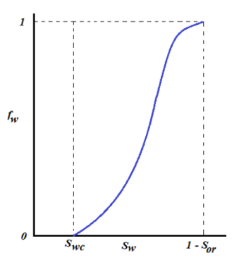
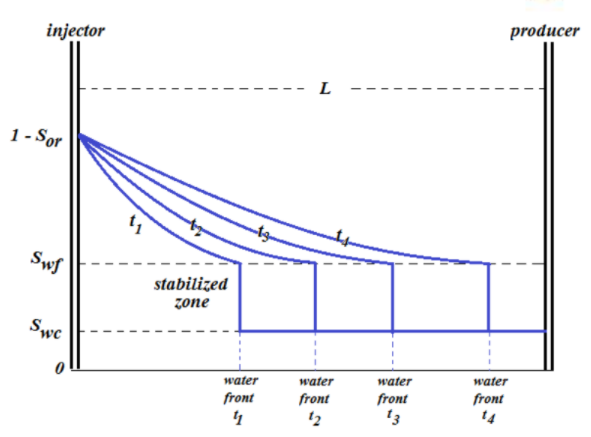
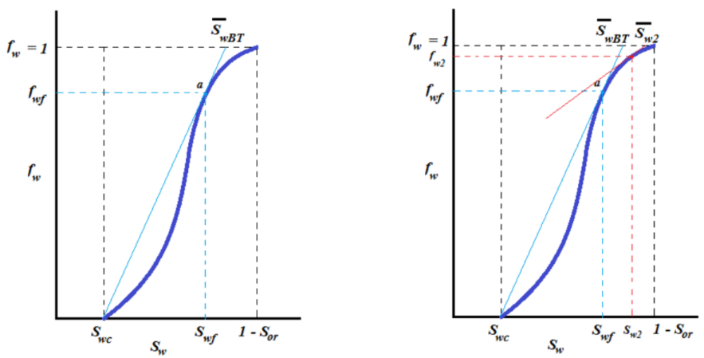

# Waterflood Predictive Model

## Pendahuluan

___Waterflooding___ adalah istilah yang digunakan untuk menggambarkan proses injeksi air ke dalam reservoir dengan tujuan untuk menambah tingkat perolehan minyak. _Waterflood predictive model_  merupakan suatu model yang dapat memprediksi performa reservoir di bawah proses _waterflood_.

Analisis performa _waterflood_ membutuhkan informasi mengenai profil saturasi air di reservoir selama periode injeksi air dilakukan. Teori ___frontal displacement___ dari Buckley dan Leverett merupakan teori yang membahas mengenai cara menentukan profil saturasi air di reservoir selama proses _secondary_ atau _tertiary recovery_. Teori ini tidak hanya berlaku untuk prediksi performa reservoir di bawah proses _waterflooding_, tetapi juga berlaku umum untuk seluruh proses _secondary_ dan _tertiary flooding_. Pemahaman mengenai teori _frontal displacement_, yang terdiri dari teori __fractional flow__ dan teori __frontal advance__, sangat penting untuk memprediksi performa reservoir di bawah proses _secondary_ maupun _tertiary flooding_. Berikut akan diberikan pnjelasan mengenai teori _frontal displacement_.

 &nbsp; 

 
## Teori _Frontal Displacement_ Untuk _Waterflooding_

### Teori _Fractional Flow_ Untuk _Waterflooding_

Teori _fractional flow_ merupakan teori yang membahas mengenai fraksi aliran suatu fasa fluida dalam total aliran yang terdiri atas sejumlah fasa fluida. Melalui teori _fractional flow_, nilai dari fraksi aliran air sebagai fungsi dari saturasi air di reservoir dapat diketahui. Berikut akan dijelaskan mengenai penurunan persamaan _fractional flow_.

Tinjau dua fasa fluida yang mengalir bersamaan di reservoir, yaitu fasa air (*water*) dan fasa minyak (*oil*). Persamaan Darcy (dalam bentuk kecepatan alir Darcy) untuk masing-masing fasa ini dinyatakan sebagai berikut.
$$u_o = -\frac{k_o}{\mu_o} \left[ \frac{\partial P_o}{\partial x}+ \rho_o\ g\ \sin \alpha \right]$$
$$u_w = -\frac{k_w}{\mu_w} \left[ \frac{\partial P_w}{\partial x}+\rho_w\ g\ \sin \alpha \right] ... (1)$$Pada persamaan (1) di atas, _k~i~_ menyatakan permeabilitas efektif dari masing-masing fasa. Selanjutnya, dari definisi kecepatan Darcy,
$$u = \frac{q}{A}...(2)$$
Maka substitusi persamaan (2) ke persamaan (1) akan memberikan persamaan berikut.
$$q_o = \frac{-k_o A}{\mu_o} \left[ \frac{\partial P_o}{\partial x}+ \rho_o\ g\ \sin \alpha \right] $$
$$q_w = \frac{-k_w A}{\mu_w} \left[ \frac{\partial P_w}{\partial x}+ \rho_w\ g\ \sin \alpha \right]...(3) $$
Fraksi aliran air (*fractional flow of water - f~w~*) dari total aliran didefinisikan sebagai laju alir fasa air dibagi dengan laju alir total,
$$f_w = \frac{q_w}{q_t} = \frac{q_w}{q_w+q_o}...(4)$$
Dari persamaan (4), diperoleh dua persamaan berikut:
$$q_w = f_w\ q_t$$
$$q_o = (1-f_w)\ q_t$$
Substitusi persamaan (5) ke persamaan (3), maka persamaan aliran untuk fasa minyak dan fasa air menjadi:
$$(1-f_w)\ q_t = -\frac{k_o A}{\mu_o} \left[ \frac{\partial P_o}{\partial x}+ \rho_o\ g\ \sin \alpha \right]$$
$$f_w\ q_t = -\frac{k_w A}{\mu_w} \left[ \frac{\partial P_w}{\partial x}+ \rho_w\ g\ \sin \alpha \right]$$
Persamaan di atas dapat pula dituliskan sebagai:
$$-(1-f_w) \frac{q_t}{A} \frac{\mu_o}{k_o} = \frac{\partial P_o}{\partial x}+ \rho_o\ g\ \sin \alpha $$
$$-f_w \frac{q_t}{A} \frac{\mu_w}{k_w} = \frac{\partial P_w}{\partial x}+ \rho_o\ g\ \sin \alpha...(6) $$
Selanjutnya, dari definisi tekanan kapiler, _P~c~ = P~o~ - P~w~_, diperoleh
$$\frac{\partial P_c}{\partial x} = \frac{\partial P_o}{\partial x} - \frac{\partial P_w}{\partial x}...(7)$$
Selisihkan persamaan aliran fasa minyak dan fasa air dari persamaan (6), kemudian lakukan substitusi persamaan (7) ke persamaan (6), diperoleh:
$$\frac{q_t f_w}{A} \left( \frac{\mu_o}{k_o} +\frac{\mu_w}{k_w} \right) = \frac{\partial P_c}{\partial x} + (\rho_o - \rho_g)\ g\ sin\ \alpha\ + \frac{q_t}{A} \frac{\mu_o}{k_o} $$
$$\frac{q_t f_w}{A} = \frac{\frac{\partial P_c}{\partial x} + (\rho_o - \rho_g)\ g\ sin\ \alpha\ + \frac{q_t}{A} \frac{\mu_o}{k_o}}{\left( \frac{\mu_o}{k_o} +\frac{\mu_w}{k_w} \right)}$$
$$f_w = \frac{1+\frac{k_o}{\mu_o}\frac{A}{q_t} \left( \frac{\partial P_c}{\partial x} + (\rho_o - \rho_g)\ g\ sin\ \alpha\ \right)}{1+\frac{k_o}{k_w}\frac{\mu_w}{\mu_o}}...(8)$$
Persamaan (8) merupakan persamaan _fractional flow_ untuk fasa air. Jika faktor tekanan kapiler dapat diabaikan, dan reservoir berada pada bidang horizontal ( = 0), maka bentuk persamaan _fractional flow of water_ dapat menjadi lebih sederhana, yaitu:
$$f_w = \frac{1}{1+\frac{k_o}{k_w}\frac{\mu_w}{\mu_o}}...(9)$$
Persamaan (9) dapat pula dinyatakan dalam bentuk permeabilitas relatif, yaitu:
$$f_w = \frac{1}{1+\frac{k_{ro}}{k_{rw}}\frac{\mu_w}{\mu_o}}...(10)$$
Analisis lebih lanjut perlu dilakukan terhadap persamaan fraksi aliran air sehingga informasi mengenai nilai fraksi aliran air (*f~w~*) sebagai fungsi dari saturasi air (*S~w~*) di reservoir dapat diperoleh. Plot fraksi aliran air (*f~w~*) terhadap saturasi air (*S~w~*) memiliki bentuk kurva seperti pada gambar berikut.

(\#fig:unnamed-chunk-2)Kurva fraksi aliran air sebagai fungsi dari saturasi air

 &nbsp; 

Untuk menyusun kurva _f~w~_ versus *S~w~* seperti di atas, perlu diketahui pernyataan _f~w~_ sebagai fungsi dari *S~w~*, ${f_w = f_w(S_w)}$. Approksimasi pernyataan ${f_w = f_w(S_w)}$ dapat diperoleh melalui analisis kurva rasio permeabilitas relatif terhadap *S~w~*. Beberapa persamaan berikut memberikan approksimasi nilai fraksi aliran air sebagai fungsi dari saturasi air.
$$\frac{k_{ro}}{k_{rw}} = ae^{bS_w} ...(11)$$
$$f_w = \frac{1}{1+ \left( \frac{\mu_w}{\mu_o} \right)ae^{bS_w}}...(12)$$
$$\left( \frac{\partial f_w}{\partial S_w} \right)_{S_w} = \frac{- \left( \frac{\mu_w}{\mu_o} \right)abe^{bS_w}}{\left[ 1+ \left( \frac{\mu_w}{\mu_o} \right)ae^{bS_w} \right]^2}...(13)$$
Dari kurva rasio permeabilitas relatif (k~ro~/k~rw~) terhadap saturasi air (*S~w~*), nilai koefisien _a_ dan _b_ pada persamaan (11) dapat diketahui. Setelah koefisien _a_ dan _b_ diketahui, maka persamaan (12) dapat digunakan sebagai approksimasi untuk mengetahui nilai _f~w~_ sebagai fungsi *S~w~*. Turunan dari _f~w~_ terhadap *S~w~*, yaitu ($\frac{\partial f_w}{\partial S_w}$), merupakan parameter yang sangat penting dalam penentuan profil saturasi air. Penjelasan mengenai parameter ($\frac{\partial f_w}{\partial S_w}$) akan diberikan kemudian pada subbab tentang teori _frontal advance_.

Kembali ke pembahasan mengenai persamaan _fractional flow_, seperti dijelaskan di awal subbab, persamaan _fractional flow_ adalah persamaan yang memberikan nilai fraksi aliran air sebagai fungsi dari saturasi air. Kurva _f~w~_ versus *S~w~*. seperti yang diperlihatkan pada gambar (1) merupakan kurva yang sangat penting. Sejumlah analisis grafik dapat dilakukan terhadap kurva ini untuk memperoleh sejumlah informasi mengenai parameter-parameter yang akan digunakan dalam analisis performa _waterflooding._ Selain itu, analisis kurva _fractional flow_ terkait erat dengan solusi dari persamaan _frontal_ _advance_ untuk memprediksi profil saturasi air di reservoir selama periode _flooding._ Penjelasan lebih lanjut mengenai hal ini akan diberikan di subbab teori _frontal advance_.

### Teori _Frontal Advance_ Untuk _Waterflooding_

Seperti yang telah disebutkan sebelumnya bahwa teori _frontal advance_ adalah teori yang membahas mengenai cara menentukan profil saturasi air di reservoir selama periode injeksi. Persamaan _frontal advance_ (atau dikenal juga dengan __persamaan Buckley-Leverett__) adalah persamaan dasar yang memberikan kecepatan gerak saturasi air di reservoir sebagai fungsi dari fraksi aliran air. Penurunan persamaan _frontal advance_ adalah sebagai berikut.

Tinjau aliran air melalui suatu elemen volume di dalam pori-pori batuan reservoir. Dengan asumsi: (1) tidak ada transfer massa antara fasa air dan fasa minyak, (2) aliran bersifat _incompressible_, dan (3) fraksi aliran air hanya merupakan fungsi dari saturasi air, maka laju akumulasi massa air di dalam elemen volume tersebut dinyatakan oleh persamaan berikut.
$$A\phi\Delta L \frac{\partial}{\partial t} = (q_w\rho_w)_x - (q_w\rho_w)_{x+\Delta x}...(14)$$
Dengan menggunakan teorema dalam kalukulus, maka persamaan (14) dapat dinyatakan dalam bentuk persamaan diferensioal orde satu sebagai berikut.
$$ \frac{\partial}{\partial x}(q_w\rho_w) + A\phi \frac{\partial}{\partial t}(q_w\rho_w) = 0 $$
$$ -\frac{\partial}{\partial x}(q_w\rho_w) = A\phi \frac{\partial}{\partial t}(q_w\rho_w)...(15) $$
Dengan asumsi aliran bersifat _incompressible_, maka densitas bernilai konstan sehingga persamaan (15) menjadi:
$$ -\frac{\partial q_w}{\partial x} = A\phi \frac{\partial S_w}{\partial t}...(16) $$
Substitusi persamaan (5) ke dalam persamaan (16), diperoleh:
$$ -\frac{\partial (f_wq_t)}{\partial x} = A\phi \frac{\partial S_w}{\partial t} $$
$$ -q_t\frac{\partial f_w}{\partial x} = A\phi \frac{\partial S_w}{\partial t} $$
$$ -\frac{\partial f_w}{\partial x} = \frac{A\phi}{q_t} \frac{\partial S_w}{\partial t} ...(17)$$
Saturasi air (*S~w~*) merupakan fungsi dari posisi (*x*) dan waktu (*t*) sehingga:
$$S_w = S_w(x,t) $$
$$dS_w = \left( \frac{\partial S_w}{\partial x} \right)dx\ + \left( \frac{\partial S_w}{\partial t} \right)dt ... (18)$$
Selanjutnya, tinjau suatu nilai saturasi air konstan pada elemen volume tersebut sehingga d*S~w~* = 0. Maka persamaan (18) menjadi:
$$\left( \frac{\partial S_w}{\partial x} \right)_tdx\ + \left( \frac{\partial S_w}{\partial t} \right)_xdt = 0$$
$$\left( \frac{\partial S_w}{\partial x} \right)_t \frac{dx}{dt}\ + \left( \frac{\partial S_w}{\partial t} \right)_x = 0$$
$$\frac{dx}{dt} = - \frac{\left( \frac{\partial S_w}{\partial t} \right)_x}{\left( \frac{\partial S_w}{\partial x} \right)_t}$$
$$ \left( \frac{\partial S_w}{\partial t} \right)_x = -\frac{dx}{dt} \left( \frac{\partial S_w}{\partial x} \right)_t $$

 atau 

$$ \left( \frac{\partial S_w}{\partial t} \right)_x = -\left( \frac{dx}{dt} \right)_{S_w} \left( \frac{\partial S_w}{\partial x} \right)_t ...(19)$$
Karena fraksi aliran air (*fractional flow of water, f~w~*) hanya merupakan fungsi dari saturasi air (*S~w~*), maka:
$$f_w = f_w (S_w)$$
$$ \frac{\partial f_w}{\partial x} = \left( \frac{\partial f_w}{\partial S_w} \right) \left( \frac{\partial S_w}{\partial x} \right)...(20) $$
Selanjutnya, lakukan substitusi persamaan (19) dan (20) ke dalam persamaan (17), akan diperoleh:
$$ -\left( \frac{\partial f_w}{\partial S_w} \right) \left( \frac{\partial S_w}{\partial x} \right) = -\frac{A\phi}{q_t} \left( \frac{\partial S_w}{\partial x} \right) \left( \frac{\partial x}{\partial t} \right)_{S_w} $$
$$ \left( \frac{dx}{dt} \right)_{S_w} = \frac{q_t}{A\phi} \left( \frac{\partial f_w}{\partial S_w} \right)_{S_w}...(21)$$
Persamaan (21) merupakan persamaan _frontal advance_ yang menyatakan bahwa kecepatan gerak suatu nilai saturasi air di reservoir berbanding lurus dengan parameter turunan _fractional flow_ terhadap saturasi air, $\left( \frac{\partial f_w}{\partial S_w} \right)$. Dengan melakukan integral terhadap persamaan (21), maka profil saturasi air di reservoir dapat diperoleh, yaitu:
$$(x)_{S_w} = \frac{q_t}{A\phi} \left( \frac{\partial f_w}{\partial S_w} \right)_{S_w} = \frac{q_tt}{A\phi} \left( \frac{f_w - f_{wi}}{S_w - S_{wi}} \right)...(22)$$
Sebelum _waterflooding_ dilakukan, saturasi air di reservoir berada pada keadaan _irreducible_ (*S~wc~*). Saat _waterflooding_ dimulai, air injeksi akan bergerak sepanjang pori-pori batuan reservoir. Pergerakan air injeksi ini memiliki sisi depan yang disebut sebagai _flood front_ (atau disebut juga _shock front_) dengan nilai saturasi *S~wf~* (disebut _front water saturation_). Bentuk profil saturasi air di reservoir berdasarkan prediksi dari persamaan (22) adalah seperti pada gambar berikut.

(\#fig:unnamed-chunk-3)Profil saturasi air di reservoir selama periode _waterflooding_

 &nbsp; 

Dari gambar (2) di atas, terlihat bahwa interval nilai saturasi air diantara *S~wc~* dan *S~wf~* memiliki profil yang sama, yaitu garis lurus vertikal. Hal ini berarti semua nilai saturasi yang berada di antara *S~wc~* dan *S~wf~* (*S~wc~* < *S~w~* < *S~wf~*) bergerak dengan kecepatan yang sama, yaitu kecepatan _flood_ _front_ (atau kecepatan _shock_) yang dinyatakan oleh:
$$(v)_{S_{wc} < S_w < S_{wf}} = \frac{q_t}{A\phi} \left( \frac{\partial f_w}{\partial S_w} \right)_{S_{wf}}$$
Sehingga jarak tempuh dari setiap nilai saturasi dalam interval ini adalah sama, yaitu
$$(x)_{S_{wc} < S_w < S_{wf}} = \frac{q_tt}{A\phi} \left( \frac{\partial f_w}{\partial S_w} \right)_{S_{wf}} = \frac{q_tt}{A\phi} \left( \frac{f_{wf} - f_{wi}}{S_{wf} - S_{wi}} \right)...(23)$$ 
Zona dimana semua nilai saturasi air dalam interval tersebut bergerak dengan kecepatan yang sama di dalam pori-pori batuan reservoir disebut sebagai zona stabil (__*stabilized zone*__). Garis biru vertikal pada gambar (2) merupakan _stabilized zone_. Interval nilai saturasi air yang berada di luar interval _stabilized zone_ disebut sebagai _non-stabilized zone_, yaitu interval nilai saturasi di atas *S~wf~* (*S~wf~* < *S~w~* < 1 − *S~or~*) dimana setiap nilai saturasi air bergerak dengan kecepatan yang berbeda sehingga membentuk profil saturasi air yang tidak konstan. Profil saturasi air untuk interval _non-stabilized zone_ dinyatakan oleh modifikasi dari persamaan (22) untuk interval saturasi air _non-stabilized zone_. Bentuk profil saturasi selama periode injeksi air terdiri atas tiga zona, yaitu _unswept zone_ yang memiliki saturasi air *S~wc~*, _stabilized_ _zone_ dengan nilai saturasi air *S~wf~*, dan _non-stabilized zone_ dengan nilai saturasi air yang berubah-ubah antara *S~wf~* dan (1 – *S~or~*).

(\#fig:unnamed-chunk-4)Profil saturasi air di reservoir seiring dengan berjalannya waktu

 &nbsp; 

Profil saturasi air di reservoir selama periode _flooding_ dapat diketahui dengan menggunakan persamaan (22) dan (23). Penggunaan kedua persamaan ini membutuhkan informasi mengenai nilai turunan _fractional_ _flow_ terhadap saturasi air, yaitu $\left( \frac{\partial f_w}{\partial S_w} \right)_{S_w}$ dan $\left( \frac{\partial f_w}{\partial S_w} \right)_{S_{wf}}$. Nilai kedua parameter ini dapat diperoleh dengan melakukan analisis grafik terhadap kurva _fractional_ _flow_ _of_ _water_, yaitu kurva _f~w~_ versus _S~w~_. Berikut akan diberikan penjelasan mengenai hal ini.

Tinjau interval nilai saturasi air antara *S~wc~* dan *S~wf~*. Pada interval ini, semua nilai saturasi air bergerak dengan kecepatan yang sama, yaitu kecepatan _flood front_. Garis lurus yang ditarik dari Swc dan menyinggung kurva _fractional flow water_ menyatakan parameter $\left( \frac{\partial f_w}{\partial S_w} \right)_{S_{wf}}$, sehingga koordinat titik singgung garis ini terhadap kurva *f~w~* merupakan koordinat dari _front water_, yaitu (*S~wf~*, *f~wf~*). Dari analisis grafik ini, nilai *S~wf~* dan *f~wf~* dapat diketahui sehingga persamaan (23) dapat digunakan untuk mendapatkan profil saturasi air untuk interval *S~wc~* < *S~w~* < *S~wf~*.

Analisis grafik yang serupa juga berlaku untuk interval _non-stabilized zone_, yaitu interval saturasi air *S~wf~* < *S~w~* < *S~or~*. Titik singgung terhadap kurva *f~w~* dari setiap nilai saturasi air yang dipilih pada interval ini (dilambangkan *S~w2~*) akan memberikan nilai fraksi aliran air yang bersesuaian, yaitu *f~w2~*. Dengan diketahuinya nilai (*f~w2~*,*S~w2~*), maka modifikasi dari persamaan (22) dapat digunakan untuk mendapatkan profil saturasi air pada interval ini, yaitu:
$$(x)_{S_{w2}} = \frac{q_tt}{A\phi} \left( \frac{\partial f_w}{\partial S_w} \right)_{S_{w2}} = \frac{q_tt}{A\phi} \left( \frac{f_{w2} - f_{wi}}{S_{w2} - S_{wi}} \right)...(24)$$
Konsep analisis grafik untuk menentukan nilai $\left( \frac{\partial f_w}{\partial S_w} \right)_{S_{wf}}$ dan $\left( \frac{\partial f_w}{\partial S_w} \right)_{S_{w2}}$ diperlihatkan pada kedua gambar berikut.

(\#fig:unnamed-chunk-5)Analisis grafik pada kurva _f~w~_ untuk menentukan nilai $\left( \frac{\partial f_w}{\partial S_w} \right)_{S_{wf}}$ dan $\left( \frac{\partial f_w}{\partial S_w} \right)_{S_{w2}}$

 &nbsp; 

Analisis grafik untuk menentukan $\left( \frac{\partial f_w}{\partial S_w} \right)_{S_w}$ merupakan metode dasar dari teori _frontal advance_ dan diberikan penjelasannya sebagai dasar teori. Pada penelitian ini, metode grafik tidak digunakan. Approksimasi dari nilai $\left( \frac{\partial f_w}{\partial S_w} \right)_{S_w}$ ditentukan dengan menggunakan metode numerik. Subbab selanjutnya akan membahas mengenai hal ini.

### Penentuan parameter $\left( \frac{\partial f_w}{\partial S_w} \right)_{S_w}$ dan Saturasi Air Rata-Rata Reservoir ($\bar S_w$)

Untuk melakukan analisis prediksi performa _waterflooding_, informasi penting yang perlu diketahui selain parameter $\left( \frac{\partial f_w}{\partial S_w} \right)_{S_w}$ adalah nilai saturasi air rata-rata di reservoir selama periode flooding $\bar S_w$. Nilai dari $\bar S_w$ di setiap periode injeksi akan digunakan dalam perhitungan parameter-parameter performa _flooding_.

#### Metode Numerik Untuk Menentukan Nilai $\left( \frac{\partial f_w}{\partial S_w} \right)_{S_w}$

Seperti yang telah diutarakan pada subbab sebelumnya, nilai dari parameter $\left( \frac{\partial f_w}{\partial S_w} \right)_{S_w}$ penting untuk diketahui karena akan digunakan dalam persamaan (22), (23), dan (24) untuk menghitung profil saturasi air di reservoir. Selain itu, parameter ini pun akan banyak digunakan dalam persamaan-persamaan mengenai parameter performa _flooding_ lainnya.

Penelitian ini menggunakan hampiran numerik untuk mencari nilai dari $\left( \frac{\partial f_w}{\partial S_w} \right)_{S_w}$ persamaan hampiran yang digunakan adalah sebagai berikut.
$$k_{ro} = \alpha _1 (1-S_{wD})^m$$
$$k_{ro} = \alpha _2 S_{wD}^n...(25)$$
$$\left( \frac{\partial f_w}{\partial S_w} \right)_{S_w} = \frac{f_{S_w}-f_{S_{wi}}}{S_w - S_{wi}} ...(26) $$
$$f_w = \frac{S_{wD}^n}{[S_{wD}^n\ + A(1-S_{wD})^m ]}...(27)$$
$$\frac{\partial f_w}{\partial S_w} = \frac{AB[nS_{wD}^{n-1}(1-S_{wD})^m\ + S_{wD}^n(1-S_{wD})^{m-1}]}{[S_{wD}^n\ + A(1-S_{wD})^m ]^2}...(28)$$
Dimana _S~wD~_ adalah nilai air _dimensionless_, $\alpha _1$, $\alpha _2$, $n$, dan $m$ adalah koefisien-koefisien numerik.
$$A = \frac{\alpha _1}{\alpha _2}\frac{\mu_w}{\mu_o};B = \frac{1}{1-S_{or}-S_{wi}}$$
$$S_{wD} = \frac{S_{w}-S_{wi}}{1-S_{or}-S_{wi}} = B(S_{w}-S_{wi})...(29)$$
Substitusi persamaan (28) ke persamaan (26)
$$ \frac{f_{S_w}-f_{S_{wi}}}{S_w - S_{wi}} = \frac{AB[nS_{wD}^{n-1}(1-S_{wD})^m\ + S_{wD}^n(1-S_{wD})^{m-1}]}{[S_{wD}^n\ + A(1-S_{wD})^m ]^2} $$
$$ \frac{f_{S_w}}{S_w - S_{wi}} = \frac{AB[nS_{wD}^{n-1}(1-S_{wD})^m\ + S_{wD}^n(1-S_{wD})^{m-1}]}{[S_{wD}^n\ + A(1-S_{wD})^m ]^2} $$
Substitusi pernyataan _f~Sw~_ dari persamaan (27),
$$  \frac{\left( \frac{S_{wD}^n}{[S_{wD}^n\ + A(1-S_{wD})^m ]}\right)}  {S_w - S_{wi}} = \frac{AB[nS_{wD}^{n-1}(1-S_{wD})^m\ + S_{wD}^n(1-S_{wD})^{m-1}]}{[S_{wD}^n\ + A(1-S_{wD})^m ]^2} $$
Substitusi pernyataan _S~w~_ dari persamaan (29),
$$  \frac{\left( \frac{S_{wD}^n}{[S_{wD}^n\ + A(1-S_{wD})^m ]}\right)}  {\left(\frac{S_{wD}}{B} + S_{wi} \right) - S_{wi}} = \frac{AB[nS_{wD}^{n-1}(1-S_{wD})^m\ + S_{wD}^n(1-S_{wD})^{m-1}]}{[S_{wD}^n\ + A(1-S_{wD})^m ]^2} $$
$$S_{wD}^n\ + A(1-S_{wD})^m = AnS_{wD}^{n-1}(1-S_{wD})^m\ + AmS_{wD}^n(1-S_{wD})^{m-1} $$
$$A(1-S_{wD})^m[nS_{wD}^{n-1}-1]\ + S_{wD}^n[Am(1-S_{wD})^{m-1}-1] = 0 ...(30)$$

 &nbsp; 

Solusi dari persamaan (30) untuk _S~wD~_ dapat diperoleh secara iterasi numerik menggunakan __metode Newton__ dengan mendefinisikan fungsi berikut:
$$g(S_{wD}) = A(1-S_{wD})^m[nS_{wD}^{n-1}-1]\ + S_{wD}^n[Am(1-S_{wD})^{m-1}-1]$$
Jika _E_ melambangkan batas toleransi _error_ dari solusi, maka metode Newton diterapkan dengan  mengulangi langkah berikut untuk _k_ = 1, 2 ... sampai diperoleh |*(S~wD~)~k+1~ - (S~wD~)~k~*| < *E*. Nilai *E* yang digunakan adalah 10^-7^.
$$(S_{wD})_{k+1} = S_{wD})_k - \frac{g((S_{wD})_k)}{g'((S_{wD})_k)}...(31)$$

 &nbsp; 

Setelah solusi *S~wD~* diperoleh, lakukan substitusi ke persamaan (27), (28), dan (29), untuk mendapatkan nilai dari *f~w~*, $\left( \frac{\partial f_w}{\partial S_w} \right)_{S_w}$, dan *S~w~*. Maka persamaan (22) dapat digunakan untuk mendapatkan profil saturasi air. Prosedur numerik yang sama berlaku dalam penentuan parameter-parameter _front saturation_, yaitu *f~wf~*, *S~wf~*, dan $\left( \frac{\partial f_w}{\partial S_w} \right)_{S_wf}$.

#### Penentuan Nilai Saturasi Air Rata-Rata di Reservoir Selama Periode _Waterflooding_

Nilai saturasi air rata-rata di reservoir ($\bar S_w$) untuk periode tertentu selama proses _waterflooding_ dapat ditentukan dengan dua cara, yaitu analisis grafik dan analisis numerik. Penentuan nilai $\bar S_w$ dari analisis grafik diperlihatkan pada gambar (4). Titik potong garis singgung dengan kurva *f~w~* di nilai *f~w~* = 1 memberikan nilai saturasi air rata-rata di reservoir, $\bar S_w$. Untuk periode sebelum dan saat terjadi _water breakthrough_, nilai saturasi air rata-rata di reservoir dinyatakan oleh $\bar S_{wBT}$, sedangkan nilai saturasi air rata-rata di reservoir setelah periode _water breakthrough_ dinyatakan oleh $\bar S_{w2}$.

Metode penentuan nilai $\bar S_w$ yang digunakan pada penelitian ini adalah metode numerik. Penurunan dari persamaan hampiran numerik yang akan digunakan untuk menentukan $\bar S_w$ adalah sebagai berikut.

Nilai saturasi air rata-rata di posisi antara *x~1~* dan *x~2~*, (*x~1~* $\leq$ *x* $\leq$ *x~2~*) dinyatakan oleh:
$$\bar S_w = \frac{\int_{x_1}^{x_2}S_wA\phi dx}{\int_{x_1}^{x_2}A\phi dx}$$
$$\bar S_w = \frac{\int_{x_1}^{x_2}S_w dx}{x_1-x_2}...(32)$$
Tinjau turunan dari _d(xS~w~)_:
$$d(xS_w) = S_wdx + xdS_w$$
$$S_wdx = d(xS_w) - xdS_w...(33)$$
Substitusi persamaan (33) ke persamaan (32),
$$\bar S_w = \frac{1}{x_1 - x_2} \int_1^2 d(xS_w)-xdS_w$$
$$\bar S_w = \left[ \frac{1}{x_1 - x_2} \int_{x_1S_{w1}}^{x_2S_{w2}} d(xS_w) \right]-\left[ \frac{1}{x_1 - x_2} \int_{1}^{2} xdS_w \right]$$
$$\bar S_w = \frac{x_2S_{w2}-x_1S_{w1}}{x_2-x_1}-\frac{1}{x_2-x_1}\int_1^2xdS_w ...(34)$$
Subtitusi persamaan (22) ke persamaan (34),
$$\bar S_w = \frac{x_2S_{w2}-x_1S_{w1}}{x_2-x_1}-\frac{1}{x_2-x_1}\int_1^2\frac{q_tt}{A\phi} \left( \frac{\partial f_w}{\partial S_w} \right)_{S_w}dS_w$$
$$\bar S_w = \frac{x_2S_{w2}-x_1S_{w1}}{x_2-x_1}-\frac{q_tt}{A\phi}\frac{1}{x_2-x_1}\int_1^2 df_w$$
$$\bar S_w = \frac{x_2S_{w2}-x_1S_{w1}}{x_2-x_1}-\left( \frac{q_tt}{A\phi} \right)\frac{1}{x_2-x_1}\int_1^2 df_w$$
$$\bar S_w = \frac{x_2S_{w2}-x_1S_{w1}}{x_2-x_1}-\left( \frac{q_tt}{A\phi} \right) \left(\frac{f_{w2}-f_{w1}}{x_2-x_1} \right)....(35)$$
Persamaan (35) merupakan persamaan hampiran umum yang digunakan untuk menghitung nilai saturasi air rata-rata di reservoir pada periode tertentu selama waterflooding. Persamaan (35) dapat dibagi atas perhitungan $\bar S_w$ sebelum dan saat terjadi _water breakthrough_, dan perhitungan $\bar S_w$ setelah _water breakthrough_.

Sebelum dan saat _water breakthrough_ terjadi, nilai saturasi air rata-rata di reservoir dinyatakan oleh *S~wBT~*. Posisi 1 (*x~1~*) adalah sumur injeksi dan posisi 2 (*x~2s~*) adalah sumur produksi, sehingga pada persamaan (5), *S~w1~* menyatakan nilai saturasi air di sumur injeksi dan *S~w2~* menyatakan nilai saturasi air di sumur produksi. Untuk periode sebelum dan saat _water breakthrough_ terjadi, *S~w2~* menyatakan nilai saturasi air di sumur produksi saat terjadi _water breakthrough_, yaitu *S~wBT~* atau *S~wf~* (nilai saturasi air di sumur produksi saat water _breakthrough_ sama dengan nilai saturasi air _flood front_, karena saat terjadi _water breakthrough_, _flood front_ sudah mencapai sumur produksi). Maka, persamaan (5) menjadi:

$$\bar S_{wBT} = \frac{LS_{wBT}}{L} - \left( \frac{q_tt}{A\phi} \right) \left( \frac{f_{wBT}-1}{L} \right) = \bar S_{wBT} -\left( \frac{q_tt}{A\phi L} \right)(f_{wBT}-1)$$
$$\bar S_{wBT} = \left( \frac{q_tt}{A\phi L} \right)(f_{wBT}-1)...(36)$$
Nilai saturasi air rata-rata di reservoir pada periode sebelum dan saat _water breakthrough_ dapat dihitung menggunakan persamaan (36). Nilai *S~wf~* dan *f~wf~* diperoleh dari metode numerik yang telah dijelaskan sebelumnya.

Dengan cara yang sama, nilai saturasi air rata-rata di reservoir setelah periode _water breakthrough_ ($\bar S_{w2}$) dapat dihitung menggunakan persamaan berikut:
$$\bar S_{w2} = S_{w2}-\left( \frac{q_tt}{A\phi L} \right)(f_{wBT}-1)...(37)$$
dimana *S~w2~* adalah nilai saturasi air di sumur produksi setelah periode _water breakthrough_.

Gambar berikut memperlihatkan konsep saturasi air rata-rata di reservoir pada periode sebelum dan saat terjadi _water breakthrough_, dan periode setelah _water breakthrough_. Gambar di bawah juga memperlihatkan nilai saturasi air di sumur injeksi dan sumur produksi untuk kedua periode ini.

(\#fig:unnamed-chunk-6)(a) Profil saturasi air di reservoir sebelum sampai saat terjadi water breakthrough dengan __$\bar S_{wBT}$__ menyatakan nilai saturasi air rata-rata di reservoir selama periode ini terjadi;(b) Profil saturasi air setelah periode water breakthrough dengan __$\bar S_{w2}$__ menyatakan nilai saturasi air rata-rata di reservoir selama periode ini

 &nbsp; 

## Penentuan Parameter Efisiensi _Waterflooding_

Prediksi performa reservoir di bawah proses waterflood dilakukan melalui perhitungan terhadap tiga parameter efisiensi _flooding_, yaitu ___displacement efficiency (E*D*), areal sweep efficiency (E*A*), dan vertical sweep efficiency (E*V*)___. Ketiga parameter efisiensi di atas merupakan parameter yang berlaku baik pada proses _secondary recovery_ maupun _tertiary recovery_. Nilai dari ketiga parameter efisiensi di atas akan meningkat selama proses _waterflood_ dilakukan dan akan mencapai nilai maksimum di _economic limit_ dari proyek _waterflood._ Berikut akan diberikan penjelasan singkat dari ketiga parameter ini.

### _Displacement Efficiency_ (E~D~)

_Displacement efficiency (E~D~)_ merupakan parameter yang menyatakan fraksi minyak residu yang telah tersapu oleh fluida injeksi setiap waktu. Persamaan untuk menghitung _E~D~_ adalah:
$$E_D = \frac{volume\ minyak\ saat\ awal\ flooding\ - volume\ minyak\ residu}{volume\ minyak\ saat\ awal\ flooding}$$
$$E_D = \frac{(pore\ volume)(\frac{S_{oi}}{B_{oi}})-(pore\ volume)(\frac{S_{o}}{B_{o}})}{(pore\ volume)(\frac{S_{oi}}{B_{oi}})} = \frac{\frac{S_{oi}}{B_{oi}}-\frac{\bar S_{o}}{B_{o}}}{\frac{S_{oi}}{B_{oi}}}$$
Dengan mengasumsikan nilai konstan dari faktor volume formasi minyak, persamaan di atas menjadi:
$$E_D = \frac{S_{oi}-S_{oi}}{\bar S_{o}}=\frac{\bar S_{w} - S_{wi} - S_{gi}}{1 - S_{wi} - S_{gi}}...(38)$$
Jika tidak terdapat _initial gas saturation_ (*S~gi~* = 0) saat awal _flooding_,
$$E_D = \frac{\bar S_{w} - S_{wi}}{1-S_{wi}}$$

### _Areal Sweep Efficiency_ (E~A~)

_Areal sweep efficiency_ (*E~A~*) merupakan parameter yang menyatakan fraksi total area injeksi yang telah tersapu oleh fluida injeksi. Nilai *E~A~* bergantung pada beberapa parameter, diantaranya _mobility ratio_, pola injeksi yang digunakan, volume air injeksi kumulatif, distribusi tekanan antara sumur injeksi dengan sumur produksi, dan keheterogenan areal. Diantara parameter-parameter ini, _mobility ratio_ merupakan parameter yang paling penting.

Mobilitas suatu fluida (dilambangkan $\lambda$) didefinisikan sebagai perbandingan antara permeabilitas efektif suatu fasa fluida dengan viskositas fasa fluida tersebut. Mobilitas fluida sangat dipengaruhi oleh saturasi fluida yang bersangkutan. Mobilitas untuk setiap fasa fluida reservoir dinyatakan sebagai berikut.

$$\lambda_o = \frac{k_o}{\mu_o}=\frac{kk_{ro}}{\mu_o}$$
$$\lambda_w = \frac{k_w}{\mu_w}=\frac{kk_{rw}}{\mu_w}$$
$$\lambda_g = \frac{k_g}{\mu_g}=\frac{kk_{rg}}{\mu_g}...(40)$$

 &nbsp; 

Dari definisi mobilitas fluida, maka __*mobility ratio*__ (dilambangkan __*M*__) didefinisikan sebagai perbandingan antara mobilitas fasa fluida injeksi terhadap mobilitas fasa fluida terpindahkan. Dalam hal _waterflooding_, fasa fluida pendorong (fluida injeksi) adalah air dan fasa fluida terpindahkan adalah minyak, sehingga
$$M = \frac{\lambda_{pendorong}}{\lambda_{terpindahkan}}=\frac{\lambda_w}{\lambda_o}=\frac{kk_{rw}}{\mu_w}\frac{\mu_o}{kk_{ro}}=\frac{k_{rw}}{k_{ro}}\frac{\mu_o}{\mu_w}...(41)$$
Perhitungan _M_ sepanjang periode _waterflooding_ untuk periode sebelum water breakthrough dan setelah _water breakthrough_ diberikan oleh persamaan (42) dan (43). Persamaan (42) adalah persamaan yang digunakan untuk menghitung nilai _M_ untuk periode awal injeksi hingga _water breakthrough_, sedangkan persamaan (43) adalah persamaan yang digunakan untuk menghitung nilai _M_ dari mulai periode _water breakthrough_ hingga akhir periode injeksi.
$$M= \frac{k_{rw}@\bar S_{wBT}}{k_{ro}@\bar S_{wi}}\frac{\mu_o}{\mu_w}...(42)$$
$$M= \frac{k_{rw}@\bar S_{w2}}{k_{ro}@\bar S_{wi}}\frac{\mu_o}{\mu_w}...(43)$$
Nilai _E~A~_ untuk setiap periode injeksi dinyatakan oleh:
_E~A~_ sebelum periode _water breakthrough_:
$$E_A = \frac{W_{inj}}{(PV)(\bar S_{wBT}- S_{wi})}...(44)$$
_E~A~_ saat _water breakthrough_:
$$E-A = 0.54602036 + \frac{0.03170817}{M} + \frac{0.30222997}{e^M} - 0.00509693M...(45)$$
_E~A~_ setelah periode _water breakthrough_:
$$E_A = E_{ABT} + 0.633log\left( \frac{W-{inj}}{W-{iBT}} \right)$$

 atau 

$$E_A = E_{ABT} + 0.2749ln\left( \frac{W-{inj}}{W-{iBT}} \right)...(46)$$

### _Vertical Sweep Efficiency_ (E~V~)

_Vertical Sweep Efficiency_ _(E~V~)_ merupakan parameter yang menyatakan fraksi vertikal reservoir yang telah tersentuh oleh fluida injeksi. Variasi permeabilitas secara vertikal merupakan parameter yang pengaruhnya dianggap paling signifikan terhadap nilai _E~V~_.

Dykstra-Parsons menyusun korelasi yang menghubungkan _E~V~_ dengan parameter _V~DP~_ (koefisien variasi permeabilitas Dykstra-Parsons), _mobility ratio M_, dan _water-oil ratio_ (WOR). Korelasi ini dinyatakan dalam bentuk parameter korelasi _Y_ yang dinyatakan sebagai:
$$Y = \frac{(WOR+0.4)(18.948 - 2.499V_{DP})}{(M - 0.8094V_{DP}+1.137)10^x} ...(47)$$
dimana
$$x = 1.6453V^2 + 0.935V - 0.6891$$
Nilai _E~V~_ dihitung menggunakan metode iterasi terhadap persamaan berikut:
$$\alpha_1E_V^{\alpha_2}(1-E_V)^{\alpha_3} - y = 0 ...(48)$$
Pada persamaan (48), nilai Y diperoleh dari persamaan (47) sedangkan nilai dari parameter-parameter $\alpha_1$, $\alpha_2$, dan $\alpha_3$ berturut-turut adalah 3.334088568, 0.7737348199, dan 1.225859406.

## Persamaan-Persamaan yang Digunakan Dalam Prediksi Performa _Waterflooding_

Beberapa parameter performa _waterflooding_ beserta persamaan yang digunakan untuk menghitung parameter tersebut dirangkum pada tabel berikut, dimana masing-masing kolom mewakili dua periode _waterflood_, yaitu periode sebelum _water breakthrough_ dan setelah _water breakthrough_.

|No   |Parameter    |Sebelum dan Saat _Water Breakthrough_    |Setelah _Water Breakthrough_   |
|:---:        |:---:        |:---:    |:---:    |
|1       |Jumlah _pore volume_(PV) injeksi air, ($Q_i$)    |$Q_{iBT}=\frac{1}{\left( \frac{\partial f_w}{\partial S_w} \right)_{S_{wf}}}=\bar S_{wBT} - S_{wi}$    |$Q_i = \frac{1}{\left( \frac{\partial f_w}{\partial S_w} \right)_{S_{w2}}}$    |
|2       |Volume injeksi air kumulatif, ($W_i$)    |$W_{iBT} = (PV)(\bar S_{wBT}-S_{wi})E_{ABT}E_{VBT}$ $W_{iBT}=(PV)Q_{iBT}E_{ABT}E_{VBT}$    |$W_{inj}=(PV)(\bar S_{w2}-S_{wi}E_AE_V)$ $W_{inj} = (PV)Q_iE_AE_V$   |
|3       |*Displacement efficiency* ($E_D$)    |$E_{DBT} = \frac{\bar S_{wBT} - S_{wi}}{1-S_{wi}}$    |$E_{D} = \frac{\bar S_{w2} - S_{wi}}{1-S_{wi}}$   |
|4       |*Displacement efficiency* ($E_A$)    |Sebelum BT: persamaan (44)   Saat BT: persamaan (45)    |Persamaan (46)   |
|5       |*Displacement efficiency* ($E_V$)    |Persamaan (48)    |Persamaan (48)   |
|6       |Waktu _breakthrough_, _t_    |$t_{BT} = \frac{W_{iBT}}{q_t}=\frac{W_{iBT}}{i_w}$    |$t_{BT} = \frac{W_{inj}}{q_t}=\frac{W_{inj}}{i_w}$   |
|7       |Koefisien Variasi Permeabilitas Dystra-Parsons, $V_{DP}$    |$V_{DP}=\frac{k_{50}-k_{84.1}}{k_{50}}$    |$V_{DP}=\frac{k_{50}-k_{84.1}}{k_{50}}$ |
|8       |*Mobiity Ratio, M*   |$M=\frac{k_{rw}@\bar S_{wBT}}{k_{ro}@\bar S_{wi}}\frac{\mu_o}{\mu_w}$    |$M=\frac{k_{rw}@\bar S_{w2}}{k_{ro}@\bar S_{wi}}\frac{\mu_o}{\mu_w}$   |
|9       |*Water-Oil-ratio* (WOR)    |Sebelum BT: _WOR_ = 0   Saat BT: (_WOR_)~s~ = $\frac{B_o}{B_w \left(\frac{1}{f_{wBT}} \right)-1}$    |(_WOR_)~s~ = $\frac{B_o}{B_w \left(\frac{1}{f_{w2}} \right)-1}$   |
|10      |Kumulatif produksi minyak, $N_p$    |Saat BT: $N_{PBT}=N_sE_{DBT}E_{ABT}E_{VBT}$    |$N_{P}=N_sE_{D}E_{A}E_{V}$   |
|11      |Kumulatif produksi air, $W_p$    |Sebelum BT: $W_p = 0$    |$W_p = \frac{W-{inj}- (N_pB_o)}{B_w}$   |
|12      |Laju produski minyak, $Q_o$    |$Q_o = \frac{q_t}{B_o}=\frac{i_w}{B_o}$    |$Q_o=\frac{i_w}{B_o+B_w(WOR)_s}$   |
|13      |Laju produski air, $Q_w$    |Sebelum BT: $Q_w = 0$    |$Q_w = Q_o(WOR)_s$   |

Table:  Tabel 3.1: Persamaan-persamaan yang digunakan dalam perhitungan performa _waterflood_ 

## Persamaan-Persamaan Dasar dan Nilai _Default_ yang Digunakan Dalam _Predictive Model_

### Viskositas Minyak

Viskositas minyak, $\mu_o$ dihitung menggunakan korelasi Beggs-Robinson. Korelasi Beggs-Robinson terlebih dahulu menghitung nilai viskositas _dead oil_, $\mu_{od}$.
$$\mu_{od}=10^x-1...(49)$$
dengan:
$$X = \frac{Y}{T^{1.163}}$$
$$Y=10^Z$$
$$Z=3.0324-0.022023(API)$$
Selanjutnya, viskositas _live oil_ dihitung dengan menggunakan persamaan berikut.
$$\mu_o= A(\mu_{od})^B...(50)$$
dengan:
$$A=\frac{10.715}{(R_s + 100)^{0.515}}$$
$$B = \frac{5.44}{(R_s + 150)^{0.338}}$$
dimana:  
_T_ = temperatur reservoir, $^\circ$F  
_R~s~_ = _solution gas-oil ratio_, SCF/STB

### _SolUtion Gas-Oil Ratio_

_Solution gas-oil ratio_, _R~s~_, dihitung menggunakan korelasi Vasquez-Beggs. Dalam korelasi Vasquez-Beggs, nilai _specific gravity gas_, $\gamma_g$, terlebih dahulu dikoreksi ke dalam kondisi tekanan _separator_ 100 psig dan temperatur _separator_ (temperatur _separator_ diasumsikan sama dengan temperatur reservoir).
$$\gamma_{g.100} = \gamma_g \left[ 1+\left( (5.912(10)^{-5}(API)(T)log \left( \frac{64.7}{114.7} \right) \right) \right]...(51)$$
Selanjutnya, nilai _soultion gas-oil ratio_ dihitung sebagai berikut.  
Untuk _API_ $\leq$ 30:
$$R_s = 0.0362 \gamma_{g.100} P_{form}^{1.0937}exp \left[ 25.724 \left( \frac{API}{T+460} \right)\right]...(52)$$
Untuk _API_ > 30:
$$R_s = 0.0178 \gamma_{g.100} P_{form}^{1.187}exp \left[ 23.931 \left( \frac{API}{T+460} \right)\right]...(53)$$

### Faktor Volume Formasi Minyak

Faktor volume formasi minyak, _B~o~_, dihitung menggunakan korelasi Vasquez-Beggs.
$$B_o = 1 + C_1R_s+(C_2+C_3R_s)(T-60) \left( \frac{API}{\gamma_{g.100}} \right) ...(54)$$
dimana:  
Untuk _API_ $\leq$ 30:
$$C_1 =4.677(10^{-4})$$
$$C_2 =1.751(10^{-5})$$
$$C_3 =-1.811(10^{-8})$$
Untuk _API_ > 30:
$$C_1 = 4.67 (10^{-4})$$
$$C_2 = 1.1 (10^{-5})$$
$$C_3 = 1.337 (10^{-9})$$

### Permeabilitas Relatif

Nilai permeabilitas relatif minyak (*k~ro~*) dan air (*k~rw~*) dihitung menggunakan korelasi Corey.
$$u_o = \frac{1-S_{w}-S_{orw}}{1-S_{wc}-S_{orw}}...(55)$$
$$k_{ro}=X_{k_{roe}}u_o^{X_{no}}...(56)$$
$$u_w = \frac{S_{w}-S_{wc}}{1-S_{wc}-S_{orw}}...(57)$$
$$k_{rw}=X_{k_{rwe}}u_w^{X_{nw}}...(58)$$
dimana:  
$S_w$ = saturasi air  
$S_{wc}$ = _connate water saturation_  
$S_{orw}$ = saturasi minyak residu  
$X_{k_{roe}}$ = nilai permeabilitas relatif minyak saat $S_{wc}$  
$X_{k_{rwe}}$ = nilai permeabilitas relatif air saat $S_{orw}$  
$X_{no}$ = eksponen kurva permeabilitas relatif minyak  
$X_{nw}$ = eksponen kurva permeabilitas relatif air  

### Nilai _Default_ Parameter yang Digunakan Dalam Model

Tabel berikut merangkum persamaan dan nilai _default_ yang digunakan dari sejumlah parameter dalam _predictive model_.

|Parameter   |Nilai _Default_ yang Digunakan   |
|:---:    |:---:    |
|Tekanan formasi, $P_{form}$   |$P_{form}=15+0.433 (depth)$   |
|Temperatur formasi, $T$   |$T=60+0.017(depth)$   |
|*Specific gravity gas*, $\gamma_g$   |$\gamma_g = 0.8$   |
|Koefisien variasi permeabilitas Dystra-Parsons, $V_{DP}$   |$V_{DP}=0.72$   |
|Jumlah lapisan reservoir   |Minimum = 1   Maksimum = 10   |
|Faktor volume formasi air, $B_w$   |Korelasi Keenan dan Keyes:   $B_w=1+1.2(10^{-4})(T-60)+1(10^{-6})(T-60)^2-3.33(10^{-6})P_{form}$   |
|Viskositas air, $\mu_w$   |Korelasi Van Wingen:   $\mu_w = exp[1.003-1.479(10^{-2})T+1.982(10^{-5})T^2]$   |
|*Connate water saturation*, $S_{wc}$   |$S_{wc}=0.3$   |
|Saturasi minyak residu, $S_{orw}$  |Untuk tipe batuan _sandstone_, $S_{orw}=0.25$   Untuk tipe batuan karbonat, $S_{orw}=0.38$   |
|Permeabilitas relatif minyak saat $S_{wc}$, $X_{k_{roe}}$   |Untuk tipe batuan _sandstone_, $X_{k_{roe}}=0.8$   Untuk tipe batuan karbonat, $X_{k_{roe}}=0.4$   |
|Permeabilitas relatif air saat $S_{orw}$, $X_{k_{rwe}}$   |Untuk tipe batuan _sandstone_, $X_{k_{rwe}}=0.2$   Untuk tipe batuan karbonat, $X_{k_{rwe}}=0.3$  |
|Eksponen kurva permeabilitas relatif minyak, $X_{no}$|$X_{no}=2$|
|Eksponen kurva permeabilitas relatif air, $X_{nw}$|$X_{nw}=2$|
|Radius sumur, $r_w$|$r_w=0.5ft$|

Table:  Tabel 3.2: Nilai _default_ yang digunakan dari sejumlah parameter dalam _predictive model_ 
