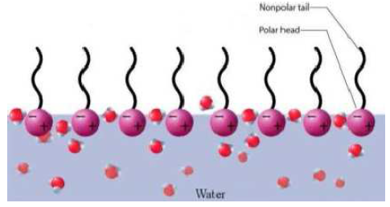
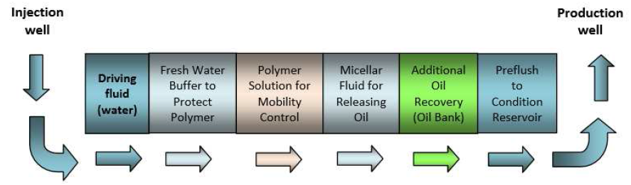
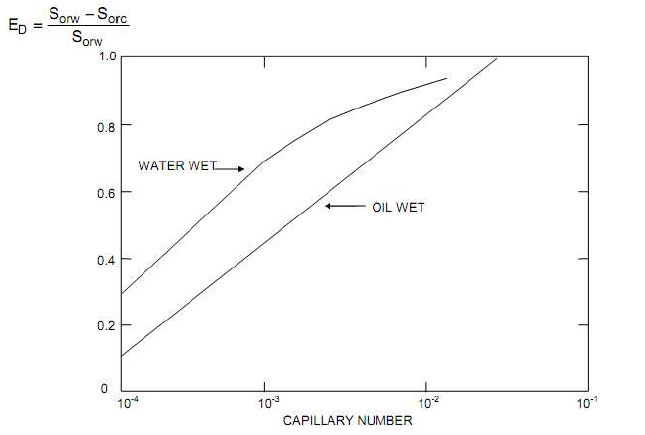
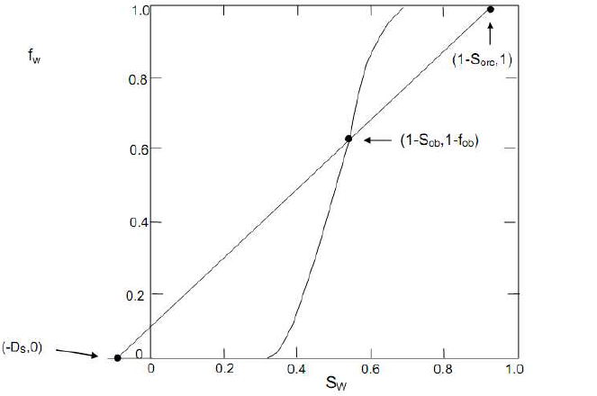
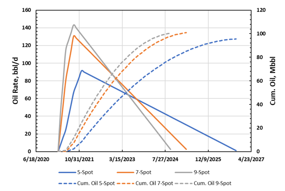

# Chemical Flood Predictive Model 

## Pendahuluan

Injeksi kimia (*chemical flooding*) merupakan bagian dari metode _Enhanced Oil Recovery_ (EOR)yang menggunakan injeksi larutan kimia yang akan bereaksi secara kimiawi (*chemical liquid*) di reservoir. Zat kimia yang umumnya digunakan adalah surfaktan, polimer, dan alkali. _Chemical flooding_ dapat dibedakan berdasarkan tipe zat kimia yang digunakan, diantaranya injeksi polimer, injeksi surfaktan, injeksi alkali (disebut juga _caustic flooding_), injeksi surfaktan-polimer (disebut juga _micellar flooding_), injeksi alkali-polimer (disebut juga _caustic-polymer flooding_), dan injeksi alkali-surfaktan-polimer (*ASP flooding*).

Laporan ini membahas mengenai penyusunan *chemical flood predictive model* untuk memprediksi performa reservoir di bawah pengaruh injeksi kimia. Tipe injeksi kimia yang ditinjau dalam model adalah injeksi surfaktan-polimer (*micellar-polymer* (MP) *flood*), injeksi alkali (*caustic flood*), dan injeksi alkali-polimer (*caustic-polymer flood*). Dalam *predictive model*, *chemical flood* diasumsikan terjadi setelah penerapan *waterflood*, sehingga *chemical flood* dipandang sebagai proses perolehan tersier.

Injeksi surfaktan-polimer (MP *flood*) ditentukan sebagai model _default_ dalam *predictive model*, dengan dua pilihan metode lainnya, yaitu *caustic flood *dan *caustic-polymer flood*, dimana perhitungan prediksi performa dari *caustic* dan *caustic-polymer flood* ditentukan berdasarkan performa dari MP *flood*, yaitu masing-masing sebesar 15% dan 40% dari nilai prediksi MP *flood* untuk parameter perolehan minyak.

Algoritma *predictive model* dibangun dari tinjauan teori dan studi simulasi. Terdapat sejumlah faktor yang pengaruhnya dianggap paling signifikan terhadap performa produksi MP *flood*. Faktor-faktor ini diantaranya adalah bilangan kapiler (*capillary number*), keheterogenan reservoir (*reservoir heterogeneity*), *crossflow*, adsorpsi surfaktan pada batuan formasi, dan *wettability*.

Teori *fractional flow* digunakan untuk melakukan analisis terhadap beberapa parameter performa *flooding*, seperti *oil breakthrough*, *surfactant breakthrough*, perolehan minyak (*oil recovery*), dan *project life*. Efisiensi perolehan minyak (*oil recovery efficiency*) ditentukan sebagai hasil kali antara *displacement efficiency* (*E~D~*), *vertical sweep efficiency* dari surfaktan (*E~V~*), dan *polymer sweep* atau *mobility buffer* *sweep efficiency* (*E~MB~*). Koreksi adanya *crossflow* terhadap nilai efisiensi perolehan minyak dilakukan melalui korelasi yang merupakan fungsi dari rasio $\frac{k_v}{k_h}$.
 
*Displacement efficiency* ditentukan dari korelasi yang merupakan fungsi dari bilangan kapiler, sedangkan *vertical sweep efficiency* dihitung menggunakan korelasi yang diperoleh dari studi simulasi. Korelasi ini merupakan fungsi dari ukuran injeksi *slug* surfaktan, adsorpsi surfaktan pada batuan formasi, dan keheterogenan reservoir. *Polymer sweep* juga ditentukan berdasarkan korelasi dari hasil simulasi. Korelasi yang dibangun merupakan fungsi dari ukuran *slug* injeksi polimer dan *vertical sweep efficienc*y.

Efek keheterogenan reservoir terhadap kecepatan *front* surfaktan dan *oil bank* disertakan dalam model melalui korelasi yang merupakan fungsi dari koefisien variasi permeabilitas Dykstra-Parsons, (*V~DP~*).

Sebelum membahas mengenai algoritma *predictive model*, akan terlebih dahulu dibahas mengenai sifat fisis dan mekanisme dari surfaktan dan alkali.

## Tinjauan Sifat Fisis dan Mekanisme Kerja Dari Surfaktan dan Alkali

### Sifat Fisis dan Mekanisme Kerja Surfaktan

Surfaktan merupakan senyawa aktif penurun tegangan permukaan (*surface active agent*) yang mempunyai struktur bipolar. Bagian kepala bersifat hidrolifik dan bagian ekor bersifat hidrofobik menyebabkan surfaktan cenderung memposisikan dirinya di permukaan atau bidang batas antar fasa yang berbeda polaritasnya seperti minyak dan air. Kegunaan surfaktan antara lain untuk menurunkan tegangan permukaan, tegangan antarmuka, meningkatkan kestabilan partikel yang terdispersi dan mengontrol jenis formasi emulsi, misalnya _oil in water_ (O/W) atau _water in oil_ (W/O). Di samping itu, surfaktan akan terserap ke dalam permukaan partikel minyak atau air sebagai penghalang yang akan mengurangi atau menghambat penggabungan (*coalescence*) dari partikel yang terdispersi (Rieger, 1985).

(\#fig:unnamed-chunk-2)Molekul Surfaktan

 &nbsp; 

Berdasarkan gugus hidrofiliknya, molekul surfaktan dibedakan ke dalam 4 kelompok (Rieger, 1985; Rosen, 2004), yaitu:

a. Surfaktan anionik  
Surfaktan anionik adalah molekul yang bermuatan negatif pada gugus hidrofilik atau aktif permukaan (*surface-active*), seperti gugus sulfat atau sulfonat.
 &nbsp; 

b. Surfaktan kationik  
Surfaktan kationik H adalah senyawa yang bermuatan positif pada gugus hidrofiliknya atau bagian aktif permukaan, seperti _quarternery ammonium salt_ (QUAT).
 &nbsp; 

c. Surfaktan non-ionik 
Surfaktan non-ionik adalah surfaktan yang tidak bermuatan atau tidak terjadi ionisasi molekul. Sifat hidrofilik disebabkan karena keberadaan gugus oksigen eter atau hidroksil.
 &nbsp; 

d. Surfaktan amfoterik 
Surfaktan amfoterik adalah surfaktan yang bermuatan positif dan negatif pada molekulnya, dimana muatannya bergantung kepada pH. Pada pH rendah akan bermuatan negatif dan pada pH tinggi akan bermuatan positif. (Mathenson, 1996; Rosen, 2004).
 &nbsp; 

Dalam aplikasinya, keempat jenis surfaktan tersebut memiliki fungsi yang spesifik dan kondisi lingkungan kerja yang spesifik. Surfaktan anionik sangat baik digunakan untuk stimulasi batuan _sandstone._ Adanya unsur silika di dalam batuan _sandstone_ yang bermuatan negatif akan menyebabkan _water wet_ pada formasi batuan _sandstone._ Kondisi ini akan menyebabkan turunnya gaya adhesi antara minyak dan batuan sehingga minyak akan lepas dan lebih mudah mengalir dan sifat batuan akan berubah menjadi _water wet_. Sebaliknya pada batuan _limestone_ yang bermuatan positif, penggunaan surfaktan anionik akan menyebabkan batuan bersifat _oil wet_ (Allen and Robert, 1993).

Surfaktan kationik dengan muatan gugus hidrofiliknya yang positif akan merubah *wettability* batuan yang memiliki muatan positif menjadi _water wet_ seperti batuan karbonat dan akan merubah *wettability* batuan yang bermuatan negatif seperti batuan sandstone menjadi *oil* *wet.* Berbeda dengan surfaktan anionik dan kationik, surfaktan non-ionik yang tidak memiliki muatan pada gugus hidrofiliknya menyebabkannya *compatible* pada kedua jenis batuan. Surfaktan nonionik akan menyebabkan _water wet_ baik pada batuan karbonat maupun *sandstone.* Sedangkan penggunaan surfaktan amfoterik pada kedua jenis batuan tersebut tergantung pada pH larutan dimana surfaktan tersebut bekerja. Pada kondisi pH > 7 (basa), gugus hidrofilik surfaktan amfoterik akan bermuatan positif sehingga akan menyebabkan *water* *wet* pada batuan yang memiliki muatan positif (karbonat). Pada pH < 7 (asam), gugus hidrofilik surfaktan amfoterik akan bermuatan negatif sehingga akan menyebabkan *water* *wet* pada batuan yang memiliki muatan negatif (*sandstone*), sedangkan pada pH = 7, gugus hidrofilik surfaktan amfoterik tidak akan bermuatan. Namun pada aplikasi stimulasi surfaktan, surfaktan amfoterik digunakan terbatas sebagai pencegah korosi dan agen pembusa (Allen and Robert, 1993; Mulyadi, 2002).

Menurut Mathenson (1996), kelompok surfaktan yang penggunaannya dalam jumlah terbesar adalah surfaktan anionik. Karakteristiknya yang hidrofilik disebabkan karena adanya gugus ionik yang cukup besar, yang biasanya berupa grup sulfat atau sulfonat. Beberapa contoh surfaktan anionik, yaitu *linear alkilbenzen sulfonat* (LAS), *alcohol sulfat* (AS), *alcohol eter sulfat* (AES), *alfa olefin sulfonat* (AOS), paraffin (*secondary alkane sulfonate*, SAS), dan *metil ester sulfonat* (MES).

Mekanisme surfaktan dalam proses *Enhanced Oil Recovery* adalah dengan cara menurunkan tegangan antarmuka, mengubah *wettability*, bersifat sebagai *emulsifier*, menurunkan viskositas dan menstabilkan dispersi sehingga memudahkan proses produksi. Untuk mendorong minyak yang terjebak dalam pori batuan, maka gaya kapilaritas dalam pori-pori harus diturunkan dengan cara menurunkan nilai IFT (*Interfacial Tension*) dan menurunkan saturasi minyak. Surfaktan yang berada di dalam *slug* harus dibuat agar membentuk *micelle*, yaitu surfaktan yang aktif dan mampu mengikat air dan minyak pada konsentrasi tertentu. Jika konsentrasinya masih kecil,maka campuran surfaktan tersebut masih berupa monomer (belum aktif). Untuk itu, setiap _slug_ perlu diketahui *critical micelles concentration* (CMC), yaitu nilai konsentrasi tertentu dimana surfaktan yang semula monomer berubah menjadi *micelles*. Hal yang penting dalam proses penggunaan surfaktan untuk menghasilkan *recovery* minyak yang tinggi adalah (Pithapurwala, et al, 1986): 

- Memiliki IFT yang sangat rendah (minimal 10^-3^ dyne/cm) antara _chemical bank_ dan _residual oil_; dan antara _chemical bank_ dan _drive fluid_.
- Memiliki kecocokan dengan air formasi dan kestabilan terhadap temperatur.
- Memiliki _mobility control_.
- Kelayakan ekonomis proses.

Proses injeksi surfaktan perlu memperhatikan besar bilangan kapiler terhadap penurunan saturasi minyak tersisa (*S~or~*). Biasanya reservoir yang diinjeksi surfaktan memiliki harga saturasi minyak tersisa di bawah 45% dengan nilai bilangan kapiler berkisar 10^-4^ - 10^-2^, sehingga pendesakan surfaktan optimal. Semakin rendah saturasi minyak tersisa pada suatu reservoir, maka semakin besar bilangan kapiler yang dibutuhkan agar pendesakan surfaktan optimal (Lake, 1989). Untuk memperbesar bilangan kapiler diperlukan tegangan antarmuka yang rendah. Hubungan antara bilangan kapiler dengan tegangan antar muka adalah sebagai berikut.
$$N_{cap}=\mu \frac{\nu}{\sigma}...(1)$$
dimana N~c~ adalah bilangan kapiler, $\mu$ adalah viskositas fluida pendesak (cP), $\nu$ adalah laju injeksi fluida pendesak, dan $\sigma$ adalah tegangan antarmuka (dyne/cm).

Penurunan nilai tegangan antarmuka dapat dilakukan dengan menambahkan surfaktan. Surfaktan yang baik adalah mampu menurunkan nilai tegangan permukaan hingga _ultra low_ IFT, yaitu lebih rendah dari 10^-2^ dyne/cm, karena pada kondisi tersebut maka bilangan kapiler akan semakin tinggi sehingga _recovery factor_ (RF) juga makin meningkat

### Sifat Fisis dan Mekanisme Kerja Alkali

*Alkaline flooding* (atau *caustic flooding*) merupakan salah satu metode *Enhanced Oil Recovery* (EOR) dimana dilakukan injeksi air dengan penambahan agen alkali pH tinggi (basa). Alkali memiliki kesamaan fungsi dengan injeksi surfaktan, namun memiliki _cost_ yang lebih rendah dalam aplikasi penggunaannya.

Tingginya pH dicirikan dengan tingginya konsentrasi anion hidroksida (OH-). Jenis *chemical* yang biasanya digunakan adalah Natrium Hidroksida (NaOH), Sodium Orthosilicate (NaSiO~6~), dan Natrium Carbonate (Na~2~CO~3~).

Dengan menginjeksikan alkali, diharapkan terjadi penurunan tegangan permukaan (IFT), gejala emulsi, dan perubahan *wettability*. Berdasarkan jenis chemical yang digunakan, maka *alkaline flooding* akan bekerja optimum bila digunakan pada viskositas fluida sedang, fluida dengan API *gravity* rendah, dan karakteristik oil yang *naphtenic*.

Tipe material alkali yang sering digunakan pada proyek-proyek EOR adalah _sodium hydroxide_ dan _sodium othosilicate_. Bahan lain yang ditelah diteliti diantaranya juga _sodium carbonate_, _ammonium hydroxide_, _polyphosphate_, dan _hydroxyl amine_.

*Alkaline flooding* memperbaiki *recovery* dari *acidic oils* dengan dua tahap proses (Castor, 1979). Tahap pertama melibatkan mobilisasi dari *residual oil* dengan perubahan konfigurasi seperti emulsifikasi dan *wettability alteration*. *Surface-active salt* dibentuk secara *in situ* dengan melibatkan reaksi asam-basa antara alkali dan *organic acids* di dalam *residual oil*. Surfaktan yang terbentuk memiliki sifat-sifat berikut:

1. Mengadsorbsi pada _oil-water interface_ ke interfacial tension yang lebih rendah. Pada beberapa kasus hal tersebut menyebabkan _spontaneous emulsification_ dan _phase swelling_.
2. Bereaksi atau _adsorb_ pada permukaan batuan, merubah karaketeristik _wettability_ batuan, dan konfigurasi dari _residual ganglia crude oil_ (Castor, 1979).

Tahap kedua melibatkan modifikasi dari karakteristik produksi makroskopik dari fasa minyak yang bergerak. Efisiensi _recovery_ minyak secara keseluruhan dapat meningkat pada tahap ini dengan peningkatan _displacement efficiency_ melalui _mobility control_.

Johnson (1976) me-*review* mekanisme dimana _alkaline flooding_ dapat meningkatan perolehan minyak yang bersifat _acidic_ dari reservoir terdeplesi parsial:

1. Emulsifikasi dan _entrainment_  
Pada mekanisme ini (pertama dipublikasikan oleh Subkow, 1942), Subkow menyebutkan bahwa konsentrasi alkali dan pH harus dapat membuat emulsi _oil-in-water_ yang stabil terbentuk pada proses emulsifikasi dan *entrainment*. 
 &nbsp; 

2. Emulsifikasi dan _entrapment_  
Pada proses ini, minyak yang teremulsi kembali terjebak di dalam porous medium pada _pore throats_ yang terlalu kecil bagi _droplet_ emulsi untuk masuk mendorong air yang diinjeksi kedalam pori yang sebelumnya belum tersapu. Hasil dari penurunan pada _mobility_ dari fasa _aqueous_ dengan peningkatan _displacement efficiency_ dan penurunan jumlah _viscous fingering_ (Jennings, et.al., 1974).
 &nbsp; 

3. Perubahan _wettability_ dari _water-wet_ ke _oil-wet_  
_Wettability_ berubah karena reaksi antara _caustic_ dan _acidic polar compounds_ yang menempel pada batuan reservoir _oil-wet_. Perubahan _wettability_ ini menghasilkan peningkatan pada _oil/water relative permeability ratio_ dan peningkatan pada _displacement efficiency_.
 &nbsp; 

4. Perubahan _wettability_ dari _oil-wet_ ke _water-wet_  
Cooke et al. (1974) merekomendasikan mekanisme ini dimana alterasi dari _wettability_ dari _water-wet_ ke _oil-wet_ menyebabkan fasa kontinu _non-wetting residual oil_ menyebar ke fasa _wetting_ kontinu. Secara simultan, _interfacial tension_ yang rendah mempengaruhi formasi dari emulsi _alkali-in-oil_ yang menyumbat jalur aliran dan juga mempengaruhi _pressure gradient_ yang tinggi disekitarnya. _Pressure gradient_ yang tinggi ini mengatasi gaya kapiler yang sudah menurun dan kemudian dapat menurunkan _residual oil saturation_.
 &nbsp; 

5.Tambahan beberapa mekanisme diantaranya adalah penurunan _interfacial tension_ dan _solubilization interfacial films_. 
 &nbsp; 

Selain itu, Johnson juga mendiskusikan variasi dan kombinasi 4 dasar mekanisme:

a. _Cyclic emulsification_ dan _entrapment process_ (Sarem 1974).
b. _Alternate emulsification-entrapment_ dan _emulsification entrainment process_ (Wade dan Lechtenberg, 1978).
c. _Concurrent entrainment_ dan _entrapment seteleh emulsification_, _wettability alteration_, dan _chromatographic wettability reversal_ (Radke dan Somerton, 1977, 1978; Castor et al., 1978).

## Mekanisme Proses Injeksi Kimia

Skema injeksi surfaktan-polimer dapat dilihat pada gambar berikut.

(\#fig:unnamed-chunk-3)Skema injeksi _micellar-polymer_

 &nbsp; 

Secara garis besar, injeksi surfakta-polimer terdiri dari:

- __Chase water__, digunakan sebagai pendorong fluida injeksi dari sumur injeksi ke sumur produksi
- __Polimer *slug*__, penggunaan polimer dalam injeksi surfaktan berfungsi sebagai _mobility buffer_,yaitu sebagai pengontrol mobilitas surfaktan dalam rangka effisiensi penyapuan dan melindungi surfaktan dari fluida pendorong. _Mobility buffer_ biasanya berupa campuran dari 250 – 2500 gr/cm^3^ polimer, 0 - 1% alkohol, _stabilizers_ dan _biocide_, dimana volumenya berkisar antara 1 – 100% dari volume pori injeksi (V~pf~).
- __*Micellar* (Surfaktan) *slug*__, berupa surfaktan dan tambahan _oil recovering agent_ yang berupa alkohol (0 - 5%), cosurfactan (0 - 5%), minyak, dan polimer. Volume larutan berkisar antara 5 – 20% V~pf~.
- __Preflush__, merupakan larutan pembuka yang berupa air garam (Na^+^, Ca^2+^) yang berfungsi untuk menurunkan salinitas air formasi, sehingga memungkinkan terjadinya percampuran antara air formasi dengan surfaktan yang diinjeksikan. Volume dari _preflush_ berkisar antara 0 – 100% V~pf~.

Larutan surfaktan yang diinjeksikan ke dalam reservoir akan bersinggungan dengan permukaaan gelembung minyak, surfaktan bekerja sebagai zat aktif permukaan untuk menurunkan tegangan permukaan minyak-air.

_Slug_ polimer yang diinjeksikan diantara _slug fresh water_ adalah untuk mengurangi kontak langsung dengan air reservoir yang mengandung garam. Air garam menurunkan viskositas polimer. Jadi injeksi polimer tidak menurunkan saturasi minyak sisa, tetapi memperbaiki perolehan minyak yang lebih dari injeksi air denan menaikkan volume reservoir yang berhubungan.

## Asumsi dan Batasan Dalam _Predictive Model_

Beberapa asumsi dan batasan dalam _predictive model_ yang dibangun diantaranya adalah sebagai berikut:

1. _Predictive model_ dibangun hanya untuk litologi _sandstone_.
2. _Micellar-polymer_ (MP) flood diasumsikan dilakukan setelah _waterflood_.
3. Temperatur formasi maksimum dibatasi sebesar 230°F, dan salinitas air formasi maksimum dibatasi sebesar 80000 ppm TDS.
4. _Target oil_ dari MP _flood_ adalah _residual oil_ di zona yang sebelumnya telah disapu oleh air saat _waterflood_. Fraksi _target oil_ yang dapat diproduksikan didefinisikan sebagai efisiensi perolehan (*overall recovery efficiency* (*E~R~*)). *E~R~* dinyatakan sebagai fungsi dari bilangan kapiler, _vertical sweep efficiency_, dan _mobility buffer efficiency_.
5. _Areal sweep_ dari MP _flood_ diasumsikan sama dengan _areal sweep_ dari _waterflood_ yang telah dilakukan sebelumnya.
6. Dalam algoritma _predictive model_, adsorpsi surfaktan ditinjau, namun adsorpsi polimer diabaikan.
7. _Displacement efficiency_ dari MP _flood_ merupakan fungsi dari bilangan kapiler, dimana bilangan kapiler merupakan fungsi dari permeabilitas, _depth_, dan _well spacing_.
8. _Interfacial tension_ antara _micellar_-minyak dianggap konstan pada nilai 10^-3^ dyne/cm.
9. _Predictive model_ berlaku untuk pola _five-spot_, _seven-spot_, dan _nine-spot_.
10. Laju injeksi diasumsikan konstan sepanjang periode _flooding_.
11. Dalam menghitung _injectivity_, viskositas surfaktan diasumsikan sama dengan viskositas minyak.
12. Profil produksi minyak dari MP _flood_ untuk reservoir heterogen diasumsikan berbentuk segitiga. Luas daerah di bawah kurva produksi minyak, yang merupakan kumulatif produksi minyak, digunakan untuk mengestimasi nilai _peak oil rate_.
13. _Breakthrough_ minyak dan surfaktan dihitung dari teori _fractional flow_.
14. Laju produksi minyak maksimum diasumsikan terjadi saat periode _surfactant breakthrough_.
15. Tidak terjadi perubahan kecepatan pada _surfactant front_ saat _polymer front_ mendahului _surfactant front_.
16. Dalam menghitung _vertical sweep efficiency_, diasumsikan beberapa hal berikut:
    + Saturasi minyak _movable_ di reservoir terdistribusi secara _uniform_.
    + Adanya _lag_ dari _surfactant front_ yang disebabkan oleh adsorpsi surfaktan terjadi secara _uniform_ sepanjang reservoir.
    + Dispersi dari _slug_ surfaktan diabaikan.
    + Nilai _mobility ratio_ di setiap _front bank_ di reservoir adalah satu.
    + Di zona yang telah tersapu oleh surfaktan, nilai saturasi minyak berkurang menjadi suatu nilai konstan yang bersesuaian dengan kurva _capillary desaturation_.

## Konsep dan Algoritma yang Digunakan Dalam _Predictive Model_

### Perhitungan _Target Oil_

_Target oil_ dari MP _flood_ adalah _residual oil_ yang berada di zona yang telah tersapu oleh air pada proses _waterflood_ yang telah diterapkan sebelum MP _flood._ Maksud dari pernyataan ini adalah _areal_ _sweep_ _efficiency_ dari MP _flood_ dianggap sama dengan _areal_ _sweep_ _efficiency_ pada _waterflood_ (_areal_ _sweep_ _efficiency_ tidak berubah). Karena _target_ _oil_ hanya berada di zona sapuan sebelumnya, maka minyak yang berada di luar zona sapuan tidak dianggap sebagai _target_ _oil._ Nilai _target_ _oil_ dinyatakan oleh persamaan berikut.
$$TO = \left[ \frac{S_{orw}}{S_{oi}-S_{orw}} \right] \left[N_p-OOIP \left( 1- \frac{B_{oi}}{B_{of}}\right) \right] \left[ 1-f_{bw}-f_{gc} \right]...(2)$$
dimana:  
$f_{bw}$ = zona reservoir _unswept_ di atas _bottom water_  
$f_{gc}$ = zona reservoir _unswept_ di bawah _gas cap_

Maka, _floodable pore volume_ dinyatakan oleh persamaan berikut.
$$V_p = TO \left( \frac{B_{of}}{S_{orw}}\right)...(3)$$
Jika nilai _TO_ tidak dapat diperoleh dari persamaan (2) karena terdapat parameter yang nilainya tidak diketahui, maka nilai _TO_ dapat diapproksimasi menggunakan persamaan (3) dengan nilai *V~p~* diasumsikan sama dengan $A\phi h$.

## Laju Alir dan Bilangan Kapiler

Persamaan laju alir dan bilangan kapiler diturunkan dari persamaan aliran _steady-state_ Muskat, dimana Muskat mendefinisikan _injectivity coefficient_, *C~p~*, sebagai:
$$\frac{C_pD}{\mu_o} \equiv \frac{\Delta P}{\mu}...(4) $$
Persamaan laju alir (dalam satuan bbl/day) adalah:
$$q = \frac{0.003541C_pkhD}{\mu_o \left[ 5.58+ \frac{1}{2}\ln A\right]}...(5)$$
dimana _A_ adalah luas daerah untuk setiap pola injeksi. 
Dari definisi bilangan kapiler,
$$N_{cap}=u \frac{\mu}{\sigma}...(6)$$
Laju alir fluida (dalam satuan ft/day) untuk pola _5-spot_ dinyatakan oleh Parsons sebagai:
$$u = \frac{0.000055C_pkD}{\mu_o \sqrt A \left[ 5.58+ \frac{1}{2}\ln A\right]}...(7)$$
Dengan mengasumsikan $\mu$ ≅ $\mu_o$ dan $\sigma$ = 10^-3^ dyne/cm pada persamaan (6), maka substitusi persamaan (6) ke persamaan (7) memberikan persamaan bilangan kapiler berikut.
$$N_{cap} = \frac{(1.9 \times 10^{-7})C_pkD}{\sqrt A \left() 5.58+ \frac{1}{2}\ln A\right)}...(8)$$
Dapat dilihat pada persamaan (5) dan (8) bahwa nilai laju alir dan bilangan kapiler sangat dipengaruhi oleh parameter _injectivity coefficient_, *C~p~*.

### _Surfactant Retention_ Pada Batuan _Sandstone_

Mekanisme _surfactant retention_ ditinjau hanya disebabkan oleh adsorpsi pada _clay_ yang terdapat di dalam _sandstone_, sehingga besarnya _surfactant retention_ dipengaruhi oleh fraksi berat _clay_. _Surfactant retention_ dinyatakan dalam satuan _pore volume_ injeksi surfaktan _slug_ adalah:
$$D_s = \left(\frac{1-\phi}{\phi} \right) \left( \frac{\rho_sa_s}{\rho_sC_s}\right)\frac {1}{1000}...(9)$$
dimana:  
$a_s$ = _surfactant retention_ dalam satuan mg surfaktan/g batuan  
$C_s$ = fraksi volume surfaktan di dalam _slug_ 

Nilai _surfactant retention_, $a_s$, umumnya diperoleh melalui eksperimen di laboratorium. Jika tidak terdapat data laboratorium, maka $a_s$ dapat diestimasi dari korelasi antara adsorpsi surfaktan pada _sandstone_ dengan total fraksi _clay_ dalam _sandstone_ seperti diperlihatkan pada grafik berikut.

(\#fig:unnamed-chunk-4)Korelasi grafik antara adsorpsi surfaktan dengan total fraksi berat _clay_ dalam _sandstone_

 &nbsp; 

Selain melalui korelasi grafik di atas, persamaan berikut, yang menyatakan _surfactant retention_ sebagai fungsi dari fraksi berat _clay_, juga dapat digunakan untuk mengestimasi nilai $a_s$ jika nilai fraksi berat _clay_ diketahui.
$$a_s = 3.3 \times wt.fr.clay ... (10)$$
Jika fraksi berat _clay_ juga tidak diketahui, maka nilai $a_s$ = 0.4 _mg/g_ dapat digunakan sebagai nilai _default_ untuk _surfactant retention_.

### Perhitungan _Oil Recovery_

Efisiensi perolehan minyak (*oil recovery efficiency*) tanpa menyertakan pengaruh *crossflow* dinyatakan oleh persamaan berikut.
$$E_r^0=E_DE_VE_{MB}...(11)$$
dimana _E~D~_ menyatakan _displacement efficiency_, _E~V~_ menyatakan _vertical sweep efficiency_, dan _E~MB~_ menyatakan _mobility buffer_ (polimer) _sweep efficiency_.

_Displacement efficiency_ didefinisikan sebagai berikut.
$$E_D = \frac{(S_{orw})-(S_{orc}}{(S_{orw}}...(12)$$
dimana: 
$S_{orc}$ = nilai saturasi minyak di zona sapuan _micellar slug_.

_Displacement efficiency_ merupakan fungsi dari bilangan kapiler yang terhubung melalui kurva _capillary desaturation_. Terdapat tiga cara untuk menentukan nilai _displacement efficiency_.

a. Tentukan nilai bilangan kapiler, _N~cap~_, dari persamaan (8), kemudian gunakan kurva _capillary desaturation_ yang khusus dibangun untuk reservoir target.
b. Nilai _displacement efficiency_ diperoleh secara langsung dari hasil analisis _core_ di laboratorium dengan nilai $\frac{V_{ps}}{D_s}$ yang tinggi.
c. Nilai bilangan kapiler ditentukan dari persamaan (8), kemudian digunakan kurva _capillary desaturation_ untuk _Berea_ _rock_ yang dibangun oleh Gupta-Trushenski. Gambar berikut memperlihatkan kurva ini.

(\#fig:unnamed-chunk-5)Kurva _capillary desaturation_ untuk Berea _rock_ yang disusun oleh Gupta dan Trushenki

 &nbsp; 

Pengaruh _wettability_ terhadap _displacement efficiency_ diwakili oleh rasio antara nilai _end-point_ permeabilitas relatif air terhadap minyak, yaitu:
$$R = \frac{k_{rw}^0}{k_{ro}^0}...(13)$$
Nilai R = 0.2 menandakan sistem _water wet_, sedangkan nilai R = 10 menandakan sistem _oil wet_.

_Vertical sweep efficiency_ dinyatakan sebagai fungsi dari keheterogenan reservoir, yang diwakili oleh koefisien variasi permeabilitas Dykstra-Parsons (*V~DP~*) dan rasio $\frac{V_{ps}}{D_s}$, _Vertical sweep efficiency_ secara matematis dinyatakan oleh persamaan berikut.
$$E_V = C_m + \frac{V_{ps}}{D_s}(1-F_m)...(14)$$
dimana $\frac{V_{ps}}{D_s}$ adalah _dimensionless surfactant slug size_, yaitu rasio antara nilai _pore volume slug_ injeksi surfaktan yang sebenarnya (*V~PS~*) terhadap nilai _pore volume surfactant retention_ (*D~S~*).

Pada persamaan (14), _C~M~_ dan _F~M~_ menyatakan _storage capacity_ dan _flow capacity_ dari lapisan M, yaitu lapisan dimana polimer _front_ mendahului _surfaktan front_. Nilai _F~M~_ dihitung menggunakan persamaan berikut.

Jika $\frac{V_{ps}}{D_s} \leq EFF,$
$$F_M = \frac{\left( \frac{EFF}{\frac{V_{ps}}{D_s}}\right)^{0.5}-EFF}{1-EFF}...(15)$$
Jika $\frac{V_{ps}}{D_s} > EFF,$
$$F_M = 1...(16)$$
Sedangkan nilai *C~M~* dihitung menggunakan persamaan berikut.
$$C_M = \frac{1}{EFF \left( \frac{1}F_M-1{}\right)+1}...(17)$$
Parameter EFF menyatakan _effective mobility ratio_, yang dihitung sebagai fungsi dari koefisien variasi permeabilitas Dykstra-Parsons (*V~DP~*).
$$EFF = 10^{ \left( \frac{V_{DP}}{(1-V_{DP})^{0.2}} \right)}...(18)$$
Untuk lapisan 1-D homogen, $F_M = C_M = 0$, dan $E_V = 1$.

_Mobility buffer sweep efficiency_ (*E~MB~*) didefinisikan sebagai rasio antara volume produksi minyak terhadap volume minyak mobile di reservoir. *E~MB~* merupakan fungsi dari _pore volume_ injeksi polimer (*V~MB~*), koefisien variasi permeabilitas Dykstra-Parsons (*V~DP~*), dan rasio $\frac{V_{ps}}{D_s}$. _Mobility buffer sweep efficiency_ dinyatakan oleh persamaan berikut.
$$E_{MB}=(1-E_{MBo}) \left[ 1-exp \left( \frac{- \alpha V_{MB} }{E_V^{\beta}} \right) \right]+E_{MBo}...(19)$$
dimana:
$$E_{MBo} = E_{MB|V_{MB}=0}...(20)$$
Nilai dan korelasi mengenai parameter-parameter $\alpha$, $\beta$, dan _E~MBo~_ diperoleh dari hasil studi simulasi. Hasil simulasi memberikan nilai-nilai berikut sebagai nilai yang sesuai untuk digunakan pada persamaan (19).
$$\alpha = 0.4$$
$$\beta = 1.2$$
$$E_{MBo} = 0.71 - 0.6V_{DP}...(21)$$
Maka, perolehan volume minyak target dinyatakan oleh persamaan berikut.
$$N_{TO} = E_R^0(TO)...(22)$$

### Karakteristik Produksi Minyak dan Koreksi Terhadap _Crossflow_

Berdasarkan teori _fractional flow_, _micellar-polymer flood_ akan membentuk _oil bank_ di reservoir dengan nilai saturasi minyak *S~ob~* dan fraksi aliran minyak *f~ob~*. Di belakang _oil bank_ adalah _surfactant bank_, dimana _surfactant front_ bergerak dengan kecepatan yang dinyatakan oleh:
$$v_s = \frac{1}{1+D_s-S_{orc}}...(23)$$
Kecepatan _surfactant front_, persamaan (23), dapat pula dinyatakan dalam bentuk lain, yaitu menggunakan nilai saturasi minyak dan fraksi aliran minyak di _oil bank_, *S~ob~* dan *f~ob~*.
$$v_s=\frac{f_{ob}}{S_{ob}-S_{orc}}=\frac{1-f_{wb}}{1-S_{wb}-S_{orc}}...(24)$$
Nilai *S~wb~* dan *f~wb~* diperoleh dari analisis kurva _fractional flow_. Tinjau kurva _fractional flow_ air dan minyak, dimana selain kurva _fractional flow_, terdapat pula garis lurus yang berawal di titik (*f~w~* = 0, *S~w~* = -*D~s~*) dan berakhir di titik (*f~w~* = 1, *S~w~* = 1 - *S~orc~*). Garis lurus ini akan berpotongan dengan kurva _fractional flow_ di titik (*S~wb~*,*f~wb~*). Gambar di halaman selanjutnya memperlihatkan penjelasan 

Maka, nilai saturasi air dan fraksi aliran air _di oil bank_,*S~wb~* dan *f~wb~* diperoleh dengan menentukan titik potong garis lurus terhadap kurva _fractional flow_. Setelah kedua nilai parameter ini diperoleh, maka kecepatan _surfactant front_ yang dinyatakan oleh persamaan (24) dapat dihitung. Selanjutnya, kecepatan front _oil bank_ dihitung menggunakan persamaan berikut.
$$v_{ob} = \frac{f_{ob}-f_{oi}}{S_{ob}-S_{oi}}...(25)$$
dimana untuk perolehan tersier, *S~oi~* = *S~or~* dan *f~oi~* = 0.

(\#fig:unnamed-chunk-6)Kurva _fractional flow_ air, titik potong antara kurva _fractional flow_ dengan garis lurus memberikan nilai (*S~wb~*,*f~wb~*)

 &nbsp; 

Dari persamaan kecepatan _surfactant front_ dan _oil bank front_, _dimensionless breakthrough time_ untuk _oil bank_ (*t~Dob~*) dan _surfactant bank_ (*t~Ds~*) untuk reservoir homogen dinyatakan oleh persamaan berikut.
$$t_{Dob}=\frac{1}{v_{ob}}...(26)$$
$$t_{Ds}=\frac{1}{v_{s}}...(27)$$
Untuk reservoir homogen, fungsi produksi _dimensionless_ dinyatakan sebagai berikut.

 Untuk $t_{D} \leq t_{Dob},\ oil\ cut = f_{oi}$ 

 Untuk $t_{Dob} \leq t_{D} \leq t_{Ds},\ oil\ cut = f_{oc}$ 
 

 Untuk $t_{D} > t_{Ds},\ oil\ cut = 0$ 

Gambar berikut memperlihatkan kurva _oil cut_ terhadap waktu _dimensionless_, *t~D~*.

(\#fig:unnamed-chunk-7)_Oil cut_ vs. waktu _dimensionless_ untuk reservoir homogen

 &nbsp; 

Penjelasan karakteristik produksi di atas berlaku untuk reservoir homogen. Untuk reservoir heterogen, penjelasan karakteristik produksi dilakukan menggunakan koreksi terhadap parameter-parameter produksi homogen yang telah dijelaskan sebelumnya. Koreksi dilakukan terhadap faktor _layering_. Untuk melakukan hal ini, profil produksi minyak diasumsikan berbentuk segitiga, yang dikarakterisasi oleh empat parameter berikut: _oil breakthrough time_ (*t~ob~*), _surfactant breakthrough time_ (*t~s~*), _peak oil rate_ (*q~opk~*), dan _time of zero rate_ (*t~sw~*).

(\#fig:unnamed-chunk-8)Profil produksi minyak (diasumsikan berbentuk segitiga) untuk reservoir heterogen

 &nbsp; 

Analisis terhadap keempat parameter di atas akan dimulai dengan mendefinisikan parameter _dimensionles_s-nya. Waktu _breakthrough_ minyak _dimensionless_ (*t~Dob~*) dan waktu _breakthrough_ surfaktan _dimensionless_ (*t~Ds~*) dinyatakan oleh dua persamaan berikut.
$$t_{Dob}=\frac{1}{(v_{ob})(EFF)}...(28)$$
$$t_{Ds}=\frac{1}{(v_{s})(EFF)}...(29)$$
Nilai fraksi aliran minyak tertinggi (*peak oil fractional flow*) dinyatakan oleh:
$$f_{opk}=(f_{ob})(f_{fprim})...(30)$$
dengan
$$f_{fprim}=\frac{(EFF)(CFPRIM)}{[(EFF)(CFPRIM)]+1-CFPRIM}...(31)$$
$$CFPRIM=\frac{\left[\frac{1}{\left(\frac{v_{s}}{v_{ob}}\right)}\right]^{0.5}-1}{EFF-1}...(32)$$
Waktu *dimensionless* saat laju alir minyak nol (*time of zero oil rate dimensionless*), *t~Dsw~*, dinyatakan oleh persamaan berikut.
$$t_{Dsw}=t_{Dob}+ \frac{2(E_R^0)(S_{orw})}{f_{opk}}...(33)$$
Pembahasan di atas memberikan nilai dari parameter-parameter dimensionless pada kurva laju produksi minyak, yaitu waktu _dimensionless oil breakthrough_ (*t~Dob~*), waktu _dimensionless_ surfaktan _breakthrough_ (*t~Ds~*), dan waktu _dimensionless zero oil rate_ (*t~Dsw~*). Parameter-parameter _dimensionless_ ini selanjutnya akan dikonversi ke dalam nilai sebenarnya.

Untuk mengkonversi parameter _dimensionless_ ke dalam nilai sebenarnya, dibutuhkan informasi mengenai laju alir fluida di reservoir. Nilai laju alir fluida reservoir pada kondisi aliran _steady-state_ dinyatakan oleh persamaan (5), yaitu:
$$q=\frac{0.003541C_pkhD}{\mu_o \left[ 5.58+ \frac{1}{2}\ln A\right]}$$
Setelah nilai laju alir fluida di reservoir diketahui, parameter-parameter _dimensionless_ pada persamaan (28), (29), dan (33) dapat dikonversi ke dalam nilai sebenarnya melalui persamaan-persamaan berikut.
$$t_{ob}=t_{Dob} \frac{(V_p)_{pat}}{q}...(34)$$
$$t_{s}=t_{Ds} \frac{(V_p)_{pat}}{q}...(35)$$
$$t_{sw}=t_{Dsw} \frac{(V_p)_{pat}}{q}...(36)$$
dimana:  
$(V_p)_{pat}$ = _pattern floodable pore volume_

Laju alir minyak tertinggi (*peak oil rate*) terjadi saat waktu surfaktan _breakthrough_ (*t~s~*). Nilai *peak oil rate* dinyatakan oleh:
$$q_{opk} =q \frac{f_{opk}}{B_{of}}...(37)$$
Setelah nilai dari parameter-parameter kurva laju produksi minyak diketahui, volume produksi minyak dan produksi air untuk setiap periode dapat dihitung. Perhitungan volume produksi fluida dibedakan dalam tiga interval waktu, yaitu (1) produksi sebelum _oil breakthrough_ (*t* < *t~ob~*) dan setelah _zero oil rate_ (*t* > *t~sw~*), (2) produksi saat *t~ob~* ≤ *t* < *t~s~*, dan (3) produksi saat *t~s~* < *t* ≤ *t~sw~*.

Selama periode *t~ob~* ≤ *t* < *t~s~*, nilai _oil cut_ akan terus naik secara linier karena semakin banyak lapisan yang memproduksikan minyak. Hal ini terjadi sampai tercapainya _peak oil rate_, yaitu saat *t* = *t~s~*. Untuk periode *t~s~* < *t* ≤ *t~sw~*, _oil cut_ akan terus menurun secara linier karena semakin banyak lapisan yang memproduksi surfaktan atau polimer. Kecepatan surfaktan _front_ diasumsikan tidak berubah selama mengalir di reservoir, juga saat _polimer front_ mendahului surfaktan _front_ di lapisan dengan nilai permeabilitas yang rendah.

Laju produksi minyak dan air untuk setiap periode dan setiap _time step i_ adalah sebagai berikut. Untuk periode waktu pertama, yaitu *t* < *t~ob~* dan *t* > *t~sw~*:
$$q_o=0...(38)$$
$$q_w=q...(39)$$
Untuk periode waktu kedua, yaitu *t~ob~* ≤ *t* < *t~s~*:
$$q_o(i)=q_{opk} \left( \frac{t(i)-t_{ob}}{t_s-t_{ob}} \right)...(40)$$
$$q_w(i)=\frac{q-[q_o(i)B_{of}]}{B_{wf}}...(41)$$
Untuk periode waktu kedua, yaitu *t~s~* < *t* ≤ *t~sw~*:
$$q_o(i)=q_{opk} \left( \frac{t_{sw}-t(i)}{t_{sw}-t_s} \right)...(42)$$
$$q_w(i)=\frac{q-[q_o(i)B_{of}]}{B_{wf}}...(43)$$
Saat *t(i)* = *t~s~*, *q~o~(i)* = *q~opk~*.

Selanjutnya, nilai _overall oil recovery efficiency_ ($E_R^0$) akan dikoreksi terhadap efek _crossflow_. Koreksi terhadap nilai $E_R^0$ memberikan nilai _corrected overall oil recovery efficiency_ ($E_R^C$) seperti dinyatakan dalam persamaan berikut.
$$E_R^C= 0.04 \log (RL) + 0.064+E_R^0...(44)$$
$$RL = \sqrt \frac{k_v}{k_h} \left( \frac{XLIP}{h_{pay}} \right)...(45)$$
$$XLIP = 0.7071 \sqrt {43560(A_{pat})}...(46)$$
dimana:  
$APAT$ = _pattern area_  
$h_{pay}$ = reservoir _net pay_  
$RL$ = bilangan _crossflow dimensionless_.

Rasio antara _corrected overall oil recovery_ dengan _overall oil recovery_ dinyatakan oleh parameter _crossflow performance factor_ (*f~CF~*), yang didefinisikan oleh persamaan berikut.
$$f_{CF} = \frac{E_R^C}{E_R^0}...(47)$$

### Karakteristik Injeksi Kimia

Terdapat dua zat kimia yang digunakan dalam _micellar-polymer flooding_, yaitu surfaktan dan polimer. Volume injeksi _slug_ surfaktan per pola injeksi adalah:
$$BSL = (V_p)_{pat}V_{PS}...(48)$$
dimana *V~PS~* adalah _slug size_ surfaktan injeksi. Adapun lama injeksi surfaktan dinyatakan oleh:
$$t_{surf} = \frac{\left( \frac{BSL}{q} \right)}{365}...(49)$$
Di lain pihak, volume injeksi polimer dinyatakan sebagai fungsi dari _mobility ratio_  dan _wettability_  dimana _wettability_ dinyatakan dalam bentuk rasio permeabilitas relatif _end-point_, $R=\frac{k_{rw}^0}{k_{ro}^0}$. Konsentrasi polimer awal dalam _slug_ polimer injeksi dinyatakan oleh persamaan berikut.
$$C_{poly}=111 \left( \frac{\mu_o}{\mu_w} \right)+B ...(50)$$
dimana:  
Untuk _R_ $\leq$ 0.1,
$$B = 338...(51)$$
Untuk 0.1 < _R_ < 10,
$$B = 338 + \left[ (R-0.1) \left( \frac{1032}{9.9} \right)\right]...(52)$$
Untuk _R_ $\geq$ 10,
$$B = 1370 ...(53)$$
Volume injksi _slug_
 polimer per pola injeksi dinyatakan oleh persamaan berikut.
 $$BMB = (V_p)_{pat}V_{MB}...(54)$$
 Sedangkan lama periode injeksi polimer dinyatakan oleh:
 $$t_{MB}= \frac{\left( \frac{BMB}{q} \right)}{365}...(55)$$
 
### Modifikasi _Predictive Model_ Untuk _Caustic_ dan _Caustic-Polymer Flood_
 
Selain _micellar-polymer_, pada predictive model yang dibangun terdapat juga pilihan tipe injeksi kimia lainnya, yaitu _caustic flood_, _caustic-polymer flood_, dan _advanced caustic flood_ (_surfactant flood_). Untuk tiga tipe pilihan injeksi kimia ini, model melakukan modifikasi terhadap beberapa nilai parameter yang digunakan dalam algoritma _micellar-polymer flood_. Tabel berikut merangkum modifikasi yang dilakukan.

(\#fig:unnamed-chunk-9)Modifikasi nilai sejumlah parameter MP _flood_ untuk kasus _caustic_ dan _caustic-polymer flood_

 &nbsp; 

## Persamaan-Persamaan Dasar dan Nilai _Default_ yang Digunakan Dalam Model

### Viskositas Minyak

Viskositas minyak, $\mu_o$, dihitung menggunakan korelasi Beggs-Robinson. Korelasi terlebih dahulu menghitung nilai viskositas _dead oil_, $\mu_{od}$.
$$\mu_{od}=10^x-1...(56)$$
dengan
$$X=\frac{Y}{T^{1.163}}$$
$$Y = 10^Z$$
$$Z= 3.0324-0.02023(API)$$
dimana:  
_T_ = temperatur reservoir, $^\circ$F  
_API_ = _gravity_ minyak, $^\circ$API.  
Selanjutnya viskositas _live oil_ dihitung dengan persamaan berikut.
$$\mu_o = A (\mu_{od})^B...(57)$$
dengan
$$A=\frac{10.715}{(R_s+100)^{0.515}}$$
$$B=\frac{5.44}{(R_s+150)^{0.338}}$$

### _Solution Gas-Oil Ratio_

_Solution gas-oil ratio_, *R~s~*, dihitung menggunakan korelasi Vasquez-Beggs. Korelasi terlebih dahulu melakukan koreksi terhadap nilai _specific gas gravity_, $\gamma_g$, ke dalam kondisi tekanan dan temperatur _separator_. _Separator_ diasumsikan berada pada tekanan 100 psig dan temperatur reservoir, *T*.
$$\gamma_{g.100}=\gamma_g = \left[ 1+5.912(10^{-5})(API)(T) \log \left( \frac{64.7}{114.7} \right) \right]...(58)$$
dimana nilai _corrected specific gas gravity_ berada pada interval 0.8 $\leq \gamma_{g.100} \leq$ 1.4.

Selanjutnya _solution gas-oil ratio_ dihitung sebagai berikut.  
Untuk $API \leq$ 30:
$$R_s = 0.0362 \gamma_{g.100}P_{form}^{1.0937}exp \left[ 25.724 \left( \frac{API}{T+460} \right) \right]...(59)$$
Untuk $API$ > 30:
$$R_s = 0.0178 \gamma_{g.100}P_{form}^{1.187}exp \left[ 23.931 \left( \frac{API}{T+460} \right) \right]...(60)$$

### Faktor Volume Formasi Minyak 

Faktor volume formasi minyak, *B~o~*, dihitung menggunakan korelasi Vasquez-Beggs.
$$B_o = 1 + C_1R-s + (C_2 + C_3R_s)(T-60) \left( \frac{API}{\gamma_{g.100}} \right)...(61)$$
dimana:  
Untuk $API \leq$ 30:
$$C_1 = 4.677 (10^{-4})$$
$$C_2 = 1.751 (10^{-5})$$
$$C_3 = -1.811 (10^{-8})$$
Untuk $API$ > 30:
$$C_1 = 4.67 (10^{-4})$$
$$C_2 = 1.1 (10^{-5})$$
$$C_3 = 1.337 (10^{-9})$$

### Permeabilitas Relatif dan Fraksi Aliran Air

Nilai permeabilitas relatif minyak (*k~ro~*) dan air (*k~rw~*), _fractional flow of water (f~w~)_ dan turunannya $\left( \frac{\partial f_w}{\partial S_w} \right)$ dihitung dengan korelasi Corey.
$$u_o = \frac{S_{w}-S_{orw}}{1-S_{wc}-S_{orw}}...(62)$$
$$k_{ro}=X_{k_{roe}}u_o^{X_{no}}...(63)$$
$$u_w = \frac{S_{w}-S_{wc}}{1-S_{wc}-S_{orw}}...(64)$$
$$k_{rw}=X_{k_{rwe}}u_w^{X_{nw}}...(65)$$
Nilai fraksi aliran air dan turunannya dihitung menggunakan persamaan berikut:
$$f_w = \frac{1}{M_{wo}}...(66)$$
$$\left( \frac{\partial f_w}{\partial S_w} \right) = f_w^2 \frac{\left( \frac{\mu_w}{\mu_o} \right)}{\left( \frac{k_{rw}}{k_{rw}UKR} \right)}...(67)$$
dengan:
$$M_{wo} = \frac{k_{ro}}{k_{rw}}\left( \frac{\mu_w}{\mu_o} \right)...(68)$$
$$UKR = (k_{ro}D_{k_{rw}})-(k_{rw}D_{k_{ro}})...(69)$$
$$D_{k_{rw}}= \frac{X_{nw}{k_{rw}}}{S_w - S_{wc}}...(70)$$
$$D_{k_{ro}}= \frac{-X_{no}{k_{ro}}}{1-S_w - S_{orw}}...(71)$$

### Nilai _Default_ yang Dignakan Dalam _Predictive Model_

Nilai _default_ dari sejumlah paramter yang digunakan dalam model dirangkum pada tabel berikut.

|Parameter   |Nilai _Default_ yang Digunakan   |
|:---:    |:---:    |
|Tekanan reservoir, $P_{form}$   |$P_{form}=15+0.433 (depth)$   |
|Temperatur reservoir, $T$   |$T=60+0.017(depth)$   |
|Temperatur reservoir maksimum, $T_{max}$   |$T_{max}=200$   |
|Salinitas air formasi, $S$   |$S=50000 ppm$ TDS   |
|Salinitas air formasi maksimum, $S_{max}$   |$S_{max}=100000 ppm$ TDS   |
|*Specific gravity gas*, $\gamma_g$   |$\gamma_g = 0.8$   |
|Koefisien variasi permeabilitas Dystra-Parsons, $V_{DP}$   |$V_{DP}=0.72$   |
|Faktor volume formasi minyak akhir, $B_{of}$   |$B_{of}=1$|
|Faktor volume formasi air akhir, $B_{wf}$   |Korelasi Keenan dan Keyes:   $B_w=1+1.2(10^{-4})(T-60)+1(10^{-6})(T-60)^2-3.33(10^{-6})P_{form}$|
|Viskositas air, $\mu_w$   |Korelasi Van Wingen:   $\mu_w = exp[1.003-1.479(10^{-2})T+1.982(10^{-5})T^2]$|
|*Connate water saturation*, $S_{wc}$   |$S_{wc}=0.3$   |
|Densitas batuan formasi, $\rho_{rock}$ |$\rho_{rock}=2.68g/ml$    |
|Densitas *slug* surfaktan, $\rho_{s}$ |$\rho_{s}=1g/ml$    |
|Ukuran *slug* surfaktan *dimensionless*, $\frac{V_{ps}}{D_s}$ |$\frac{V_{ps}}{D_s}=1.3$    |
|Konsentrasi surfaktan dalam *slug* injeksi, $C_s$ |$C_s=0.05$    |
|Saturasi minyak residu, $S_{orw}$  |Untuk tipe batuan _sandstone_, $S_{orw}=0.25$   Untuk tipe batuan karbonat, $S_{orw}=0.38$   |
|Permeabilitas relatif minyak saat $S_{wc}$, $X_{k_{roe}}$   |Untuk tipe batuan _sandstone_, $X_{k_{roe}}=0.8$   Untuk tipe batuan karbonat, $X_{k_{roe}}=0.4$   |
|Permeabilitas relatif air saat $S_{orw}$, $X_{k_{rwe}}$   |Untuk tipe batuan _sandstone_, $X_{k_{rwe}}=0.2$   Untuk tipe batuan karbonat, $X_{k_{rwe}}=0.3$  |
|Eksponen kurva permeabilitas relatif minyak, $X_{no}$|$X_{no}=2$|
|Eksponen kurva permeabilitas relatif air, $X_{nw}$|$X_{nw}=2$|
|*Pore volume* injeksi polimer, $V_{MB}$|Untuk MP *flood*, $V_{MB}=0.65$   Untuk *caustic flood*, $V_{MB}=0.001$   Untuk *caustic-polymer flood*, $V_{MB}=0.4$|
|Koefisien _injectivity_, $C_P$    |$C_P=0.3$ |

Table:  Tabel 4.1: Nilai _default_ yang digunakan dari sejumlah parameter dalam _predictive model_ 

## Penambahan Jenis _Pattern_ pada Injeksi Kimia

### Injeksi Kimia

Aplikasi dari EOR ini mulai banyak digunakan pada tahun 1980 dikarenakan tingginya harga minyak dan kemajuan teknologi yang membantu perkembangan dari metode ini. Injeksi chemical dapat menaikan _oil recovery_ dengan cara menurunkan _Interfacial Tension_ (IFT) diantara fluida imbibisi dan minyak atau peningkatan viskositas dari fluida injektan untuk meningkatkan mobilitas minyak. Selain itu, injeksi kimia menghasilkan perubahan _wettability_ batuan untuk meningkatkan permeabilitas minyak.

Metode injeksi kimia paling banyak digunakan adalah injeksi polimer, surfaktan, dan alkalin. Walaupun begitu, metode ini mempunya limitasi dimana pada injeksi polimer yang mempunyai mekanisme _recovery_ utama yaitu meningkatkan viskositas injektan, dapat mengalami _viscosity loss_ apabila adanya garam dan suhu yang tinggi pada reservoir. Surfaktan dan alkali pun dapat kehilangan efisiensinya pada saat injektan dialirkan ke media berpori dikarenakan fenomena adsorpsi. Maka dari itu diciptakan juga campuran dari alkali-surfaktan (AS), surfaktan-polimer (SP), alkalin-surfaktan (AP), dan juga alkalin-surfaktan-polimer (ASP) untuk dapat memperbaiki efisiensi pengaplikasian pada sumur minyak. Belakangan ini dikembangkan juga penggunaan _foam_ dan nano-teknologi untuk menunjang EOR.

(\#fig:unnamed-chunk-10)Klasfikasi teknologi injeksi kimia (Afeez dkk)

### Penentuan Pola Sumur Injeksi 

Salah satu cara untuk meningkatkan faktor perolehan minyak adalah dengan membuat pola sumur injeksi, yang mempunya tujuan untuk mencari pola penyapuan paling efisien dengan tetap mempertimbangkan sumur yang sudah ada untuk menekan biaya pengeluaran. Pertimbangan-pertimbangan dalam penentuan pola sumur injeksi sangat bergantung pada:

1. Tingkat keseragaman karakteristik formasi (vertikal maupun horizontal)
2. Struktur batuan reservoir meliputi patahan, kemiringan, dan ukuran
3. Lokasi sumur-sumur yang sudah ada
4. Topografi
5. Nilai ekonomi

Pada operasinya, sumur-sumur injeksi dan produksi umumnya dibentuk dalam suatu pola tertentu yang beraturan, seperti pola garis lurus, empat titik, lima titik, tujuh titik, dan sembilan titik seperti yang terlihat pada gambar berikut.

(\#fig:unnamed-chunk-11)Beberapa pola sumur injeksi (Latil dkk)

### Sejarah Injeksi Kimia

George dkk (1982) mengembangkan model prediktif dari injeksi kimia yang dapat meninjau nilai ekonomis dari _mycellar-polymer injection_. Persamaan yang dipakai dikembangakan dengan menggabungkan faktor-faktor yang mempengaruhi _oil recovery_ seperti _capillary number_, koefisien Dykstra-Parsons, permeabilitas vertikal dan horizontal, dan_ wettability_. Hasil yang didapat pada model prediktif dibandingkan dengan 4 data _pilot test_, didapat bahwa hanya 1 dari 4 yang mempunyai kemiripan hasil. Model prediktif yang dibuat cenderung menghasilkan nilai yang _optimistic_ untuk _oil breaktrough_ dan _peak rate_. 

Ray dkk (1982) membuat publikasi tentang deskripsi desain kriteria dan pengembangan model dan _database_ dari model prediktif injeksi mikroemulsi dan uap. Model prediktif injeksi kimia dikembangkan untuk reservoir bertipe _sandstone_, dimana laju alir minyak dan recovery factor dibuat menggunakan simulasi numerik dengan persamaan multi-komponen, multi-fasa, dan multi-dimensi. Data yang dimasukan harus mencangkup temperatur formasi, salinitas, kumultif produksi, saturasi air, saturasi minyak residual dan _pattern spacing_. Model ini dapat digunakan untuk melakukan pemilihan EOR paling optimum dengan melihat karakteristik reservoirnya ditinjau dari aspek ekonomi.

Mollaei dkk (2011) melakukan studi mengenai performa dan tingkah laku dari injeksi surfaktan-polimer (SP) menggunakan model prediktif analitik. Pembuatan model prediktif didasari 2 pendekatan, yaitu pendekatan secara _deterministic_ dan stokastik. Pada studi _deterministic_ performa injeksi surfaktan-polimer diprediksi menggunakan model prediktif, hasilnya didapatkanlah kandidat terbaik injeksi surfaktan-polimer berdasarkan karakteristik batuan dan fluida reservoir. Dan pada studi stokastik dilakukan _sensitivity analysis_ menggunakan metode Winding Stair. _Sensitivity analysis_ dapat membantu untuk mengidentifikasi faktor ketidakpastian yang paling penting pada injeksi surfaktan-polimer. Studi stokastik dapat mengurangi hasil output ketidakpastian pada injeksi kimia secara signifikan dengan mengurangi parameter input yang menyebabkan besarnya ketidakpastian.

### Derivasi Persamaan Model _Pattern_ Injeksi Kimia

Derivasi persamaan yang akan digunakan dalam membangun model _pattern_ 7-*spot* dan 9-*spot* pada injeksi kimia merupakan persamaan yang sama dengan yang digunakan dalam pengembangan model _pattern_ 5-*spot* dalam model DoE. Selanjutnya beberapa variabel yang berkaitan dengan perubahan pattern disesuaikan dengan persamaan yang dikembangkan oleh Muskat, M. (1937) & Deppe, J. (1961).

#### Derivasi 7-*Spot*

Variabel utama dalam derivasi persamaan 5-*spot* menjadi 7-*spot* adalah luas area (APAT), _fluid velocity_, _capillary number_ (CAP) dan juga variabel-variabel pendukung untuk mendapatkan nilai variabel utama.

(\#fig:unnamed-chunk-12)Model _pattern_ 7-_spot_

Luas area _pattern_, APAT, *inverted* 7-*spot* dapat dilihat pada persamaan di bawah ini
$$APAT = \frac{3 \sqrt 3}{2}a^2 = \frac{3 \sqrt 3}{2}d^2 ...(72)$$
di mana _d_ adalah jarak antara _injector_ dengan _producer_ dan a adalah jarak antar sumur produksi
$$d_{7spot} = \sqrt{\frac{2}{3 \sqrt 3}APAT}...(73)$$
$$\Delta p = CP \times DEPTH \times \mu/\mu_o...(74)$$
Laju alir pada sumur produksi _pattern_ 7-_spot_ apabila diturunkan dengan _field unit_ adalah
$$q_{7spot} = \frac{4 \pi kh \Delta p}{\mu \left(3 \ln\left(\frac{d_{7spot}}{r_w}\right)-1.7073\right)}...(75)$$
Dengan definisi _∆p_ dan $d_{7spot}$ di atas, dan _r~w~_ = 0.3 ft, maka laju alir sumur dalam _field unit_ adalah
$$q_{7spot} = \frac{0.014164 \times CP \times DEPTH \times PER \times h}{\mu_o(\ln (APAT^{1.5})+16.4953)}...(76)$$
Kecepatan fluida rata-rata di reservoir dengan _pattern inverted_ 7-*spot* dan _capillary number_, CAP, adalah:
$$u_{7spot} = \frac{c_{7spot} \times q_{7spot}}{ah}...(77)$$
$$u_{7spot} = \frac{c_{7spot} \times q_{7spot}}{\sqrt{\frac{2}{3 \sqrt 3}APAT}h}...(78)$$
$$CAP_{7spot} = \frac{u_{7spot} \times \mu_o}{\sigma}...(79)$$
Jika _interfacial tension_, σ = 0.001 dyne/cm, maka _capillary number_ didapat pada persamaan di bawah ini:
$$CAP_{7spot} = \frac{1.7766 \times 10^{-7}CP. Depth.k}{\sqrt {\frac{APAT}{3}}\left( 5.4984 + 0.5 \ln \left( \frac{APAT}{3} \right)\right)}...(80)$$

#### Derivasi 9-*Spot*

Pada derivasi 9-*spot* variabel utama dalam menderivasi persamaan dari 5-*spot* menjadi 9-*spot* adalah sama seperti pada derivasi 7-*spot*, dimana variabel tersebut adalah luas area (APAT), _fluid velocity_, _capillary number_ (CAP) dan juga variabel-variabel pendukung untuk mendapatkan nilai variabel utama.

(\#fig:unnamed-chunk-13)Model _pattern_ 9-_spot_

Luas area _pattern_, APAT, *inverted* 9-*spot* dapat dilihat pada persamaan di bawah ini
$$APAT = 4a^2 = 2d^2...(81)$$
di mana _d_ adalah jarak antara _injector_ dengan _producer_ dan _a_ adalah jarak antar sumur produksi
$$d_{9spot} = \sqrt {\frac{APAT}{2}}...(82)$$
$$\Delta p = CP \times DEPTH \times \mu/\mu_o...(83)$$
Laju alir pada sumur produksi pattern 9-*spot* apabila diturunkan dengan _field unit_ adalah 
$$q_{9spot} = \frac{0.014164 \Delta phk}{\mu \left(3 \log \left(\frac{d}{r_w}\right)-1.7073\right)}...(84)$$
Di mana $\Delta p_{i,c}$ adalah _pressure drop_ antara sumur injeksi dengan sumur produksi yang berada di sudut _pattern_ dan _R_ adalah rasio produksi antara sumur produksi sudut dengan sumur produksi sisi _pattern_. 

Dengan definisi _∆p_ dan $d_{9spot}$ di atas, _r~w~_ = 0.3 ft, dan _R_ = 0.0.75 maka laju alir sumur adalah
$$q_{9spot} = \frac{0.003541hk \Delta p_{i,c}}{\mu \frac{(R+1)}{(R+2)} \left(log \left( \frac{d}{r_w} \right)-0.272 \right)}...(85)$$
Kecepatan fluida rata-rata di reservoir dengan _pattern_ 9-*spot* dan _capillary number_, CAP, adalah
$$u_{9spot} = \frac{c_{9spot} \times q_{9spot}}{ah}...(86)$$
$$u_{9spot} = \frac{c_{9spot} \times q_{9spot}}{\sqrt {\frac{APAT}{2}}h}...(87)$$
$$CAP_{9spot} = \frac{u_{9spot} \times \mu_o}{\sigma}...(88)$$
Jika _interfacial tension_, σ = 0.001 dyne/cm, maka _capillary number_ didapat pada persamaan dibawah ini:
$$CAP_{7spot} = \frac{1.5704 \times 10^{-7}CP. Depth.k}{\sqrt {\frac{APAT}{4}}\left( 5.9264 + 0.5 \ln \left( \frac{APAT}{4} \right)\right)}...(89)$$

### Simulasi Sintetik Injeksi Kimia

Uji Simulasi Sintetik pada Injeksi kimia menggunakan salah satu _software_ komersial guna untuk membandingkan laju produksi minyak yang dihasilkan oleh model prediktif pada software PertaEOR-Lite.

(\#fig:unnamed-chunk-14)Perbandingan laju alir minyak hasil model prediktif PertaEOR-Lite dan simulator pada pola injeksi 7-_spot_ dan 9-_spot_

Gambar di atas menunjukan perbandingan laju produksi minyak yang dihasilkan oleh injeksi kimia 7-*spot* dan 9-*spot* pada simulasi dan model prediktif PertaEOR-Lite. *Peak-oil rate* yang dihasilkan pada model prediktif PertaEOR-Lite cenderung lebih pesimistis dibandingkan hasil simulasi dengan perbedaan sebesar 18 STB/d pada injeksi kimia 7-*spot* dan 15 STB/d pada injeksi kimia 9-*spot.* Laju alir minyak setelah *peak-oil rate* pun terlihat memiliki perbedaan yang signifikan dimana hasil model prediktif PertaEOR-Lite lebih optimistis dibandingkan hasil simulasi.

Hasil perbandingan laju alir minyak dan laju alir kumulatif minyak pada injeksi kimia 5-*spot*, 7-*spot*, dan 9-*spot* dapat dilihat pada gambar berikut. Injeksi kimia dengan 9-*spot* memiliki laju alir minyak paling tinggi dan injeksi kimia dengan 5-*spot* memiliki laju alir minyak paling rendah

(\#fig:unnamed-chunk-15)Perbandingan laju alir minyak dan laju alir kumulatif minyak hasil model prediktif PertaEOR-Lite pada pola injeksi 5-_spot_, 7-_spot_ dan 9-_spot_

