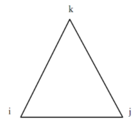
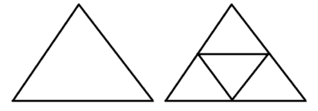

# Infill Drilling Predictive Model

## Pendahuluan

___Infill drilling___ adalah salah satu upaya yang dilakukan untuk menambah tingkat perolehan minyak dengan cara menambah jumlah sumur dalam pola injeksi terdahulu, sehingga terbentuk pola injeksi baru. Adanya sumur baru (disebut __sumur *infill*__) akan membuka daerah sapuan baru di reservoir, sehingga zona reservoir yang belum tersapu sebelumnya akan dapat tersentuh oleh fluida injeksi. Dengan adanya zona sapuan baru, minyak yang sebelumnya belum tersapu oleh fluida injeksi akan dapat tersapu sehingga dapat menambah tingkat perolehan minyak.

_Infill drilling predictive model_ disusun untuk memprediksi performa reservoir di bawah penerapan *infill drilling*. Model yang dibangun merupakan model tiga dimensi (*stratified*, *five-spot*) dan dua fasa (minyak dan air). Model menghitung perpindahan minyak dan air beserta perolehan minyak menggunakan pendekatan solusi *finite difference* di dalam *streamtube*. Pergerakan fluida di setiap _streamtube_ dianalisis menggunakan korelasi yang diperoleh dari studi simulasi. *Predictive model* yang dibangun merupakan gabungan dari model *streamtube* dengan simulasi numerik.

Beberapa peneliti telah mempelajari mekanisme *infill drilling*, diantaranya Driscoll (1974), Van Everdingen (1980), Holm (1980), Ghauri (1980), dan Barber (1983). Sejumlah studi mengenai *infill drilling* menunjukkan bahwa proses ini dapat bersaing dengan proses EOR (*Enhanced Oil Recovery*) sebagai metode penambahan perolehan minyak, terutama dalam kondisi harga minyak rendah. Selain memiliki potensi perolehan minyak yang sebanding dengan EOR, jumlah *cost* dan investasi yang lebih rendah dibandingkan dengan EOR menjadikan *infill drilling* pilihan yang lebih ekonomis dan cocok untuk digunakan pada kondisi harga minyak rendah.

Driscoll (1974) menjelaskan bahwa mekanisme *infill drilling* dalam menambah perolehan minyak adalah sebagai berikut.

1. Meningkatkan kekontinuan reservoir (*improving reservoir continuity*)
2. Meningkatkan *vertical sweep*
3. Meningkatkan *areal sweep*
4. Penyapuan minyak di daerah batas reservoir (disebut *wedge edge oil*)
5. Meningkatkan *economic limit*.

Peningkatan kekontinuan reservoir merupakan efek paling dominan yang berpengaruh terhadap performa produksi _infill drilling_. Barbe dan Schnoebelen (1986) mengkonfirmasi hal ini melalui studi yang mereka lakukan terhadap lapangan Robertson Clearfork di West Texas.

Peningkatan _vertical sweep_ dalam reservoir _multilayer_ biasanya dinyatakan sebagai fungsi dari koefisien variasi permeabilitas Dykstra-Parsons (V~DPs~). Penambahan sumur _infill_ memungkinkan untuk dilakukannya konversi sumur produksi menjadi sumur injeksi. Hal ini mengakibatkan terbentuknya _streamline_ baru yang akan menambah _vertical sweep_. _Crossflow_ antar lapisan reservoir sangat berperan terhadap peningkatan _vertical sweep_.

Peningkatan _areal sweep_ disebabkan oleh munculnya _streamline_ baru yang diakibatkan oleh adanya sumur _infill_. Peningkatan perolehan minyak akibat peningkatan _areal sweep_ bergantung pada faktor-faktor berikut: (1) derajat keheterogenan reservoir (_reservoir anisotropy_), (2) _water cut_ yang ditentukan sebagai _economic limit_, dan (3) _mobility ratio_ dari _waterflood_.

(\#fig:unnamed-chunk-2)Pembentukan _streamline_ baru akibat adanya sumur _infill_

 &nbsp; 

Minyak yang berada di zona batas reservoir (disebut *wedge edge oil*) dapat tersapu oleh fluida injeksi dengan mengecilnya *pattern size* akibat penambahan sumur *infill*. Peningkatan *economic limit* terjadi karena perubahan prosedur operasional akibat penambahan sumur *infill*. Sumur *infill* juga dapat mengurangi *water cut* sehingga *operational cost* berkurang.

Perhitungan peningkatan *reservoir continuity* akibat penerapan *infill drilling* dilakukan dengan dua metode, yaitu (1) berdasarkan peningkatan permeabilitas relatif, dan (2) berdasarkan penambahan lapisan reservoir.

## Asumsi yang Digunakan Dalam _Predictive Model_

Beberapa asumsi yang digunakan dalam infill drilling predictive model adalah sebagai berikut:

a. Fluida dan batuan dianggap bersifat *compressible*.
b. Bentuk *streamtube* tidak dipengaruhi oleh perubahan nilai *water cut*.
c. *Streamtube* tidak dipengaruhi oleh *mobility ratio*.
d. Terjadi *cross flow* antar lapisan di dalam setiap *streamtube*.
e. Sifat-sifat reservoir, seperti permeabilitas, porositas, dan _thickness_ dianggap homogen dalam satu lapisan.
f. Setiap lapisan bersifat *anisotropic*.

Beberapa fitur dari *predictive model* yang dibangun diantaranya adalah:

a. Perolehan minyak (*oil recovery*) dinyatakan sebagai fungsi dari *pore volume* injeksi air.
b. Nilai *areal sweep* dipengaruhi oleh bentuk *streamtube*.
c. Nilai *vertical sweep* dipengaruhi oleh perhitungan cross flow.
d. Bentuk *streamtube* merupakan fungsi dari rasio $\frac{k_y}{k_x}$ 
e. Efek perubahan konektivitas reservoir (*reservoir continuity*) dinyatakan dalam bentuk perubahan permeabilitas relatif terhadap perubahan jarak antar sumur akibat keberadaan sumur *infill*.

## Analisis _Streamtube_

Langkah pertama dalam penyusunan _infill drilling predictive model_ adalah menghitung geometri _streamtube_. Model dua dimensi dengan dua kondisi aliran, yaitu _steady state_ dan _pseudo-steady state_, digunakan untuk menghitung geometri _streamtube_. Solusi dari persamaan aliran diperoleh menggunakan metode _finite element_. Beberapa asumsi yang digunakan diantaranya adalah:

a. _Finite element_ yang digunakan berbentuk segitiga dimana untuk setiap elemen, tekanan diasumsikan mengikuti fungsi dasar linier.
b. Sifat aliran adalah sama di dalam satu elemen, namun dapat berbeda dari satu elemen ke elemen lainnya.
c. Dalam satu elemen, aliran diasumsikan terjadi secara _uniform_ dan _unidirectional_.
d. Faktor anisotropi disertakan di dalam model, yaitu _k~y~_ ≠ _k~x~_ 
e. Aliran dalam elemen terjadi dalam dua dimensi (*x, y*).
f. Aliran tidak dipengaruhi oleh gaya kapilaritas, gaya gravitasi, _miscibility_, perubahan fasa, atau efek permeabilitas relatif.
g. Persamaan aliran dinyatakan oleh hukum Darcy dan persamaan kontinuitas.

Persamaan aliran fluida dalam media berpori, yang dibangun dari hukum Darcy dan persamaan kontinuitas, merupakan persamaan diferensial parsial yang disebut sebagai persamaan difusivitas. Persamaan difusivitas dinyatakan sebagai berikut.
$$\nabla \left( \frac{kh}{\mu}\nabla P \right) = \phi ch \frac{\partial P}{\partial t}...(1)$$
dimana:  
$k$ = permeabilitas medium  
$\mu$ = viskositas fluida  
$P$ = tekanan  
$\phi$ = porositas  
$c$ = kompresibilitas  
$t$ = waktu.

Untuk aliran yang terjadi dalam dua dimensi, dengan permeabilitas, porositas, viskositas, kompresibilitas, dan _thickness_ dianggap konstan, persamaan (1) dapat dinyatakan sebagai: 
$$\nabla \left( \frac{kh}{\mu}\nabla P \right) = f...(2)$$
$$\frac{\partial}{\partial x} \left( \frac{kh}{\mu} \frac{\partial P}{\partial x} \right) + \frac{\partial}{\partial y} \left( \frac{kh}{\mu} \frac{\partial P}{\partial y} \right) = f...(3)$$
$$\frac{\partial}{\partial x} \left( K \frac{\partial P}{\partial x} \right) + \frac{\partial}{\partial y} \left( K \frac{\partial P}{\partial y} \right) = f...(4)$$
dimana:  
$f$ = sisi kanan persamaan (disebut _source term_)  
$K$ = konstanta = $\frac{kh}{\mu}$

Kondisi aliran _steady-state_ terjadi saat profil tekanan reservoir konstan, yaitu kondisi dimana terjadi keseimbangan antara injeksi dan produksi. Dalam kondisi _steady-state_, nilai _f_ = 0, sehingga bentuk persamaan difusivitas menjadi:
$$\nabla \left( \frac{kh}{\mu}\nabla P \right) = 0 ...(5)$$
$$\frac{\partial}{\partial x} \left( K \frac{\partial P}{\partial x} \right) + \frac{\partial}{\partial y} \left( K \frac{\partial P}{\partial y} \right) = 0...(6)$$
Persamaan (5) dan (6) merupakan persamaan Laplace.

Kondisi aliran _pseudo-steady state_ terjadi saat profil tekanan reservoir berubah secara linear terhadap waktu. Kondisi _pseudo-steady state_ menyatakan ketidakseimbangan antara injeksi dengan produksi. Dalam kondisi _pseudo-steady state_, _f_ = $\phi ch \frac{\partial P}{\partial t}$, sehingga bentuk persamaan difusivitas menjadi:
$$\nabla \left( \frac{kh}{\mu}\nabla P \right) = \phi ch \frac{\partial P}{\partial t} ...(7)$$
$$\frac{\partial}{\partial x} \left( K \frac{\partial P}{\partial x} \right) + \frac{\partial}{\partial y} \left( K \frac{\partial P}{\partial y} \right) = \phi ch \frac{\partial P}{\partial t}...(8)$$
Persamaan (7) dan (8) merupakan persamaan Poisson.

Solusi dari persamaan diferensial parsial dalam bentuk persamaan Laplace (persamaan (5) atau (6)) dan persamaan Poisson (persamaan (7) dan (8)) diperoleh menggunakan metode _finite element_. Solusi dari _finite element_ kemudian akan digunakan untuk menghitung geometri _streamtube_ yang akan digunakan dalam model.

_Finite element_ merupakan salah satu metode untuk mencari pendekatan solusi dari suatu persamaan diferensial parsial. _Finite element_ membagi suatu area (yang akan dicari solusinya) ke dalam sejumlah elemen, dimana setiap elemen terhubung melalui _node_. Terdapat beberapa bentuk elemen yang dapat dipilih, diantaranya bentuk segitiga, segi empat, dan lain-lain. Pada _predictive model_ yang dibangun, elemen yang digunakan adalah bentuk segitiga.

(\#fig:unnamed-chunk-3)Bentuk elemen yang digunakan dalam penerapan metode _finite element_

 &nbsp; 

Gambar (2) memperlihatkan bentuk elemen segitiga dengan *node* *i*, *j*, dan *k*. Pada setiap elemen, didefinisikan suatu fungsi dasar yang menghubungkan distribusi tekanan di dalam elemen dengan nilai tekanan di *node* *i*, *j*, dan *k*. Fungsi dasar yang digunakan pada model adalah fungsi linear.
$$P(X,Y) = \frac{1}{2\Delta}[(a_i+b_iX+c_iY)P_i+(a_j+b_jX+c_jY)P_j+(a_k+b_kX+c_kY)P_k]...(9)$$
$$\Delta = \frac{1}{2} det \left| \begin{array}{c} 1 & X_i & Y_i\\ 1 & X_j & Y_j\\ 1 & X_k & Y_k \end{array} \right|...(10)$$
dimana:  
$$a_i = X_kY_j - X_jY_k$$
$$b_i = Y_j-Y_k$$
$$c_i = X_j - X_k$$
$$a_j = X_iY_k - X_kY_i$$
$$b_j = Y_k-Y_i$$
$$c_j = X_k - X_i$$
$$a_k = X_jY_i - X_iY_j$$
$$b_k = Y_i-Y_j$$
$$c_k = X_i - X_j$$

Solusi dari persamaan (8) diperoleh dengan meminimalkan suatu fungsional, dengan asumsi *K* dan *f* bernilai konstan dalam satu elemen. Solusi tekanan pada elemen target ditentukan dengan menjumlahkan pengaruh tekanan dari setiap _node_ untuk setiap elemen yang bersentuhan dengan _node_ elemen target. Dengan melakukan hal ini, sejumlah persamaan linier akan diperoleh.
$$[A][P]=[Q]...(11)$$
dimana:  
[*A*] = matriks $N \times N$, dengan *N* adalah jumlah _node_  
[*Q*] = matriks $1 \times N$, yang menyatakan laju alir (*rate*) di setiap _node_  
[*P*] = matriks $1 \times N$, menyatakan tekanan yang nilainya akan dicari.

Matriks *A* ditentukan dari sub-matriks $S^e$ untuk setiap elemen. Matriks $S^e$ dipengaruhi oleh geometri elemen dan konstanta aliran *K* untuk elemen *e*.
$$S_{ij}^e = \frac{K^e}{4\Delta^e}(X_{jk}Y_{ki}+Y_{jk}X_{ki})...(12)$$
dimana:  
$K^e$ = konstanta aliran = $\frac{kh}{\mu}$  
$\Delta$ = luas daerah elemen  
$X_{jk}$ = $X_j - X_k$  
$Y_{ki}$ = $Y_k - Y_i$  
$Y_{jk}$ = $Y_j - Y_k$  
$Y_{ki}$ = $Y_k - Y_i$

Matriks *A* didefinisikan sebagai berikut.
$$A_{ij} = \sum S_{ij}^e...(13)$$
Dimana untuk *i* = *j*, banyaknya elemen yang akan dijumlahkan adalah banyaknya elemen yang terhubung dengan _node i_, sedangkan untuk *i* ≠ *j*, banyaknya elemen yang akan dijumlahkan bergantung pada banyaknya elemen yang serupa diantara dua _node_.

Matriks *Q*, yang menyatakan laju alir di setiap _node_, terdiri atas dua bagian, yaitu bagian _source_ dan bagian _generation_. Bentuk umum dari matriks *Q* untuk _node i_ adalah:
$$Q_i = q_i + \sum \frac{1}{3}f^e \Delta^e...(14)$$
Penjumlahan dilakukan terhadap setiap elemen yang mengandung _node i_.
dimana:  
$q_i$ = bagian _source_  
$f^e$ = bagian generation  
$\Delta^e$ = luas daerah elemen.

Dengan diketahuinya matriks *A* dan *Q*, maka solusi dari persamaan aliran dapat diperoleh dengan mencari nilai matriks *P* pada persamaan (11). Metode yang digunakan untuk mencari solusi persamaan linier pada persamaan (11) adalah metode *successive over-relaxation* (SOR). Metode SOR menghitung nilai tekanan di *node i* (*P~i~*) dari persamaan yang menghubungkannya dengan nilai-nilai tekanan yang diketahui. Kekonvergenan akan diperoleh jika perubahan tekanan di setiap *node* selama iterasi berada pada interval 1 hingga 2 kali nilai perubahan tekanan yang memberikan hubungan garis lurus. Prosedur iterasi dilakukan hingga dicapai jumlah iterasi maksimum yang ditentukan atau hingga nilai toleransi tertentu dicapai.

Setelah nilai tekanan di setiap *node* diperoleh, maka tekanan di setiap titik dalam elemen dapat diperoleh menggunakan persamaan (9). Nilai tekanan di *node* (disebut *nodal pressure*) akan menentukan arah dan besar aliran dalam setiap elemen.

Metode *finite element* diterapkan dengan terlebih dahulu menggunakan ukuran elemen yang besar, kemudian solusi tekanan di setiap *node* dicari. Selanjutnya, ukuran elemen dapat diperkecil dengan membagi elemen yang besar ini. Pembagian elemen dilakukan dengan menempatkan *node* yang baru di titik tengah antara dua *node*. Dengan melakukan ini untuk setiap pasangan *node*, maka satu elemen besar akan terbagi menjadi empat elemen yang lebih kecil. Solusi tekanan di elemen yang lebih kecil ini kemudian dicari. Pembagian elemen kemudian terus dilakukan sesuai dengan derajat akurasi solusi yang ingin dicapai.

(\#fig:unnamed-chunk-4)Pembagian _node_ besar menjadi _node_ yang lebih kecil dalam _finite element_

 &nbsp; 

Solusi nilai tekanan yang diperoleh dari metode *finite element* dapat digunakan untuk membuat peta isobar, yaitu garis-garis yang menyatakan nilai tekanan yang sama dalam satu elemen yang menghubungkan *node* pertama (disebut *source*) dengan *node* kedua (disebut *sink*). Selanjutnya, *streamline* dapat ditentukan berdasarkan peta isobar ini. Fungsi flux vektor yang menghubungkan _source_ dengan _sink_ akan digunakan untuk membuat garis flux aliran (*streamline*) di setiap elemen.

*Streamtube* dapat didefinisikan sebagai suatu area yang membatasi beberapa *streamline* yang dimulai dari source tertentu dan diakhiri di *sink* tertentu, dimana pada area ini terjadi aliran fluida. *Streamtube* dibangun dengan melakukan integral garis (*line integral)* terhadap fluks vektor aliran sepanjang isobar tertentu. Lebar dan rapat *streamtube* ditentukan oleh seberapa detail fenomena aliran ingin dijelaskan.

Selanjutnya, faktor laju alir sumur perlu disertakan ke dalam model *finite element*. Untuk mendapatkan nilai laju alir pada kondisi aliran *steady-state* dilakukan simulasi melalui model *black-oil*. Faktor anisotropi jelas berperan dalam laju alir sumur, sehingga simulasi *black-oil* menyertakan faktor anisotropi dalam bentuk *permeability ratio* $\left( \frac{k_y}{k_x} \right)$. Hasil simulasi akan digunakan untuk membangun korelasi antara laju alir sumur dengan *permeability ratio*. Korelasi semacam ini telah disertakan di dalam *program* *code*.

*Grid* kartesian digunakan untuk menkarakterisasi geometri *streamtube*. Untuk mempercepat diperolehnya solusi dari *finite element*, posisi dari elemen segitiga yang digunakan dalam *finite element* perlu disesuaikan dengan bentuk *grid* kartesian. Elemen segitiga diposisikan sedemikian rupa sehingga posisi *node* berada di titik sudut atau di titik tengah *grid* kartesian. Solusi *finite element* dalam *grid* kartesian dinyatakan dalam bentuk komponen x dan y dari fluks aliran untuk _grid_ tersebut. Geometri *streamtube* dapat diprediksi dengan menjumlahkan setiap fluks aliran di setiap *grid* (integral) untuk satu _streamline_ yang dipilih.

Setelah geometri *streamtube* diketahui, langkah selanjutnya adalah membangun *grid finite difference* di setiap *streamtube* atau membangun *grid finite difference* di dalam _grid_ kartesian. Jumlah *grid finite difference* yang digunakan dalam setiap *streamtube* bergantung pada derajat akurasi yang diinginkan pada hasil perhitungan. *Grid finite difference* ditentukan sedemikian rupa sehingga setiap *grid* memiliki ukuran yang sama. Hal ini dilakukan untuk mempercepat perhitungan.

Perpindahan minyak dan air di setiap _streamtube_ dihitung menggunakan simulator, dimana performa produksi dan injeksi dari setiap sumur dihitung dengan menjumlahkan performa dari setiap _streamtube_. Performa _streamtube_ individu diperoleh dari solusi _finite difference_ terhadap persamaan aliran fluida.

Untuk menghitung performa reservoir, ujung sisi produksi dari setiap _streamtube_ dinyatakan berada pada tekanan konstan, sedikit di bawah tekanan reservoir. Sedangkan ujung sisi injeksi dari setiap _streamtube_ dinyatakan berada pada laju injeksi konstan.

Model _finite difference_ yang dibangun adalah model dua dimensi (untuk menyertakan faktor _crossflow_ antar lapisan) dan dua fasa, dimana fasa fluida yang ditinjau adalah fasa minyak dan fasa air. Persamaan aliran fluida di dalam _streamtube_ dapat diturunkan dari hukum kekekalan massa, hukum Darcy, dan hubungan termodinamika. Beberapa asumsi berikut digunakan dalam penurunan persamaan aliran:

a. Fluida diasumsikan bersifat _slightly compressible_.
b. Aliran fluida di reservoir terjadi secara isotermal, _immiscible_, dan mengikuti hukum Darcy.
c. Densitas fluida di _stock tank_ bernilai konstan.
d. Perubahan porositas batuan terhadap tekanan mengikuti persamaan berikut:
$$\phi = \phi_{original}[1+C_r(P-P_{original})]...(15)$$

Berdasarkan hukum kekekalan massa,
$$[total\ massa\ yang\ mengalir\ dalam\ grid] = [perubahan\ massa\ dalam\ grid] \\ - [massa\ yang\ terproduksi]...(16)$$
Penerapan hukum Darcy dan hukum termodinamika bersamaan dengan hukum kekekalan massa (persamaan (16)) memberikan persamaan aliran fluida di reservoir untuk minyak dan air.

Persamaan aliran minyak:
$\left[\frac{\partial}{\partial x} \left( \frac{q_{oR}}{B_o} \right)\delta x + \frac{\partial}{\partial y} \left( \frac{q_{oR}}{B_o} \right)\delta y + \frac{\partial}{\partial z} \left( \frac{q_{oR}}{B_o} \right)\delta z\right] + \left[ \begin{array}{c} laju\\ produksi\\ minyak \end{array}\right] \\ + \left[\left( \frac{S_oV_bC_r \phi_{original}}{B_o} + S_oV_b\phi \frac{\partial}{\partial B_o} \left( \frac{1}{B_o} \right)\right) \frac{\partial P_o}{\partial t} \right] = \frac{V_b \phi}{B_o} \frac{\partial S_o}{\partial t}...(17)$
Persamaan aliran air:
$\left[\frac{\partial}{\partial x} \left( \frac{q_{wR}}{B_w} \right)\delta x + \frac{\partial}{\partial y} \left( \frac{q_{wR}}{B_w} \right)\delta y + \frac{\partial}{\partial z} \left( \frac{q_{wR}}{B_w} \right)\delta z\right] + \left[ \begin{array}{c} laju\\ produksi\\ air \end{array}\right] \\ + \left[\left( \frac{S_wV_bC_r \phi_{original}}{B_w} + S_wV_b\phi \frac{\partial}{\partial B_w} \left( \frac{1}{B_w} \right)\right) \frac{\partial P_w}{\partial t} \right] = \frac{V_b \phi}{B_w} \frac{\partial S_w}{\partial t}...(18)$

Metode _finite difference_ diterapkan sebagai pendekatan solusi untuk persamaan (17) dan (18). Hal ini diterapkan untuk setiap _streamtube_ mengacu pada _grid finite difference_ seperti yang telah dibahas sebelumnya. Pendekatan finite difference terhadap persamaan (17) dan (18) memberikan persamaan berikut.

Persamaan aliran minyak:
$$\frac{1}{\Delta t} \left[ \left( \frac{S_oV_p}{B_o} \right)^{n+1} - \left( \frac{S_oV_p}{B_o} \right)^n \right] \\ = A_{oe}[P_e^{n+1} - P_c^{n+1} + \gamma_{oe}^n(Z_e-Z_c)] + A_{ow}[P_w^{n+1} - P_c^{n+1} + \gamma_{ow}^n(Z_w-Z_c)] \\ + [P_t^{n+1} - P_c^{n+1} + \gamma_{ot}^n(Z_t-Z_c)] + [P_b^{n+1} - P_c^{n+1} + \gamma_{ob}^n(Z_b-Z_c)]...(19)$$
dengan:
$$V_p^n = \Delta X \Delta Y h\phi_{original} [1-C_r(P_{ref}-P_c^n)]...(20)$$
$$\gamma_{oe}^n = \frac{\rho_o(P_e)^n+\rho_o(P_c)^n}{288} ...(21)$$
$$\gamma_{ow}^n = \frac{\rho_o(P_w)^n+\rho_o(P_c)^n}{288} ...(22)$$
$$\gamma_{ot}^n = \frac{\rho_o(P_t)^n+\rho_o(P_c)^n}{288} ...(23)$$
$$\gamma_{ob}^n = \frac{\rho_o(P_b)^n+\rho_o(P_c)^n}{288} ...(24)$$
$$A_{oe} = \frac{4T_{ec}k_{ro}^u(S_o^n)}{[B_o(P_e^n)+B_o(P_c^n)][\mu_o(P_e^n)+\mu_o(P_c^n)]}...(25)$$
$$A_{ow} = \frac{4T_{wc}k_{ro}^u(S_o^n)}{[B_o(P_w^n)+B_o(P_c^n)][\mu_o(P_w^n)+\mu_o(P_c^n)]}...(26)$$
$$A_{ot} = \frac{4T_{tc}k_{ro}^u(S_o^n)}{[B_o(P_t^n)+B_o(P_c^n)][\mu_o(P_t^n)+\mu_o(P_c^n)]}...(27)$$
$$A_{ob} = \frac{4T_{bc}k_{ro}^u(S_o^n)}{[B_o(P_b^n)+B_o(P_c^n)][\mu_o(P_b^n)+\mu_o(P_c^n)]}...(28)$$
$$T_{ec} = \frac{0.01266\Delta Y_ch_eh_ck_{xc}k_{xe}}{\Delta X_ch_ek_{xe} + \Delta X_eh_ck_{xc}} ...(29)$$
$$T_{wc} = \frac{0.01266\Delta Y_ch_wh_ck_{xc}k_{xw}}{\Delta X_ch_wk_{xw} + \Delta X_wh_ck_{xc}} ...(30)$$
$$T_{tc} = \frac{0.01266\Delta Y_ch_th_ck_{xc}k_{xt}}{\Delta X_ch_tk_{xt} + \Delta X_th_ck_{xc}} ...(31)$$
$$T_{bc} = \frac{0.01266\Delta Y_ch_bh_ck_{xc}k_{xb}}{\Delta X_ch_bk_{xb} + \Delta X_bh_ck_{xc}} ...(32)$$

Persamaan aliran air:  
$$\frac{1}{\Delta t} \left[ \left( \frac{S_wV_p}{B_w} \right)^{n+1} - \left( \frac{S_wV_p}{B_w} \right)^n \right] \\ = A_{we}[P_e^{n+1} - P_c^{n+1} + \gamma_{we}^n(Z_e-Z_c)] + A_{ww}[P_w^{n+1} - P_c^{n+1} + \gamma_{ww}^n(Z_w-Z_c)] \\ + [P_t^{n+1} - P_c^{n+1} + \gamma_{wt}^n(Z_t-Z_c)] + [P_b^{n+1} - P_c^{n+1} + \gamma_{wb}^n(Z_b-Z_c)]...(33)$$
dengan:
$$\gamma_{we}^n = \frac{\rho_w(P_e)^n+\rho_w(P_c)^n}{288} ...(34)$$
$$\gamma_{ww}^n = \frac{\rho_w(P_w)^n+\rho_w(P_c)^n}{288} ...(35)$$
$$\gamma_{wt}^n = \frac{\rho_w(P_t)^n+\rho_w(P_c)^n}{288} ...(36)$$
$$\gamma_{wb}^n = \frac{\rho_w(P_b)^n+\rho_w(P_c)^n}{288} ...(37)$$
$$A_{we} = \frac{4T_{ec}k_{rw}^u(S_w^n)}{[B_w(P_e^n)+B_w(P_c^n)][\mu_w(P_e^n)+\mu_w(P_c^n)]}...(38)$$
$$A_{ww} = \frac{4T_{wc}k_{rw}^u(S_w^n)}{[B_w(P_w^n)+B_o(P_c^n)][\mu_w(P_w^n)+\mu_w(P_c^n)]}...(39)$$
$$A_{wt} = \frac{4T_{tc}k_{rw}^u(S_w^n)}{[B_w(P_t^n)+B_w(P_c^n)][\mu_w(P_t^n)+\mu_w(P_c^n)]}...(40)$$
$$A_{wb} = \frac{4T_{bc}k_{rw}^u(S_w^n)}{[B_w(P_b^n)+B_w(P_c^n)][\mu_w(P_b^n)+\mu_w(P_c^n)]}...(41)$$
Variabel-variabel $T_{ec}$,$T_{wc}$,$T_{tc}$, dan $T_{bc}$ dinyatakan oleh persamaan (29), (30), (31), dan (32).

Selanjutnya, persamaan _finite difference_ untuk minyak dan air digabungkan ke dalam satu persamaan. Langkah pertama untuk melakukan hal ini adalah dengan mengalikan persamaan (19) dan (33) dengan faktor volume formasi yang bersesuaian, $B^{n+1}$.
$$B_o^{n+1} \sum_{i=1}^4 A_{oi} \Delta \phi_{oi} = S_o^{n+1} \frac{V_p^{n+1}}{\Delta t} - \frac{S_o^nV_p^nB_o^{n+1}}{B_o^n \Delta t}-B_o^{n+1}q_o...(42)$$
ini adalah dengan mengalikan persamaan (19) dan (33) dengan faktor volume formasi yang bersesuaian, $B^{n+1}$.
$$B_w^{n+1} \sum_{i=1}^4 A_{wi} \Delta \phi_{wi} = S_w^{n+1} \frac{V_p^{n+1}}{\Delta t} - \frac{S_w^nV_p^nB_w^{n+1}}{B_w^n \Delta t}-B_w^{n+1}q_w...(43)$$
dimana *i* = 1 bersesuaian dengan *e*, *i* = 2 bersesuaian dengan *w*, *i* = 3 bersesuaian dengan *t*, dan *i* = 4 bersesuaian dengan *b*, dimana *e*, *w*, *t*, dan *b* adalah *subscript* dari persamaan aliran minyak dan air.

Persamaan (42) dan (43) kemudian dijumlahkan, akan diperoleh persamaan berikut.
$$B_o^{n+1} \sum_{i=1}^4 A_{oi} \Delta \phi_{oi} + B_w^{n+1} \sum_{i=1}^4 A_{wi} \Delta \phi_{wi} = \\ \frac{V_p^{n+1}}{\Delta t} - \frac{V_p^{n}}{\Delta t}\left( \frac{S_o^nB_o^{n+1}}{B_o^n \Delta t}+\frac{S_w^nB_w^{n+1}}{B_w^n \Delta t}\right)-B_o^{n+1}q_o-B_w^{n+1}q_w...(44)$$
Pada persamaan (44) di atas, berlaku $S_o^{n+1} + S_w^{n+1} = 1$.

Selanjutnya, didefinisikan:
$$V_p^{n+1} = V_p^n [1+C_r(P^{n+1}-P^n)]...(45)$$
$$B_o^{n+1} = B_o^n + \frac{d B_o}{dP}(P^{n+1}-P^n)...(46)$$
$$B_w^{n+1} = B_w^n + \frac{d B_w}{dP}(P^{n+1}-P^n)...(47)$$
$$C_o = \frac{-1}{B_o^n}\frac{dB_o}{dP}...(48)$$
$$C_w = \frac{-1}{B_w^n}\frac{dB_w}{dP}...(49)$$
$$C_t = C_r + C_oS_o + C_wS_w...(50)$$
Substitusi persamaan (45), (46), (47), (48), (49), dan (50) ke dalam persamaan (44), akan diperoleh persamaan berikut.

$$\sum_{i=1}^4(P_i^{n+1}-P_c^{n+1})(A_{oi}B_o^{n+1}+A_{wi}B_w^{n+1}) - \frac{V_p^n}{\Delta t}P_c^{n+1} = \\ -\frac{V_p^nC_t}{\Delta t}P_c^{n} - \sum_{i=1}^4B_o^{n+1}A_{oi}[\gamma_{oi}(Z_c-Z_i)] - \sum_{i=1}^4B_w^{n+1}A_{wi}[\gamma_{wi}(Z_c-Z_i)] \\ - B_o^{n+1}q_o - B_w^{n+1}q_w...(51)$$
Persamaan (51) merupakan pendekatan persamaan aliran minyak dan air berdasarkan metode _finite difference_ dalam setiap _streamtube_.

## Pemodelan _Continuity_ Reservoir

Terdapat dua metode yang digunakan dalam _predictive model_ dalam memodelkan perubahan kekontinuan reservoir akibat _infill drilling_. Metode pertama menyatakan perubahan kekontinuan reservoir dalam bentuk perubahan nilai _end point_ permeabilitas relatif minyak. Sedangkan, metode kedua menyatakan perubahan kekontinuan reservoir dalam bentuk penambahan lapisan _net pay_.

Metode pertama, yaitu metode yang mengubah nilai _end point_ kurva permeabilitas relatif minyak dalam memodelkan perubahan kekontinuan reservoir, dilakukan dengan terlebih dahulu menggunakan nilai _end point_ permeabilitas relatif minyak yang diperoleh dari laboratorium. Nilai ini menyatakan _end-point_ permeabilitas relatif minyak dalam kondisi 100% _continuity_. Selanjutnya, koreksi dilakukan tahap demi tahap terhadap perubahan nilai reservoir _continuity_ (*C*) dan perubahan jarak antar sumur akibat keberadaan sumur _infill_. Persamaan berikut digunakan untuk setiap tahapan koreksi terhadap nilai _end-point_ permeabilitas relatif minyak.
$$(S_{orw})_{used} = (S_{orw}) + (1+VCONEC)(1-S_{wi}-S_{orw})...(52)$$
Metode kedua, dimana peningkatan kekontinuan reservoir dimodelkan dengan menambah *net pay*, dilakukan dengan menambah lapisan (*layer*) ke dalam model sebagai bentuk penambahan *net pay*. Nilai *effective net pay* di setiap nilai *continuity* (*C*) dinyatakan oleh persamaan berikut.
$$h_e - h_tC...(53)$$
dimana:  
$h_e$ = _net pay_ efektif pada nilai _continuity C_  
$h_t$ = _net pay_ efektif pada nilai _continuity_ 100%.

Penerapan _infill drilling_ menyebabkan perubahan _continuity_ reservoir, sehingga nilai *C* berubah, dan selanjutnya nilai _net pay_ efektif pun akan berubah.

Hasil studi memperlihatkan nilai perolehan minyak sebelum penerapan _infill drilling_ tidak dipengaruhi oleh nilai _continuity, C_. Namun, nilai perolehan minyak setelah penerapan _infill drilling_ sangat dipengaruhi oleh nilai *C*. Metode _net pay_ (metode kedua) memberikan hasil prediksi perolehan minyak yang lebih tinggi dibandingkan metode permeabilitas relatif (metode pertama).

## Persamaan-Persamaan Dasar dan Nilai _Default_ yang Digunakan Dalam _Predcitive Model_

### Viskositas Minyak

Viskositas minyak, $\mu_o$ dihitung menggunakan korelasi Beggs-Robinson. Korelasi Beggs-Robinson terlebih dahulu menghitung nilai viskositas _dead oil_, $\mu_{od}$.
$$\mu_{od}=10^x-1...(54)$$
dengan:
$$X = \frac{Y}{T^{1.163}}$$
$$Y=10^Z$$
$$Z=3.0324-0.022023(API)$$
Selanjutnya, viskositas _live oil_ dihitung dengan menggunakan persamaan berikut.
$$\mu_o= A(\mu_{od})^B...(55)$$
dengan:
$$A=\frac{10.715}{(R_s + 100)^{0.515}}$$
$$B = \frac{5.44}{(R_s + 150)^{0.338}}$$
dimana:  
_T_ = temperatur reservoir, $^\circ$F  
_R~s~_ = _solution gas-oil ratio_, SCF/STB

### _Solution Gas-Oil Ratio_

_Solution gas-oil ratio_, _R~s~_, dihitung menggunakan korelasi Vasquez-Beggs. Dalam korelasi Vasquez-Beggs, nilai _specific gravity gas_, $\gamma_g$, terlebih dahulu dikoreksi ke dalam kondisi tekanan _separator_ 100 psig dan temperatur _separator_ (temperatur _separator_ diasumsikan sama dengan temperatur reservoir).
$$\gamma_{g.100} = \gamma_g \left[ 1+\left( (5.912(10)^{-5}(API)(T)log \left( \frac{64.7}{114.7} \right) \right) \right]...(56)$$
Selanjutnya, nilai _soultion gas-oil ratio_ dihitung sebagai berikut.  
Untuk _API_ $\leq$ 30:
$$R_s = 0.0362 \gamma_{g.100} P_{form}^{1.0937}exp \left[ 25.724 \left( \frac{API}{T+460} \right)\right]...(57)$$
Untuk _API_ > 30:
$$R_s = 0.0178 \gamma_{g.100} P_{form}^{1.187}exp \left[ 23.931 \left( \frac{API}{T+460} \right)\right]...(58)$$

### Faktor Volume Formasi Minyak

Faktor volume formasi minyak, _B~o~_, dihitung menggunakan korelasi Vasquez-Beggs.
$$B_o = 1 + C_1R_s+(C_2+C_3R_s)(T-60) \left( \frac{API}{\gamma_{g.100}} \right) ...(59)$$
dimana:  
Untuk _API_ $\leq$ 30:
$$C_1 =4.677(10^{-4})$$
$$C_2 =1.751(10^{-5})$$
$$C_3 =-1.811(10^{-8})$$
Untuk _API_ > 30:
$$C_1 = 4.67 (10^{-4})$$
$$C_2 = 1.1 (10^{-5})$$
$$C_3 = 1.337 (10^{-9})$$

### Permeabilitas Relatif

Nilai permeabilitas relatif minyak (*k~ro~*) dan air (*k~rw~*) dihitung menggunakan korelasi Corey.
$$u_o = \frac{1-S_{w}-S_{orw}}{1-S_{wc}-S_{orw}}...(60)$$
$$k_{ro}=X_{k_{roe}}u_o^{X_{no}}...(61)$$
$$u_w = \frac{S_{w}-S_{wc}}{1-S_{wc}-S_{orw}}...(62)$$
$$k_{rw}=X_{k_{rwe}}u_w^{X_{nw}}...(63)$$
dimana:  
$S_w$ = saturasi air  
$S_{wc}$ = _connate water saturation_  
$S_{orw}$ = saturasi minyak residu  
$X_{k_{roe}}$ = nilai permeabilitas relatif minyak saat $S_{wc}$  
$X_{k_{rwe}}$ = nilai permeabilitas relatif air saat $S_{orw}$  
$X_{no}$ = eksponen kurva permeabilitas relatif minyak  
$X_{nw}$ = eksponen kurva permeabilitas relatif air  

### Nilai _Default_ yang Digunakan Dalam _Predictive Model_

Tabel berikut merangkum nilai _default_ dari sejumlah parameter yang digunakan dalam model.

|Parameter    |Nilai _Default_ yang Digunakan   |
|:---:        |:---:                            |
|Jumlah lapisan reservoir, $N_{layer}$|$N_{layer} = 5$ |
|Jumlah _grid_ per _steamtube_, $N_{grid}$|$N_{grid} = 15$ |
|Kompresibilitas _pore volume_, $c_{pore}$|$c_{pore} = 3(10^{-6})$psi^-1^|
|Kompresibilitas minyak, $c_{o}$|$c_{o} = 3(10^{-6})$psi^-1^|
|Kompresibilitas air, $c_{w}$|$c_{w} = 3(10^{-6})$psi^-1^|
|Viskositas air, $\mu_w$|$\mu_w = -1.439 \log (T) + 3.74486$|
|Densitas air, $\mu_w$|$\rho_w = 62.4$ lbm/ft^3^|
|Faktor volume formasi air, $B_w$   |Korelasi Keenan dan Keyes:   $B_w=1+1.2(10^{-4})(T-60)+1(10^{-6})(T-60)^2-3.33(10^{-6})P_{form}$   |
|*Connate water saturation*, $S_{wc}$   |$S_{wc}=0.3$   |
|Saturasi minyak residu, $S_{orw}$  |Untuk tipe batuan _sandstone_, $S_{orw}=0.25$   Untuk tipe batuan karbonat, $S_{orw}=0.38$   |
|Permeabilitas relatif minyak saat $S_{wc}$, $X_{k_{roe}}$   |Untuk tipe batuan _sandstone_, $X_{k_{roe}}=0.8$   Untuk tipe batuan karbonat, $X_{k_{roe}}=0.4$   |
|Permeabilitas relatif air saat $S_{orw}$, $X_{k_{rwe}}$   |Untuk tipe batuan _sandstone_, $X_{k_{rwe}}=0.2$   Untuk tipe batuan karbonat, $X_{k_{rwe}}=0.3$  |
|Eksponen kurva permeabilitas relatif minyak, $X_{no}$|$X_{no}=2$|
|Eksponen kurva permeabilitas relatif air, $X_{nw}$|$X_{nw}=2$|

Table:  Tabel 10.1: Nilai _default_ yang digunakan dari sejumlah parameter dalam _predictive model_ 
