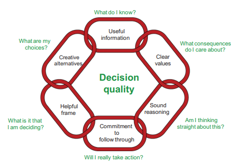

# _Decision Tree Analysis_

## Pendahuluan

Decision tree merupakan metode yang digunakan untuk ... bla bla

## Teori Dasar Teknik Pengambilan Keputusan 

## _Decision Tree Analysis Workflow_

### _Framing The Problem_

### _Deterministic Analysis_

### _Probabilistic Analysis_

### _Appraisal_

#### _Value of Information_

#### _Decision Quality_

Terdapat suatu perbedaan definisi yang mendasar antara keputusan dan hasil. Hasil yang baik adalah apa yang kita inginkan sedangkan keputusan yang baik adalah apa yang dapat dilakukan untuk memaksimalkan kemungkinan hasil yang baik. Keputusan yang baik tidak menjamin hasil yang baik tapi pada umumnya keputusan yang baik akan mengarah pada hasil yang baik sehingga dari definisi ini maka yang dapat dilakukan adalah membuat keputusan yang baik, bukan hasil yang baik. Bagi _decision-maker_ tunggal, biasanya penentuan apakah keputusan itu "baik" dapat dilakukan dengan jelas. Di sisi lain, jika berada dalam suatu lingkungan yang terdiri dari beberapa _decision-maker_, maka penentuan organisasi itu siap mengambil keputusan menjadi cukup sulit. Dalam kondisi tersebut, perlu ada persetujuaan mengenai kualitas dari alternatif, informasi, dan _value_. _Decision Quality_ di sini berperan sebagai alat yang berfungsi untuk mengevaluasi kualitas dari keputusan.

Setelah mencapi tahap pendeklarasian keputusan, perlu dipastikan bahwa proses menentukan keputusan tersebut sudah mencapai keputusan yang berkualitas yang dilakukan dengan mengevaluasi keputusan tersebut berdasarkan 6 elemen _Decision Quality_. Matheson dan Matheson (1998) mensurvei sejumlah besar _decison-maker_ dan menggabungan tanggapan mereka dengan pemikiran akademisi untuk mengembangkan kerangka kerja yang mengevaluasi kualitas dari keputusan dalam 6 dimensi seperti Gambar di bawah ini.

(\#fig:unnamed-chunk-2)Elemen _Decision Quality_

Elemen-elemen tersebut direpresentasikan dalam sebagai hubungan dalam rantai keputusan akan hanya sekuat mata rantai yang paling lemah. Jika setiap elemen kuat, maka kualitas keputusan adalah tinggi. Jika salah satu elemen lemah, maka kualitas keputusan tidak lebih baik dari elemen yang lemah tersebut. Setiap elemen harus dipertimbangkan berdasarkan perspektif kepala dan hati karena keputusan harus masuk akal dan terasa benar. Setiap dari 6 elemen tersebut harus mencapai kualitas terbaiknya: _helpful frame_, _creative alternatives_, _useful information_, _clear values_, _sound reasoning_, dan _commitment to follow through_.

##### _1. Helpful Frame_ {-}

Titik awal adalah mengidentifikasi keputusan yang akan dibuat secara jelas dan seberapa akurat keputusan itu untuk dinilai. _Helpful frame_ memperjelas situasi yang akan dipecahkan. Langkah pada tahap ini sangat penting. Mendapat pertanyaan yang baik dari kerangka masalah yang buruk adalah tidak berguna. Sebagai _engineer_ dan _geoscientists_, mereka cenderung untuk segera menghasilkan model (sebagai contoh, _tools_ simulasi, _spreadsheets_, model dan analisi geologi, dan lain-lain) saat menghadapi situasi keputusan yang baru. _Decision-maker_ yang sudah ahli, bagaimanapun, mengetahui bahwa mereka harus mengidentifikasi secara sadar apa uang harus diputuskan. Terlalu sering terdesak waktu dan membutuhkan jawaban yang segera, _decision-maker_ yang belum berpengalaman terjun ke dalam untuk mengumpulkan informasi atau membangun model kuantitatif tanpa berhenti untuk mengajukan pertanyaan-pertanyaan sebagai berikut ini:

- Apa yang diputuskan?
- Apa yang tidak diputuskan? 
- Apa yang akan didapat dari yang diberi?
- Apakah asumsi-asumsi sudah ditentukan secara jelas?

Terlepas dari seberapa sedikit waktu yang tersedia, seseorag tidak boleh melewatkan menanyakan pertanyaan-pertanyaan _framing-type_. Jika tidak bertanya dengan baik, maka memungkinkan akan lebih banyak waktu yang terbuang daripada "menghemat" karena mengambil risiko memecahkan masalah yang salah. 

##### _2. Creative Alternatives_ {-}

Kurangnya tingkat kreativitas dan fleksibilitas alternatif adalah salah satu alasan utama perusahaan-perusahaan memiliki kesulitan dalam mencapai keputusan yang berkualitas tinggi. Bagian ini dapat diilustrasikan dengan menanyakan pertanyaan-pertanyaan sebagai berikut ini:

- Apa saja pilihan-pilihan kita?
- Apakah alternatif-alternatif tersebut dapat dilakukan?
- Apakah alternatif tersebut memecahkan masalah?
- Apakah berbagai alternatif lain sudah dipertimbangkan?

Bagian ini membutuhkan suatu tim untuk menggali ide-ide dan menjadi kreatif. Setiap alternatif yang telah diindetifikasi harus konsisten secara logika dan bisa dilakukan. Kualitas setiap keputusan hanya bisa sebaik alternatifnya yang telah diidentifikasi, jika tidak ada alternatif maka tidak ada keputusan.

##### _3. Useful Information_ {-}

Bagian ini menjelaskan kebutuhan untuk menggunakan informasi yang terpercaya dan relevan yang berkaitan dengan penentuan keputusan. Hal tersebut dapat diilustrasikan dengan menanyakan pertanyaan-pertanyaan di bawah ini:

- Apa yang kita ketahui?
- Apakah kita memiliki informasi yang penting?
- Apakah informasi tersebut tidak bias?
- Seberapa akurat kita di masa lalu dengan penilaian serupa?
- Informasi apa dikumpulkan dengan adanya lebih banyak waktu/uang/sumber daya? 

##### _4. Clear Values_ {-}

##### _5. Sound Reasoning_ {-}

##### _6. Commitment to Follow Through_ {-}
