--- 
title: "Help PertaEOR-Lite"
author: "LAPI ITB & PERTAMINA INV"
date: "`r Sys.Date()`"
site: bookdown::bookdown_site
documentclass: book
bibliography: [book.bib, packages.bib]
biblio-style: apalike
---
# Screening EOR 

## Teori Dasar Statistik, Distribusi Probabilitas, dan Metode Numerik 

### Teori Dasar Statistik dan Probabilitas 

```{r include=FALSE}
knitr::opts_chunk$set(echo = FALSE)
```

Statistik adalah ilmu yang mempelajari cara mengumpulkan, mengatur, menganalisis, dan menginterpretasi data. Statistik dibagi menjadi dua, yaitu statistik deskriptif dan statistik inferensial. Statistik deskriptif membahas mengenai cara mengumpulkan dan mengatur data, sedangkan statistik inferensial membahas mengenai cara menganalisis data, yaitu analisis terhadap data sampel untuk memberikan kesimpulan= mengenai populasi. Beberapa istilah yang digunakan dalam statistik, diantaranya:

1. __Populasi__, yaitu total data dari sistem yang ingin dipelajari. Variabel yang menggambarkan populasi disebut __parameter populasi__. Parameter populasi yang penting untuk diketahui diantaranya: (a) __Rata-rata (mean) populasi__ (dilambangkan $\mu$ ), yaitu parameter yang memberikan informasi mengenai titik pusat dari data populasi; (b) __*Variance* populasi__ (dilambangkan $\sigma$^2^, yaitu parameter yang memberikan informasi mengenai sebaran dat apopulasi. __Standard deviasi populasi__ (dilambangkan $\sigma$) didefinisikan sebagai akar kuadrat dari _variance_ populasi ($\sqrt{\sigma^2}$). Sama halnya dengan _variance_ populasi, standard deviasi populasi juga memberikan informasi mengenai sebaran data populasi.
2. __Sampel__, yaitu bagian dari populasi. Sampel harus dapat mewakili populasi. Sampel yang memenuhi kriteria ini disebut sebagai __*random* sampel__. Variabel yang menggambarkan sampel disebut __statistik sampel__. Statistik sampel yang penting untuk diketahui diantaranya: (a) __Rata-rata (*mean*) sampel__ (dilambangkan $\bar{x}$), yaitu statistik yang memberikan informasi mengenai titik pusat dari data sampel. _Mean_ sampel dihitung dengan menjumlahkan semua nilai numerik sampel, kemudian dibagi dengan jumlah anggota sampel; (b) __*Variance* sampel__ (dilambangkan s^2^), yaitu parameter yang memberikan informasi mengenai sebaran data sampel. __Standard deviasi sampel__ (dilambangkan __s__) didefinisikan sebagai akar kuadrat dari _variance_ sampel ($\sqrt{s^2}$). Sama halnya dengan _variance_ sampel, standard deviasi sampel memberikan informasi mengenai sebaran data sampel.

Dalam aplikasi, informasi mengenai parameter populasi seringkali tidak diketahui. Dalam kasus seperti ini, akan terlihat peranan penting dari statistik, yaitu kesimpulan mengenai populasi dapat dibuat melalui analisis sampel. Konsekuensi dari hal ini adalah terdapatnya ketidakpastian pada kesimpulan yang diperoleh. Adanya ketidakpastian _uncertainty_ dalam kesimpulan merupakan hal yang tidak dapat dipisahkan dari statistik.

Dalam probabilitas dikenal istilah event, yaitu suatu kejadian yang muncul sebagai akibat dari eksperimen. __Eksperimen__ didefinisikan sebagai suatu kegiatan yang dilakukan untuk memperoleh data atau nilai. Himpunan event keluaran (*output*) dari seluruh kemungkinan _event_ yang muncul sebagai hasil dari suatu eksperimen disebut sebagai himpunan semesta atau __ruang sampel__. Ruang sampel disimbolkan dengan _S_.

```{r fig.align = 'center', out.width = "50%", fig.cap = "Definisi ruang sampel dan anggota sampel"}
knitr::include_graphics("images/screening/himpunan.png")
```

Gambar di atas memberikan ilustrasi mengenai konsep ruang sampel dan anggota sampel. Pada gambar, _event_ A merupakan anggota dari ruang sampel _S_. Konsep probabilitas erat kaitannya dengan konsep frekuensi relatif. Jika suatu eksperimen diulang sebanyak n kali, kemudian dicatat banyaknya jumlah keluaran dari _n_ jumlah eksperimen yang berupa _event A_, maka frekuensi dari _event A_, disimbolkan _N_(*A*), didefinisikan sebagai berikut. $$N(A)=\frac{banyaknya\ keluaran\ event\ A}{n}...(1)$$
Frekuensi relatif _event_ A dinyatakan sebagai frekuensi _event_ A dibagi banyaknya jumlah sampel _n_. $$frekuensi\ relatif\ (A)=\frac{N(A)}{n}...(2)$$
Nilai frekuensi relatif suatu _event_ bergantung pada jumlah sampel n. Semakin banyak n, maka nilai frekuensi relatif akan semakin stabil. Probabilitas suatu _event_ bersesuaian dengan nilai stabil dari frekuensi relatif _event_ tersebut. __Probabilitas suatu _event_ didefinisikan sebagai proporsi kemunculan suatu _event_ dari total _n_ jumlah random eksperimen__. Probabilitas kemunculan atau kejadian suatu _event_ disimbolkan P(*event*). Maka, probabilitas kejadian _event_ A dalam ruang sampel S disimbolkan dengan P(A). Dua aturan dasar terkait teori probabilitas adalah probabilitas suatu _event_ tidak pernah bernilai negatif, dan probabilitas dari ruang sampel _S_ adalah 1.
<p>&nbsp;</p>

#### Distribusi Probabilitas Kontinu 

Seperti yang telah dijelaskan sebelumnya, probabilitas dapat didefinisikan sebagai peluang terjadinya suatu _event_ atau peluang kemunculan suatu nilai dari suatu eksperimen. Eksperimen yang dimaksud di sini adalah ___ekperimen statistik___, yaitu suatu proses yang menghasilkan data atau nilai numerik. Nilai probabilitas berada diantara 0 dan 1. Jika terdapat sekumpulan nilai, dan masing-masing nilai tersebut dikaitkan dengan probabilitas kejadiannya, maka akan diperoleh distribusi probabilitas.

Distribusi probabilitas dapat dibagi menjadi dua, yaitu distribusi probabilitas diskrit dan distribusi probabilitas kontinu. Fungsi yang menjelaskan suatu distribusi probabilitas dari variabel random diskrit disebut sebagai ___probability mass function___, sedangkan fungsi yang menjelaskan suatu distribusi probabilitas dari variabel random kontinu disebut sebagai ___probability density function___. Karena parameter reservoir merupakan variable random kontinu, maka penjelasan akan ditekankan pada teori _probability density function_.

_Probability Density Funtion_ (disingkat PDF) adalah suatu fungsi f(x) yang memberikan bentuk distribusi probabilitas dari suatu variabel random kontinu. Konsep PDF sangat penting karena dengan mengetahui PDF dari suatu parameter, maka bentuk distribusi probabilitas dari parameter tersebut akan dapat diketahui. Misalkan, untuk parameter porositas reservoir, dengan mengetahui PDF dari porositas reservoir maka bentuk distribusi dari porositas akan diketahui. Secara matematis, PDF didefinisikan oleh persamaan berikut.$$P(a<X<b)=\int_a^{b}f(x)dx$$
Beberapa sifat dari PDF adalah sebagai berikut:

1. f(x) > 0, x $\in$ S. Maksud dari simbol ini adalah PDF _f_ selalu bernilai positif, dimana variabel random _x_ merupakan anggota dari ruang sampel _S_.
2. $\int_s f(x)dx=1$. Maksudnya adalah total luas daerah di bawah kurva PDF selalu sama dengan 1, artinya nilai probabilitas total (untuk seluruh anggota ruang sampel _S_) adalah 1.

Informasi PDF dapat digunakan untuk mencari nilai rata-rata ($\mu$) dan _variance_ ($\sigma^2$) dari PDF tersebut. Nilai rata-rata ($\mu$) dan _variance_ ($\sigma^2$) dapat dihitung menggunakan persamaan berikut.$$\mu=\int_s xf(x)dx$$ $$\sigma^2=\int_s (x-\mu)^2f(x)dx=\int_s x^2f(x)dx-\mu^2...(3)$$
Terdapat beberapa bentuk distribusi kontinu yang akan digunakan dalam analisis EOR _screening._ Berikut akan dijelaskan empat bentuk distribusi kontinu yang akan digunakan dalam algoritma EOR _screening_. 
<p>&nbsp;</p>

#### Distribusi Normal dan Standard Normal

__Distribusi normal__ (disebut juga __distribusi *Gaussian*__) merupakan distribusi dari variabel random kontinu yang berbentuk mirip lonceng (“*bell-shaped*”). Distribusi normal didefinisikan oleh dua parameter, yaitu nilai rata-rata ($\mu$) dan standard deviasi ($\sigma$).

```{r fig.align = 'center', out.width = "50%", fig.cap = "Bentuk distribusi normal"}
knitr::include_graphics("images/screening/distribusi_normal.png")
```

Beberapa sifat dari distribusi normal adalah:
1. Kurva distribusi normal berbentuk mirip lonceng (“_bell-shape_d”) dengan titik puncak kurva berada di atas nilai rata-rata ($\mu$),
2. Kurva distribusi normal berbentuk simetri melalui nilai rata-rata ($\mu$), dan
3. Kurva distribusi normal semakin mendekati sumbu horizontal namun tidak pernah menyentuh atau melewati sumbu horizontal.

Hal yang terpenting dari kurva distribusi normal adalah luas daerah di bawah kurva distribusi normal. Hal ini penting karena luas daerah di bawah kurva distribusi normal pada suatu interval tertentu menyatakan __probabilitas__ suatu nilai berada pada interval tersebut. Sama seperti aturan distribusi probabilitas untuk semua distribusi probabilitas kontinu yang telah dijelaskan sebelumnya, total luas daerah di bawah kurva distribusi normal adalah 1. Gambar berikut memperlihatkan konsep ini.

```{r fig.align = 'center', out.width = "50%", fig.cap = "Total luas daerah di bawah kurva distribusi normal adalah 1"}
knitr::include_graphics("images/screening/distribusi_normal_1.png")
```

```{r fig.align = 'center', out.width = "50%", fig.cap = "Total luas daerah setengah dari total distribusi normal adalah 0.5"}
knitr::include_graphics("images/screening/distribusi_normal_0.5.png")
```

Maka, dengan mengetahui luas daerah di bawah kurva distribusi normal dalam suatu interval, probabilitas suatu nilai ada di dalam interval tersebut dapat diketahui. Hal lain yang perlu diketahui dari kurva distribusi normal adalah sebagai berikut:

1. Sekitar 68.2% dari luas daerah di bawah kurva distribusi normal berada dalam interval satu
standard deviasi dari nilai rata-ratanya, yaitu $\mu$ + $\sigma$ dan $\mu$ – $\sigma$,
2. Sekitar 95.4% dari luas daerah di bawah kurva distribusi normal berada dalam interval dua
standard deviasi dari nilai rata-ratanya, yaitu $\mu$ + 2$\sigma$ dan $\mu$ – 2$\sigma$, dan
3. Sekitar 99.7% dari luas daerah di bawah kurva distribusi normal berada dalam interval tiga
standard deviasi dari nilai rata-ratanya, yaitu $\mu$ + 3$\sigma$ dan $\mu$ – 3$\sigma$.

Dengan kata lain, suatu nilai yang merupakan anggota dari populasi nilai distribusi normal yang bersangkutan akan berada pada _range_ ± 3 standard deviasi dari _mean_ $\mu$. Karena hampir seluruh nilai yang merupakan anggota populasi berada pada _range_ ± 3 standard deviasi dari μ (dengan probabilitas 99.7%), maka dapat disimpulkan bahwa suatu nilai yang berada di luar _range_ ± 3 standard deviasi dari $\mu$ bukan merupakan anggota dari populasi yang bersangkutan (probabilitas nilai ini merupakan anggota dari populasi terkait sangat kecil, yaitu 100% - 99.7% = 0.3%).

```{r fig.align = 'center', out.width = "50%", fig.cap = "Luas daerah (probabilitas) di bawah kurva distribusi normal untuk masing-masing range standard deviasi dari mean"}
knitr::include_graphics("images/screening/distribusi_normal_range.png")
```
_
Probability Density Function_ (PDF) distribusi normal diberikan oleh persamaan berikut. $$f(x)=\frac{1}{\sigma\sqrt{2\pi}}e^{-\frac{(x-\mu)^2}{2\sigma^2}}...(4)$$

Menentukan luas daerah di bawah kurva distribusi normal tidaklah selalu mudah karena masing- masing distribusi normal memiliki nilai rata-rata $\mu$ dan standard deviasi $\sigma$ yang berbeda satu sama lain. Oleh karena itu, digunakanlah teori __distribusi standard normal__ untuk mempermudah menghitung luas daerah di bawah kurva distribusi normal. Prosedur dalam menentukan luas daerah di bawah kurva normal adalah mentransformasi nilai _x_ pada distribusi normal original menjadi nilai _z_ pada distribusi standard normal. Statistik _z_ disebut sebagai statistik standard normal, yaitu suatu parameter yang mengkarakterisasi nilai distribusi standard normal. Kemudian, luas daerah di bawah kurva standard normal ditentukan dengan melihat tabel luas daerah kurva standard normal yang telah disusun oleh para ahli statistik.
s
Konsep untuk mentransformasi kurva distribusi normal menjadi kurva standard normal adalah dengan menghitung berapa standard deviasi jauhnya suatu nilai x pada distribusi normal dari _mean_-nya. Setelah hal ini diketahui, maka nilai _x_ dikonversi menjadi nilai _z_ menggunakan persamaan berikut. $$z=\frac{x-\mu}{\sigma}...(5)$$

Distribusi normal _original_ kini telah ditransformasi ke dalam distribusi standard normal dengan variabel _z_. Distribusi standard normal dicirikan dengan nilai rata-rata $\mu$ = 0 dan standard deviasi $\sigma$ = 1. Luas daerah (probabilitas) suatu nilai standard normal akan jatuh pada interval 0 dan _z_ diperoleh dari kurva standard normal. Distribusi standard normal sangat berguna karena dapat mempermudah perhitungan probabilitas suatu nilai dalam distribusi normal.
<p> &nbsp; </p>

#### Distribusi Segitiga (Triangular)

Distribusi segitiga merupakan bentuk distribusi kontinu yang dikarakterisasi oleh tiga titik, yaitu titik ujung bawah a, titik ujung atas b, dan titik tengah c, dimana a < b dan a ≤ c ≤ b.

```{r fig.align = 'center', out.width = "50%", fig.cap = "Distribusi segitiga"}
knitr::include_graphics("images/screening/distribusi_segitiga.png")
```
_Probability Density Function_ (PDF) untuk distribusi segitiga diberikan oleh:

$$
f(x) =
\begin{cases}
  0,\ untuk\ x < a\ dan\ x > b\\ 
  \frac{2(x-a)}{(b-a)(c-a)},\ untuk\ a \leq x \leq c \\
  \frac{2(b-x)}{(b-a)(b-c)},\ untuk\ c \leq x \leq b
\end{cases}       
$$
<p> &nbsp; </p>

#### Distribusi Uniform 

Distribusi _uniform_ kontinu adalah bentuk distribusi dimana setiap anggota distribusi memiliki probabilitas kemunculan yang sama. Bentuk distribusi ini dicirikan oleh dua parameter, yaitu nilai minimum _a_, dan nilai maksimum _b_. _Probability Density Function_ (PDF) dari distribusi _uniform_ adalah:

\[
f(x)=
\begin{cases}
  \frac{1}{b-a},\ untuk\ a \leq x \leq b\\
  0,\ untuk\ x > a\ atau\ x > b
\end{cases}
\]

```{r fig.align = 'center', out.width = "50%", fig.cap = "Distribusi uniform"}
knitr::include_graphics("images/screening/distribusi_uniform.png")
```
<p> &nbsp; </p>

#### Distribusi Log Normal

Distribusi log normal berkaitan dengan distribusi normal, sehingga parameter-parameter distribusi log normal dapat dinyatakan dalam bentuk parameter distribusi normal. Misalkan Y adalah suatu variabel random kontinu yang terdistribusi normal, maka variabel random kontinu  = D akan terdistribusi log normal dengan:

<center> _Mean_ log normal = E[ln(X)] = E(Y) = $\mu$ </center>
<center> _Variance_ log normal = Var[ln(X)] = Var[Y] = $\sigma$^2^ </center>
<center> dimana ln(X) = ln(e^Y^) = Y </center>
<p> &nbsp; </p>

Bentuk distribusi log normal adalah seperti distribusi normal namun miring ke kiri. Hal ini disebabkan karena distribusi normal memiliki _skewness_ nol, sedangkan distribusi log normal memiliki _skewness_ positif.
```{r fig.align = 'center', out.width = "50%", fig.cap = "Distribusi log normal"}
knitr::include_graphics("images/screening/distribusi_log_normal.png")
```
_Mean_ dan _variance_ dari variabel log normal _X_ adalah:
$$\mu_X = e^{(\mu+\frac{\sigma^2}{2})}$$
$$\sigma^2_X = (e^{2\mu+\sigma^2})(e^{\sigma^2}-1$$
Dimana $\mu$ dan $\sigma$^2^ adalah _mean_ dan _variance_ dari variabel normal _Y_. Terlihat bahwa _mean_ dan _variance_ dari variabel log normal adalah fungsi dari _mean_ dan _variance_ variabel normal. Karenadistribusi log normal dan distribusi normal saling berkaitan, maka _Probability Density Function_ (PDF) dari distribusi log normal dinyatakan oleh parameter-parameter distribusi normal.
$$f(x) = \frac{1}{x\sigma\sqrt{2\pi}}\ exp\ [-\frac{1}{2\sigma^2}(ln\ x-\mu)^2]$$
Pada persamaan (8) di atas, $\mu$ dan $\sigma$^2^ adalah _mean_ dan _variance_ dari variabel normal _Y_.

### Metode Numerik

Dalam aplikasi, seringkali dijumpai permasalahan berupa penentuan akar (solusi) dari sebuah persamaan _f(x)_ = 0. Jika _f(x)_ adalah suatu fungsi sederhana, tentu solusinya akan mudah diperoleh secara eksak. Permasalahan timbul apabila fungsi _f(x)_ adalah suatu fungsi kompleks yang solusinya tidak dapat diperoleh secara eksak. Untuk kasus-kasus dimana solusi dari fungsi _f(x)_ tidak dapat diperoleh secara eksak, dilakukan pendekatan pencarian solusi secara numerik, yaitu dilakukan perubahan solusi secara bertahap dengan sedikit demi sedikit menambah tingkat ketelitian sampai diperoleh solusi dengan tingkat ketelitian yang diinginkan. Metode mencarisolusi seperti ini disebut sebagai __metode approksimasi berurutan *(method of successive approximation)*__ atau disebut juga dengan __metode iterasi__. Metode iterasi tidak hanya harus diterapkan pada kasus-kasus yang tidak memiliki solusi eksak. Kasus-kasus sederhana yang solusi eksaknya ada pun dapat dicari pendekatan solusinya menggunakan metode iterasi. Bahkan, metode iterasi lebih disukai untuk digunakan di kasus-kasus sederhana oleh banyak orang karena metode ini kadang lebih mudah diterapkan dibandingkan mencari solusi eksak secara analitik.

Terdapat beberapa metode iterasi yang dapat digunakan untuk mencari solusi. Pada penelitian ini, metode iterasi yang digunakan adalah metode Newton-Raphson. Oleh karena itu, pada subbab ini, penjelasan metode numerik dibatasi pada metode Newton-Raphson.

__Metode Newton-Raphson__, yang juga sering disebut sebagai __metode Newton__ adalah suatu metode numerik yang melibatkan turunan pertama dari fungsi _f(x)_ dalam proses iterasi. Pada penelitian ini, metode Newton digunakan untuk mencari titik potong antara dua kurva distribusi, yaitu kurva distribusi _database_ dan kurva distribusi _input_. Jika distribusi _database_ memiliki _density function_ _f(x)_ dan distribusi _input_ memiliki _density function_ _g(x)_, maka fungsi _h(x)_ = _f(x)_ - _g(x)_ menyatakan selisih antara _density database_ dengan _density input_. Nilai fungsi _h(x)_ = 0 menyatakan titik potong antara kedua kurva _f(x)_ dan _g(x)_. Metode Newton diterapkan terhadap fungsi _h(x)_ untuk mencari pendekatan solusi _h(x)_ = 0. Hasil dari penerapan metode Newton adalah diperolehnya pendekatan nilai x dimana _h(x)_ sangat dekat ke nol. Nilai x ini merupakan titik potong yang dicari.
```{r fig.align = 'center', out.width = "50%", fig.cap = "Titik x~p~ merupakan titik potong antara kurva distribusi database dengan kurva distribusi input. Titik potong ini dicari menggunakan metode Newton-Rhapson"}
knitr::include_graphics("images/screening/newton_rhapson.png")
```
Misalkan _h(x)_ adalah fungsi yang dapat didiferensialkan dan misalkan x~1~ adalah tebakan awal solusi untuk _h(x)_ = 0. Jika E melambangkan batas toleransi error dari solusi, maka metode Newton diterapkan dengan mengulangi langkah berikut untuk n = 1, 2 ... sampai diperoleh |x~n+1~ - x~n~| < _E_:
$$x_{n+1} = x_n - \frac{h(x_n)}{h'(x_n)}...(9)$$
Persamaan (9) di atas merupakan prosedur perulangan (iterasi) untuk mencari solusi x yang sangat mendekati _h(x)_ = 0. Prosedur iterasi dilakukan sampai dicapai suatu nilai konvergen (yang kemudian diambil sebagai solusi), atau sampai suatu batas _error_ tertentu _E_, dimana _E_ = |x~n+1~ - x~n~| Hal yang perlu diperhatikan dalam penggunaan metode Newton-Raphson adalah pemilihan tebakan awal untuk solusi. Permasalahan yang sering timbul adalah pemilihan tebakan awal yang terlalu jauh sehingga kekonvergenan lambat diperoleh, atau bahkan solusi konvergen tidak dapat diperoleh.

Setelah titik potong dari dua kurva distribusi diperoleh dari metode Newton, maka langkah selanjutnya adalah mencari luas daerah irisan dari kedua kurva distribusi tersebut (arsiran merah pada Gambar 9). Luas daerah irisan ini menyatakan probabilitas kecocokan distribusi _input_ terhadap distribusi _database_.

Penentuan luas daerah irisan melibatkan penggunaan integral dari fungsi distribusi dalam suatu interval [*a*, *b*]. Metode numerik yang digunakan dalam penentuan luas daerah (integral) adalah __metode Simpson__ (disebut juga __metode Parabolik__). Metode Simpson mencari pendekatan terhadap luas daerah dari suatu bangun ruang dengan membagi interval [*a*, *b*] ke dalam n jumlah sub-interval (*n* harus genap), dimana pada masing-masing sub-interval ditempatkan suatu bangun ruang parabola. Sehingga, akan terdapat *n* buah parabola di bawah suatu kurva *f(x)*. Luas daerah di bawah kurva *f(x)* dapat didekati dengan menjumlahkan seluruh n buah parabola dalam interval [*a*, *b*].

Metode Simpson dinyatakan sebagai berikut.
$$\int_a^bf(x)dx \approx \frac{h}{3}[f(x_0)+4f(x_1)+2f(x_2)+...+4f(x_{n-1})+f(x_n)]...(10)$$
Pada persamaan (10) di atas, h adalah lebar sub-interval dan nilai-nilai 1, 4, 2, 4, 2, 4, 2,..., 2, 4, 1 adalah koefisien-koefisien yang terkait dengan setiap suku _f(x)_.
<p> &nbsp; </p>

## Metode Analisis EOR Screening

Teori dasar yang telah dijelaskan di subbab pertamaS merupakan dasar yang akan digunakan untuk analisis EOR _screening_ dalam subbab ini. Seperti yang telah disebutkan pada bagian pendahuluan, analisis dilakukan untuk mengetahui probabilitas kecocokan dari setiap parameter _input_ reservoir (untuk setiap metode EOR) terhadap _database_. _Database_ ini berupa interval nilai parameter reservoir untuk setiap metode EOR yang telah berhasil diterapkan di seluruh dunia. _Database_ yang digunakan diambil dari paper Aladasani dan Baojun Bai (2010). Tabel berikut memperlihatkan _database_ yang digunakan untuk EOR _screening_.

```{r fig.align = 'center', out.width = "100%"}
knitr::include_graphics("images/screening/miscible.png")
```
```{r fig.align = 'center', out.width = "100%"}
knitr::include_graphics("images/screening/immiscible.png")
```
```{r fig.align = 'center', out.width = "100%"}
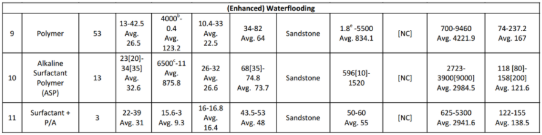
```
```{r fig.align = 'center', out.width = "100%"}
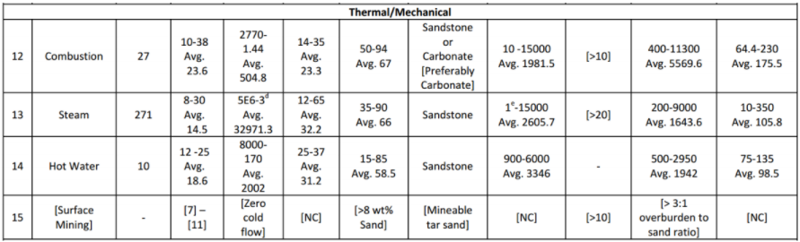
```
```{r fig.align = 'center', out.width = "100%", fig.cap = "_Range_ nilai dari beberapa parameter reservoir terhadap setiap metode EOR yang telah sukses diterapkan di beberapa tempat di seluruh dunia. _Range_ nilai ini akan dijadikan data acuan dalam analisis statistik. (Sumber: Ahmad Aladasani nad Baojun Bai, 2010, _Recent Developments and Updated Screening Criteria of Enhanced Oil Recovery Techniques_, SPE Paper 130726)"}
knitr::include_graphics("images/screening/microbial.png")
```

Interval nilai parameter reservoir yang tertera di Gambar 10 akan digunakan sebagai acuan _database_ dalam analisis. Metode analisis EOR _screening_ terbagi atas __metode analisis untuk *input* data *single-value*__ dan __metode analisis untuk *input* data distribusi__. Berikut akan dijelaskan kedua metode analisis ini.

### Metode Analisis EOR Screening Untuk Input Data Single-Value

_Input_ data _single-value_ yang dimaksud di sini adalah parameter _input_ berupa nilai tunggal, misalnya _input_ porositas berupa satu nilai porositas yang mewakili distribusi porositas. Terdapat dua algoritma yang digunakan dalam EOR _screening_, yaitu algoritma normal dan algoritma _tight_. Bentuk distribusi probabilitas yang digunakan dalam analisis input data single value adalah distribusi segitiga.

#### Algoritma Normal (Normal Screening Algorithm)

Algoritma normal yang digunakan dalam EOR screening dibagi menjadi dua, yaitu __algoritma statistik (*statistics algorithm*)__ dan __algoritma teknik (*engineering algorithm*)__. Algoritma statistik adalah algoritma yang murni menggunakan konsep statistik dalam penentuan kriteria *screen*ing, sedangkan algoritma teknik adalah algoritma yang menyertakan faktor *engineering sense* ke dalam perhitungan *screening*.

Pada kedua algoritma, disertakan parameter __*cut-off*__. Parameter *cut-off* menyatakan tambahan data (berupa luas daerah) sebesar ±$\alpha$% dari distribusi data original. Parameter ini memungkinkan *user* untuk menentukan nilai probabilitas (sebesar $\alpha$%) saat parameter input _x_ tepat jatuh di nilai maksimum atau nilai minimum *database*.
```{r fig.align = 'center', out.width = "50%", fig.cap="Konsep _cut-off_ dalam algoritma EOR _screening_"}
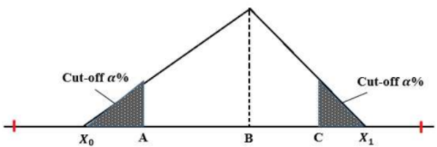
```
<p> &nbsp; </p>

__a.    Algoritma Statistik (Statistics Algoritm)__ <br/>
Pada algoritma statistik, nilai rata-rata (_mean_) dari distribusi _database_ digunakan sebagai acuan penentuan kecocokan 100% terhadap suatu metode EOR.
```{r fig.align = 'center', out.width = "50%", fig.cap="Konsep algoritma statistik"}
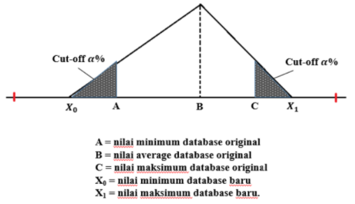
```
Berdasarkan _database_, maka variable yang diketahui nilainya adalah A, B, dan C (mengacu pada gambar di atas). X~0~ dan X~1~ merupakan dua variabel _unknown_ yang harus dicari nilainya. Penentuan nilai X~0~ adalah sebagai berikut.
```{r fig.align = 'center', out.width = "50%", fig.cap="Konsep penentuan __X~0~__"}
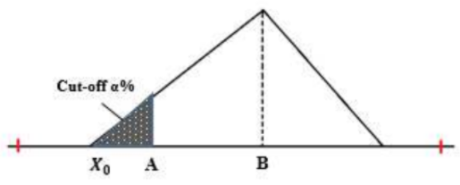
```
$$X_0 = \frac{-b\ ±\ \sqrt{D} }{2a}...(11)$$
Dimana: <br/> 
D = b^2^ - 4a <br/>
a = 1 - 2P <br/>
b = 4BP - 2A <br/>
c = A^2^ - 2PB^2^ <br/>
A = nilai minimum dari _database original_ <br/>
B = nilai rata-rata (*mean*) dari _database original_ <br/>
P = probabilitas nilai di x = _A_ (nyatakan P = $\frac{\alpha}{100}$). <br/>
Solusi X~0~ yang dipilih adalah yang memenuhi X~0~ < A

Penentuan nilai X~1~ adalah sebagai berikut.
```{r fig.align = 'center', out.width = "50%", fig.cap="Konsep penentuan __X~1~__"}
knitr::include_graphics("images/screening/X1.png")
```
$$X_1 = \frac{-b\ ±\ \sqrt{D} }{2a}...(12)$$
Dimana: <br/> 
D = b^2^ - 4a <br/>
a = 1 - 2P <br/>
b = 4BP - 2C <br/>
c = C^2^ - 2PB^2^ <br/>
A = nilai maksimum dari _database original_ <br/>
B = nilai rata-rata (*mean*) dari _database original_ <br/>
P = probabilitas nilai di x = _C_ (nyatakan P = $\frac{\alpha}{100}$). <br/>
Solusi X~1~ yang dipilih adalah yang memenuhi X~1~ > A

Setelah nilai X~0~ dan X~1~ diperoleh, maka langkah selanjutnya adalah menentukan probabilitas kecocokan. Probabilitas kecocokan suatu parameter input *x* terhadap _database_ (dinyatakan oleh P(*x*) adalah sebagai berikut.

- Untuk parameter _input_ di bawah nilai _mean_ dari _database original_ (x < B)
```{r fig.align = 'center', out.width = "50%", fig.cap="Perhitungan P(x) untuk nilai input x < B"}
knitr::include_graphics("images/screening/kecilB.png")
```
$$P(x) = \left( \frac{1}{2}\frac{(x-X_0)^2}{(B-X_0)^2} \right) \times 2\  ...(13)$$
Dimana: <br/> 
_x_ = nilai parameter _input single value_ <br/>
_X~0~_ = nilai minimum _database_ baru <br/>
_B_ = nilai _mean database original_ <br/>

- Untuk parameter _input_ di bawah nilai _mean_ dari _database original_ (x > B)
```{r fig.align = 'center', out.width = "50%", fig.cap="Perhitungan P(x) untuk nilai input x > B"}
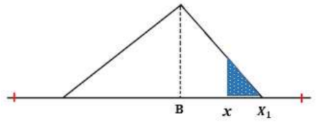
```
$$P(x) = \left( \frac{1}{2}\frac{(X_0-x)^2}{(X_1-B)^2} \right) \times 2\  ...(14)$$
Dimana: <br/> 
_x_ = nilai parameter _input single value_ <br/>
_X~1~_ = nilai maksimum _database_ baru <br/>
_B_ = nilai _mean database original_ <br/>
<p> &nbsp; </p>

__b.    Algoritma Teknik (Engineering Algoritm)__ <br/>
Pada algoritma teknik, terdapat tiga tipe algoritma yang dapat dipilih oleh _user_, yaitu algoritma tipe _average_, algoritma tipe maksimum, dan algoritma tipe minimum.
<p> &nbsp; </p>

__(1)   Algoritma Teknik Tipe _Average___ <br/>
Algoritma tipe ini adalah algoritma yang sama dengan yang diterapkan pada algoritma statistik, dimana mean dari _database_ dijadikan titik acuan penentuan kecocokan 100%.
```{r fig.align = 'center', out.width = "50%", fig.cap="Konsep algoritma teknik tipe _average_"}
knitr::include_graphics("images/screening/tipe_average.png")
```
<p> &nbsp; </p>

__(2)   Algoritma Teknik Tipe Minimum__ <br/>
Algoritma tipe ini menetapkan nilai kecocokan 100% untuk nilai parameter _input_ di bawah nilai _mean database original_. Bentuk distribusi data yang digunakan adalah sebagai berikut.
```{r fig.align = 'center', out.width = "50%", fig.cap="Konsep algoritma teknik tipe minimum"}
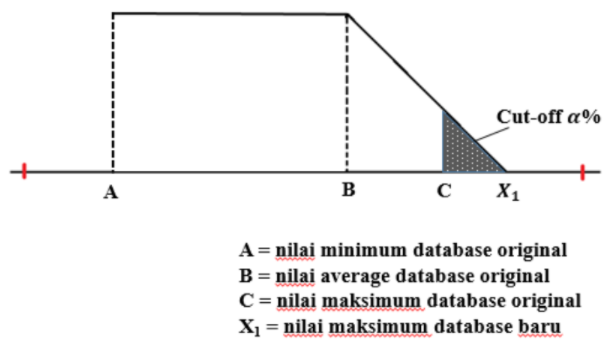
```
Langkah pertama dari algoritma adalah mencari nilai X~1~. Nilai X~1~ ditentukan sebagai berikut.
$$X_1 = \frac{-b\ ±\ \sqrt{D} }{2a}...(15)$$
Dimana: <br/> 
D = b^2^ - 4a <br/>
a = 1 - P <br/>
b = 4BP - 2C <br/>
c = C^2^ - 2PB^2^ <br/>
A = nilai maksimum dari _database original_ <br/>
B = nilai rata-rata (*mean*) dari _database original_ <br/>
P = probabilitas nilai di x = _C_ (nyatakan P = $\frac{\alpha}{100}$). <br/>
Solusi X~1~ yang dipilih adalah yang memenuhi X~1~ > C

Setelah nilai X~1~ diperoleh, maka langkah selanjutnya adalah menentukan probabilitas kecocokan. Probabilitas kecocokan suatu parameter input _x_ terhadap _database_ (dinyatakan oleh P(*x*)) adalah sebagai berikut.

- Untuk parameter _input_ di atas nilai _mean_ dari _database original_ (x > B)
```{r fig.align = 'center', out.width = "50%", fig.cap="Perhitungan P(x) untuk nilai input x > B"}
knitr::include_graphics("images/screening/besarB1.png")
```
$$P(x) = \left[\frac{(X_1-x)^2}{(X_1-B)^2} \right]...(16)$$
<p> &nbsp; </p>

- Untuk parameter _input_ di bawah nilai _mean_ dari _database original_ (x < B)
```{r fig.align = 'center', out.width = "50%", fig.cap="Perhitungan P(x) untuk nilai input x < B"}
knitr::include_graphics("images/screening/kecilB1.png")
```
$$P(x) = 1...(17)$$
<p> &nbsp; </p>

__(3)   Algoritma Teknik Tipe Maksimum__ <br/>
Algoritma tipe ini menetapkan nilai kecocokan 100% untuk nilai parameter _input_ di atas nilai _mean database original_. Bentuk distribusi data yang digunakan adalah sebagai berikut.
```{r fig.align = 'center', out.width = "50%", fig.cap="Konsep algoritma teknik tipe maksimum"}
knitr::include_graphics("images/screening/tipe_maksimum.png")
```
Langkah pertama dari algoritma adalah mencari nilai X~0~. Nilai X~0~ ditentukan sebagai berikut.
$$X_0 = \frac{-b\ ±\ \sqrt{D} }{2a}...(18)$$
Dimana: <br/> 
D = b^2^ - 4a <br/>
a = 1 - P <br/>
b = 2BP - 2A <br/>
c = A^2^ - 2PB^2^ <br/>
A = nilai minimum dari _database original_ <br/>
B = nilai rata-rata (*mean*) dari _database original_ <br/>
P = probabilitas nilai di x = _A_ (nyatakan P = $\frac{\alpha}{100}$). <br/>
Solusi X~0~ yang dipilih adalah yang memenuhi X~0~ < A.

Setelah nilai X~0~ diperoleh, maka langkah selanjutnya adalah menentukan probabilitas kecocokan. Probabilitas kecocokan suatu parameter input x terhadap _database_ (dinyatakan oleh P(*x*)) adalah sebagai berikut.

- Untuk parameter _input_ di bawah nilai _mean_ dari _database original_ (x < B)
```{r fig.align = 'center', out.width = "50%", fig.cap="Perhitungan P(x) untuk nilai input x < B"}
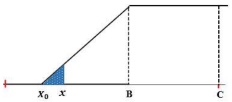
```
$$P(x) = \left[\frac{(x-X_0)^2}{(B-X_0)^2}\right] ...(19)$$
<p> &nbsp; </p>

- Untuk parameter _input_ di atas nilai _mean_ dari _database original_ (x < B)
```{r fig.align = 'center', out.width = "50%", fig.cap="Perhitungan P(x) untuk nilai input x > B"}
knitr::include_graphics("images/screening/besarB2.png")
```
$$P(x) = 1...(17)$$
<p> &nbsp; </p>

#### Algoritma *Tight (Tight Screening Algorithm)*

Algoritma _tight_ diterapkan pada hasil (_score_) algoritma normal. Algoritma ini menerapkan prosedur tambahan dalam perhitungan dengan cara mempertimbangkan banyak dan besarnya nilai _unmatch_ dari score algoritma normal, sehingga metode EOR yang memiliki nilai _unmatch_ akan mengalami perubahan peringkat sesuai dengan banyaknya jumlah nilai _unmatch_ dan besarnya nilai _unmatch_.

Algoritma _tight_ diterapkan menggunakan sejumlah parameter berikut.
<center> __Average Match and Unmatch Score__ = $\frac{Total\ Match\ Score\ +\ Total\ Unmatch\ Score}{Number\ of\ Match\ +\ Number\ of\ Unmatch}$ </center>
<center> __Average Match Score__ = $\frac{Total\ Match\ Score}{Number\ of\ Match}$</center>
<center> __Ratio__ = $\frac{Average\ Match\ and\ Unmatch\ Score}{Average\ Match\ Score}$ </center>
<p> &nbsp; </p>

Score dari algoritma _tight screening_ dinyatakan oleh:
<center> __Tight Screening Score__ = __(Normal Screening Score)__ $\times$ Ratio ... (21)</center>
<p> &nbsp; </p>

#### Perhitungan Total Probabilitas Kecocokan

Total probabilitas kecocokan suatu metode EOR terhadap database dihitung menggunakan persamaan yang melibatkan hasil kali antara probabilitas kecocokan individu per parameter dengan nilai weighting factor. Persamaan ini berlaku baik pada algoritma statistik maupun algoritma teknik.
$$Probability\ (average\ score) = \frac{w_1F_1+w_2F_2+...+w_8F_8}{w_1+w_2+...+w_8}$$
$$Probability\ (average\ score) = \frac{\sum_{j=1}^{8}w_jF_j }{\sum_{j=1}^{8}w_j}...(22)$$
Dimana: <br/> 
_w~i~_ = _weighting factor_ parameter ke-*i* <br/>
_F~i~_ = parameter _input_ ke-*i* <br/>

Metode EOR dengan nilai probabilitas kecocokan terbesar terhadap database akan dipilih sebagai _the most probable EOR method_ bagi reservoir target tersebut.
<p> &nbsp; </p>

#### Algoritma _Penalty Factor_ Dalam EOR _Screening_ 

Dalam EOR _screening_, diterapkan algoritma tambahan untuk mengakomodasi _input_ _user_ yang berada di luar _database._ Algoritma ini disebut dengan algoritma _penalty_ _factor._ Algoritma _penalty_ _factor_ mengakomodasi seberapa jauh nilai _input_ _user_ yang berada di luar _database._ Maka, semakin jauh nilai _input_ _user_ dari _database_, nilai probabilitas total menjadi semakin kecil dan menurunkan peringkat metode EOR terkait dalam peringkat kecocokan. Algoritma _penalty_ _factor_ memberikan nilai kecocokan negatif.

Algoritma _penalty_ _factor_ diterapkan untuk setiap tipe algoritma _screening_ yang digunakan, termasuk algoritma screening tipe _average_, maksimum, dan minimum. Persamaan-persamaan yang digunakan untuk setiap algoritma adalah sebagai berikut.

__a.    Algoritma Tipe _Average___ <br/>
Untuk algoritma tipe _average_, _penalty factor_ diterapkan baik untuk kasus _input user_ di bawah minimum _database_ maupun untuk kasus _input user_ di atas maksimum _database_.
```{r fig.align = 'center', out.width = "50%", fig.cap="*Penalty factor* untuk algoritma tipe _average_"}
knitr::include_graphics("images/screening/tipe_average1.png")
```
<p> &nbsp; </p>

Untuk nilai input > nilai maksimum _database_,
$$Penalty\ Factor\ = \frac{maxDB\ -\ nilai\ input}{maxDB\ -\ minDB}...(23)$$
Untuk nilai input < nilai minimum _database_,
$$Penalty\ Factor\ = \frac{nilai\ input\ -\ minDB}{maxDB\ -\ minDB}...(24)$$
<p> &nbsp; </p>

__b.    Algoritma Tipe Minimum <br/>
Untuk algoritma tipe minimum, _penalty factor_ diterapkan hanya untuk untuk kasus _input user_ yang berada di atas nilai maksimum _database_.
```{r fig.align = 'center', out.width = "50%", fig.cap="*Penalty factor* untuk algoritma tipe minimum"}
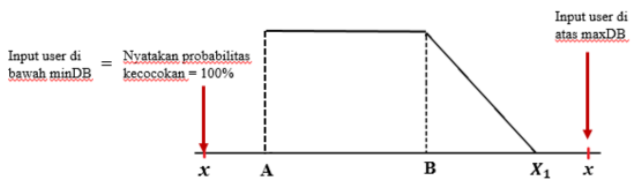
```
$$Penalty\ Factor\ = \frac{maxDB\ -\ nilai\ input}{maxDB\ -\ minDB}...(25)$$
<p> &nbsp; </p>

__b.    Algoritma Tipe Maksimum <br/>
Untuk algoritma tipe minimum, _penalty factor_ diterapkan hanya untuk untuk kasus _input user_ yang berada di bawah nilai maksimum _database_.
```{r fig.align = 'center', out.width = "50%", fig.cap="*Penalty factor* untuk algoritma tipe maksimum"}
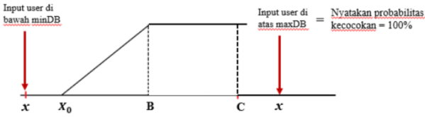
```
$$Penalty\ Factor\ = \frac{nilai\ input\ -\ minDB}{maxDB\ -\ minDB}...(26)$$

Sedangkan, untuk kasus _input_ distribusi, algoritma _penalty factor_ diterapkan sama seperti pada kasus _input single value_ untuk tipe algoritma _average_.
<p> &nbsp; </p>

### Metode Analisis EOR _Screening_ Untuk _Input_ Data Distribusi

Untuk kasus _input_ data distribusi, maka _input_ dari _user_ berupa parameter-parameter dari distribusi _input_, seperti _mean_, standard deviasi, nilai minimum, dan nilai maksimum. Pada kasus distribusi,terdapat dua jenis distribusi yang terlibat, yaitu __distribusi _database___ dan __distribusi _input___.

_Database_ yang digunakan adalah interval nilai dengan nilai minimum, nilai maksimum, dan nilai rata-rata, sehingga hanya ada tiga nilai yang diketahui. Oleh karena itu, pada penelitian ini,distribusi _database_ selalu diasumsikan mengikuti __distribusi _triangular_ (segitiga)__ dengan _density_ _function_ seperti yang dinyatakan dalam persamaan (6). Untuk distribusi _input_, _user_ dapat memilihempat pilihan distribusi, yaitu __distribusi segitiga, distribusi normal, distribusi uniform, dan distribusi log normal__. Probabilitas kecocokan distribusi input terhadap distribusi _database_ diperoleh dengan menghitung luas daerah irisan antara dua distribusi probabilitas ini. Gambar berikut memperlihatkan ide dari metode analisis yang digunakan untuk kasus _input_ distribusi.
```{r fig.align = 'center', out.width = "50%", fig.cap="Daerah irisan dari distribusi _input_ dan distribusi _database_"}
knitr::include_graphics("images/screening/irisan.png")
```

Bagian kurva yang diarsir dengan warna merah pada gambar di atas memperlihatkan contoh daerah irisan dari dua kurva distribusi, yaitu kurva distribusi _database_ (segitiga) dan kurva distribusi _input_ (normal). Titik potong kurva (x) dicari dengan menggunakan metode numerik Newton-Raphson. Setelah titik potong kurva diperoleh, luas daerah irisan dihitung menggunakan aturan Simpson, _seperti yang telah dijelaskan sebelumnya.

Berdasarkan penjelasan sebelumnya, maka terdapat empat kasus yang melibatkan pasangan distribusi database – distribusi input, yaitu: <br/>
(1) Kasus pasangan distribusi segitiga – distribusi segitiga <br/>
(2) Kasus pasangan distribusi segitiga – distribusi normal <br/>
(3) Kasus pasangan distribusi segitiga – distribusi uniform <br/>
(4) Kasus pasangan distribusi segitiga – distribusi log normal. <br/>
Secara umum, pengembangan algoritma untuk setiap pasangan distribusi _database_ distribusi _input_ dibagi ke dalam enam tipe algoritma yang berlaku untuk enam kasus berikut:

__(1) Distribusi _database_ dan distribusi _input_ tidak berpotongan___ <br/>
Distribusi _database_ dan distribusi _input_ tidak berpotongan jika interval distribusi _input_ berada di luar interval distribusi _database_. Gambar di bawah memperlihatkan contoh kasus ini untuk pasangan distribusi _database_ segitiga distribusi _input_ normal. Karena kedua kurva distribusi tidak berpotongan, maka tidak terdapat daerah irisan antara dua distribusi ini, sehingga probabilitas kecocokan distribusi input terhadap distribusi database adalah nol.
```{r fig.align = 'center', out.width = "50%", fig.cap="Distribusi _input_ dan distribusi _database_ tidak berpotongan"}
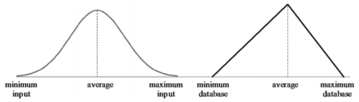
```
<p> &nbsp; </p>

__(2) Distribusi _database_ dan distribusi _input_ identik__ <br/>
Hal ini terjadi jika distribusi _database_ dan distribusi _input_ memiliki bentuk distribusi yang sama dengan parameter-parameter nilai minimum, nilai maksimum, nilai _mean_, dan nilai standard deviasi yang sama. Dengan kata lain, distribusi _database_ dan distribusi _input_ adalah dua distribusi identik. Karena dua distribusi identik, maka daerah irisan antara kedua distribusi ini meliputi seluruh daerah di bawah kurva kedua distribusi, sehingga probabilitas kecocokan distribusi _input_ terhadap distribusi _database_ adalah 100%.
```{r fig.align = 'center', out.width = "50%", fig.cap="Distribusi _input_ dan distribusi _database_ merupakan distribusi identik"}
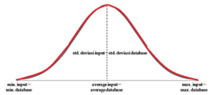
```
<p> &nbsp; </p>

__(3) Distribusi _input_ beririsan dengan distribusi _database_ di sisi kiri distribusi _database___ <br/>
Untuk kasus ini, terdapat satu titik potong antara kurva distribusi _database_ dan kurva distribusi _input._ Gambar di bawah memperlihatkan contoh untuk kasus ini.
```{r fig.align = 'center', out.width = "50%", fig.cap="Daerah irisan berada di sisi kiri kurva distribusi _database_"}
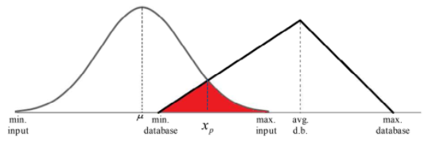
```

Pengembangan algoritma untuk kasus ini adalah sebagai berikut. Pertama, titik potong kurva dicari dengan menggunakan metode Newton. Fungsi yang digunakan dalam iterasi Newton adalah selisih antara kedua _density function_ dari distribusi _database_ dan distribusi _input._ Jika distribusi _database_ memiliki _density function f(x)_ dan distribusi _input_ memiliki _density function g(x)_, maka fungsi _h(x) = f(x) − g(x)_ menyatakan selisih dari fungsi distribusi _database_ dan fungsi distribusi _input._

Titik potong antara kedua kurva adalah suatu titik _x_ pada kurva dimana nilai fungsi _h(x)_ adalah nol. Nilai _h(x)_ nol adalah solusi eksak, sedangkan metode Newton adalah metode mencari solusi secara numerik. Oleh karena itu, dibutuhkan penyesuaian terhadap solusi numerik. Untuk solusi numerik, titik potong kurva dinyatakan oleh suatu titik _x_ pada kurva dimana nilai fungsi _h(x)_ sangat dekat dengan nol dengan tingkat kesalahan _E_. Tingkat kesalahan _E_ yang digunakan pada algoritma adalah 10^-7^. Sehingga, solusi titik potong x secara numerik adalah nilai dimana titik perulangan x~n+1~ memenuhi |_x~n+1~_ − _x~n~_| ≤ _E_.

Setelah titik potong kurva diperoleh, langkah selanjutnya adalah menghitung luas daerah irisan antara dua kurva distribusi. Luas daerah irisan ini diperlihatkan di gambar dengan arsiran merah. Luas daerah irisan menyatakan probabilitas kecocokan ditribusi _input_ terhadap distribusi _database_. Secara umum, untuk daerah irisan berada di sisi kiri kurva distribusi _database_, luas daerah dihitung dengan cara berikut. $$Luas\ Daerah\ arsiran\ = \int_{min.db}^{x_p}g(x)dx\ +\ \int_{x_p}^{max.input}f(x)dx...(27) $$
Dimana $\int_{min.db}^{x_p}g(x)dx$ dan $\int_{x_p}^{max.input}f(x)dx$ dihitung menggunakan aturan Simpson.
<p> &nbsp; </p>

__(4) Distribusi _input_ beririsan dengan distribusi _database_ di sisi kanan distribusi _database___ <br/>
Kasus ini masih melibatkan satu titik potong. Contoh kasus ini diperlihatkan pada hambar berikut.
```{r fig.align = 'center', out.width = "50%", fig.cap="Daerah irisan berada di sisi kanan kurva distribusi _database_"}
knitr::include_graphics("images/screening/irisan2.png")
```

Langkah-langkah pengembangan algoritma untuk kasus ini sama seperti kasus (3) di atas, yaitu penentuan titik potong x~p~ yang diikuti oleh perhitungan luas daerah arsiran untuk mengetahui probabilitas kecocokan distribusi _input_ terhadap distribusi _database_. Secara umum, perhitungan luas daerah arsiran adalah: $$Luas\ daerah\ arsiran\ = \int_{min.input}^{x_p}g(x)dx\ +\ \int_{x_p}^{max.db}f(x)dx...(28) $$
Dimana $\int_{min.input}^{x_p}g(x)dx$ dan $\int_{x_p}^{max.db}f(x)dx$ dihitung menggunakan aturan Simpson.
<p> &nbsp; </p>

__(5) Interval distribusi _input_ berada di dalam interval distribusi _database___ <br/>
Berbeda dengan kasus (3) dan (4), kasus ini memiliki dua titik potong. Pada dasarnya, langkah-langkah pengembangan algoritma untuk dua titik potong sama seperti kasus satu titik potong, yaitu penentuan titik potong (dalam hal ini terdapat dua titik potong) kemudian menghitung luas daerah arsiran untuk mengetahui probabilitas kecocokan distribusi _inpu_. terhadap distribusi _database_.
```{r fig.align = 'center', out.width = "50%", fig.cap="Kasus interval distribusi _input_ berada di dalam distribusi _database_"}
knitr::include_graphics("images/screening/interval_dalam.png")
```
Luas daerah arsiran dihitung menggunkn persamaan berikut. $$Luas\ Daerah\ arsiran\ = \int_{min.input}^{x_{p_1}}g(x)dx\ +\ \int_{x_{p_1}}^{avg.db}f_1(x)dx\ +\ \int_{avg.db}^{x_{p_2}}f_2(x)dx\ +\ \int_{x_{p_2}}^{max.input}g(x)dx...(29)$$
Masing-masing integral di atas dihitung menggunakan aturan Simpson.
<p> &nbsp; </p>

__(6) Interval distribusi _database_ berada di dalam interval distribusi _input___
Sama seperti kasus (5), kasus ini melibatkan dua titik potong. Langkah-langkah pengembangan algoritma sama seperti kasus-kasus sebelumnya, yaitu penentuan titik potong yang dilanjutkan dengan perhitungan luas daerah arsiran untuk mengetahui probabilitas kecocokan distribusi _input_ terhadap distribusi _database_.
```{r fig.align = 'center', out.width = "50%", fig.cap="Kasus interval distribusi _database_ berada di dalam distribusi _input_"}
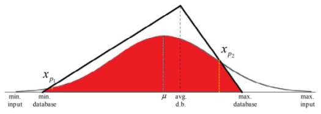
```
Luas daerah arsiran adalah: $$Luas\ daerah\ arsiran\ = \int_{min.input}^{x_{p_1}}f_1(x)dx\ +\ \int_{x_{p_1}}^{\mu}g(x)dx\ +\ \int_{\mu}^{x_{p_2}}g(x)dx\ +\ \int_{x_{p_2}}^{max.input}f_2(x)dx...(30)$$
Masing-masing integral di atas dihitung menggunakan aturan Simpson.

Masing-masing keenam kasus di atas berlaku untuk keempat pasangan distribusi _database_ – distribusi _input._ Langkah-langkah pengembangan algoritma adalah sama untuk setiap pasangan distribusi _database_ – distribusi _input._ Perbedaannya terletak pada fungsi _g(x)_ yang menyatakan _density_ _function_ dari distribusi _input._ Karena terdapat empat pilihan distribusi input, maka terdapat empat pilihan fungsi _g(x)_ yang berbeda bersesuaian dengan tipe distribusi _input_ yang dipilih oleh _user._ Secara umum, diagram alir algoritma untuk kasus input berupa distribusi diperlihatkan pada gambar berikut.

```{r fig.align = 'center', out.width = "75%", fig.cap="Diagram alir algoritma EOR _screening_ untuk kasus distribusi"}
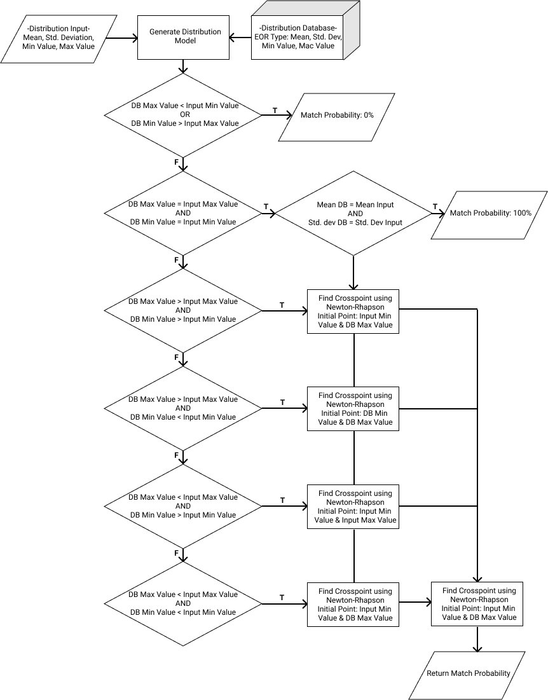
```

<!--chapter:end:index.Rmd-->

# CO~2~ Prophet Predictive Model

```{r include=FALSE}
knitr::opts_chunk$set(echo = FALSE)
```

## Pendahuluan

__CO~2~ Prophet__ merupakan perangkat lunak yang dibangun oleh __U.S. Department of Energy (DOE)__ yang dapat digunakan untuk memprediksi performa CO2 _flooding_. Perangkat lunak ini memiliki keunggulan dibandingkan dengan CO2 Miscible Predictive Model (CO2PM), yang juga dibangun oleh U.S. DOE.

Berbeda dengan CO2PM yang hanya memberikan satu pilihan pola injeksi (yaitu 5-spot), CO~2~ Prophet memberikan opsi kepada _user_ untuk memilih antara enam pola injeksi. Pilihan pola injeksi yang tersedia diantaranya adalah 5-_spot_, West Texas 7-_spot_, _Inverted_ 9-_spot_, _Line Drive_, 4-_spot_, dan _Isolated_ 2-_spot._ Gambar berikut memperlihatkan pilihan pola injeksi yang tersedia bagi _user_.

```{r fig.align = 'center', out.width = "50%", fig.cap = "Beberapa pilihan pola injeksi dalam CO~2~ Prophet"}
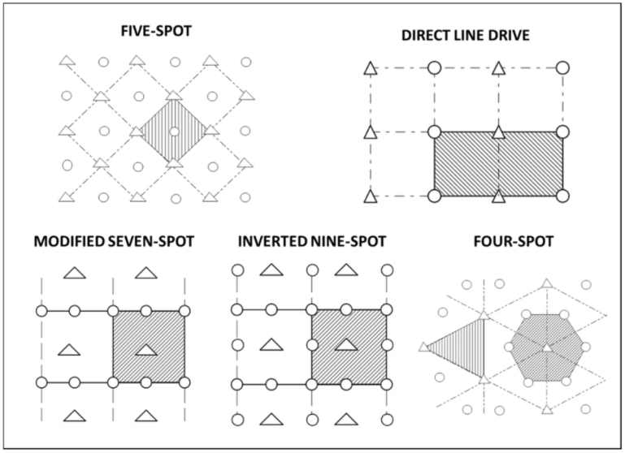
```
<p> &nbsp; </p>

Selain untuk memprediksi performa _miscible_ CO~2~ _flooding_, CO~2~ Prophet juga dapat digunakan untuk memprediksi performa _waterflood_, _miscible_ CO~2~ _WAG_, dan _immiscible_ CO~2~ _flood._
<p> &nbsp; </p>

## Asumsi yang Digunakan Dalam Model

Beberapa asumsi yang digunakan dalam CO~2~ Prophet diantaranya adalah: 

1. Terdapat tiga fasa fluida yang disertakan dalam model, yaitu fasa minyak, fasa air, dan fasa _solvent._
2. User dapat memilih hingga 10 _layer_ untuk digunakan dalam perhitungan. Nilai _default_ untuk jumlah _layer_ adalah 5 _layer._
3. Efek gravitasi diabaikan.
4. Beberapa parameter reservoir dan fluida yang berperan penting dalam model diantaranya adalah koefisien permeabilitas Dykstra-Parsons, viskositas minyak, viskositas air, temperatur
reservoir, tekanan rata-rata reservoir, dan _minimum miscibility pressure_ (MMP).

## Parameter-Parameter Penting yang Digunakan Dalam Model

### Koefisien Permeabilitas Dykstra-Parsons

Koefisien permeabilitas Dykstra-Parsons (V~*dp*~) menyatakan besarnya keheterogenan permeabilitas reservoir secara vertikal. Nilai V~*dp*~ menentukan besarnya _injectivity_ fluida di setiap lapisan reservoir. Nilai _default_ yang digunakan adalah 0.7.

### Temperatur Reservoir

Dalam model, temperatur reservoir digunakan untuk menghitung viskositas CO~2~ di dalam reservoir. Nilai _default_ yang digunakan adalah 100$^\circ$F. 

### Tekanan Rata-Rata Reservoir (_Average Reservoir Pressure_)

Nilai tekanan rata-rata reservoir menentukan kondisi aliran di reservoir. Kondisi aliran dapat berupa _completely miscible flood_, _partially miscible flood_, atau _totally miscible flood_. Nilai _default_ yang digunakan dalam model adalah 2000 psia.

### _Minimum Miscibility Pressure (MMP)_

Sama seperti nilai tekanan rata-rata reservoir, nilai MMP menentukan kondisi aliran yang akan terjadi di reservoir. Jika _user_ menginginkan kondisi _completely miscible_ CO~2~, maka nilai MMP harus berada di bawah nilai tekanan rata-rata reservoir. Nilai default MMP yang digunakan dalam model adalah 1200 psia.

### Viskositas Minyak ($\mu_o$)

Dalam model, viskositas minyak digunakan untuk melakukan perhitungan mobilitas fluida. Nilai _default_ $\mu_o$ yang digunakan dalam model adalah 2 cp.

### Viskositas Air ($\mu_w$)

Dalam model, viskositas minyak digunakan untuk melakukan perhitungan mobilitas fluida. Nilai _default_ $\mu_w$ yang digunakan dalam model adalah 0.8 cp.

### Faktor Volume Formasi Minyak (B~*o*~)

Faktor volume formasi minyak menyatakan perbandingan antara volume fluida di reservoir dengan volume fluida di permukaan. Nilai default yang digunakan dalam model adalah 1.4 bbl/STB.

### _Solution Gas-Oil Ratio_ (R~*s*~)

Nilai kelarutan gas digunakan untuk menghitung jumlah gas hidrokarbon yang terproduksikan. Nilai _defaut_ yang digunakan dalam model adalah 500 scf/STB.

### Permeabilitas Relatif (k~*r*~)

Dalam model, nilai permeabilitas relatif air (k~*rw*~), permeabilitas relatif minyak (k~*ro*~), permeabilitas relatif gas (k~*rg*~), dan permeabilitas relatif solvent (k~*rs*~) dihitung menggunakan persamaan-persamaan berikut:
$$k_{rw}\ = k_{rw}@S_{or} \left( \frac{S_w-S_{wirr}}{1-S_{wirr}-S_{orw}} \right)^{expw} $$
$$k_{ro}\ (oil\ -\ water) = k_{ro}@S_{wc} \left( \frac{1-S_w-S_{orw}}{1-S_{wc}-S_{orw}} \right)^{expow} $$
$$k_{ro}\ (gas\ -\ oil) = k_{ro}@S_{wc} \left( \frac{1-S_{wc}-S_{org}-S_g}{1-S_{wc}-S_{org}} \right)^{expog} $$
$$k_{rg}\ = k_{rg}@S_{wc} \left( \frac{S_g-S_{gr}}{1-S_{wc}-S_{gr}} \right)^{expg} $$
$$k_{rs}\ = k_{rs}@S_{wc} \left( \frac{S_g-S_{gr}}{1-S_{wirr}-S_{sr}-S_{orm}} \right)^{exps} $$
Dimana: <br/>
_S~wirr~_ = _irreducible water saturation (default = 0.2)_ <br/>
_S~orw~_ = _residual oil to waterflood (default = 0.37)_ <br/>
_S~wc~_ = _connate water saturation (default = 0.2)_ <br/>
_S~gr~_ = _residual gas saturation (default = 0.37)_ <br/>
_S~sr~_ = _residual solvent saturation (default = 0.37)_ <br/>
_S~orm~_ = _residual oil saturation to solvent (default = 0.001)_ <br/>
expw = _water equation exponent (default = 2)_ <br/>
expo = _oil equation exponent (default = 2)_ <br/>
expw = _gas equation exponent (default = 2)_ <br/>
expo = _solvent equation exponent (default = 2)_ 

### _Water/CO~2~ Injection Ratio_

___Water/CO~2~ Injection Ratio___ merupakan parameter yang menyatakan periode injeksi air dan CO~2~ dalam injeksi WAG. Parameter ini terkait dengan ___WAG ratio___, seperti diperlihatkan pada tabel di bawah berikut ini.

|WAG Ratio    |Water/CO~2~ Injection Ratio    |
|:---:        |:---:                          |
|2 to 1       |2    |
|1 to 1       |1    |
|1 to 2       |0.5  |
|1 to 3       |0.33 ||

Table: <span style="color: grey;"> Tabel 1.1: Hubungan antara WAG _ratio_ dan _water/CO~2~ injection ratio_ </span>

<br/>
_Water/CO~2~ injection ratio_ daoat ditentukan berdasarkan _time basis_ atau _volume basis_. Jika _user_ memilih _time basis_ dan nilai _water/CO~2~ injection ratio_ adalah 2, maka 67% dari total periode injeksi adalah injeksi air, dan 33% dari total periode injeksi adalah injeksi CO~2~. Jika _user_ memilih _volume basis_ dan nilai _water/injection ratio_ adalah 2, maka 67% dari total volume injeksi fluida adalah air, dan 33% dari total volume injeksi fluida adalah CO~2~.

### _Mixing Parameter ($\omega$)_

_Mixing parameter_ merupakan parameter yang digunakan untuk menggambarkan keadaan _miscibility_ di dalam model. Parameter ini berperan dalam mengatur viskositas efektif untuk fasa _solvent_ dan minyak. Jika , bernilai 0, maka tidak terjadi pencampuran dan fasa _solvent_ dan minyak memiliki nilai viskositas yang berbeda, masing-masing sesuai dengan nilai _immiscible_-nya. Jika $\omega$, bernilai 1, maka terjadi complete mixing dimana fasa minyak dan _solvent_ akan memiliki viskositas yang sama. Nilai default yang digunakan untuk, adalah 0.666.

Viskositas efektif untuk fasa minyak dan _solvent_ masing-masing dinyatakan oleh persamaan berikut:
$$Viskositas\ efektif\ solvent\ = \mu_{se} = (1-\alpha)\mu_s\ + \alpha\mu_{sm} $$
$$Viskositas\ efektif\ minyak\ = \mu_{oe} = (1-\alpha)\mu_o\ + \alpha\mu_{pm} $$
<p> &nbsp; </p>
Untuk kondisi _partially miscible_, yaitu P~*res*~ < _MMP_ dan P~*res*~ > 0.75_MMP_, maka $\alpha$ dinyatakan oleh:
$$\alpha = \frac{P_{res}-0.75MMP}{0.25MMP}$$
<p> &nbsp; </p>
Untuk kondisi _completely miscible_, yaitu P~*res*~ > _MMP_, maka $\alpha$ dinyatakan oleh:
$$\alpha = 1$$
<br/>
$$\mu_{sm} = \mu_s^{1-\omega}\mu_m^\omega$$
$$\mu_{om} = \mu_o^{1-\omega}\mu_m^\omega$$
$$\frac{1}{\mu_m^{0.25}} = \frac{1}{1-S_w} \left(\frac{S_o}{\mu_o^{0.25}} + \frac{S_g}{\mu_s^{0.25}} \right)$$

Dimana: <br/>
_$\mu_s$ = solvent viscosity_ <br/>
_$\mu_o$ = oil viscosity_ <br/>
_$\mu_m$ = mixed viscosity_ <br/>
*$\mu_{sm}$ = mixed solvent viscosity* <br/>
*$\mu_{om}$ = mixed oil viscosity* 

## Tiga Kondisi Aliran Fluida

Proses _flooding_ dapat terjadi dalam tiga kondisi, yaitu kondisi _immiscible flow_, _miscible flow_, dan _partially miscible flow_.

### _Immiscible Flow_

Pada kondisi aliran _immiscible_, permeabilitas relatif solvent merupakan fungsi dari saturasi _solvent_ saja. Pada kondisi ini, permeabilitas relatif minyak (_k_~*ro*~) dinyatakan oleh:

$$k_{ro} = \frac{1}{k_{row}}(A-k_{rg}-k_{rw})$$
$$A = \left( \frac{k_{row}}{k_{ro}@S_{wc}}+k_{rw}\right)\left( \frac{k_{rog}}{k_{ro}@S_{wc}}+k_{rg}\right) $$

### _Miscible Flow_

Pada kondisi aliran _miscible_, permeabilitas relatif fasa _miscible_ (_k_~*rm*~) dihitung dengan persamaan berikut.
$$k_{rm} = \frac{S_o-S_{orm}}{1-S_w-S_{orm}}(k_{row})\ +\ \frac{S_g}{1-S_w-S_{orm}}(k_{rs}) $$

### _Partially Miscible Flow_

Kondisi _partially miscible_ terjadi saat P~*res*~ < _MMP_ dan P~*res*~ > 0.75*MMP*. Pada kondisi ini, permeabilitas efektif minyak dan _solvent_ dinyatakan oleh persamaan berikut.
$$k_{roeff} = (1-\alpha)k_{ro}\ +\ \alpha \left( \frac{S_o-S_{orm}}{1-S_w-S_{orm}} \right)$$
$$k_{rseff} = (1-\alpha)k_{rg}\ +\ \alpha \left( \frac{S_g}{1-S_w-S_{orm}}(k_{rs} \right)$$

dimana:
$$\alpha = \frac{P_{res}-0.75MMP}{0.25MMP}$$

## Hasil Perhitungan dan Tampilan Perangkat Lunak

Hasil perhitungan CO~2~ Prophet memberikan informasi mengenai estimasi dari beberapa parameter performa produksi, diantaranya laju produksi minyak, laju produksi air, laju produksi CO~2~, dan lain sebagainya.

Berikut merupakan tampilan _screenshot_ dari _output_ yang dihasilkan oleh CO~2~ Prophet.

```{r fig.align = 'center', out.width = "50%", fig.cap = "Hasil prediksi performa dari CO~2~ Prophet"}
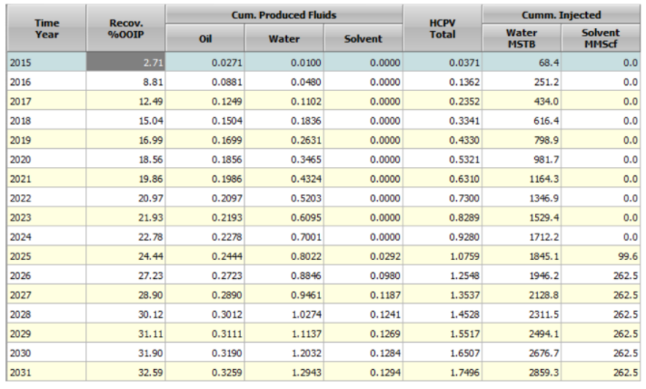
```
<p> &nbsp; </p>

```{r fig.align = 'center', out.width = "50%", fig.cap = "Grafik laju produksi minyak hasil perhitungan CO~2~ Prophet"}
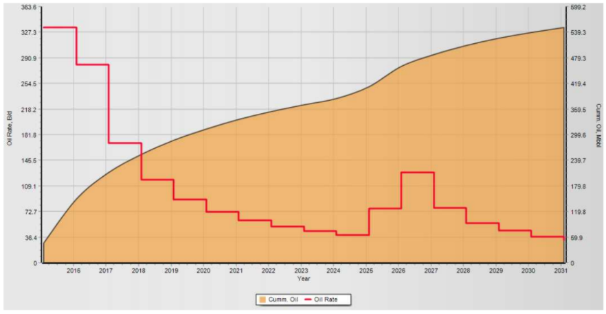
```
<p> &nbsp; </p>

```{r fig.align = 'center', out.width = "50%", fig.cap = "Grafik laju produksi air hasil perhitungan CO~2~ Prophet"}
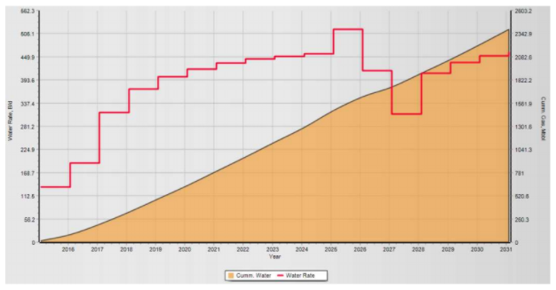
```
<p> &nbsp; </p>

```{r fig.align = 'center', out.width = "50%", fig.cap = "Grafik laju produksi _solvent_ hasil perhitungan CO~2~ Prophet"}
knitr::include_graphics("images/co2prophet/produksisolventprophet.png")
```
<p> &nbsp; </p>

<!--chapter:end:01-intro.Rmd-->

# Waterflood Predictive Model

```{r include=FALSE}
knitr::opts_chunk$set(echo = FALSE)
```

## Pendahuluan

___Waterflooding___ adalah istilah yang digunakan untuk menggambarkan proses injeksi air ke dalam reservoir dengan tujuan untuk menambah tingkat perolehan minyak. _Waterflood predictive model_  merupakan suatu model yang dapat memprediksi performa reservoir di bawah proses _waterflood_.

Analisis performa _waterflood_ membutuhkan informasi mengenai profil saturasi air di reservoi selama periode injeksi air dilakukan. Teori ___frontal displacement___ dari Buckley dan Leverett merupakan teori yang membahas mengenai cara menentukan profil saturasi air di reservoir selama proses _secondary_ atau _tertiary recovery_. Teori ini tidak hanya berlaku untuk prediksi performa reservoir di bawah proses _waterflooding_, tetapi juga berlaku umum untuk seluruh proses _secondary_ dan _tertiary flooding_. Pemahaman mengenai teori _frontal displacement_, yang terdiri dari teori __fractional flow__ dan teori __frontal advance__, sangat penting untuk memprediksi performa reservoir di bawah proses _secondary_ maupun _tertiary flooding_. Berikut akan diberikan pnjelasan mengenai teori _frontal displacement_.

## Teori _Frontal Displacement_ Untuk _Waterflooding_

### Teori _Fractional Flow_ Untuk _Waterflooding_

Teori _fractional flow_ merupakan teori yang membahas mengenai fraksi aliran suatu fasa fluida dalam total aliran yang terdiri atas sejumlah fasa fluida. Melalui teori _fractional flow_, nilai dari fraksi aliran air sebagai fungsi dari saturasi air di reservoir dapat diketahui. Berikut akan dijelaskan mengenai penurunan persamaan _fractional flow_.

Tinjau dua fasa fluida yang mengalir bersamaan di reservoir, yaitu fasa air (*water*) dan fasa minyak (*oil*). Persamaan Darcy (dalam bentuk kecepatan alir Darcy) untuk masing-masing fasaini dinyatakan sebagai berikut.
$$u_o = -\frac{k_o}{\mu_o} \left[ \frac{\partial P_o}{\partial x}+ \rho_o\ g\ \sin \alpha \right]$$
$$u_w = -\frac{k_w}{\mu_w} \left[ \frac{\partial P_w}{\partial x}+\rho_w\ g\ \sin \alpha \right] ... (1)$$Pada persamaan (1) di atas, _k~i~_ menyatakan permeabilitas efektif dari masing-masing fasa. Selanjutnya, dari definisi kecepatan Darcy,
$$u = \frac{q}{A}...(2)$$
Maka substitusi persamaan (2) ke persamaan (1) akan memberikan persamaan berikut.
$$q_o = \frac{-k_o A}{\mu_o} \left[ \frac{\partial P_o}{\partial x}+ \rho_o\ g\ \sin \alpha \right] $$
$$q_w = \frac{-k_w A}{\mu_w} \left[ \frac{\partial P_w}{\partial x}+ \rho_w\ g\ \sin \alpha \right]...(3) $$
Fraksi aliran air (*fractional flow of water - f~w~*) dari total aliran didefinisikan sebagai laju alir fasa air dibagi dengan laju alir total,
$$f_w = \frac{q_w}{q_t} = \frac{q_w}{q_w+q_o}...(4)$$
Dari persamaan (4), diperoleh dua persamaan berikut:
$$q_w = f_w\ q_t$$
$$q_o = (1-f_w)\ q_t$$
Substitusi persamaan (5) ke persamaan (3), maka persamaan aliran untuk fasa minyak dan fasa air menjadi:
$$(1-f_w)\ q_t = -\frac{k_o A}{\mu_o} \left[ \frac{\partial P_o}{\partial x}+ \rho_o\ g\ \sin \alpha \right]$$
$$f_w\ q_t = -\frac{k_w A}{\mu_w} \left[ \frac{\partial P_w}{\partial x}+ \rho_w\ g\ \sin \alpha \right]$$
Persamaan di atas dapat pula dituliskan sebagai:
$$-(1-f_w) \frac{q_t}{A} \frac{\mu_o}{k_o} = \frac{\partial P_o}{\partial x}+ \rho_o\ g\ \sin \alpha $$
$$-f_w \frac{q_t}{A} \frac{\mu_w}{k_w} = \frac{\partial P_w}{\partial x}+ \rho_o\ g\ \sin \alpha...(6) $$
Selanjutnya, dari definisi tekanan kapiler, _P~c~ = P~o~ - P~w~_, diperoleh
$$\frac{\partial P_c}{\partial x} = \frac{\partial P_o}{\partial x} - \frac{\partial P_w}{\partial x}...(7)$$
Selisihkan persamaan aliran fasa minyak dan fasa air dari persamaan (6), kemudian lakukan substitusi persamaan (7) ke persamaan (6), diperoleh:
$$\frac{q_t f_w}{A} \left( \frac{\mu_o}{k_o} +\frac{\mu_w}{k_w} \right) = \frac{\partial P_c}{\partial x} + (\rho_o - \rho_g)\ g\ sin\ \alpha\ + \frac{q_t}{A} \frac{\mu_o}{k_o} $$
$$\frac{q_t f_w}{A} = \frac{\frac{\partial P_c}{\partial x} + (\rho_o - \rho_g)\ g\ sin\ \alpha\ + \frac{q_t}{A} \frac{\mu_o}{k_o}}{\left( \frac{\mu_o}{k_o} +\frac{\mu_w}{k_w} \right)}$$
$$f_w = \frac{1+\frac{k_o}{\mu_o}\frac{A}{q_t} \left( \frac{\partial P_c}{\partial x} + (\rho_o - \rho_g)\ g\ sin\ \alpha\ \right)}{1+\frac{k_o}{k_w}\frac{\mu_w}{\mu_o}}...(8)$$
Persamaan (8) merupakan persamaan _fractional flow_ untuk fasa air. Jika faktor tekanan kapiler dapat diabaikan, dan reservoir berada pada bidang horizontal ( = 0), maka bentuk persamaan _fractional flow of water_ dapat menjadi lebih sederhana, yaitu:
$$f_w = \frac{1}{1+\frac{k_o}{k_w}\frac{\mu_w}{\mu_o}}...(9)$$
Persamaan (9) dapat pula dinyatakan dalam bentuk permeabilitas relatif, yaitu:
$$f_w = \frac{1}{1+\frac{k_{ro}}{k_{rw}}\frac{\mu_w}{\mu_o}}...(10)$$
Analisis lebih lanjut perlu dilakukan terhadap persamaan fraksi aliran air sehingga informasi mengenai nilai fraksi aliran air (*f~w~*) sebagai fungsi dari saturasi air (*S~w~*) di reservoir dapat diperoleh. Plot fraksi aliran air (*f~w~*) terhadap saturasi air (*S~w~*) memiliki bentuk kurva seperti pada gambar berikut.

```{r fig.align = 'center', out.width = "50%", fig.cap = "Kurva fraksi aliran air sebagai fungsi dari saturasi air"}
knitr::include_graphics("images/waterflood/fraksiair.png")
```
<p> &nbsp; </p>

Untuk menyusun kurva _f~w~_ versus *S~w~* seperti di atas, perlu diketahui pernyataan _f~w~_ sebagai fungsi dari *S~w~*, ${f_w = f_w(S_w)}$. Approksimasi pernyataan ${f_w = f_w(S_w)}$ dapat diperoleh melalui analisis kurva rasio permeabilitas relatif terhadap .. Beberapa persamaan berikut memberikan approksimasi nilai fraksi aliran air sebagai fungsi dari saturasi air.
$$\frac{k_{ro}}{k_{rw}} = ae^{bS_w} ...(11)$$
$$f_w = \frac{1}{1+ \left( \frac{\mu_w}{\mu_o} \right)ae^{bS_w}}...(12)$$
$$\left( \frac{\partial f_w}{\partial S_w} \right)_{S_w} = \frac{- \left( \frac{\mu_w}{\mu_o} \right)abe^{bS_w}}{\left[ 1+ \left( \frac{\mu_w}{\mu_o} \right)ae^{bS_w} \right]^2}...(13)$$
Dari kurva rasio permeabilitas relatif (k~ro~/k~rw~) terhadap saturasi air (*S~w~*), nilai koefisien _a_ dan _b_ pada persamaan (11) dapat diketahui. Setelah koefisien _a_ dan _b_ diketahui, maka persamaan (12) dapat digunakan sebagai approksimasi untuk mengetahui nilai _f~w~_ sebagai fungsi *S~w~*. Turunan dari _f~w~_ terhadap *S~w~*, yaitu ($\frac{\partial f_w}{\partial S_w}$), merupakan parameter yang sangat penting dalam penentuan profil saturasi air. Penjelasan mengenai parameter ($\frac{\partial f_w}{\partial S_w}$) akan diberikan kemudian pada subbab tentang teori _frontal advance_.

Kembali ke pembahasan mengenai persamaan _fractional flow_, seperti dijelaskan di awal subbab, persamaan _fractional flow_ adalah persamaan yang memberikan nilai fraksi aliran air sebagai fungsi dari saturasi air. Kurva _f~w~_ versus *S~w~*. seperti yang diperlihatkan pada gambar (1) merupakan kurva yang sangat penting. Sejumlah analisis grafik dapat dilakukan terhadap kurva ini untuk memperoleh sejumlah informasi mengenai parameter-parameter yang akan digunakan dalam analisis performa _waterflooding._ Selain itu, analisis kurva fractional flow terkait erat dengan solusi dari persamaan _frontal_ _advance_ untuk memprediksi profil saturasi air di reservoir selama periode _flooding._ Penjelasan lebih lanjut mengenai hal ini akan diberikan di subbab teori _frontal advance_.

### Teori _Frontal Advance_ Untuk _Waterflooding_

Seperti yang telah disebutkan sebelumnya bahwa teori frontal advance adalah teori yang membahas mengenai cara menentukan profil saturasi air di reservoir selama periode injeksi. Persamaan frontal advance (atau dikenal juga dengan __persamaan Buckley-Leverett__) adalah persamaan dasar yang memberikan kecepatan gerak saturasi air di reservoir sebagai fungsi dari fraksi aliran air. Penurunan persamaan _frontal advance_ adalah sebagai berikut.

Tinjau aliran air melalui suatu elemen volume di dalam pori-pori batuan reservoir. Dengan asumsi: (1) tidak ada transfer massa antara fasa air dan fasa minyak, (2) aliran bersifat _incompressible_, dan (3) fraksi aliran air hanya merupakan fungsi dari saturasi air, maka laju akumulasi massa air di dalam elemen volume tersebut dinyatakan oleh persamaan berikut.
$$A\phi\Delta L \frac{\partial}{\partial t} = (q_w\rho_w)_x - (q_w\rho_w)_{x+\Delta x}...(14)$$
Dengan memnggunakan teorema dalam kalukulus, maka persamaan (14) dapat dinyatakan dalam bentukl persamaan diferensioal orde satu sebagai berikut.
$$ \frac{\partial}{\partial x}(q_w\rho_w) + A\phi \frac{\partial}{\partial t}(q_w\rho_w) = 0 $$
$$ -\frac{\partial}{\partial x}(q_w\rho_w) = A\phi \frac{\partial}{\partial t}(q_w\rho_w)...(15) $$
Dengan asumsi aliran bersifat _incompressible_, maka densitas bernilai konstan sehingga persamaan (15) menjadi:
$$ -\frac{\partial q_w}{\partial x} = A\phi \frac{\partial S_w}{\partial t}...(16) $$
Substitusi persamaan (5) ke dalam persamaan (16), diperoleh:
$$ -\frac{\partial (f_wq_t)}{\partial x} = A\phi \frac{\partial S_w}{\partial t} $$
$$ -q_t\frac{\partial f_w}{\partial x} = A\phi \frac{\partial S_w}{\partial t} $$
$$ -\frac{\partial f_w}{\partial x} = \frac{A\phi}{q_t} \frac{\partial S_w}{\partial t} ...(17)$$
Saturasi air (*S~w~*) merupakan fungsi dari posisi (*x*) dan waktu (*t*) sehingga:
$$S_w = S_w(x,t) $$
$$dS_w = \left( \frac{\partial S_w}{\partial x} \right)dx\ + \left( \frac{\partial S_w}{\partial t} \right)dt ... (18)$$
Selanjutnya, tinjau suatu nilai saturasi air konstan pada elemen volume tersebut sehingga dS~w~ = 0. Maka persamaan (18) menjadi:
$$\left( \frac{\partial S_w}{\partial x} \right)_tdx\ + \left( \frac{\partial S_w}{\partial t} \right)_xdt = 0$$
$$\left( \frac{\partial S_w}{\partial x} \right)_t \frac{dx}{dt}\ + \left( \frac{\partial S_w}{\partial t} \right)_x = 0$$
$$\frac{dx}{dt} = - \frac{\left( \frac{\partial S_w}{\partial t} \right)_x}{\left( \frac{\partial S_w}{\partial x} \right)_t}$$
$$ \left( \frac{\partial S_w}{\partial t} \right)_x = -\frac{dx}{dt} \left( \frac{\partial S_w}{\partial x} \right)_t $$
<center> atau </center>
$$ \left( \frac{\partial S_w}{\partial t} \right)_x = -\left( \frac{dx}{dt} \right)_{S_w} \left( \frac{\partial S_w}{\partial x} \right)_t ...(19)$$
Karena fraksi aliran air (*fractional flow of water, f~w~*) hanya merupakan fungsi dari saturasi air (*S~w~*), maka:
$$f_w = f_w (S_w)$$
$$ \frac{\partial f_w}{\partial x} = \left( \frac{\partial f_w}{\partial S_w} \right) \left( \frac{\partial S_w}{\partial x} \right)...(20) $$
Selanjutnya, lakukan substitusi persamaan (19) dan (20) ke dalam persamaan (17), akan diperoleh:
$$ -\left( \frac{\partial f_w}{\partial S_w} \right) \left( \frac{\partial S_w}{\partial x} \right) = -\frac{A\phi}{q_t} \left( \frac{\partial S_w}{\partial x} \right) \left( \frac{\partial x}{\partial t} \right)_{S_w} $$
$$ \left( \frac{dx}{dt} \right)_{S_w} = \frac{q_t}{A\phi} \left( \frac{\partial f_w}{\partial S_w} \right)_{S_w}...(21)$$
Persamaan (21) merupakan persamaan _frontal advance_ yang menyatakan bahwa kecepatan gerak suatu nilai saturasi air di reservoir berbanding lurus dengan parameter turunan _fractional flow_ terhadap saturasi air, $\left( \frac{\partial f_w}{\partial S_w} \right)$. Dengan melakukan integral terhadap persamaan (21), maka profil saturasi air di reservoir dapat diperoleh, yaitu:
$$(x)_{S_w} = \frac{q_t}{A\phi} \left( \frac{\partial f_w}{\partial S_w} \right)_{S_w} = \frac{q_tt}{A\phi} \left( \frac{f_w - f_{wi}}{S_w - S_{wi}} \right)...(22)$$
Sebelum _waterflooding_ dilakukan, saturasi air di reservoir berada pada keadaan irreducible (*S~wc~*). Saat _waterflooding_ dimulai, air injeksi akan bergerak sepanjang pori-pori batuan reservoir. Pergerakan air injeksi ini memiliki sisi depan yang disebut sebagai _flood front_ (atau disebut juga _shock front_) dengan nilai saturasi *S~wf~* (disebut _front water saturation_). Bentuk profil saturasi air di reservoir berdasarkan prediksi dari persamaan (22) adalah seperti pada gambar berikut.

```{r fig.align = 'center', out.width = "50%", fig.cap = "Profil saturasi air di reservoir selama periode _waterflooding_"}
knitr::include_graphics("images/waterflood/saturasiair.png")
```
<p> &nbsp; </p>

Dari gambar (2) di atas, terlihat bahwa interval nilai saturasi air diantara *S~wc~* dan *S~wf~* memiliki profil yang sama, yaitu garis lurus vertikal. Hal ini berarti semua nilai saturasi yang berada di antara *S~wc~* dan *S~wf~* (*S~wc~* < *S~w~* < *S~wf~*) bergerak dengan kecepatan yang sama, yaitu kecepatan _flood_ _front_ (atau kecepatan _shock_) yang dinyatakan oleh:
$$(v)_{S_{wc} < S_w < S_{wf}} = \frac{q_t}{A\phi} \left( \frac{\partial f_w}{\partial S_w} \right)_{S_{wf}}$$
Sehingga jarak tempuh dari setiap nilai saturasi dalam interval ini adalah sama, yaitu
$$(x)_{S_{wc} < S_w < S_{wf}} = \frac{q_tt}{A\phi} \left( \frac{\partial f_w}{\partial S_w} \right)_{S_{wf}} = \frac{q_tt}{A\phi} \left( \frac{f_{wf} - f_{wi}}{S_{wf} - S_{wi}} \right)...(23)$$ 
Zona dimana semua nilai saturasi air dalam interval tersebut bergerak dengan kecepatan yang sama di dalam pori-pori batuan reservoir disebut sebagai zona stabil (__*stabilized zone*__). Garis biru vertikal pada gambar (2) merupakan _stabilized zone_. Interval nilai saturasi air yang berada di luar interval _stabilized zone_ disebut sebagai _non-stabilized zone_, yaitu interval nilai saturasi di atas *S~wf~* (*S~wf~* < *S~w~* < 1 − *S~or~*) dimana setiap nilai saturasi air bergerak dengan kecepatan yang berbeda sehingga membentuk profil saturasi air yang tidak konstan. Profil saturasi air untuk interval _non- __stabilized zone_ dinyatakan oleh modifikasi dari persamaan (22) untuk interval saturasi air _non-stabilized zone_. Bentuk profil saturasi selama periode injeksi air terdiri atas tiga zona, yaitu _unswept zone_ yang memiliki saturasi air *S~wc~*, _stabilized_ _zone_ dengan nilai saturasi air *S~wf~*, dan _non-stabilized zone_ dengan nilai saturasi air yang berubah-ubah antara *S~wf~* dan (1 – *S~or~*).

```{r fig.align = 'center', out.width = "50%", fig.cap = "Profil saturasi air di reservoir seiring dengan berjalannya waktu"}
knitr::include_graphics("images/waterflood/saturasiair2.png")
```
<p> &nbsp; </p>

Profil saturasi air di reservoir selama periode _flooding_ dapat diketahui dengan menggunakan persamaan (22) dan (23). Penggunaan kedua persamaan ini membutuhkan informasi mengenai nilai turunan _fractional_ _flow_ terhadap saturasi air, yaitu $\left( \frac{\partial f_w}{\partial S_w} \right)_{S_w}$ dan $\left( \frac{\partial f_w}{\partial S_w} \right)_{S_{wf}}$. Nilai kedua parameter ini dapat diperoleh dengan melakukan analisis grafik terhadap kurva _fractional_ _flow_ _of_ _water_, yaitu kurva _f~w~_ versus _S~w~_. Berikut akan diberikan penjelasan mengenai hal ini.

Tinjau interval nilai saturasi air antara *S~wc~* dan *S~wf~*. Pada interval ini, semua nilai saturasi air bergerak dengan kecepatan yang sama, yaitu kecepatan _flood front_. Garis lurus yang ditarik dari Swc dan menyinggung kurva _fractional flow water_ menyatakan parameter $\left( \frac{\partial f_w}{\partial S_w} \right)_{S_{wf}}$, sehingga koordinat titik singgung garis ini terhadap kurva *f~w~* merupakan koordinat dari _front water_, yaitu (*S~wf~*, *f~wf~*). Dari analisis grafik ini, nilai *S~wf~* dan *f~wf~* dapat diketahui sehingga persamaan (23) dapat digunakan untuk mendapatkan profil saturasi air untuk interval *S~wc~* < *S~w~* < *S~wf~*.

Analisis grafik yang serupa juga berlaku untuk interval _non-stabilized zone_, yaitu interval saturasi air *S~wf~* < *S~w~* < *S~or~*. Titik singgung terhadap kurva *f~w~* dari setiap nilai saturasi air yang dipilih pada interval ini (dilambangkan *S~w2~*) akan memberikan nilai fraksi aliran air yang bersesuaian, yaitu *f~w2~*. Dengan diketahuinya nilai (*f~w2~*,*S~w2~*), maka modifikasi dari persamaan (22) dapat digunakan untuk mendapatkan profil saturasi air pada interval ini, yaitu:
$$(x)_{S_{w2}} = \frac{q_tt}{A\phi} \left( \frac{\partial f_w}{\partial S_w} \right)_{S_{w2}} = \frac{q_tt}{A\phi} \left( \frac{f_{w2} - f_{wi}}{S_{w2} - S_{wi}} \right)...(24)$$
Konsep analisis grafik untuk menentukan nilai $\left( \frac{\partial f_w}{\partial S_w} \right)_{S_{wf}}$ dan $\left( \frac{\partial f_w}{\partial S_w} \right)_{S_{w2}}$ diperlihatkan pada kedua gambar berikut.

```{r fig.align = 'center', out.width = "75%", fig.cap = "Analisis grafik pada kurva _f~w~_ untuk menentukan nilai $\\left( \\frac{\\partial f_w}{\\partial S_w} \\right)_{S_{wf}}$ dan $\\left( \\frac{\\partial f_w}{\\partial S_w} \\right)_{S_{w2}}$"}
knitr::include_graphics("images/waterflood/perbandingan.png")
```
<p> &nbsp; </p>

Analisis grafik untuk menentukan $\left( \frac{\partial f_w}{\partial S_w} \right)_{S_w}$ merupakan metode dasar dari teori frontal advance dan diberikan penjelasannya sebagai dasar teori. Pada penelitian ini, metode grafik tidak digunakan. Approksimasi dari nilai $\left( \frac{\partial f_w}{\partial S_w} \right)_{S_w}$ ditentukan dengan menggunakan metode numerik. Subbab selanjutnya akan membahas mengenai hal ini.

### Penentuan parameter $\left( \frac{\partial f_w}{\partial S_w} \right)_{S_w}$ dan Saturasi Air Rata-Rata Reservoir ($\bar S_w$)

Untuk melakukan analisis prediksi performa _waterflooding_, informasi penting yang perlu diketahui selain parameter $\left( \frac{\partial f_w}{\partial S_w} \right)_{S_w}$ adalah nilai saturasi air rata-rata di reservoir selama periode flooding $\bar S_w$. Nilai dari $\bar S_w$ di setiap periode injeksi akan digunakan dalam perhitungan parameter-parameter performa _flooding_.

#### Metode Numerik Untuk Menentukan Nilai $\left( \frac{\partial f_w}{\partial S_w} \right)_{S_w}$

Seperti yang telah diutarakan pada subbab sebelumnya, nilai dari parameter $\left( \frac{\partial f_w}{\partial S_w} \right)_{S_w}$ penting untuk diketahui karena akan digunakan dalam persamaan (22), (23), dan (24) untuk menghitung profil saturasi air di reservoir. Selain itu, parameter ini pun akan banyak digunakan dalam persamaan-persamaan mengenai parameter performa _flooding_ lainnya.

Penelitian ini menggunakan hampiran numerik untuk mencari nilai dari $\left( \frac{\partial f_w}{\partial S_w} \right)_{S_w}$ persamaan hampiran yang digunakan adalah sebagai berikut.
$$k_{ro} = \alpha _1 (1-S_{wD})^m$$
$$k_{ro} = \alpha _1 S_{wD}^n$$
$$\left( \frac{\partial f_w}{\partial S_w} \right)_{S_w} = \frac{f_{S_w}-f_{S_{wi}}}{S_w - S_{wi}} ...(26) $$
$$f_w = \frac{S_{wD}^n}{[S_{wD}^n\ + A(1-S_{wD})^m ]}...(27)$$
$$\frac{\partial f_w}{\partial S_w} = \frac{AB[nS_{wD}^{n-1}(1-S_{wD})^m\ + S_{wD}^n(1-S_{wD})^{m-1}]}{[S_{wD}^n\ + A(1-S_{wD})^m ]^2}...(28)$$
Dimana _S~wD~_ adalah nilai air _dimensionless_, $\alpha _1$, $\alpha _2$, $n$, dan $m$ adlah koefisien-koefisien numerik.
$$A = \frac{\alpha _1}{\alpha _2}\frac{\mu_w}{\mu_o};B = \frac{1}{1-S_{or}-S_{wi}}$$
$$S_{wD} = \frac{S_{w}-S_{wi}}{1-S_{or}-S_{wi}} = B(S_{w}-S_{wi})...(29)$$
Substitusi persamaan (28) ke persamaan (26)
$$ \frac{f_{S_w}-f_{S_{wi}}}{S_w - S_{wi}} = \frac{AB[nS_{wD}^{n-1}(1-S_{wD})^m\ + S_{wD}^n(1-S_{wD})^{m-1}]}{[S_{wD}^n\ + A(1-S_{wD})^m ]^2} $$
$$ \frac{f_{S_w}}{S_w - S_{wi}} = \frac{AB[nS_{wD}^{n-1}(1-S_{wD})^m\ + S_{wD}^n(1-S_{wD})^{m-1}]}{[S_{wD}^n\ + A(1-S_{wD})^m ]^2} $$
Substitusi pernyataan _f~Sw~_ dari persamaan (27),
$$  \frac{\left( \frac{S_{wD}^n}{[S_{wD}^n\ + A(1-S_{wD})^m ]}\right)}  {S_w - S_{wi}} = \frac{AB[nS_{wD}^{n-1}(1-S_{wD})^m\ + S_{wD}^n(1-S_{wD})^{m-1}]}{[S_{wD}^n\ + A(1-S_{wD})^m ]^2} $$
Substitusi pernyataan _S~w~_ dari persamaan (29),
$$  \frac{\left( \frac{S_{wD}^n}{[S_{wD}^n\ + A(1-S_{wD})^m ]}\right)}  {\left(\frac{S_{wD}}{B} + S_{wi} \right) - S_{wi}} = \frac{AB[nS_{wD}^{n-1}(1-S_{wD})^m\ + S_{wD}^n(1-S_{wD})^{m-1}]}{[S_{wD}^n\ + A(1-S_{wD})^m ]^2} $$
$$S_{wD}^n\ + A(1-S_{wD})^m = AnS_{wD}^{n-1}(1-S_{wD})^m\ + AmS_{wD}^n(1-S_{wD})^{m-1} $$
$$A(1-S_{wD})^m[nS_{wD}^{n-1}-1]\ + S_{wD}^n[Am(1-S_{wD})^{m-1}-1] = 0 ...(30)$$
<p> &nbsp; </p>
Solusi dari persamaan (30) untuk _S~wD~_ dapat diperoleh secara iterasi numerik menggunakan __metode Newton__ dengan mendefinisikan fungsi berikut:
$$g(S_{wD}) = A(1-S_{wD})^m[nS_{wD}^{n-1}-1]\ + S_{wD}^n[Am(1-S_{wD})^{m-1}-1]$$
Jika _E_ melambangkan batas toleransi _error_ dari solusi, maka metode Newton diterapkan dengan  mengulangi langkah berikut untuk _k_ = 1, 2 ... sampai diperoleh |(S~wD~)~k+1~ - (S~wD~)~k~| < ~E~. Nilai ~E~ yang digunakan adalah 10^-7^.
$$(S_{wD})_{k+1} = S_{wD})_k - \frac{g((S_{wD})_k)}{g'((S_{wD})_k)}...(31)$$
<p> &nbsp; </p>
Setelah solusi *S~wD~* diperoleh, lakukan substitusi ke persamaan (27), (28), dan (29), untuk mendapatkan nilai dari *f~w~*, $\left( \frac{\partial f_w}{\partial S_w} \right)_{S_w}$, dan *S~w~*. Maka persamaan (22) dapat digunakan untuk mendapatkan profil saturasi air. Prosedur numerik yang sama berlaku dalam oenentuan oarameter-parameter _front saturation_, yaitu *f~wf~*, *S~wf~*, dan $\left( \frac{\partial f_w}{\partial S_w} \right)_{S_wf}$.

#### Penentuan Nilai Saturasi Air Rata-Rata di Reservoir Selama Periode _Waterflooding_

Nilai saturasi air rata-rata di reservoir ($\bar S_w$) untuk periode tertentu selama proses _waterflooding_ dapat ditentukan dengan dua cara, yaitu analisis grafik dan analisis numerik. Penentuan nilai $\bar S_w$ dari analisis grafik diperlihatkan pada gambar (4). Titik potong garis singgung dengan kurva *f~w~* di nilai *f~w~* = 1 memberikan nilai saturasi air rata-rata di reservoir, $\bar S_w$. Untuk periode sebelum dan saat terjadi _water breakthrough_, nilai saturasi air rata-rata di reservoir dinyatakan oleh $\bar S_{wBT}$, sedangkan nilai saturasi air rata-rata di reservoir setelah periode _water breakthrough_ dinyatakan oleh $\bar S_{w2}$.

Metode penentuan nilai $\bar S_w$ yang digunakan pada penelitian ini adalah metode numerik. Penurunan dari persamaan hampiran numerik yang akan digunakan untuk menentukan $\bar S_w$ adalah sebagai berikut.

Nilai saturasi air rata-rata di posisi antara x~1~ dan x~2~, (x~1~ $\leq$ x $\leq$ x~2~) dinyatakan oleh:
$$\bar S_w = \frac{\int_{x_1}^{x_2}S_wA\phi dx}{\int_{x_1}^{x_2}A\phi dx}$$
$$\bar S_w = \frac{\int_{x_1}^{x_2}S_w dx}{x_1-x_2}...(32)$$
Tinjau turunan dari _d(xS~w~)_:
$$d(xS_w) = S_wdx + xdS_w$$
$$S_wdx = d(xS_w) - xdS_w...(33)$$
Substitusi persamaan (33) ke persamaan (32),
$$\bar S_w = \frac{1}{x_1 - x_2} \int_1^2 d(xS_w)-xdS_w$$
$$\bar S_w = \left[ \frac{1}{x_1 - x_2} \int_{x_1S_{w1}}^{x_2S_{w2}} d(xS_w) \right]-\left[ \frac{1}{x_1 - x_2} \int_{1}^{2} xdS_w \right]$$
$$\bar S_w = \frac{x_2S_{w2}-x_1S_{w1}}{x_2-x_1}-\frac{1}{x_2-x_1}\int_1^2xdS_w ...(34)$$
Subtitusi persamaan (22) ke persamaan (34),
$$\bar S_w = \frac{x_2S_{w2}-x_1S_{w1}}{x_2-x_1}-\frac{1}{x_2-x_1}\int_1^2\frac{q_tt}{A\phi} \left( \frac{\partial f_w}{\partial S_w} \right)_{S_w}dS_w$$
$$\bar S_w = \frac{x_2S_{w2}-x_1S_{w1}}{x_2-x_1}-\frac{q_tt}{A\phi}\frac{1}{x_2-x_1}\int_1^2 df_w$$
$$\bar S_w = \frac{x_2S_{w2}-x_1S_{w1}}{x_2-x_1}-\left( \frac{q_tt}{A\phi} \right)\frac{1}{x_2-x_1}\int_1^2 df_w$$
$$\bar S_w = \frac{x_2S_{w2}-x_1S_{w1}}{x_2-x_1}-\left( \frac{q_tt}{A\phi} \right) \left(\frac{f_{w2}-f_{w1}}{x_2-x_1} \right)....(35)$$
Persamaan (35) merupakan persamaan hampiran umum yang digunakan untuk menghitung nilai saturasi air rata-rata di reservoir pada periode tertentu selama waterflooding. Persamaan (35) dapat dibagi atas perhitungan $\bar S_w$ sebelum dan saat terjadi _water breakthrough_, dan perhitungan $\bar S_w$ setelah _water breakthrough_.

Sebelum dan saat _water breakthrough_ terjadi, nilai saturasi air rata-rata di reservoir dinyatakan oleh *S~wBT~*. Posisi 1 (*x~1~*) adalah sumur injeksi dan posisi 2 (*x~2s~*) adalah sumur produksi, sehingga pada persamaan (5), *S~w1~* menyatakan nilai saturasi air di sumur injeksi dan *S~w2~* menyatakan nilai saturasi air di sumur produksi. Untuk periode sebelum dan saat _water breakthrough_ terjadi, *S~w2~* menyatakan nilai saturasi air di sumur produksi saat terjadi _water breakthrough_, yaitu *S~wBT~* atau *S~wf~* (nilai saturasi air di sumur produksi saat water breakthrough sama dengan nilai saturasi air _flood front_, karena saat terjadi _water breakthrough_, flood front sudah mencapai sumur produksi). Maka, persamaan (5) menjadi:

$$\bar S_{wBT} = \frac{LS_{wBT}}{L} - \left( \frac{q_tt}{A\phi} \right) \left( \frac{f_{wBT}-1}{L} \right) = \bar S_{wBT} -\left( \frac{q_tt}{A\phi L} \right)(f_{wBT}-1)$$
$$\bar S_{wBT} = \left( \frac{q_tt}{A\phi L} \right)(f_{wBT}-1)...(36)$$
Nilai saturasi air rata-rata di reservoir pada periode sebelum dan saat _water breakthrough_ dapat dihitung menggunakan persamaan (36). Nilai *S~wf~* dan *f~wf~* diperoleh dari metode numerik yang telah dijelaskan sebelumnya.

Dengan cara yang sama, nilai saturasi air rata-rata di reservoir setelah periode _water breaktrhough_ ($\bar S_{w2}$) dapat dihitung menggunakan persamaan berikut:
$$\bar S_{w2} = S_{w2}-\left( \frac{q_tt}{A\phi L} \right)(f_{wBT}-1)...(37)$$
dimana *S~w2~* adalah nilai saturasi air di sumur produksi setelah periode _water breakthrough_.

Gambar berikut memperlihatkan konsep saturasi air rata-rata di reservoir pada periode sebelum dan saat terjadi _water breakthrough_, dan periode setelah _water breakthrough_. Gambar di bawah juga memperlihatkan nilai saturasi air di sumur injeksi dan sumur produksi untuk kedua periode ini.

```{r fig.align = 'center', out.width = "75%", fig.cap = "(a) Profil saturasi air di reservoir sebelum sampai saat terjadi water breakthrough dengan __$\\bar S_{wBT}$__ menyatakan nilai saturasi air rata-rata di reservoir selama periode ini terjadi;(b) Profil saturasi air setelah periode water breakthrough dengan __$\\bar S_{w2}$__ menyatakan nilai saturasi air rata-rata di reservoir selama periode ini"}
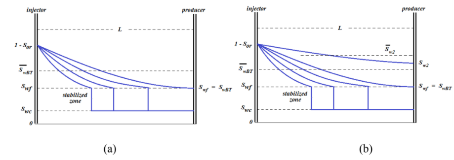
```
<p> &nbsp; </p>

## Penentuan Parameter Efisiensi _Waterflooding_

Prediksi performa reservoir di bawah proses waterflood dilakukan melalui perhitungan terhadap tiga parameter efisiensi _flooding_, yaitu ___displacement efficiency (E*D*), areal sweep efficiency (E*A*), dan vertical sweep efficiency (E*V*)___. Ketiga parameter efisiensi di atas merupakan parameter yang berlaku baik pada proses _secondary recovery_ maupun _tertiary recovery_. Nilai dari ketiga parameter efisiensi di atas akan meningkat selama proses _waterflood_ dilakukan dan akan mencapai nilai maksimum di economic limit dari proyek _waterflood._ Berikut akan diberikan penjelasan singkat dari ketiga parameter ini.

### _Displacement Efficiency_ (E~D~)

_Displacement efficiency (E~D~)_ merupakan parameter yang menyatakan fraksi minyak residu yang telah tersapu oleh fluida injeksi setiap waktu. Persamaan untuk menghitung _E~D~_ adalah:
$$E_D = \frac{volume\ minyak\ saat\ awal\ flooding\ - volume\ minyak\ residu}{volume\ minyak\ saat\ awal\ flooding}$$
$$E_D = \frac{(pore\ volume)(\frac{S_{oi}}{B_{oi}})-(pore\ volume)(\frac{S_{o}}{B_{o}})}{(pore\ volume)(\frac{S_{oi}}{B_{oi}})} = \frac{\frac{S_{oi}}{B_{oi}}-\frac{\bar S_{o}}{B_{o}}}{\frac{S_{oi}}{B_{oi}}}$$
Dengan mengasumsikan nilai konstan dari faktor volue formasi minyak, persamaan di atas menjadi:
$$E_D = \frac{S_{oi}-S_{oi}}{\bar S_{o}}=\frac{\bar S_{w} - S_{wi} - S_{gi}}{1 - S_{wi} - S_{gi}}...(38)$$
Jika tidak terdapat _initial gas saturation_ (*S~gi~* = 0) saat awal _flooding_,
$$E_D = \frac{\bar S_{w} - S_{wi}}{1-S_{wi}}$$

### _Areal Sweep Efficiency_ (E~A~)

_Areal sweep efficiency_ (*E~A~*) merupakan parameter yang menyatakan fraksi total area injeksi yang telah tersapu oleh fluida injeksi. Nilai *E~A~* bergantung pada beberapa parameter, diantaranya _mobility ratio_, pola injeksi yang digunakan, volume air inj_eksi kumulatif, distribusi tekanan antara sumur injeksi dengan sumur produksi, dan keheterogenan areal. Diantara parameter-parameter ini, _mobility ratio merupakan parameter yang paling penting.

Mobilitas suatu fluida (dilambangkan $\lambda$) didefinisikan sebagai perbandingan antara permeabilitas efektif suatu fasa fluida dengan viskositas fasa fluida tersebut. Mobilitas fluida sangat dipengaruhi oleh saturasi fluida yang bersangkutan. Mobilitas untuk setiap fasa fluida reservoir dinyatakan sebagai berikut.

$$\lambda_o = \frac{k_o}{\mu_o}=\frac{kk_{ro}}{\mu_o}$$
$$\lambda_w = \frac{k_w}{\mu_w}=\frac{kk_{rw}}{\mu_w}$$
$$\lambda_g = \frac{k_g}{\mu_g}=\frac{kk_{rg}}{\mu_g}...(40)$$
<p> &nbsp; </p>
Dari definisi mobilitas fluida, maka __*mobility ratio*__ (dilambangkan __*M*__) didefinisikan sebagai perbandingan antara mobilitas fasa fluida injeksi terhadap mobilitas fasa fluida terpindahkan. Dalam hal _waterflooding_, fasa fluida pendorong (fluida injeksi) adalah air dan fasa fluida terpindahkan adalah minyak, sehingga
$$M = \frac{\lambda_{pendorong}}{\lambda_{terpindahkan}}=\frac{\lambda_w}{\lambda_o}=\frac{kk_{rw}}{\mu_w}\frac{\mu_o}{kk_{ro}}=\frac{k_{rw}}{k_{ro}}\frac{\mu_o}{\mu_w}...(41)$$
Perhitungan _M_ sepanjang periode _waterflooding_ untuk periode sebelum water breakthrough dan setelah _water breakthrough_ diberikan oleh persamaan (42) dan (43). Persamaan (42) adalah persamaan yang digunakan untuk menghitung nilai _M_ untuk periode awal injeksi hingga _water breakthrough_, sedangkan persamaan (43) adalah persamaan yang digunakan untuk menghitung nilai _M_ dari mulai periode _water breakthrough_ hingga akhir periode injeksi.
$$M= \frac{k_{rw}@\bar S_{wBT}}{k_{ro}@\bar S_{wi}}\frac{\mu_o}{\mu_w}...(42)$$
$$M= \frac{k_{rw}@\bar S_{w2}}{k_{ro}@\bar S_{wi}}\frac{\mu_o}{\mu_w}...(43)$$
Nilai _E~A~_ untuk setiap periode injeksi dinyatakan oleh:
_E~A~_ sebelum periode _water breakthrough_:
$$E_A = \frac{W_{inj}}{(PV)(\bar S_{wBT}- S_{wi})}...(44)$$
_E~A~_ saat _water breakthrough_:
$$E-A = 0.54602036 + \frac{0.03170817}{M} + \frac{0.30222997}{e^M} - 0.00509693M...(45)$$
_E~A~_ setelah periode _water breakthrough_:
$$E_A = E_{ABT} + 0.633log\left( \frac{W-{inj}}{W-{iBT}} \right)$$
<center> atau </center>
$$E_A = E_{ABT} + 0.2749ln\left( \frac{W-{inj}}{W-{iBT}} \right)...(46)$$
### _Vertical Sweep Efficiency_ (E~V~)

_Vertical Sweep Efficiency_ _(E~V~)_ merupakan parameter yang menyatakan fraksi vertikal reservoir yang telah tersentuh oleh fluida injeksi. Variasi permeabilitas secara vertikal merupakan parameter yang pengaruhnya dianggap paling signifikan terhadap nilai _E~V~_.

Dykstra-Parsons menyusun korelasi yang menghubungkan _E~V~_ dengan parameter _V~DP~_ (koefisien variasi permeabilitas Dykstra-Parsons), _mobility ratio M_, dan _water-oil ratio_ (WOR). Korelasi ini dinyatakan dalam bentuk parameter korelasi Y yang dinyatakan sebagai:
$$Y = \frac{(WOR+0.4)(18.948 - 2.499V_{DP})}{(M - 0.8094V_{DP}+1.137)10^x} ...(47)$$
dimana
$$x = 1.6453V^2 + 0.935V - 0.6891$$
Nilai _E~V~_ dihitung menggunakan metode iterasi terhadap persamaan berikut:
$$\alpha_1E_V^{\alpha_2}(1-E_V)^{\alpha_3} - y = 0 ...(48)$$
Pada persamaan (48), nilai Y diperoleh dari persamaan (47) sedangkan nilai dari parameter-parameter $\alpha_1$, $\alpha_2$, dan $\alpha_3$ berturut-turut adalah 3.334088568, 0.7737348199, dan 1.225859406.

## Persamaan-Persamaan yang Digunakan Dalam Prediksi Performa _Waterflooding_

Beberapa parameter performa _waterflooding_ beserta persamaan yang digunakan untuk menghitung parameter tersebut dirangkum pada tabel berikut, dimana masing-masing kolom mewakili dua periode _waterflood_, yaitu periode sebelum _water breakthrough_ dan setelah _water breakthrough_.

|No   |Parameter    |Sebelum dan Saat _Water Breakthrough_    |Setelah _Water Breakthrough_   |
|:---:        |:---:        |:---:    |:---:    |
|1       |Jumlah _pore volume_(PV) injeksi air, ($Q_i$)    |$Q_{iBT}=\frac{1}{\left( \frac{\partial f_w}{\partial S_w} \right)_{S_{wf}}}=\bar S_{wBT} - S_{wi}$    |$Q_i = \frac{1}{\left( \frac{\partial f_w}{\partial S_w} \right)_{S_{w2}}}$    |
|2       |Volume injeksi air kumulatif, ($W_i$)    |$W_{iBT} = (PV)(\bar S_{wBT}-S_{wi})E_{ABT}E_{VBT}$ $W_{iBT}=(PV)Q_{iBT}E_{ABT}E_{VBT}$    |$W_{inj}=(PV)(\bar S_{w2}-S_{wi}E_AE_V)$ $W_{inj} = (PV)Q_iE_AE_V$   |
|3       |*Displacement efficiency* ($E_D$)    |$E_{DBT} = \frac{\bar S_{wBT} - S_{wi}}{1-S_{wi}}$    |$E_{D} = \frac{\bar S_{w2} - S_{wi}}{1-S_{wi}}$   |
|4       |*Displacement efficiency* ($E_A$)    |Sebelum BT: persamaan (44) </br> Saat BT: persamaan (45)    |Persamaan (46)   |
|5       |*Displacement efficiency* ($E_V$)    |Persamaan (48)    |Persamaan (48)   |
|6       |Waktu _breakthrough_, _t_    |$t_{BT} = \frac{W_{iBT}}{q_t}=\frac{W_{iBT}}{i_w}$    |$t_{BT} = \frac{W_{inj}}{q_t}=\frac{W_{inj}}{i_w}$   |
|7       |Koefisien Variasi Permeabilitas Dystra-Parsons, $V_{DP}$    |$V_{DP}=\frac{k_{50}-k_{84.1}}{k_{50}}$    |$V_{DP}=\frac{k_{50}-k_{84.1}}{k_{50}}$ |
|8       |*Mobiity Ratio, M*   |$M=\frac{k_{rw}@\bar S_{wBT}}{k_{ro}@\bar S_{wi}}\frac{\mu_o}{\mu_w}$    |$M=\frac{k_{rw}@\bar S_{w2}}{k_{ro}@\bar S_{wi}}\frac{\mu_o}{\mu_w}$   |
|9       |*Water-Oil-ratio* (WOR)    |Sebelum BT: _WOR_ = 0 </br> Saat BT: (_WOR_)~s~ = $\frac{B_o}{B_w \left(\frac{1}{f_{wBT}} \right)-1}$    |(_WOR_)~s~ = $\frac{B_o}{B_w \left(\frac{1}{f_{w2}} \right)-1}$   |
|10      |Kumulatif produksi minyak, $N_p$    |Saat BT: $N_{PBT}=N_sE_{DBT}E_{ABT}E_{VBT}$    |$N_{P}=N_sE_{D}E_{A}E_{V}$   |
|11      |Kumulatif produksi air, $W_p$    |Sebelum BT: $W_p = 0$    |$W_p = \frac{W-{inj}- (N_pB_o)}{B_w}$   |
|12      |Laju produski minyak, $Q_o$    |$Q_o = \frac{q_t}{B_o}=\frac{i_w}{B_o}$    |$Q_o=\frac{i_w}{B_o+B_w(WOR)_s}$   |
|13      |Laju produski air, $Q_w$    |Sebelum BT: $Q_w = 0$    |$Q_w = Q_o(WOR)_s$   |

Table: <span style="color: grey;"> Tabel 3.1: Persamaan-persamaan yang digunakan dalam perhitungan performa _waterflood_ </span>

## Persamaan-Persamaan Dasar dan Nilai _Default_ yang digunakan Dalam _Predictive Model_

### Viskositas Minyak

Viskositas minyak, $\mu_o$ dihitung menggunakan korelasi Beggs-Robinson. Korelasi Beggs-Robinson terlebih dahulu menghitung nilai viskositas _dead oil_, $\mu_{od}$.
$$\mu_{od}=10^x-1...(49)$$
dengan:
$$X = \frac{Y}{T^{1.163}}$$
$$Y=10^Z$$
$$Z=3.0324-0.022023(API)$$
Selanjutnya, viskositas _live oil_ dihitung dengan menggunakan persamaan berikut.
$$\mu_o= A(\mu_{od})^B...(50)$$
dengan:
$$A=\frac{10.715}{(R_s + 100)^{0.515}}$$
$$B = \frac{5.44}{(R_s + 150)^{0.338}}$$
dimana: </br>
_T_ = temperatur reservoir, $\circ$F </br>
_R~s~_ = _solution gas-oil ratio_, SCF/STB

### _SolUtion Gas-Oil Ratio_

_Solution gas-oil ratio_, _R~s~_, dihitung menggunakan korelasi Vasquez-Beggs. Dalam korelasi Vasquez-Beggs, nilai s_pecific gravity gas_, $\gamma_g$, terlebih dahulu dikoreksi ke dalam kondisi tekanan _separator_ 100 psig dan temperatur _separator_ (temperatur _separator_ diasumsikan sama dengan temperatur reservoir).
$$\gamma_{g.100} = \gamma_g \left[ 1+\left( (5.912(10)^{-5}(API)(T)log \left( \frac{64.7}{114.7} \right) \right) \right]...(51)$$
Selanjutnya, nilai _soultion gas-oil ratio_ dihitung sebagai berikut. </br>
Untuk _API_ $\leq$ 30:
$$R_s = 0.0362 \gamma_{g.100} P_{form}^{1.0937}exp \left[ 25.724 \left( \frac{API}{T+460} \right)\right]...(52)$$
Untuk _API_ > 30:
$$R_s = 0.0178 \gamma_{g.100} P_{form}^{1.187}exp \left[ 23.931 \left( \frac{API}{T+460} \right)\right]...(53)$$

### Faktor Volume Formasi Minyak

Faktor volume formasi minyak, _B~o~_, dihitung menggunakan korelasi Vasquez-Beggs.
$$B_o = 1 + C_1R_s+(C_2+C_3R_s)(T-60) \left( \frac{API}{\gamma_{g.100}} \right) ...(54)$$
dimana: </br>
Untuk _API_ $\leq$ 30:
$$C_1 =4.677(10^{-4})$$
$$C_2 =1.751(10^{-5})$$
$$C_3 =-1.811(10^{-8})$$

### Permeabilitas Relatif

Nilai permeabilitas relatif minyak (*k~ro~*) dan air (*k~rw~*) dihitung menggunakan korelasi Corey.
$$u_o = \frac{1-S_{w}-S_{orw}}{1-S_{wc}-S_{orw}}...(55)$$
$$k_{ro}=X_{k_{roe}}u_o^{X_{no}}...(56)$$
$$u_w = \frac{S_{w}-S_{wc}}{1-S_{wc}-S_{orw}}...(57)$$
$$k_{rw}=X_{k_{rwe}}u_w^{X_{nw}}...(58)$$
dimana: </br>
$S_w$ = saturasi air </br>
$S_{wc}$ = _connate water saturation_ </br>
$S_{orw}$ = saturasi minyak residu </br>
$X_{k_{roe}}$ = nilai permeabilitas relatif minyak saat $S_{wc}$ </br>
$X_{k_{rwe}}$ = nilai permeabilitas relatif air saat $S_{orw}$ </br>
$X_{no}$ = eksponen kurva permeabilitas relatif minyak </br>
$X_{nw}$ = eksponen kurva permeabilitas relatif air </br>

### Nilai _Default_ Parameter yang Digunakan Dalam Model

Tabel berikut merangkum persamaan dan nilai _default_ yang digunakan dari sejumlah parameter dalam _predictive model_.

|Parameter   |Nilai _Default_ yang Digunakan   |
|:---:    |:---:    |
|Tekanan formasi, $P_{form}$   |$P_{form}=15+0.433 (depth)$   |
|Temperatur formasi, $T$   |$T=60+0.017(depth)$   |
|*Specific gravity gas*, $\gamma_g$   |$\gamma_g = 0.8$   |
|Koefisien variasi permeabilitas Dystra-Parsons, $V_{DP}$   |$V_{DP}=0.72$   |
|Jumlah lapisan reservoir   |Minimum = 1 </br> Maksimum = 10   |
|Faktor volume formasi air, $B_w$   |Korelasi Keenan dan Keyes: </br> $B_w=1+1.2(10^{-4})(T-60)+1(10^{-6})(T-60)^2-3.33(10^{-6})P_{form}$   |
|Viskositas air, $\mu_w$   |Korelasi Van Wingen: </br> $\mu_w = exp[1.003-1.479(10^{-2})T+1.982(10^{-5})T^2]$   |
|*Connate water saturation*, $S_{wc}$   |$S_{wc}=0.3$   |
|Saturasi minyak residu, $S_{orw}$  |Untuk tipe batuan _sandstone_, $S_{orw}=0.25$ </br> Untuk tipe batuan karbonat, $S_{orw}=0.38$   |
|Permeabilitas relatif minyak saat $S_{wc}$, $X_{k_{roe}}$   |Untuk tipe batuan _sandstone_, $X_{k_{roe}}=0.8$ </br> Untuk tipe batuan karbonat, $X_{k_{roe}}=0.4$   |
|Permeabilitas relatif air saat $S_{orw}$, $X_{k_{rwe}}$   |Untuk tipe batuan _sandstone_, $X_{k_{rwe}}=0.2$ </br> Untuk tipe batuan karbonat, $X_{k_{rwe}}=0.3$  |
|Eksponen kurva permeabilitas relatif minyak, $X_{no}$|$X_{no}=2$|
|Eksponen kurva permeabilitas relatif air, $X_{nw}$|$X_{nw}=2$|
|Radius sumur, $r_w$|$r_w=0.5ft$|

Table: <span style="color: grey;"> Tabel 3.2: Nilai _default_ yang digunakan dari sejumlah parameter dalam _predictive model_ </span>

<!--chapter:end:02-literature.Rmd-->

# Chemical Flood Predictive Model 

```{r include=FALSE}
knitr::opts_chunk$set(echo = FALSE)
```

## Pendahuluan

Injeksi kimia (*chemical flooding*) merupakan bagian dari metode _Enhanced Oil Recovery_ (EOR)yang menggunakan injeksi larutan kimia yang akan bereaksi secara kimiawi (*chemical liquid*) di reservoir. Zat kimia yang umumnya digunakan adalah surfaktan, polimer, dan alkali. _Chemical flooding_ dapat dibedakan berdasarkan tipe zat kimia yang digunakan, diantaranya injeksi polimer, injeksi surfaktan, injeksi alkali (disebut juga _caustic flooding_), injeksi surfaktan-polimer (disebut juga _micellar flooding_), injeksi alkali-polimer (disebut juga _caustic-polymer flooding_), dan injeksi alkali-surfaktan-polimer (*ASP flooding*).

Laporan ini membahas mengenai penyusunan *chemical flood predictive model* untuk memprediksi performa reservoir di bawah pengaruh injeksi kimia. Tipe injeksi kimia yang ditinjau dalam model adalah injeksi surfaktan-polimer (*micellar-polymer* (MP) *flood*), injeksi alkali (*caustic flood*), dan injeksi alkali-polimer (*caustic-polymer flood*). Dalam *predictive model*, *chemical flood* diasumsikan terjadi setelah penerapan *waterflood*, sehingga *chemical flood* dipandang sebagai proses perolehan tersier.

Injeksi surfaktan-polimer (MP *flood*) ditentukan sebagai model default dalam *predictive model*, dengan dua pilihan metode lainnya, yaitu *caustic flood *dan *caustic-polymer flood*, dimana perhitungan prediksi performa dari *caustic* dan *caustic-polymer flood* ditentukan berdasarkan performa dari MP *flood*, yaitu masing-masing sebesar 15% dan 40% dari nilai prediksi MP *flood* untuk parameter perolehan minyak.

Algoritma *predictive model* dibangun dari tinjauan teori dan studi simulasi. Terdapat sejumlah faktor yang pengaruhnya dianggap paling signifikan terhadap performa produksi MP *flood*. Faktor-faktor ini diantaranya adalah bilangan kapiler (*capillary number*), keheterogenan reservoir (*reservoir heterogeneity*), *crossflow*, adsorpsi surfaktan pada batuan formasi, dan *wettability*.

Teori *fractional flow* digunakan untuk melakukan analisis terhadap beberapa parameter performa *flooding*, seperti *oil breakthrough*, *surfactant breakthrough*, perolehan minyak (*oil recovery*), dan *project life*. Efisiensi perolehan minyak (*oil recovery efficiency*) ditentukan sebagai hasil kali antara *displacement efficiency* (*E~D~*), *vertical sweep efficiency* dari surfaktan (*E~V~*), dan *polymer sweep* atau *mobility buffer* *sweep efficiency* (*E~MB~*). Koreksi adanya *crossflow* terhadap nilai efisiensi perolehan minyak dilakukan melalui korelasi yang merupakan fungsi dari rasio $\frac{k_v}{k_h}$.
 
*Displacement efficiency* ditentukan dari korelasi yang merupakan fungsi dari bilangan kapiler, sedangkan *vertical sweep efficiency* dihitung menggunakan korelasi yang diperoleh dari studi simulasi. Korelasi ini merupakan fungsi dari ukuran injeksi *slug* surfaktan, adsorpsi surfaktan pada batuan formasi, dan keheterogenan reservoir. *Polymer sweep* juga ditentukan berdasarkan korelasi dari hasil simulasi. Korelasi yang dibangun merupakan fungsi dari ukuran *slug* injeksi polimer dan *vertical sweep efficienc*y.

Efek keheterogenan reservoir terhadap kecepatan *front* surfaktan dan *oil bank* disertakan dalam model melalui korelasi yang merupakan fungsi dari koefisien variasi permeabilitas Dykstra-Parsons, (*V~DP~*).

Sebelum membahas mengenai algoritma *predictive model*, akan terlebih dahulu dibahas mengenai sifat fisis dan mekanisme dari surfaktan dan alkali.

## Tinjauan Sifat Fisis dan Mekanisme Kerja Dari Surfaktan dan Alkali

### Sifat Fisis dan Mekanisme Kerja Surfaktan

Surfaktan merupakan senyawa aktif penurun tegangan permukaan (*surface active agent*) yang mempunyai struktur bipolar. Bagian kepala bersifat hidrolifik dan bagian ekor bersifat hidrofobik menyebabkan surfaktan cenderung memposisikan dirinya di permukaan atau bidang batas antar fasa yang berbeda polaritasnya seperti minyak dan air. Kegunaan surfaktan antara lain untuk menurunkan tegangan permukaan, tegangan antarmuka, meningkatkan kestabilan partikel yang terdispersi dan mengontrol jenis formasi emulsi, misalnya _oil in water_ (O/W) atau _water in oil_ (W/O). Di samping itu, surfaktan akan terserap ke dalam permukaan partikel minyak atau air sebagai penghalang yang akan mengurangi atau menghambat penggabungan (*coalescence*) dari partikel yang terdispersi (Rieger, 1985).

```{r fig.align = 'center', out.width = "50%", fig.cap = "Molekul Surfaktan"}
knitr::include_graphics("images/chemical/molekul.png")
```
<p> &nbsp; </p>

Berdasarkan gugus hidrofiliknya, molekul surfaktan dibedakan ke dalam 4 kelompok (Rieger, 1985; Rosen, 2004), yaitu:

a. Surfaktan anionik </br>
Surfaktan anionik adalah molekul yang bermuatan negatif pada gugus hidrofilik atau aktif permukaan (*surface-active*), seperti gugus sulfat atau sulfonat.<p> &nbsp; </p>
b. Surfaktan kationik </br>
Surfaktan kationik H adalah senyawa yang bermuatan positif pada gugus hidrofiliknya atau bagian aktif permukaan, seperti quarternery ammonium salt (QUAT).<p> &nbsp; </p>
c. Surfaktan non-ionik</br>
Surfaktan non-ionik adalah surfaktan yang tidak bermuatan atau tidak terjadi ionisasi molekul. Sifat hidrofilik disebabkan karena keberadaan gugus oksigen eter atau hidroksil.<p> &nbsp; </p>
d. Surfaktan amfoterik</br>
Surfaktan amfoterik adalah surfaktan yang bermuatan positif dan negatif pada molekulnya, dimana muatannya bergantung kepada pH. Pada pH rendah akan bermuatan negatif dan pada pH tinggi akan bermuatan positif. (Mathenson, 1996; Rosen, 2004).<p> &nbsp; </p>

Dalam aplikasinya, keempat jenis surfaktan tersebut memiliki fungsi yang spesifik dan kondisi lingkungan kerja yang spesifik. Surfaktan anionik sangat baik digunakan untuk stimulasi batuan _sandstone._ Adanya unsur silika di dalam batuan _sandstone_ yang bermuatan negatif akan menyebabkan _water wet_ pada formasi batuan _sandstone._ Kondisi ini akan menyebabkan turunnya gaya adhesi antara minyak dan batuan sehingga minyak akan lepas dan lebih mudah mengalir dan sifat batuan akan berubah menjadi _water wet_. Sebaliknya pada batuan _limestone_ yang bermuatan positif, penggunaan surfaktan anionik akan menyebabkan batuan bersifat _oil wet_ (Allen and Robert, 1993).

Surfaktan kationik dengan muatan gugus hidrofiliknya yang positif akan merubah *wettability* batuan yang memiliki muatan positif menjadi water wet seperti batuan karbonat dan akan merubah *wettability* batuan yang bermuatan negatif seperti batuan sandstone menjadi *oil* *wet.* Berbeda dengan surfaktan anionik dan kationik, surfaktan non-ionik yang tidak memiliki muatan pada gugus hidrofiliknya menyebabkannya *compatible* pada kedua jenis batuan. Surfaktan nonionik akan menyebabkan water wet baik pada batuan karbonat maupun *sandstone.* Sedangkan penggunaan surfaktan amfoterik pada kedua jenis batuan tersebut tergantung pada pH larutan dimana surfaktan tersebut bekerja. Pada kondisi pH > 7 (basa), gugus hidrofilik surfaktan amfoterik akan bermuatan positif sehingga akan menyebabkan *water* *wet* pada batuan yang memiliki muatan positif (karbonat). Pada pH < 7 (asam), gugus hidrofilik surfaktan amfoterik akan bermuatan negatif sehingga akan menyebabkan *water* *wet* pada batuan yang memiliki muatan negatif (*sandstone*), sedangkan pada pH = 7, gugus hidrofilik surfaktan amfoterik tidak akan bermuatan. Namun pada aplikasi stimulasi surfaktan, surfaktan amfoterik digunakan terbatas sebagai pencegah korosi dan agen pembusa (Allen and Robert, 1993; Mulyadi, 2002).

Menurut Mathenson (1996), kelompok surfaktan yang penggunaannya dalam jumlah terbesar adalah surfaktan anionik. Karakteristiknya yang hidrofilik disebabkan karena adanya gugus ionik yang cukup besar, yang biasanya berupa grup sulfat atau sulfonat. Beberapa contoh surfaktan anionik, yaitu *linear alkilbenzen sulfonat* (LAS), *alcohol sulfat* (AS), *alcohol eter sulfat* (AES), *alfa olefin sulfonat* (AOS), paraffin (*secondary alkane sulfonate*, SAS), dan *metil ester sulfonat* (MES).

Mekanisme surfaktan dalam proses *Enhanced Oil Recovery* adalah dengan cara menurunkan tegangan antarmuka, mengubah *wettability*, bersifat sebagai *emulsifier*, menurunkan viskositas dan menstabilkan dispersi sehingga memudahkan proses produksi. Untuk mendorong minyak yang terjebak dalam pori batuan, maka gaya kapilaritas dalam pori-pori harus diturunkan dengan cara menurunkan nilai IFT (*Interfacial Tension*) dan menurunkan saturasi minyak. Surfaktan yang berada di dalam *slug* harus dibuat agar membentuk *micelle*, yaitu surfaktan yang aktif dan mampu mengikat air dan minyak pada konsentrasi tertentu. Jika konsentrasinya masih kecil,maka campuran surfaktan tersebut masih berupa monomer (belum aktif). Untuk itu, setiap slug perlu diketahui *critical micelles concentration* (CMC), yaitu nilai konsentrasi tertentu dimana surfaktan yang semula monomer berubah menjadi *micelles*. Hal yang penting dalam proses penggunaan surfaktan untuk menghasilkan *recovery* minyak yang tinggi adalah (Pithapurwala, et al, 1986): 

- Memiliki IFT yang sangat rendah (minimal 10-3 dyne/cm) antara _chemical bank_ dan _residual oil_; dan antara _chemical bank_ dan _drive fluid_.
- Memiliki kecocokan dengan air formasi dan kestabilan terhadap temperatur.
- Memiliki _mobility control_.
- Kelayakan ekonomis proses.

Proses injeksi surfaktan perlu memperhatikan besar bilangan kapiler terhadap penurunan saturasi minyak tersisa (*S~or~*). Biasanya reservoir yang diinjeksi surfaktan memiliki harga saturasi minyak tersisa di bawah 45% dengan nilai bilangan kapiler berkisar 10^-4^ - 10^-2^, sehingga pendesakan surfaktan optimal. Semakin rendah saturasi minyak tersisa pada suatu reservoir, maka semakin besar bilangan kapiler yang dibutuhkan agar pendesakan surfaktan optimal (Lake, 1989). Untuk memperbesar bilangan kapiler diperlukan tegangan antarmuka yang rendah. Hubungan antara bilangan kapiler dengan tegangan antar muka adalah sebagai berikut.
$$N_{cap}=\mu \frac{\nu}{\sigma}...(1)$$
dimana N~c~ adalah bilangan kapiler, $\mu$ adalah viskositas fluida pendesak (cP), $\nu$ adalah laju injeksi fluida pendesak, dan $\sigma$ adalah tegangan antarmuka (dyne/cm).

Penurunan nilai tegangan antarmuka dapat dilakukan dengan menambahkan surfaktan. Surfaktan yang baik adalah mampu menurunkan nilai tegangan permukaan hingga _ultra low_ IFT yaitu lebih rendah dari 10^-2^ dyne/cm, karena pada kondisi tersebut maka bilangan kapiler akan semakin tinggi sehingga _recovery factor_ (RF) juga makin meningkat

### Sifat Fisis dan Mekanisme Kerja Alkali

*Alkaline flooding* (atau *caustic flooding*) merupakan salah satu metode *Enhanced Oil Recovery* (EOR) dimana dilakukan injeksi air dengan penambahan agen alkali pH tinggi (basa). Alkali memiliki kesamaan fungsi dengan injeksi surfaktan, namun memiliki cost yang lebih rendah dalam aplikasi penggunaannya.

Tingginya pH dicirikan dengan tingginya konsentrasi anion hidroksida (OH-). Jenis *chemical* yang biasanya digunakan adalah Natrium Hidroksida (NaOH), Sodium Orthosilicate (NaSiO~6~), dan Natrium Carbonate (Na~2~CO~3~).

Dengan menginjeksikan alkali, diharapkan terjadi penurunan tegangan permukaan (IFT), gejala emulsi, dan perubahan *wettability*. Berdasarkan jenis chemical yang digunakan, maka *alkaline flooding* akan bekerja optimum bila digunakan pada viskositas fluida sedang, fluida dengan API *gravity* rendah, dan karakteristik oil yang *naphtenic*.

Tipe material alkali yang sering digunakan pada proyek-proyek EOR adalah sodium hydroxide dan sodium othosilicate. Bahan lain yang ditelah diteliti diantaranya juga sodium carbonate, ammonium hydroxide, polyphosphate, dan hydroxyl amine.

*Alkaline flooding* memperbaiki *recovery* dari *acidic oils* dengan dua tahap proses (Castor, 1979). Tahap pertama melibatkan mobilisasi dari *residual oil* dengan perubahan konfigurasi seperti emulsifikasi dan *wettability alteration*. *Surface-active salt* dibentuk secara *in situ* dengan melibatkan reaksi asam-basa antara alkali dan *organic acids* di dalam *residual oil*. Surfaktan yang terbentuk memiliki sifat-sifat berikut:

1. Mengadsorbsi pada _oil-water interface_ ke interfacial tension yang lebih rendah. Pada beberapa kasus hal tersebut menyebabkan _spontaneous emulsification_ dan _phase swelling_.
2. Bereaksi atau _adsorb_ pada permukaan batuan, merubah karaketeristik _wettability_ batuan, dan konfigurasi dari _residual ganglia crude oil_ (Castor, 1979).

Tahap kedua melibatkan modifikasi dari karakteristik produksi makroskopik dari fasa minyak yang bergerak. Efisiensi _recovery_ minyak secara keseluruhan dapat meningkat pada tahap ini dengan peningkatan _displacement efficiency_ melalui _mobility control_.

Johnson (1976) me-*review* mekanisme dimana _alkaline floodin_g dapat meningkatan perolehan minyak yang bersifat _acidic_ dari reservoir terdeplesi parsial:

1. Emulsifikasi dan _entrainment_ </br>
Pada mekanisme ini (pertama dipublikasikan oleh Subkow, 1942), Subkow menyebutkan bahwa konsentrasi alkali dan pH harus dapat membuat emulsi _oil-in-water_ yang stabil terbentuk pada proses emulsifikasi dan *entrainment*. <p> &nbsp; </p>
2. Emulsifikasi dan _entrapment_ </br>
Pada proses ini, minyak yang teremulsi kembali terjebak di dalam porous medium pada _pore throats_ yang terlalu kecil bagi _droplet_ emulsi untuk masuk mendorong air yang diinjeksi kedalam pori yang sebelumnya belum tersapu. Hasil dari penurunan pada _mobility_ dari fasa _aqueous_ dengan peningkatan _displacement efficiency_ dan penurunan jumlah _viscous fingering_ (Jennings, et.al., 1974).<p> &nbsp; </p>
3. Perubahan _wettability_ dari _water-wet_ ke _oil-wet_ </br>
_Wettability_ berubah karena reaksi antara _caustic_ dan _acidic polar compounds_ yang menempel pada batuan reservoir _oil-wet_. Perubahan _wettability_ ini menghasilkan peningkatan pada _oil/water relative permeability ratio_ dan peningkatan pada _displacement efficiency_.<p> &nbsp; </p>
4. Perubahan _wettability_ dari _oil-wet_ ke _water-wet_ </br>
Cooke et al. (1974) merekomendasikan mekanisme ini dimana alterasi dari _wettability_ dari _water-wet_ ke _oil-wet_ menyebabkan fasa kontinu _non-wetting residual oil_ menyebar ke fasa _wetting_ kontinu. Secara simultan, _interfacial tension_ yang rendah mempengaruhi formasi dari emulsi _alkali-in-oil_ yang menyumbat jalur aliran dan juga mempengaruhi _pressure gradient_ yang tinggi disekitarnya. _Pressure gradient_ yang tinggi ini mengatasi gaya kapiler yang sudah menurun dan kemudian dapat menurunkan _residual oil saturation_.<p> &nbsp; </p>
5.Tambahan beberapa mekanisme diantaranya adalah penurunan _interfacial tension_ dan _solubilization interfacial films_. <p> &nbsp; </p>

Selain itu, Johnson juga mendiskusikan variasi dan kombinasi 4 dasar mekanisme:

a. _Cyclic emulsification_ dan _entrapment process_ (Sarem 1974).
b. _Alternate emulsification-entrapment_ dan _emulsification entrainment proces_s (Wade dan Lechtenberg, 1978).
c. _Concurrent entrainment_ dan _entrapment seteleh emulsification_, _wettability alteration_, dan _chromatographic wettability reversal_ (Radke dan Somerton, 1977, 1978; Castor et al., 1978).

## Mekanisme Proses Injeksi Kimia

Skema injeksi surfaktan-polimer dapat dilihat pada gambar berikut.

```{r fig.align = 'center', out.width = "50%", fig.cap = "Skema injeksi _micellar-polymer_"}
knitr::include_graphics("images/chemical/skema.png")
```
<p> &nbsp; </p>

Secara garis besar, injeksi surfakta-polimer terdiri dari:

- __Chase water__, digunakan sebagai pendorong fluida injeksi dari sumur injeksi ke sumur produksi
- __Polimer *slug*__, penggunaan polimer dalam injeksi surfaktan berfungsi sebagai _mobility buffer_,yaitu sebagai pengontrol mobilitas surfaktan dalam rangka effisiensi penyapuan dan melindungi surfaktan dari fluida pendorong. _Mobility buffer_ biasanya berupa campuran dari 250 – 2500 gr/cm^3^ polimer, 0 - 1% alkohol, _stabilizers_ dan _biocide_, dimana volumenya berkisar antara 1 – 100% dari volume pori injeksi (V~pf~).
- __*Micellar* (Surfaktan) *slug*__, berupa surfaktan dan tambahan _oil recovering agent_ yang berupa alkohol (0 - 5%), cosurfactan (0 - 5%), minyak, dan polimer. Volume larutan berkisar antara 5 – 20% V~pf~.
- __Preflush__, merupakan larutan pembuka yang berupa air garam (Na^+^, Ca^2+^) yang berfungsi untuk menurunkan salinitas air formasi, sehingga memungkinkan terjadinya percampuran antara air formasi dengan surfaktan yang diinjeksikan. Volume dari preflush berkisar antara 0 – 100% V~pf~.

Larutan surfaktan yang diinjeksikan ke dalam reservoir akan bersinggungan dengan permukaaan gelembung minyak, surfaktan bekerja sebagai zat aktif permukaan untuk menurunkan tegangan permukaan minyak-

Slug polimer yang diinjeksikan diantara slug fresh water adalah untuk mengurangi kontak langsung dengan air reservoir yang mengandung garam. Air garam menurunkan viskositas polimer. Jadi injeksi polimer tidak menurunkan saturasi minyak sisa, tetapi memperbaiki perolehan minyak yang lebih dari injeksi air denan menaikkan volume reservoir yang berhubungan.

## Asumsi dan Batasan Dalam _Predictive Model_

Beberapa asumsi dan batasan dalam _predictive model_ yang dibangun diantaranya adalah sebagai berikut:

1. _Predictive model_ dibangun hanya untuk litologi _sandstone_.
2. _Micellar-polymer_ (MP) flood diasumsikan dilakukan setelah _waterflood_.
3. Temperatur formasi maksimum dibatasi sebesar 230°F, dan salinitas air formasi maksimum dibatasi sebesar 80000 ppm TDS.
4. _Target oil_ dari MP _flood_ adalah _residual oil_ di zona yang sebelumnya telah disapu oleh air saat _waterflood_. Fraksi target oil yang dapat diproduksikan didefinisikan sebagai efisiensi perolehan (*overall recovery efficiency* (*E~R~*)). *E~R~* dinyatakan sebagai fungsi dari bilangan kapiler, _vertical sweep efficiency_, dan _mobility buffer efficiency_.
5. _Areal sweep_ dari MP _flood_ diasumsikan sama dengan _areal sweep_ dari _waterflood_ yang telah dilakukan sebelumnya.
6. Dalam algoritma _predictive model_, adsorpsi surfaktan ditinjau, namun adsorpsi polimer diabaikan.
7. _Displacement efficiency_ dari MP _flood_ merupakan fungsi dari bilangan kapiler, dimana bilangan kapiler merupakan fungsi dari permeabilitas, _depth_, dan _well spacing_.
8. _Interfacial tension_ antara _micellar_-minyak dianggap konstan pada nilai 10^-3^ dyne/cm.
9. _Predictive model_ hanya berlaku untuk pola _five-spot_.
10. Laju injeksi diasumsikan konstan sepanjang periode _flooding_.
11. Dalam menghitung _injectivity_, viskositas surfaktan diasumsikan sama dengan viskositas minyak.
12. Profil produksi minyak dari MP _flood_ untuk reservoir heterogen diasumsikan berbentuk segitiga. Luas daerah di bawah kurva produksi minyak, yang merupakan kumulatif produksi minyak, digunakan untuk mengestimasi nilai _peak oil rate_.
13. _Breakthrough_ minyak dan surfaktan dihitung dari teori _fractional flow_.
14. Laju produksi minyak maksimum diasumsikan terjadi saat periode _surfactant breakthrough_.
15. Tidak terjadi perubahan kecepatan pada _surfactant front_ saat _polymer front_ mendahului _surfactant front_.
16. Dalam menghitung _vertical sweep efficiency_, diasumsikan beberapa hal berikut:
    + Saturasi minyak _movable_ di reservoir terdistribusi secara _uniform_.
    + Adanya _lag_ dari _surfactant front_ yang disebabkan oleh adsorpsi surfaktan terjadi secara _uniform_ sepanjang reservoir.
    + Dispersi dari _slug_ surfaktan diabaikan.
    + Nilai _mobility ratio_ di setiap _front bank_ di reservoir adalah satu.
    + Di zona yang telah tersapu oleh surfaktan, nilai saturasi minyak berkurang menjadi suatu nilai konstan yang bersesuaian dengan kurva _capillary desaturation_.

## Konsep dan Algoritma yang Digunakan Dalam _Predictive Model_

### Perhitungan _Target Oil_

_Target oil_ dari MP _flood_ adalah _residual oil_ yang berada di zona yang telah tersapu oleh air pada proses _waterflood_ yang telah diterapkan sebelum MP _flood._ Maksud dari pernyataan ini adalah _areal_ _sweep_ _efficiency_ dari MP _flood_ dianggap sama dengan _areal_ _sweep_ _efficiency_ pada _waterflood_ (_areal_ _sweep_ _efficiency_ tidak berubah). Karena _target_ _oil_ hanya berada di zona sapuan sebelumnya, maka minyak yang berada di luar zona sapuan tidak dianggap sebagai _target_ _oil._ Nilai _target_ _oil_ dinyatakan oleh persamaan berikut.
$$TO = \left[ \frac{S_{orw}}{S_{oi}-S_{orw}} \right] \left[N_p-OOIP \left( 1- \frac{B_{oi}}{B_{of}}\right) \right] \left[ 1-f_{bw}-f_{gc} \right]...(2)$$
dimana: </br>
$f_{bw}$ = zona reservoir _unswept_ di atas _bottom water_ </br>
$f_{gc}$ = zona reservoir _unswept_ di bawah _gas cap_

Maka, _floodable pore volume_ dinyatakan oleh persamaan berikut.
$$V_p = TO \left( \frac{B_{of}}{S_{orw}}\right)...(3)$$
Jika nilai TO tidak dapat diperoleh dari persamaan (2) karena terdapat parameter yang nilainya tidak diketahui, maka nilai TO dapat diapproksimasi menggunakan persamaan (3) dengan nilai *V~p~* diasumsikan sama dengan $A\phi h$.

## Laju Alir dan Bilangan Kapiler

Persamaan laju alir dan bilangan kapiler diturunkan dari persamaan aliran _steady-state_ Muskat, dimana Muskat mendefinisikan _injectivity coefficient_, *C~p~*, sebagai:
$$\frac{C_pD}{\mu_o} \equiv \frac{\Delta P}{\mu}...(4) $$
Persamaan laju alir (dalam satuan bbl/day) adalah:
$$q = \frac{0.003541C_pkhD}{\mu_o \left[ 5.58+ \frac{1}{2}\ln A\right]}...(5)$$
dimana _A_ adalah luas daerah untuk setiap pola injeksi.</br>
Dari definisi bilangan kapiler,
$$N_{cap}=u \frac{\mu}{\sigma}...(6)$$
Laju alir fluida (dalam satuan ft/day) untuk pola _5-spot_ dinyatakan oleh Parsons sebagai:
$$u = \frac{0.000055C_pkD}{\mu_o \sqrt A \left[ 5.58+ \frac{1}{2}\ln A\right]}...(7)$$
Dengan mengasumsikan $\mu$ ≅ $\mu_o$ dan $\sigma$ = 10^-3^ dyne/cm pada persamaan (6), maka substitusi persamaan (6) ke persamaan (7) memberikan persamaan bilangan kapiler berikut.
$$N_{cap} = \frac{(1.9 \times 10^{-7})C_pkD}{\sqrt A \left() 5.58+ \frac{1}{2}\ln A\right)}...(8)$$
Dapat dilihat pada persamaan (5) dan (8) bahwa nilai laju alir dan bilangan kapiler sangat dipengaruhi oleh parameter _injectivity coefficient_, *C~p~*.

### _Surfactant Retention_ Pada Batuan _Sandstone_

Mekanisme _surfactant retention_ ditinjau hanya disebabkan oleh adsorpsi pada _clay_ yang terdapat di dalam _sandstone_, sehingga besarnya _surfactant retention_ dipengaruhi oleh fraksi berat _clay_. _Surfactant retention_ dinyatakan dalam satuan _pore volume_ injeksi surfaktan _slug_ adalah:
$$D_s = \left(\frac{1-\phi}{\phi} \right) \left( \frac{\rho_sa_s}{\rho_sC_s}\right)\frac {1}{1000}...(9)$$
dimana: </br>
$a_s$ = _surfactant retention_ dalam satuan mg surfaktan/g batuan </br>
$C_s$ = fraksi volume surfaktan di dalam _slug_ 

Nilai _surfactant retention_, $a_s$, umumnya diperoleh melalui eksperimen di laboratorium. Jika tidak terdapat data laboratorium, maka $a_s$ dapat diestimasi dari korelasi antara adsorpsi surfaktan pada _sandstone_ dengan total fraksi _clay_ dalam _sandstone_ seperti diperlihatkan pada grafik berikut.

```{r fig.align = 'center', out.width = "50%", fig.cap = "Korelasi grafik antara adsorpsi surfaktan dengan total fraksi berat _clay_ dalam _sandstone_"}
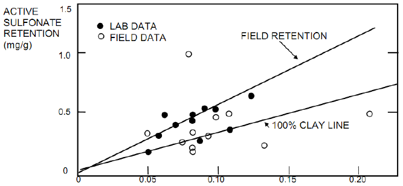
```
<p> &nbsp; </p>

Selain melalui korelasi grafik di atas, persamaan berikut, yang menyatakan _surfactant retentio_n sebagai fungsi dari fraksi berat _clay_, juga dapat digunakan untuk mengestimasi nilai $a_s$ jika nilai fraksi berat _clay_ diketahui.
$$a_s = 3.3 \times wt.fr.clay ... (10)$$
Jika fraksi berat clay juga tidak diketahui, maka nilai $a_s$ = 0.4 _mg/g_ dapat digunakan sebagai nilai _default_ untuk _surfactant retention_.

### Perhitungan _Oil Recovery_

Efisiensi perolehan minyak (*oil recovery efficiency*) tanpa menyertakan pengaruh *crossflow* dinyatakan oleh persamaan berikut.
$$E_r^0=E_DE_VE_{MB}...(11)$$
dimana _E~D~_ menyatakan _displacement efficiency_, _E~V~_ menyatakan _vertical sweep efficiency_, dan _E~MB~_ menyatakan _mobility buffer_ (polimer) _sweep efficiency_.

_Displacement efficiency_ didefinisikan sebagai berikut.
$$E_D = \frac{(S_{orw})-(S_{orc}}{(S_{orw}}...(12)$$
dimana:</br>
$S_{orc}$ = nilai saturasi minyak di zona sapuan _micellar slug_.

_Displacement efficiency_ merupakan fungsi dari bilangan kapiler yang terhubung melalui kurva _capillary desaturation_. Terdapat tiga cara untuk menentukan nilai _displacement efficiency_.

a. Tentukan nilai bilangan kapiler, _N~cap~_, dari persamaan (8), kemudian gunakan kurva _capillary desaturation_ yang khusus dibangun untuk reservoir target.
b. Nilai _displacement efficiency_ diperoleh secara langsung dari hasil analisis core di laboratorium dengan nilai $\frac{V_{ps}}{D_s}$ yang tinggi.
c. Nilai bilangan kapiler ditentukan dari persamaan (8), kemudian digunakan kurva _capillary desaturation_ untuk Berea _rock_ yang dibangun oleh Gupta-Trushenski. Gambar berikut memperlihatkan kurva ini.

```{r fig.align = 'center', out.width = "50%", fig.cap = "Kurva _capillary desaturation_ untuk Berea _rock_ yang disusun oleh Gupta dan Trushenki"}
knitr::include_graphics("images/chemical/berea.png")
```
<p> &nbsp; </p>

Pengaruh _wettability_ terhadap _displacement efficiency_ diwakili oleh rasio antara nilai _end-point_ permeabilitas relatif air terhadap minyak, yaitu:
$$R = \frac{k_{rw}^0}{k_{ro}^0}...(13)$$
Nilai R =0.2 menandakan sistem _water wet_, sedangkan nilai R = 10 menandakan sistem _oil wet_.

_Vertical sweep efficiency_ dinyatakan sebagai fungsi dari keheterogenan reservoir, yang diwakili oleh koefisien variasi permeabilitas Dykstra-Parsons (*V~DP~*) dan rasio $\frac{V_{ps}}{D_s}$, _Vertical sweep efficiency_ secara matematis dinyatakan oleh persamaan berikut.
$$E_V = C_m + \frac{V_{ps}}{D_s}(1-F_m)...(14)$$
dimana $\frac{V_{ps}}{D_s}$ adalah _dimensionless surfactant slug size_, yaitu rasio antara nilai _pore volume slug_ injeksi surfaktan yang sebenarnya (*V~PS~*) terhadap nilai _pore volume surfactant retention_ (*D~S~*).

Pada persamaan (14), _C~M~_ dan _F~M~_ menyatakan _storage capacity_ dan _flow capacity_ dari lapisan M, yaitu lapisan dimana polimer _front_ mendahului _surfaktan front_. Nilai _F~M~_ dihitung menggunakan persamaan berikut.

Jika $\frac{V_{ps}}{D_s} \leq EFF,$
$$F_M = \frac{\left( \frac{EFF}{\frac{V_{ps}}{D_s}}\right)^{0.5}-EFF}{1-EFF}...(15)$$
Jika $\frac{V_{ps}}{D_s} > EFF,$
$$F_M = 1...(16)$$
Sedangkan nilai *C~M~* dihitung menggunakan persamaan berikut.
$$C_M = \frac{1}{EFF \left( \frac{1}F_M-1{}\right)+1}...(17)$$
Parameter EFF menyatakan _effective mobility ratio_, yang dihitung sebagai fungsi dari koefisien variasi permeabilitas Dykstra-Parsons (*V~DP~*).
$$EFF = 10^{ \left( \frac{V_{DP}}{(1-V_{DP})^{0.2}} \right)}...(18)$$
Untuk lapisan 1-D homogen, $F_M = C_M = 0$, dan $E_V = 1$.

_Mobility buffer sweep efficiency_ (*E~MB~*) didefinisikan sebagai rasio antara volume produksi minyak terhadap volume minyak mobile di reservoir. *E~MB~* merupakan fungsi dari _pore volume_ injeksi polimer (*V~MB~*), koefisien variasi permeabilitas Dykstra-Parsons (*V~DP~*), dan rasio $\frac{V_{ps}}{D_s}$. _Mobility buffer sweep efficiency_ dinyatakan oleh persamaan berikut.
$$E_{MB}=(1-E_{MBo}) \left[ 1-exp \left( \frac{- \alpha V_{MB} }{E_V^{\beta}} \right) \right]+E_{MBo}...(19)$$
dimana:
$$E_{MBo} = E_{MB|V_{MB}=0}...(20)$$
Nilai dan korelasi mengenai parameter-parameter $\alpha$, $\beta$, dan _E~MBo~_ diperoleh dari hasil studi simulasi. Hasil simulasi memberikan nilai-nilai berikut sebagai nilai yang sesuai untuk digunakan pada persamaan (19).
$$\alpha = 0.4$$
$$\beta = 1.2$$
$$E_{MBo} = 0.71 - 0.6V_{DP}...(21)$$
Maka, perolehan volume minyak target dinyatakan oleh persamaan berikut.
$$N_{TO} = E_R^0(TO)...(22)$$
### Karakteristik Produksi Minyak dan Koreksi Terhadap _Crossflow_

Berdasarkan teori _fractional flo_w, _micellar-polymer flood_ akan membentuk _oil bank_ di reservoir dengan nilai saturasi minyak *S~ob~* dan fraksi aliran minyak *f~ob~*. Di belakang oil bank adalah _surfactant bank_, dimana _surfactant front_ bergerak dengan kecepatan yang dinyatakan oleh:
$$v_s = \frac{1}{1+D_s-S_{orc}}...(23)$$
Kecepatan _surfactant front_, persamaan (23), dapat pula dinyatakan dalam bentuk lain, yaitu menggunakan nilai saturasi minyak dan fraksi aliran minyak di _oil bank_, *S~ob~* dan *f~ob~*.
$$v_s=\frac{f_{ob}}{S_{ob}-S_{orc}}=\frac{1-f_{wb}}{1-S_{wb}-S_{orc}}...(24)$$
Nilai *S~wb~* dan *f~wb~* diperoleh dari analisis kurva _fractional flow_. Tinjau kurva _fractional flow_ air dan minyak, dimana selain kurva _fractional flow_, terdapat pula garis lurus yang berawal di titik (*f~w~* = 0, *S~w~* = -*D~s~*) dan berakhir di titik (*f~w~* = 1, *S~w~* = 1 - *S~orc~*). Garis lurus ini akan berpotongan dengan kurva _fractional flow_ di titik (*S~wb~*,*f~wb~*). Gambar di halaman selanjutnya memperlihatkan penjelasan 

Maka, nilai saturasi air dan fraksi aliran air _di oil bank_,*S~wb~* dan *f~wb~* diperoleh dengan menentukan titik potong garis lurus terhadap kurva _fractional flow_. Setelah kedua nilai parameter ini diperoleh, maka kecepatan _surfactant front_ yang dinyatakan oleh persamaan (24) dapat dihitung. Selanjutnya, kecepatan front _oil bank_ dihitung menggunakan persamaan berikut.
$$v_{ob} = \frac{f_{ob}-f_{oi}}{S_{ob}-S_{oi}}...(25)$$
dimana untuk perolehan tersier, *S~oi~* = *S~or~* dan *f~oi~* = 0.

```{r fig.align = 'center', out.width = "50%", fig.cap = "Kurva _fractional flow_ air, titik potong antara kurva _fractional flow_ dengan garis lurus memberikan nilai (*S~wb~*,*f~wb~*)"}
knitr::include_graphics("images/chemical/fractional.png")
```
<p> &nbsp; </p>

Dari persamaan kecepatan _surfactant front_ dan _oil bank front_, _dimensionless breakthrough time_ untuk _oil bank_ (*t~Dob~*) dan _surfactant bank_ (*t~Ds~*) untuk reservoir homogen dinyatakan oleh persamaan berikut.
$$t_{Dob}=\frac{1}{v_{ob}}...(26)$$
$$t_{Ds}=\frac{1}{v_{s}}...(27)$$
Untuk reservoir homogen, fungsi produksi _dimensionless_ dinyatakan sebagai berikut.

<center> Untuk $t_{D} \leq t_{Dob},\ oil\ cut = f_{oi}$  
<center> Untuk $t_{Dob} \leq t_{D} \leq t_{Ds},\ oil\ cut = f_{oc}$ 
<center> Untuk $t_{D} > t_{Ds},\ oil\ cut = 0$

Gambar berikut memperlihatkan kurva _oil cut_ terhadap waktu _dimensionless_, *t~D~*.

```{r fig.align = 'center', out.width = "50%", fig.cap = "_Oil cut_ vs. waktu _dimensionless_ untuk reservoir homogen"}
knitr::include_graphics("images/chemical/octd.png")
```
<p> &nbsp; </p>

Penjelasan karakteristik produksi di atas berlaku untuk reservoir homogen. Untuk reservoir heterogen, penjelasan karakteristik produksi dilakukan menggunakan koreksi terhadap parameter-parameter produksi homogen yang telah dijelaskan sebelumnya. Koreksi dilakukan terhadap faktor _layering_. Untuk melakukan hal ini, profil produksi minyak diasumsikan berbentuk segitiga, yang dikarakterisasi oleh empat parameter berikut: _oil breakthrough time_ (*t~ob~*), _surfactant breakthrough time_ (*t~s~*), _peak oil rate_ (*q~opk~*), dan _time of zero rate_ (*t~sw~*).

```{r fig.align = 'center', out.width = "50%", fig.cap = "Profil produksi minyak (diasumsikan berbentuk segitiga) untuk reservoir heterogen"}
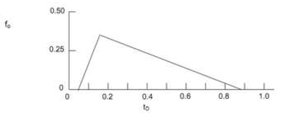
```
<p> &nbsp; </p>

Analisis terhadap keempat parameter di atas akan dimulai dengan mendefinisikan parameter _dimensionles_s-nya. Waktu _breakthrough _minyak _dimensionless_ (*t~Dob~*) dan waktu _breakthroug_h surfaktan _dimensionless_ (*t~Ds~*) dinyatakan oleh dua persamaan berikut.
$$t_{Dob}=\frac{1}{(v_{ob})(EFF)}...(28)$$
$$t_{Ds}=\frac{1}{(v_{s})(EFF)}...(29)$$
Nilai fraksi aliran minyak tertinggi (*peak oil fractional flow*) dinyatakan oleh:
$$f_{opk}=(f_{ob})(f_{fprim})...(30)$$
dengan
$$f_{fprim}=\frac{(EFF)(CFPRIM)}{[(EFF)(CFPRIM)]+1-CFPRIM}...(31)$$
$$CFPRIM=\frac{\left[\frac{1}{\left(\frac{v_{s}}{v_{ob}}\right)}\right]^{0.5}-1}{EFF-1}...(32)$$
Waktu *dimensionless* saat laju alir minyak nol (*time of zero oil rate dimensionless*), *t~Dsw~*, dinyatakan oleh persamaan berikut.
$$t_{Dsw}=t_{Dob}+ \frac{2(E_R^0)(S_{orw})}{f_{opk}}...(33)$$
Pembahasan di atas memberikan nilai dari parameter-parameter dimensionless pada kurva laju produksi minyak, yaitu waktu _dimensionless oil breakthrough_ (*t~Dob~*), waktu _dimensionless_ surfaktan _breakthrough_ (*t~Ds~*), dan waktu _dimensionless zero oil rate_ (*t~Dsw~*). Parameter-parameter _dimensionless_ ini selanjutnya akan dikonversi ke dalam nilai sebenarnya.

Untuk mengkonversi parameter dimensionless ke dalam nilai sebenarnya, dibutuhkan informasi mengenai laju alir fluida di reservoir. Nilai laju alir fluida reservoir pada kondisi aliran _steady-state_ dinyatakan oleh persamaan (5), yaitu:
$$q=\frac{0.003541C_pkhD}{\mu_o \left[ 5.58+ \frac{1}{2}\ln A\right]}$$
Setelah nilai laju alir fluida di reservoir diketahui, parameter-parameter _dimensionless_ pada persamaan (28), (29), dan (33) dapat dikonversi ke dalam nilai sebenarnya melalui persamaan-persamaan berikut.
$$t_{ob}=t_{Dob} \frac{(V_p)_{pat}}{q}...(34)$$
$$t_{s}=t_{Ds} \frac{(V_p)_{pat}}{q}...(35)$$
$$t_{sw}=t_{Dsw} \frac{(V_p)_{pat}}{q}...(36)$$
dimana: </br>
$(V_p)_{pat}$ = _pattern floodable pore volume_

Laju alir minyak tertinggi (*peak oil rate*) terjadi saat waktu surfaktan _breakthrough_ (*t~s~*). Nilai *peak oil rate* dinyatakan oleh:
$$q_{opk} =q \frac{f_{opk}}{B_{of}}...(37)$$
Setelah nilai dari parameter-parameter kurva laju produksi minyak diketahui, volume produksi minyak dan produksi air untuk setiap periode dapat dihitung. Perhitungan volume produksi fluida dibedakan dalam tiga interval waktu, yaitu (1) produksi sebelum _oil breakthrough_ (*t* < *t~ob~*) dan setelah _zero oil rate_ (*t* > *t~sw~*), (2) produksi saat *t~ob~* ≤ *t* < *t~s~*, dan (3) produksi saat *t~s~* < *t* ≤ *t~sw~*.

Selama periode *t~ob~* ≤ *t* < *t~s~*, nilai _oil cut_ akan terus naik secara linier karena semakin banyak lapisan yang memproduksikan minyak. Hal ini terjadi sampai tercapainya _peak oil rate_, yaitu saat *t* = *t~s~*. Untuk periode *t~s~* < *t* ≤ *t~sw~*, _oil cut_ akan terus menurun secara linier karena semakin banyak lapisan yang memproduksi surfaktan atau polimer. Kecepatan surfaktan _front_ diasumsikan tidak berubah selama mengalir di reservoir, juga saat _polimer front_ mendahului surfaktan _front_ di lapisan dengan nilai permeabilitas yang rendah.

Laju produksi minyak dan air untuk setiap periode dan setiap time step i adalah sebagai berikut. Untuk periode waktu pertama, yaitu *t* < *t~ob~* dan *t* > *t~sw~*:
$$q_o=0...(38)$$
$$q_w=q...(39)$$
Untuk periode waktu kedua, yaitu *t~ob~* ≤ *t* < *t~s~*:
$$q_o(i)=q_{opk} \left( \frac{t(i)-t_{ob}}{t_s-t_{ob}} \right)...(40)$$
$$q_w(i)=\frac{q-[q_o(i)B_{of}]}{B_{wf}}...(41)$$
Untuk periode waktu kedua, yaitu *t~s~* < *t* ≤ *t~sw~*:
$$q_o(i)=q_{opk} \left( \frac{t_{sw}-t(i)}{t_{sw}-t_s} \right)...(42)$$
$$q_w(i)=\frac{q-[q_o(i)B_{of}]}{B_{wf}}...(43)$$
Saat *t(i)* = *t~s~*, *q~o~(i)* = *q~opk~*.

Selanjutnya, nilai _overall oil recovery efficiency_ ($E_R^0$) akan dikoreksi terhadap efek _crossflow_. Koreksi terhadap nilai $E_R^0$ memberikan nilai _corrected overall oil recovery efficiency_ ($E_R^C$) seperti dinyatakan dalam persamaan berikut.
$$E_R^C= 0.04 \log (RL) + 0.064+E_R^0...(44)$$
$$RL = \sqrt \frac{k_v}{k_h} \left( \frac{XLIP}{h_{pay}} \right)...(45)$$
$$XLIP = 0.7071 \sqrt {43560(A_{pat})}...(46)$$
dimana: </br>
$APAT$ = _pattern area_ </br>
$h_{pay}$ = reservoir _net pay_ </br>
$RL$ = bilangan _crossflow dimensionless_.

Rasio antara _corrected overall oil recovery_ dengan _overall oil recovery_ dinyatakan oleh parameter _crossflow performance factor_ (*f~CF~*), yang didefinisikan oleh persamaan berikut.
$$f_{CF} = \frac{E_R^C}{E_R^0}...(47)$$

### Karakteristik Injeksi Kimia

Terdapat dua zat kimia yang digunakan dalam _micellar-polymer flooding_, yaitu surfaktan dan polimer. Volume injeksi _slug_ surfaktan per pola injeksi adalah:
$$BSL = (V_p)_{pat}V_{PS}...(48)$$
dimana *V~PS~* adalah _slug size_ surfaktan injeksi. Adapun lama injeksi surfaktan dinyatakan oleh:
$$t_{surf} = \frac{\left( \frac{BSL}{q} \right)}{365}...(49)$$
Di lain pihak, volume injeksi polimer dinyatakan sebagai fungsi dari _mobility rati_  dan
_wettability_  dimana _wettability_ dinyatakan dalam bentuk rasio permeabilitas relatif _end-point_, $R=\frac{k_{rw}^0}{k_{ro}^0}$. Konsentrasi polimer awal dalam _slug_ polimer injeksi dinyatakan oleh persamaan berikut.
$$C_{poly}=111 \left( \frac{\mu_o}{\mu_w} \right)+B ...(50)$$
dimana: </br>
Untuk _R_ $leq$ 0.1,
$$B = 338...(51)$$
Untuk 0.1 < _R_ < 10,
$$B = 338 + \left[ (R-0.1) \left( \frac{1032}{9.9} \right)\right]...(52)$$
Untuk _R_ $\geq$ 10,
$$B = 1370 ...(53)$$
Volume injksi _slug_
 polimer per pola injeksi dinyatakan oleh persamaan berikut.
 $$BMB = (V_p)_{pat}V_{MB}...(54)$$
 Sedangkan lama periode injeksi polimer dinyatakan oleh:
 $$t_{MB}= \frac{\left( \frac{BMB}{q} \right)}{365}...(55)$$
 
 ### Modifikasi _Predictive Model_ Untuk _Caustic_ dan _Caustic-Polymer Flood_
 
Selain _micellar-polymer_, pada predictive model yang dibangun terdapat juga pilihan tipe injeksi kimia lainnya, yaitu _caustic flood_, _caustic-polymer flood_, dan _advanced caustic flood_ (_surfactant flood_). Untuk tiga tipe pilihan injeksi kimia ini, model melakukan modifikasi terhadap beberapa nilai parameter yang digunakan dalam algoritma _micellar-polymer flood_. Tabel berikut merangkum modifikasi yang dilakukan.

```{r fig.align = 'center', out.width = "50%", fig.cap = "Modifikasi nilai sejumlah parameter MP _flood_ untuk kasus _caustic_ dan _caustic-polymer flood_"}
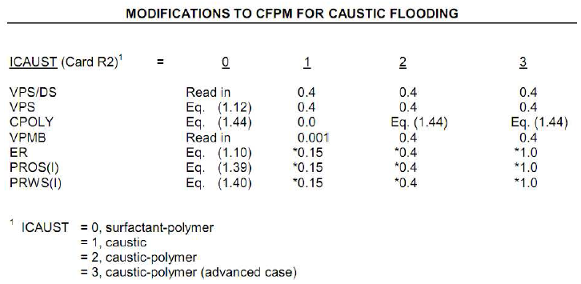
```
<p> &nbsp; </p>

## Persamaan-Persamaan Dasar dan Nilai _Default_ yang Digunakan Dalam Model

### Viskositas Minyak

Viskositas minyak, $\mu_o$, dihitung menggunakan korelasi Beggs-Robinson. Korelasi terlebih dahulu menghitung nilai viskositas _dead oil_, $\mu_{od}$.
$$\mu_{od}=10^x-1...(56)$$
dengan
$$X=\frac{Y}{T^{1.163}}$$
$$Y = 10^Z$$
$$Z= 3.0324-0.02023(API)$$
dimana: </br>
_T_ = temperatur reservoir, $\circ$F </br>
_API_ = _gravity_ minyak, $\circ$API. </br>
Selanjutnya viskositas _live oil_ dihitung dengan persamaan berikut.
$$\mu_o = A (\mu_{od})^B...(57)$$
dengan
$$A=\frac{10.715}{(_s+100)^{0.515}}$$
$$B=\frac{5.44}{(_s+150)^{0.338}}$$

### _Solution Gas-Oil Ratio_

_Solution gas-oil ratio_, *R~s~*, dihitung menggunakan korelasi Vasquez-Beggs. Korelasi terlebih dahulu melakukan koreksi terhadap nilai _specific gas gravity_, $\gamma_g$, ke dalam kondisi tekanan dan temperatur _separator_. _Separator_ diasumsikan berada pada tekanan 100 psig dan temperatur reservoir, *T*.
$$\gamma_{g.100}=\gamma_g = \left[ 1+5.912(10^{-5})(API)(T) \log \left( \frac{64.7}{114.7} \right) \right]...(58)$$
dimana nilai _corrected specific gas gravity_ berada pada interval 0.8 $\leq \gamma_{g.100} \leq$ 1.4.

Selanjutnya _solution gas-oil ratio_ dihitung sebagai berikut. </br>
Untuk $API \leq$ 30:
$$R_s = 0.0362 \gamma_{g.100}P_{form}^{1.0937}exp \left[ 25.724 \left( \frac{API}{T+460} \right) \right]...(59)$$
Untuk $API$ > 30:
$$R_s = 0.0178 \gamma_{g.100}P_{form}^{1.187}exp \left[ 23.931 \left( \frac{API}{T+460} \right) \right]...(60)$$

### Faktor Volume Formasi Minyak 

Faktor volume formasi minyak, *B~o~*, dihitung menggunakan korelasi Vasquez-Beggs.
$$B_o = 1 + C_1R-s + (C_2 + C_3R_s)(T-60) \left( \frac{API}{\gamma_{g.100}} \right)...(61)$$
dimana: </br>
Untuk $API \leq$ 30:
$$C_1 = 4.677 (10^{-4})$$
$$C_2 = 1.751 (10^{-5})$$
$$C_3 = -1.811 (10^{-8})$$
Untuk $API$ > 30:\
$$C_1 = 4.67 (10^{-4})$$
$$C_2 = 1.1 (10^{-5})$$
$$C_3 = 1.337 (10^{-9})$$

### Permeabilitas Relatif dan Fraksi Aliran Air

Nilai permeabilitas relatif minyak (*k~ro~*) dan air (*k~rw~*), _fractional flow of water (f~w~)_ dan turunannya $\left( \frac{\partial f_w}{\partial S_w} \right)$ dihitung dengan korelasi Corey.
$$u_o = \frac{S_{w}-S_{orw}}{1-S_{wc}-S_{orw}}...(62)$$
$$k_{ro}=X_{k_{roe}}u_o^{X_{no}}...(63)$$
$$u_w = \frac{S_{w}-S_{wc}}{1-S_{wc}-S_{orw}}...(64)$$
$$k_{rw}=X_{k_{rwe}}u_w^{X_{nw}}...(65)$$
Nilai fraksi aliran air dan turunannya dihitung menggunakan persamaan berikut:
$$f_w = \frac{1}{M_{wo}}...(66)$$
$$\left( \frac{\partial f_w}{\partial S_w} \right) = f_w^2 \frac{\left( \frac{\mu_w}{\mu_o} \right)}{\left( \frac{k_{rw}}{k_{rw}UKR} \right)}...(67)$$
dengan:
$$M_{wo} = \frac{k_{ro}}{k_{rw}}\left( \frac{\mu_w}{\mu_o} \right)...(68)$$
$$UKR = (k_{ro}D_{k_{rw}})-(k_{rw}D_{k_{ro}})...(69)$$
$$D_{k_{rw}}= \frac{X_{nw}{k_{rw}}}{S_w - S_{wc}}...(70)$$
$$D_{k_{ro}}= \frac{-X_{no}{k_{ro}}}{1-S_w - S_{orw}}...(71)$$

### Nilai _Default_ yang Dignakan Dalam _Predictive Model_

Nilai _default_ dari sejumlah paramter yang digunakan dalam model dirangkum pada tabel berikut.

|Parameter   |Nilai _Default_ yang Digunakan   |
|:---:    |:---:    |
|Tekanan reservoir, $P_{form}$   |$P_{form}=15+0.433 (depth)$   |
|Temperatur reservoir, $T$   |$T=60+0.017(depth)$   |
|Temperatur reservoir maksimum, $T_{max}$   |$T_{max}=200$   |
|Salinitas air formasi, $S$   |$S=50000 ppm$ TDS   |
|Salinitas air formasi maksimum, $S_{max}$   |$S_{max}=100000 ppm$ TDS   |
|*Specific gravity gas*, $\gamma_g$   |$\gamma_g = 0.8$   |
|Koefisien variasi permeabilitas Dystra-Parsons, $V_{DP}$   |$V_{DP}=0.72$   |
|Faktor volume formasi minyak akhir, $B_{of}$   |$B_{of}=1$|
|Faktor volume formasi air akhir, $B_{wf}$   |Korelasi Keenan dan Keyes: </br> $B_w=1+1.2(10^{-4})(T-60)+1(10^{-6})(T-60)^2-3.33(10^{-6})P_{form}$|
|Viskositas air, $\mu_w$   |Korelasi Van Wingen: </br> $\mu_w = exp[1.003-1.479(10^{-2})T+1.982(10^{-5})T^2]$|
|*Connate water saturation*, $S_{wc}$   |$S_{wc}=0.3$   |
|Densitas batuan formasi, $\rho_{rock}$ |$\rho_{rock}=2.68g/ml$    |
|Densitas *slug* surfaktan, $\rho_{s}$ |$\rho_{s}=1g/ml$    |
|Ukuran *slug* surfaktan *dimensionless*, $\frac{V_{ps}}{D_s}$ |$\frac{V_{ps}}{D_s}=1.3$    |
|Konsentrasi surfaktan dalam *slug* injeksi, $C_s$ |$C_s=0.05$    |
|Saturasi minyak residu, $S_{orw}$  |Untuk tipe batuan _sandstone_, $S_{orw}=0.25$ </br> Untuk tipe batuan karbonat, $S_{orw}=0.38$   |
|Permeabilitas relatif minyak saat $S_{wc}$, $X_{k_{roe}}$   |Untuk tipe batuan _sandstone_, $X_{k_{roe}}=0.8$ </br> Untuk tipe batuan karbonat, $X_{k_{roe}}=0.4$   |
|Permeabilitas relatif air saat $S_{orw}$, $X_{k_{rwe}}$   |Untuk tipe batuan _sandstone_, $X_{k_{rwe}}=0.2$ </br> Untuk tipe batuan karbonat, $X_{k_{rwe}}=0.3$  |
|Eksponen kurva permeabilitas relatif minyak, $X_{no}$|$X_{no}=2$|
|Eksponen kurva permeabilitas relatif air, $X_{nw}$|$X_{nw}=2$|
|*Pore volume* injeksi polimer, $V_{MB}$|Untuk MP *flood*, $V_{MB}=0.65$ </br> Untuk *caustic flood*, $V_{MB}=0.001$ </br> Untuk *custic-polymer flood*, $V_{MB}=0.4$|
|Koefisien _injectivity_, $C_P$    |$C_P=0.3$ |

Table: <span style="color: grey;"> Tabel 4.1: Nilai _default_ yang digunakan dari sejumlah parameter dalam _predictive model_ </span>

<!--chapter:end:03-method.Rmd-->

# Polymer Predictive Model

```{r include=FALSE}
knitr::opts_chunk$set(echo = FALSE)
```

## Pendahuluan  

__Injeksi polimer (*polymer flood*)__ merupakan bagian dari metode _Enhanced Oil Recovery_ (EOR)yang menggunakan mekanisme injeksi zat kimia ke dalam reservoir dengan tujuan untuk menambah tingkat perolehan minyak. Zat kimia yang diinjeksikan ke dalam reservoir adalah
polimer.

Adanya konsentrasi polimer dalam air injeksi akan menambah viskositas air. Akibatnya mobilitas air akan berkurang, sehingga nilai _mobility ratio M_ akan menjadi lebih kecil. Berkurangnya nilai _M_ menyebabkan bertambahnya nilai dari ketiga parameter efisiensi, yaitu _displacement efficiency_ (*E~D~*), _areal sweep efficiency_ (*E~A~*), dan _vertical sweep efficiency_ (*E~V~*), sehingga efisiensi dari proses _displacement_ akan bertambah, yang menyebabkan bertambahnya tingkat perolehan minyak.

_Polymer Flood Predictive Model_ merupakan model yang dibangun untuk memprediksi performa reservoir di bawah pengaruh injeksi polimer. Predictive model yang dibangun merupakan model tiga dimensi dan dua fasa (minyak dan air) dimana _displacement efficiency_ dihitung menggunakan teori _fractional flow_, sedangkan _areal_ dan _vertical sweep_ dihitung menggunakan pendekatan _streamtube_. Efek dari _slug size_ polimer dimodelkan dengan menggunakan korelasi. Selain itu, model juga menyertakan sifat-sifat fisis dari larutan polimer ke dalam perhitungan, seperti adsorpsi polimer, efek _permeability reduction_, dan efek non-Newtonian.

Beberapa asumsi yang digunakan dalam penyusunan predictive model adalah sebagai berikut:

a. Fluida dan batuan dianggap _incompressible_.
b. Aliran fluida terjadi secara isotermal.
c. Tidak terjadi perubahan volume selama proses pencampuran polimer dengan air.
d. Efek salinitas terhadap viskositas polimer diabaikan.
e. Gaya gravitasi dan gaya kapiler diabaikan.
f. Tidak terjadi _fingering_.
g. Dispersi pada larutan polimer diabaikan.
h. Tidak terjadi _crossflow_ antar lapisan reservoir.
i. Nilai permeabilitas, porositas, _thickness_, dan _initial water saturation_ adalah homogen untuk setiap lapisan reservoir.
j. Adsorpsi polimer terjadi secara seketika.
k. Beda tekanan antara sumur injeksi dan sumur produksi dinyatakan konstan, sehingga nilai _injectivity_ berubah-ubah untuk setiap time step bergantung pada mobilitas fluida di setiap _streamtube_.
l. Faktor keheterogenan reservoir dapat dinyatakan dalam bentuk input data untuk setiap lapisan reservoir maupun dalam bentuk koefisien variasi permeabilitas Dykstra-Parsons (*V~DP~*).
m. Injeksi polimer diasumsikan membentuk empat zona (atau *bank*) di reservoir, yaitu *initial water bank* (bank ke-1), *oil ba*nk atau *connate water bank* (*bank* ke-2), *polymer bank* (*bank* ke-3), dan *chase water bank* (*bank* ke-4).

## Teori _Fractional Flow_

Sama seperti proses _waterflooding,_ prediksi performa _polymer flood_ membutuhkan dua informasi penting, yaitu informasi mengenai profil saturasi air di reservoir selama periode flooding dan informasi mengenai nilai saturasi air rata-rata di reservoir pada waktu tertentu selama periode _flooding_. Kedua informasi penting ini dapat diperoleh dengan memahami teori _fractional flow_ untuk _polymer flood_. Dalam model, teori _fractional flow_ digunakan untuk menghitung _displacement efficiency_ dari injeksi polimer, dimana injeksi polimer terlebih dahulu diasumsikan dilakukan secara kontinu (tidak menggunakan _slug_). Koreksi terhadap efek injeksi non-kontinu dengan menggunakan ukuran slug akan dilakukan kemudian.

Terdapat dua perbedaan utama antara teori _fractional flow_ untuk _waterflooding_ dengan _polymer flood_. Pertama, terlarutnya polimer (dengan konsentrasi tertentu) dalam air injeksi pada _polymer flood_ akan menyebabkan perbedaan profil saturasi air di reservoir dengan proses _waterflooding_, sehingga secara otomatis mempengaruhi kurva _fractional flow of water_ (*f~w~*). Kedua, adanya penyerapan (adsorpsi) polimer oleh batuan reservoir menyebabkan fenomena _displacement_ di reservoir menjadi lebih rumit dibandingkan dengan proses _waterflooding_.

```{r fig.align = 'center', out.width = "50%", fig.cap = "Elemen volume dengan panjang \\Delta x"}
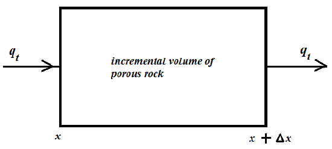
```
<p> &nbsp; </p>

Total akumulasi zat kimia *i* dalam elemen volume di atas dinyatakan oleh:

\(
\left( 
  \begin{tabular}{c}
    total & akumulasi & zat & kimia\ i\\ 
    dalam & elemen & volume\\ 
    selama & selang & waktu & \Delta x
  \end{tabular}
\right)
\)

$\frac{0}{0}$


<!--chapter:end:04-application.Rmd-->

# Final Words

We have finished a nice book.

<!--chapter:end:05-summary.Rmd-->

`r if (knitr::is_html_output()) '
# References {-}
'`

<!--chapter:end:06-references.Rmd-->

